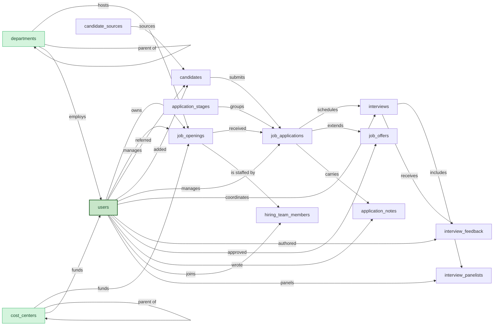

## 1. Overview

An Applicant Tracking System (ATS) manages the end-to-end recruiting workflow: opening requisitions, sourcing and tracking candidates, running interviews, gathering panel feedback, and extending offers. The central work record is the job application, which links one candidate to one job opening and progresses through a configurable pipeline of stages from applied to hired or rejected.

The model supports a panel-interview pattern with per-interviewer scorecards that lock on submit, a single-approver offer flow, and personal-content scoping on interviewer feedback and recruiter notes. It assumes a single ATS deployment per tenant; multi-region tenancy is provided by the platform.

## 2. Entity summary

| # | Table | Singular label | Purpose |
|---|---|---|---|
| 1 | `job_openings` | Job Opening | A position the company is hiring for; the requisition |
| 2 | `departments` | Department | Org-structure lookup; a job opening belongs to one |
| 3 | `candidates` | Candidate | A person in the talent pool, independent of any specific application |
| 4 | `candidate_sources` | Candidate Source | Lookup of where a candidate originated (referral, job board, agency, event) |
| 5 | `job_applications` | Job Application | One candidate's application to one job opening; the central work record |
| 6 | `application_stages` | Application Stage | Lookup defining the recruiting pipeline |
| 7 | `hiring_team_members` | Hiring Team Member | Junction linking users (recruiter, hiring manager, interviewers) to a job opening |
| 8 | `interviews` | Interview | A scheduled interview event for one job application |
| 9 | `interview_panelists` | Interview Panelist | Junction linking users to an interview |
| 10 | `interview_feedback` | Interview Feedback | One interviewer's scorecard for one interview, personal and submit-then-lock |
| 11 | `job_offers` | Job Offer | A formal offer extended on a job application |
| 12 | `application_notes` | Application Note | A free-form note on a job application |
| 13 | `cost_centers` | Cost Center | Finance lookup; the budget center a job opening is funded from |
| 14 | `users` | User | Recruiters, hiring managers, interviewers, coordinators (Semantius built-in) |

### Permissions summary

| Permission | Type | Description | Used by | Included in |
|---|---|---|---|---|
| `ats:read` | baseline-read | Read access to every entity in the module. Typically: every user. | every entity (view_permission) | — |
| `ats:manage` | baseline-manage | Edit operational records (openings, candidates, applications, interviews, offers, notes). Typically: recruiters, hiring coordinators. | every operational entity (edit_permission) | — |
| `ats:admin` | baseline-admin | Edit reference data (departments, cost centers, sources, stages) and inherit every workflow override. Typically: RecOps, recruiting leadership. | `departments`, `cost_centers`, `candidate_sources`, `application_stages` (edit_permission); includes every workflow permission below | — |
| `ats:hire_candidate` | workflow | Move a job application to hired status. Typically: hiring managers, HR leads. | `job_applications` rule `hire_requires_permission` | `ats:admin` |
| `ats:approve_offer` | workflow | Approve a job offer (move status to approved). Typically: hiring directors, VPs. | `job_offers` rule `approve_offer_requires_approver` | `ats:admin` |
| `ats:submit_interview_feedback` | workflow | Submit interview feedback on behalf of another interviewer. Typically: RecOps, hiring leads. | `interview_feedback` rule `submit_restricted_to_interviewer` | `ats:admin` |
| `ats:manage_all_feedback` | workflow | Edit feedback authored by other interviewers. Typically: RecOps, HR partners. | `interview_feedback` rule `feedback_edit_scope` | `ats:admin` |
| `ats:manage_all_notes` | workflow | Edit notes authored by other users. Typically: HR partners, recruiting leads. | `application_notes` rule `note_edit_scope` | `ats:admin` |
| `ats:view_all_feedback` | workflow | View interview feedback authored by other interviewers. Typically: RecOps, hiring leads. | `interview_feedback` select_rule | `ats:admin` |
| `ats:view_all_notes` | workflow | View private notes authored by other users. Typically: HR partners, recruiting leads. | `application_notes` select_rule | `ats:admin` |
| `ats:interview` | workflow-narrow | Write interview feedback as an external panel interviewer (no other module access). Typically: engineers, PMs, panel interviewers outside the recruiting team. | `interview_feedback` (edit_permission) | `ats:manage` |

## 3. Entities

### 3.1 `job_openings`

**Description:** A requisition for one or more positions the company is hiring for. The job opening carries the role definition, compensation range, ownership (hiring manager and recruiter), and lifecycle status from draft through filled or cancelled.

**Singular label:** Job Opening
**Plural label:** Job Openings
**View permission:** `ats:read`
**Edit permission:** `ats:manage`

**Validation rules**

**Input type rules**

### 3.2 `departments`

**Description:** A small org-structure lookup. Departments are seeded with the organization's initial structure and extended occasionally as the business reorganizes. A job opening hosts under exactly one department; users may be assigned a primary department.

**Singular label:** Department
**Plural label:** Departments
**View permission:** `ats:read`
**Edit permission:** `ats:admin`
**Shared master cluster:** organization

### 3.3 `candidates`

**Description:** A person in the talent pool, identified by email. A candidate exists independent of any specific job application; the same person may apply to multiple openings over time and accumulate multiple job applications.

**Singular label:** Candidate
**Plural label:** Candidates
**View permission:** `ats:read`
**Edit permission:** `ats:manage`

**Computed fields**

### 3.4 `candidate_sources`

**Description:** A small lookup of where candidates originated. Seeded with the organization's typical sources (employee referral, careers site, LinkedIn, agency partners, university events) and extended occasionally.

**Singular label:** Candidate Source
**Plural label:** Candidate Sources
**View permission:** `ats:read`
**Edit permission:** `ats:admin`

### 3.5 `job_applications`

**Description:** The central work record of the ATS. A job application links one candidate to one job opening, sits in one pipeline stage, and progresses through statuses from active to a terminal value (hired, rejected, or withdrawn). All interviews, offers, and notes hang off the application.

**Singular label:** Job Application
**Plural label:** Job Applications
**View permission:** `ats:read`
**Edit permission:** `ats:manage`

**Computed fields**

**Validation rules**

**Input type rules**

### 3.6 `application_stages`

**Description:** Pipeline-stage definitions, ordered by `stage_order`. Seeded with the organization's recruiting funnel (applied, screening, phone screen, onsite, offer, hired, rejected) and extended occasionally as the process evolves.

**Singular label:** Application Stage
**Plural label:** Application Stages
**View permission:** `ats:read`
**Edit permission:** `ats:admin`

### 3.7 `hiring_team_members`

**Description:** Junction record assigning a user to a job opening's hiring team in a specific role. A user may join many openings; an opening may be staffed by many users in different team roles.

**Singular label:** Hiring Team Member
**Plural label:** Hiring Team Members
**View permission:** `ats:read`
**Edit permission:** `ats:manage`

**Computed fields**

### 3.8 `interviews`

**Description:** A scheduled interview event for one job application. An interview includes one or more panelists (via `interview_panelists`) and gathers one feedback row per interviewer.

**Singular label:** Interview
**Plural label:** Interviews
**View permission:** `ats:read`
**Edit permission:** `ats:manage`

**Computed fields**

**Validation rules**

### 3.9 `interview_panelists`

**Description:** Junction record linking a user to an interview as a panelist. A user may panel on many interviews; an interview includes one or more panelists.

**Singular label:** Interview Panelist
**Plural label:** Interview Panelists
**View permission:** `ats:read`
**Edit permission:** `ats:manage`

**Computed fields**

### 3.10 `interview_feedback`

**Description:** One interviewer's scorecard for one interview. Each interviewer records their own feedback row; the row is editable while in draft and locks when the interviewer submits it. Submission is restricted to the row's interviewer or holders of the override permission. Reads are scoped to the interviewer plus elevated roles by default.

**Singular label:** Interview Feedback
**Plural label:** Interview Feedback
**View permission:** `ats:read`
**Edit permission:** `ats:interview`

**Computed fields**

**Validation rules**

**Input type rules**

**Select rule**

The rule restricts each caller to the feedback rows they authored. Holders of `ats:view_all_feedback` (RecOps, hiring leads, HR partners by default) see every row.

### 3.11 `job_offers`

**Description:** A formal offer extended to a candidate on a job application. The offer carries compensation, proposed start date, and approval state. Status progresses through draft, pending_approval, approved (gated by `ats:approve_offer`), sent, and a terminal value (accepted, declined, rescinded, expired).

**Singular label:** Job Offer
**Plural label:** Job Offers
**View permission:** `ats:read`
**Edit permission:** `ats:manage`

**Computed fields**

**Validation rules**

**Input type rules**

### 3.12 `application_notes`

**Description:** A free-form note written by a user on a job application. Notes capture recruiter observations, debrief summaries, and follow-up reminders. A private note is visible only to its author and to holders of the view-all override; a public note is visible to every reader of the application.

**Singular label:** Application Note
**Plural label:** Application Notes
**View permission:** `ats:read`
**Edit permission:** `ats:manage`

**Computed fields**

**Validation rules**

**Select rule**

Public notes are visible to every reader of the application. Private notes are visible only to the author and to holders of `ats:view_all_notes`.

### 3.13 `cost_centers`

**Description:** A small finance lookup of the cost centers an opening is funded from. Seeded with the organization's chart of accounts (e.g. 4200-ENG, 4300-PROD) and extended occasionally as new business lines emerge. Included in this model now so the ATS deploys self-contained, and flagged as a candidate to be hosted by a shared finance master module when one becomes available (Budgeting, Procurement, Expense, and other domains all want to FK to the same rows).

**Singular label:** Cost Center
**Plural label:** Cost Centers
**View permission:** `ats:read`
**Edit permission:** `ats:admin`
**Shared master cluster:** finance

### 3.14 `users` (Semantius built-in extension)

**Description:** A user of the ATS module. The Semantius built-in `users` table is used directly; the deployer skips entity creation and reuses the built-in as the FK target. Built-in fields used as-is: `display_name` (label_column), `email` (login identifier), `is_disabled` (account suspension). The model additively declares the fields below.

**Singular label:** User
**Plural label:** Users
**View permission:** `ats:read`
**Edit permission:** `ats:admin`

## 4. Relationship summary

| From (child) | To (parent) | Kind | Cardinality | Delete behavior |
|---|---|---|---|---|
| `job_openings.department_id` | `departments` | reference | N:1 | restrict |
| `job_openings.cost_center_id` | `cost_centers` | reference | N:1 | restrict |
| `job_openings.hiring_manager_id` | `users` | reference | N:1 | restrict |
| `job_openings.recruiter_id` | `users` | reference | N:1 | restrict |
| `departments.parent_department_id` | `departments` | reference | N:1 | clear |
| `cost_centers.parent_cost_center_id` | `cost_centers` | reference | N:1 | clear |
| `users.department_id` | `departments` | reference | N:1 | clear |
| `users.cost_center_id` | `cost_centers` | reference | N:1 | clear |
| `candidates.candidate_source_id` | `candidate_sources` | reference | N:1 | clear |
| `candidates.referrer_user_id` | `users` | reference | N:1 | clear |
| `candidates.created_by` | `users` | reference | N:1 | restrict |
| `job_applications.candidate_id` | `candidates` | reference | N:1 | restrict |
| `job_applications.job_opening_id` | `job_openings` | reference | N:1 | restrict |
| `job_applications.application_stage_id` | `application_stages` | reference | N:1 | restrict |
| `job_applications.recruiter_id` | `users` | reference | N:1 | restrict |
| `hiring_team_members.job_opening_id` | `job_openings` | parent (junction) | N:1 | cascade |
| `hiring_team_members.user_id` | `users` | parent (junction) | N:1 | cascade |
| `interviews.job_application_id` | `job_applications` | reference | N:1 | restrict |
| `interviews.coordinator_user_id` | `users` | reference | N:1 | clear |
| `interview_panelists.interview_id` | `interviews` | parent (junction) | N:1 | cascade |
| `interview_panelists.user_id` | `users` | parent (junction) | N:1 | cascade |
| `interview_feedback.interview_id` | `interviews` | reference | N:1 | restrict |
| `interview_feedback.interviewer_user_id` | `users` | reference | N:1 | restrict |
| `job_offers.job_application_id` | `job_applications` | reference | N:1 | restrict |
| `job_offers.approved_by_user_id` | `users` | reference | N:1 | clear |
| `application_notes.job_application_id` | `job_applications` | parent | N:1 | cascade |
| `application_notes.author_id` | `users` | reference | N:1 | restrict |

## 6. Cross-model link suggestions

| From | To | Verb | Cardinality | Delete |
|---|---|---|---|---|
| `employees` | `candidates` | becomes | N:1 | clear |
| `job_openings` | `positions` | is filled by | N:1 | clear |
| `new_hire_checklists` | `job_applications` | spawns | N:1 | clear |
| `background_checks` | `job_applications` | triggers | N:1 | clear |
| `reference_checks` | `candidates` | supplies | N:1 | clear |
| `job_openings` | `salary_bands` | defines | N:1 | restrict |
| `job_offers` | `compensation_plans` | governs | N:1 | restrict |
| `cost_allocations` | `cost_centers` | receives | N:1 | restrict |
| `budget_lines` | `cost_centers` | receives | N:1 | restrict |

