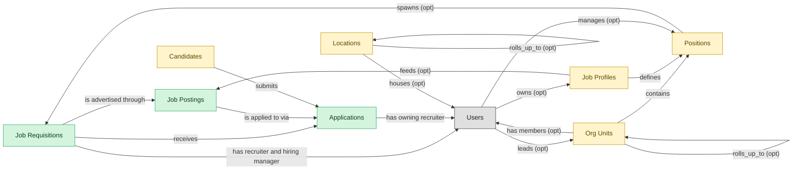

# Recruitment Pipeline

## 1. Overview

Requisitions → postings → applications with pipeline-stage lifecycle. Realizes REQ-MGMT and CANDIDATE-EXP (application flow slice). Embedded-masters `candidates`, optionally `hcm_positions` and `org_units` for canonical position/org context.

## 2. Entity summary

| Name | Description |
| --- | --- |
| Applications | A candidate's submission against a specific requisition. Carries pipeline stage, status (active / rejected / withdrawn / hired), source, and the full evaluation history. |
| Job Postings | Published, candidate-facing version of a requisition on a career site or job board. One requisition can have many postings (per board, language, or region). |
| Job Requisitions | Approved request to hire for a specific role. The master ATS work item, carries headcount, level, location, hiring manager, recruiter, and status (draft / open / on_hold / filled / cancelled). |
| Candidates | Person known to the recruiting org, with or without an active application. Carries contact details, resume, tags, GDPR consent, and source. Distinct from Employee until hired. |
| Job Profiles | Canonical role definition in the job catalog: title, family, level, responsibilities, required skills and competencies, pay range, FLSA classification. Distinct from positions (which are slots referencing a profile). Many positions share a single job profile. |
| Locations | - |
| Org Units | Node in the organizational hierarchy: division, business unit, department, team. Carries manager, cost center alignment, geographic scope, and parent/child relationships. HCM masters the operational hierarchy; EPM contributes the cost-center mapping (which would be Finance-mastered once a Finance/GL domain is loaded). |
| Positions | Approved slot in the org - a 'chair' with role definition, cost center, reporting line, location, and FTE allocation. Distinct from job_profiles (the catalog definition) and from employees (the person filling the slot). A position can be open, filled, or eliminated. SWP designs future positions via org_designs; HCM operationalizes them once approved. |

## 3. Entities catalog

| # | data_object | role | mastered in | necessity | pattern flags | notes |
| ---: | --- | --- | --- | --- | --- | --- |
| 1 | `job_applications` (Applications) | master | - | required | personal_content | - |
| 2 | `job_postings` (Job Postings) | master | - | required | - | - |
| 3 | `job_requisitions` (Job Requisitions) | master | - | required | single_approver | - |
| 4 | `candidates` (Candidates) | embedded_master | `ats-candidate-crm` | required | personal_content | - |
| 5 | `job_profiles` (Job Profiles) | embedded_master | `hcm-org-positions` | required | single_approver | Module 4 holds the requisition template-binding to a job_profile (competencies, level, family). Reads from HCM when integrated; standalone deployments keep the embedded shell. |
| 6 | `locations` (Locations) | embedded_master | `IWMS` _(domain-level, not modularized)_ | required | - | Job postings are location-scoped (remote / hybrid / on-site at specific offices). ATS local-masters when no IWMS is present. |
| 7 | `org_units` (Org Units) | embedded_master | `hcm-org-positions` | optional | - | Without HCM org structure, requisitions function with a flat or local org-unit reference. |
| 8 | `hcm_positions` (Positions) | embedded_master | `hcm-org-positions` | optional | single_approver | Without HCM-WORKER-RECORD deployed, requisitions function with a local position shell. |

## 4. Aliases and industry synonyms

| data_object | alias | alias_type | preferred? | context | notes |
| --- | --- | --- | --- | --- | --- |
| `candidates` | Applicant | synonym | - | - | generic; used by EEOC and OFCCP |
| `job_applications` | Candidacy | synonym | - | - | practitioner term for the candidate-to-req relationship |
| `job_postings` | Career Site Posting | synonym | - | - | vendor-specific: iCIMS, SmartRecruiters distinguish branded career-site placements |
| `job_requisitions` | Headcount Request | synonym | - | - | finance / HRBP framing emphasizing budget approval |
| `job_postings` | Job Ad | synonym | - | - | externally-published version of a requisition |
| `job_applications` | Job Application | synonym | - | - | long-form; candidate-facing flows and EEOC reporting |
| `job_postings` | Job Listing | synonym | - | - | standard on aggregator boards (Indeed, LinkedIn) |
| `job_requisitions` | Job Req | synonym | - | - | universal recruiter shorthand |
| `job_requisitions` | Open Position | synonym | - | - | industry shorthand for approved-and-funded role |
| `org_units` | Organization | synonym | - | - | - |
| `candidates` | Person | synonym | - | - | vendor-specific: Workday Recruiting unified internal/external person record |
| `candidates` | Prospect | synonym | - | - | sourcing-CRM term before formal application |
| `job_applications` | Submission | synonym | - | - | vendor-specific: Bullhorn (staffing-oriented ATS) |
| `locations` | branch | synonym | - | - | - |
| `locations` | building | synonym | - | - | - |
| `org_units` | business unit | synonym | - | - | - |
| `org_units` | cost-bearing unit | synonym | - | - | cluster A \| HCM \| finance-overlay framing |
| `org_units` | department | synonym | ✓ | - | cluster A \| HCM \| common enterprise label |
| `org_units` | division | synonym | - | - | - |
| `locations` | facility | synonym | - | - | - |
| `hcm_positions` | headcount slot | synonym | - | - | cluster A \| HCM \| finance / SWP framing |
| `job_profiles` | job catalog entry | synonym | - | - | cluster A \| HCM \| catalog framing |
| `locations` | office | synonym | - | - | - |
| `org_units` | organizational unit | synonym | - | - | - |
| `job_profiles` | role profile | synonym | - | - | cluster A \| HCM \| Workday-style naming |
| `hcm_positions` | seat | synonym | - | - | cluster A \| HCM \| informal / planning usage |
| `locations` | site | synonym | - | - | - |
| `org_units` | team | synonym | - | - | - |
| `locations` | workplace | synonym | - | - | - |

## 5. Relationships

### 5.1 Intra-scope edges

| from | verb | to | cardinality | kind | necessity | owner_side | notes |
| --- | --- | --- | --- | --- | --- | --- | --- |
| `org_units` | contains | `hcm_positions` | one_to_many | reference | required | source | intra \| cluster A \| HCM \| positions live inside an org unit |
| `job_profiles` | defines | `hcm_positions` | one_to_many | reference | required | source | intra \| cluster A \| HCM \| job profile is the template for positions |
| `hcm_positions` | spawns | `job_requisitions` | one_to_many | reference | optional | source | cross \| cluster A \| HCM \| approved position becomes a requisition in ATS |
| `job_profiles` | feeds | `job_postings` | one_to_many | reference | optional | source | cross \| cluster A \| HCM \| canonical job profile feeds ATS posting templates |
| `job_requisitions` | is advertised through | `job_postings` | one_to_many | reference | required | source | intra \| ATS \| req opens, postings are children |
| `job_requisitions` | receives | `job_applications` | one_to_many | reference | required | source | intra \| ATS \| apps target a specific req |
| `job_postings` | is applied to via | `job_applications` | one_to_many | reference | required | source | intra \| ATS \| app inflow is anchored on a posting |
| `candidates` | submits | `job_applications` | one_to_many | reference | required | target | intra \| ATS \| candidate persists across applications |
| `org_units` | rolls_up_to | `org_units` | one_to_many | reference | optional | source | Hierarchical parent-child between org_units (Team -> Department -> Division -> BU -> Company). |
| `locations` | rolls_up_to | `locations` | one_to_many | reference | optional | source | Hierarchical parent-child between locations (Office -> City -> Country -> Region). |

### 5.2 Built-in edges (`users` and other platform built-ins)

| from | verb | to | cardinality | necessity | owner_side | notes |
| --- | --- | --- | --- | --- | --- | --- |
| `users` | manages | `hcm_positions` | one_to_many | optional | source | users \| cluster A \| HCM \| manager-of-position relationship \| auto-flipped from many_to_one |
| `users` | leads | `org_units` | one_to_many | optional | source | users \| cluster A \| HCM \| org-unit head \| auto-flipped from many_to_one |
| `users` | owns | `job_profiles` | one_to_many | optional | source | users \| cluster A \| HCM \| catalog owner (HR/COE) \| auto-flipped from many_to_one |
| `job_requisitions` | has recruiter and hiring manager | `users` | many_to_many | required | source | users \| ATS \| recruiter + hiring_manager roles on the req |
| `job_applications` | has owning recruiter | `users` | many_to_many | required | source | users \| ATS \| recruiter role on the application |
| `org_units` | has members | `users` | one_to_many | optional | target | Every user is assigned to one or more org_units (department membership). Drives assignment routing, RBAC scoping, and chargeback. |
| `locations` | houses | `users` | one_to_many | optional | target | Every user has a primary work location. Drives walk-up support routing, on-site dispatch, and location-based access. |

### 5.3 Cross-scope edges

| from | verb | to | cardinality | necessity | notes |
| --- | --- | --- | --- | --- | --- |
| `org_units` | groups | `employees` | one_to_many | required | intra \| cluster A \| HCM \| every employee rolls up to an org unit |
| `hcm_positions` | is_filled_by | `employees` | one_to_one | optional | intra \| cluster A \| HCM \| a position may be vacant or filled by one incumbent |
| `cost_centers` | funds | `org_units` | one_to_many | required | intra \| cluster A \| HCM \| org-unit labor cost rolls to a cost center \| auto-flipped from many_to_one |
| `org_units` | engages | `contingent_workers` | one_to_many | optional | intra \| cluster A \| HCM \| contingent workforce attaches to an org unit |
| `org_units` | is_scored_by | `engagement_drivers` | one_to_many | optional | intra \| cluster A \| HCM \| engagement drivers measured at org-unit level |
| `org_units` | is_measured_by | `people_kpis` | one_to_many | optional | intra \| cluster A \| HCM \| people KPIs aggregated by org unit |
| `job_profiles` | maps_to | `skill_profiles` | many_to_many | optional | intra \| cluster A \| HCM \| competencies expected by job profile |
| `org_units` | triggers | `iga_entitlement_definitions` | one_to_many | optional | cross \| cluster A \| HCM \| new/merged/disbanded org units drive IGA group lifecycle |
| `job_profiles` | maps_to | `courses` | many_to_many | optional | cross \| cluster A \| HCM \| job-profile competencies drive required training |
| `salary_bands` | anchors | `hcm_positions` | one_to_many | optional | cross \| cluster A \| HCM \| approved position carries grade/band to Comp-Mgmt \| auto-flipped from many_to_one |
| `salary_bands` | bands | `job_profiles` | one_to_many | optional | cross \| cluster A \| HCM \| job-profile-to-salary-band mapping is authoritative \| auto-flipped from many_to_one |
| `org_units` | maps_to | `cost_centers` | one_to_one | optional | cross \| cluster A \| HCM \| new org unit usually maps to ERP-FIN cost center |
| `hcm_positions` | requires | `compliance_assignments` | one_to_many | optional | intra \| cluster A \| LMS \| role-based compliance training |
| `job_profiles` | requires | `learning_paths` | many_to_many | optional | intra \| cluster A \| LMS \| job-profile competency paths |
| `job_profiles` | expects | `skill_profiles` | many_to_many | optional | intra \| cluster A \| LMS \| competency expectation by profile |
| `org_units` | sponsors | `compliance_assignments` | one_to_many | optional | intra \| cluster A \| LMS \| org-unit assigns compliance training |
| `skill_profiles` | feeds | `candidates` | one_to_many | optional | cross \| cluster A \| LMS \| internal-candidate skill data flows to ATS |
| `org_units` | sponsors | `benefit_plans` | many_to_many | optional | intra \| cluster A \| BEN-ADMIN \| embedded: org-level offering |
| `survey_campaigns` | targets | `org_units` | many_to_many | optional | intra \| cluster A \| EMP-EXP \| embedded: org-unit scoping |
| `org_units` | owns | `action_plans` | one_to_many | optional | intra \| cluster A \| EMP-EXP \| org-unit accountable for action plan \| auto-flipped from many_to_one |
| `candidate_referrals` | introduces | `candidates` | one_to_many | required | intra \| ATS \| referral is the introduction event; candidate is durable |
| `recruitment_sources` | attributes | `candidates` | one_to_many | required | intra \| ATS \| source-of-hire dimension on candidate |
| `recruitment_agencies` | sources | `candidates` | one_to_many | required | intra \| ATS \| agency is the channel; candidate persists |
| `recruitment_events` | attracts | `candidates` | one_to_many | required | intra \| ATS \| event is the touchpoint; candidate persists |
| `talent_pools` | groups | `candidates` | many_to_many | required | intra \| ATS \| pool is a membership shell; candidate lives outside it |
| `job_applications` | schedules | `interviews` | one_to_many | required | intra \| ATS \| interview belongs to the application's pipeline |
| `job_applications` | requires | `candidate_assessments` | one_to_many | required | intra \| ATS \| assessment invitation belongs to the app's pipeline |
| `job_applications` | results in | `job_offers` | one_to_many | required | intra \| ATS \| offer is the conversion of the application |
| `candidates` | becomes | `employees` | one_to_one | required | cross \| ATS→HCM \| candidate.hired creates employee record; identity handoff |
| `job_requisitions` | updates | `position_demand_forecasts` | many_to_many | optional | cross \| ATS→SWP \| requisition.filled feeds the demand-forecast actualization (analytical) |
| `job_requisitions` | feeds | `people_kpis` | many_to_many | optional | cross \| ATS→PA \| requisition.filled rolls into time-to-fill / hire-velocity KPIs (analytical) |
| `candidates` | becomes pre-employee | `pre_employees` | one_to_one | required | Candidate identity continues into the pre-employee record; promoted to employees on activation. |
| `employees` | fills | `hcm_positions` | one_to_one | optional | intra \| cluster A \| ONBOARDING \| embedded: incumbent of the position being onboarded |

## 6. Cross-domain context

### 6.1 Master consumers (other modules / domains that embed this scope's masters)

| data_object | other module / domain | role | necessity | notes |
| --- | --- | --- | --- | --- |
| `job_applications` | ATS-INTERVIEWS (Interviews) - ATS | embedded_master | required | - |
| `job_applications` | ATS-OFFERS (Offers) - ATS | embedded_master | required | - |
| `job_requisitions` | SWP-DEMAND-FORECAST (Demand Forecast) - SWP | contributor | required | SWP authorizes the requisition slice (approved position, budget, time window); ATS owns execution. |

### 6.2 Outbound handoffs (events this scope publishes)

| source module | target domain | target module | trigger_event | payload | integration | friction | description |
| --- | --- | --- | --- | --- | --- | --- | --- |
| ATS-RECRUITMENT-PIPELINE | HCM | _(domain-level)_ | `headcount.approved` | `job_requisitions` | event_stream | low | Headcount approval (often originating from HCM/SWP) confirmed back to HCM; gives ATS green light to source. |
| ATS-RECRUITMENT-PIPELINE | HCM | _(domain-level)_ | `requisition.filled` | `job_requisitions` | event_stream | low | Requisition fill closes headcount slot; HCM headcount-plan updates. |
| ATS-RECRUITMENT-PIPELINE | SWP | SWP-DEMAND-FORECAST | `requisition.filled` | `job_requisitions` | event_stream | low | Filled requisition feeds SWP actuals-vs-plan reconciliation. |

### 6.3 Inbound handoffs (events this scope reacts to)

| target module | source domain | source module | trigger_event | payload | integration | friction | description |
| --- | --- | --- | --- | --- | --- | --- | --- |
| ATS-RECRUITMENT-PIPELINE | ATS | ATS-INTERVIEWS | `candidate_assessment.failed` | `job_applications` | lifecycle_progression | low | - |
| ATS-RECRUITMENT-PIPELINE | ATS | ATS-CANDIDATE-CRM | `job_application.submitted` | `job_applications` | lifecycle_progression | low | - |
| ATS-RECRUITMENT-PIPELINE | HCM | HCM-ORG-POSITIONS | `hcm_position.approved_for_creation` | `hcm_positions` | event_stream | medium | Approved position flows to ATS as the basis for a requisition. Approval state must be in sync to avoid requisitions opened against unapproved positions. |
| ATS-RECRUITMENT-PIPELINE | HCM | HCM-ORG-POSITIONS | `job_profile.published` | `job_profiles` | event_stream | low | Canonical job profile feeds ATS posting templates and screening criteria. |
| ATS-RECRUITMENT-PIPELINE | SWP | SWP-DEMAND-FORECAST | `headcount.approved` | `job_requisitions` | api_call | high | Approved headcount in SWP authorises requisition creation in ATS. THIS IS THE CO-MASTER BRIDGE: SWP masters the intent slice (approved position, budget, time window) and ATS masters the execution slice (pipeline, candidates, interviews, offer). High friction because SWP's plan structure (org × geo × level × time) rarely matches ATS's requisition template structure (job code × location × hiring manager × pay range), requiring mapping rules that drift as either side evolves. |
| ATS-RECRUITMENT-PIPELINE | ATS | ATS-TALENT-POOLS | `talent_pool.candidate_activated` | `job_applications` | lifecycle_progression | low | - |
| ATS-RECRUITMENT-PIPELINE | ATS | ATS-INTERVIEWS | `interview.completed` | `job_applications` | lifecycle_progression | low | - |
| ATS-RECRUITMENT-PIPELINE | ATS | ATS-INTERVIEWS | `candidate_assessment.passed` | `job_applications` | lifecycle_progression | low | - |
| ATS-RECRUITMENT-PIPELINE | HCM | HCM-CORE-WORKER | `employee.terminated` | `job_requisitions` | api_call | low | Employee termination in HCM optionally triggers backfill requisition consideration in ATS. Low friction when SWP-driven; some orgs auto-open a backfill req on regrettable losses, others route through SWP for approval first. |

### 6.4 Master providers (modules / domains that own masters this scope embeds)

| data_object | role here | necessity | canonical owner(s) | slice notes |
| --- | --- | --- | --- | --- |
| `candidates` | embedded_master | required | ATS-CANDIDATE-CRM (ATS) | - |
| `hcm_positions` | embedded_master | optional | HCM-ORG-POSITIONS (HCM) | Without HCM-WORKER-RECORD deployed, requisitions function with a local position shell. |
| `job_profiles` | embedded_master | required | HCM-ORG-POSITIONS (HCM) | Module 4 holds the requisition template-binding to a job_profile (competencies, level, family). Reads from HCM when integrated; standalone deployments keep the embedded shell. |
| `locations` | embedded_master | required | IWMS (Workplace and Space Management) | Job postings are location-scoped (remote / hybrid / on-site at specific offices). ATS local-masters when no IWMS is present. |
| `org_units` | embedded_master | optional | HCM-ORG-POSITIONS (HCM) | Without HCM org structure, requisitions function with a flat or local org-unit reference. |

## 7. Lifecycle states (per master)

### `job_applications` (Application)

| order | state_name | initial? | terminal? | requires_permission? | derived gate | description |
| --- | --- | --- | --- | --- | --- | --- |
| 1 | `applied` | ✓ | - | - | - | Candidate submitted an application against the requisition. |
| 2 | `screening` | - | - | - | - | Recruiter is reviewing resume and qualifications. |
| 3 | `interviewing` | - | - | - | - | Candidate is progressing through interview loops. |
| 4 | `offer_extended` | - | - | - | - | An offer has been generated and is in flight for this application. |
| 5 | `hired` | - | ✓ | ✓ | `ats-pre-employee-record:hire_candidate` | Candidate accepted the offer and was hired; gated transition. |
| 6 | `rejected` | - | ✓ | - | - | Application closed without progression by recruiter or hiring manager. |
| 7 | `withdrawn` | - | ✓ | - | - | Candidate withdrew their application. |

### `job_postings` (Job Posting)

| order | state_name | initial? | terminal? | requires_permission? | derived gate | description |
| --- | --- | --- | --- | --- | --- | --- |
| 1 | `draft` | ✓ | - | - | - | Posting being composed against a requisition for a specific board or region. |
| 2 | `published` | - | - | ✓ | `ats-recruitment-pipeline:publish_posting` | Posting is live on the target channel; gated publish step. |
| 3 | `paused` | - | - | - | - | Posting temporarily hidden from the channel. |
| 4 | `expired` | - | ✓ | - | - | Posting reached its scheduled end date. |
| 5 | `closed` | - | ✓ | - | - | Posting taken down because the requisition is filled or cancelled. |

### `job_requisitions` (Job Requisition)

| order | state_name | initial? | terminal? | requires_permission? | derived gate | description |
| --- | --- | --- | --- | --- | --- | --- |
| 1 | `draft` | ✓ | - | - | - | Hiring manager is drafting the requisition. |
| 2 | `pending_approval` | - | - | - | - | Requisition routed for headcount and budget approval. |
| 3 | `open` | - | - | ✓ | `ats-recruitment-pipeline:approve_requisition` | Requisition approved and actively recruiting. |
| 4 | `on_hold` | - | - | - | - | Recruiting temporarily paused (budget freeze, scope change). |
| 5 | `filled` | - | ✓ | ✓ | `ats-recruitment-pipeline:close_requisition` | Requisition closed because the role was filled. |
| 6 | `cancelled` | - | ✓ | - | - | Requisition closed without a hire. |

## 8. Permissions and business rules (derived)

### 8.1 Permissions

| permission | tier | description | included in `:admin`? |
| --- | --- | --- | --- |
| `ats-recruitment-pipeline:read` | baseline-read | Read access to every entity in the module | ✓ |
| `ats-recruitment-pipeline:manage` | baseline-manage | Edit operational records | ✓ |
| `ats-recruitment-pipeline:admin` | baseline-admin | Edit reference data and inherit every workflow gate below | - |
| `ats-recruitment-pipeline:approve_requisition` | workflow-gate (lifecycle) | Transition `job_requisitions` into state `open` | ✓ |
| `ats-recruitment-pipeline:close_requisition` | workflow-gate (lifecycle) | Transition `job_requisitions` into state `filled` | ✓ |
| `ats-recruitment-pipeline:publish_posting` | workflow-gate (lifecycle) | Transition `job_postings` into state `published` | ✓ |
| `ats-recruitment-pipeline:view_all_applications` | override (personal_content) | View all `job_applications` rows beyond row-scope | ✓ |
| `ats-recruitment-pipeline:manage_all_applications` | override (personal_content) | Manage all `job_applications` rows beyond row-scope | ✓ |

### 8.2 Business rules

| rule_name | data_object | source flag | intent |
| --- | --- | --- | --- |
| `approve_job_requisition_requires_approver` | `job_requisitions` | has_single_approver | Exactly one explicit approver required; uses the module's approval gate (`ats-recruitment-pipeline:approve_job_requisition` if surfaced as a lifecycle workflow gate). |
| `application_edit_scope` | `job_applications` | has_personal_content | Row-scope by default; override via `ats-recruitment-pipeline:view_all_applications` / `ats-recruitment-pipeline:manage_all_applications` |
