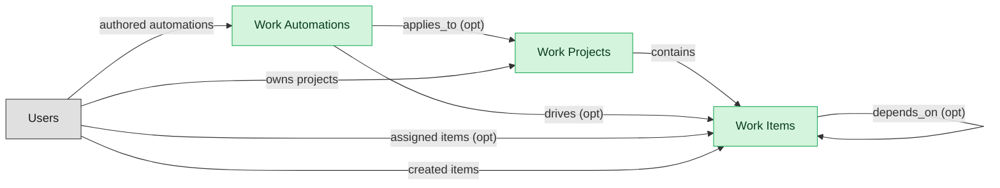

# Task and Project Execution

## 1. Overview

Cross-functional task and project execution surface: work items with owners, due dates, dependencies, statuses, and assignments; project containers with timelines, dashboards, and board views; user-authored automation rules that fire on item state changes. The deployable substrate every team-based work-management product orbits.

## 2. Entity summary

| Name | Description |
| --- | --- |
| Work Automations | Trigger-action rule defined per board/project: status change, due date, assignment, form submission as triggers; multi-step actions with conditions, time delays, and external integrations. The user-authored behavior layer on top of the data primitives. |
| Work Items | Atomic primitive in a work-management platform: task / item / card with owner, due date, status, priority, dependencies, subtasks, attachments, and comments. Same shape regardless of platform-specific terminology (task, item, row, card). |
| Work Projects | Container of work_items, regardless of platform-specific terminology (project, board, sheet, space/list). Has timeline, status, owner, members, dashboards, and embedded views. |

## 3. Entities catalog

| # | data_object | role | mastered in | necessity | pattern flags | notes |
| ---: | --- | --- | --- | --- | --- | --- |
| 1 | `work_automations` (Work Automations) | master | - | required | - | - |
| 2 | `work_items` (Work Items) | master | - | required | - | - |
| 3 | `work_projects` (Work Projects) | master | - | required | - | - |

## 4. Aliases and industry synonyms

_(no industry-scoped aliases or non-synonym alias types loaded for this scope; generic synonyms are omitted as common knowledge.)_

## 5. Relationships

### 5.1 Intra-scope edges

| from | verb | to | cardinality | kind | necessity | owner_side | notes |
| --- | --- | --- | --- | --- | --- | --- | --- |
| `work_items` | depends_on | `work_items` | many_to_many | association | optional | source | - |
| `work_projects` | contains | `work_items` | one_to_many | composition | required | source | - |
| `work_automations` | drives | `work_items` | one_to_many | reference | optional | source | - |
| `work_automations` | applies_to | `work_projects` | many_to_many | association | optional | target | - |

### 5.2 Built-in edges (`users` and other platform built-ins)

| from | verb | to | cardinality | necessity | owner_side | notes |
| --- | --- | --- | --- | --- | --- | --- |
| `users` | assigned items | `work_items` | one_to_many | optional | source | - |
| `users` | created items | `work_items` | one_to_many | required | source | - |
| `users` | owns projects | `work_projects` | one_to_many | required | source | - |
| `users` | authored automations | `work_automations` | one_to_many | required | source | - |

### 5.3 Cross-scope edges

| from | verb | to | cardinality | necessity | notes |
| --- | --- | --- | --- | --- | --- |
| `test_defects` | spawns | `work_items` | one_to_many | optional | - |
| `action_plans` | spawns | `work_items` | one_to_many | optional | - |
| `okr_objectives` | tracked_by | `work_items` | one_to_many | optional | - |
| `work_projects` | aligned_to | `okr_objectives` | many_to_many | optional | - |
| `work_items` | mirrors_to | `service_requests` | one_to_one | optional | - |
| `work_automations` | propagates_to | `service_requests` | many_to_many | optional | - |
| `strategic_initiatives` | portfolio rollup from | `work_items` | one_to_many | optional | - |
| `work_automations` | rolls_up_into | `strategic_portfolios` | many_to_many | optional | - |
| `work_projects` | closes_into | `service_projects` | one_to_one | optional | - |
| `work_automations` | feeds | `project_tasks` | many_to_many | optional | - |
| `work_automations` | posts_to | `chat_channels` | many_to_many | optional | - |
| `work_automations` | mirrors_to | `product_roadmaps` | many_to_many | optional | - |

## 6. Cross-domain context

### 6.1 Master consumers (other modules / domains that embed this scope's masters)

| data_object | other module / domain | role | necessity | notes |
| --- | --- | --- | --- | --- |
| `work_automations` | PM-ROADMAP-DELIVERY (Roadmap, Release, and Strategy) - PROD-MGMT | consumer | optional | - |
| `work_items` | SPM (Strategic Portfolio Management) | consumer | required | Portfolio dashboards roll up project/work_item completion as input to portfolio status and strategy-execution alignment. |
| `work_items` | WORK-MGMT-GOALS-OKR (Team-Execution Goals and OKRs) - WORK-MGMT | embedded_master | required | - |
| `work_projects` | PSA-PROJECT-DELIVERY (Project Delivery) - PSA | consumer | optional | - |

### 6.2 Outbound handoffs (events this scope publishes)

| source module | target domain | target module | trigger_event | payload | integration | friction | description |
| --- | --- | --- | --- | --- | --- | --- | --- |
| WORK-MGMT-TASK-EXEC | ITSM | _(domain-level)_ | `work_item.status_changed` | `work_items` | api_call | high | Cross-functional WORK-MGMT items intersect with IT support requests: a marketing project task ('IT-provision new SaaS') needs to be linked to an ITSM request, with status mirrored both ways. Bidirectional sync is bespoke; off-the-shelf WORK-MGMT-to-ITSM connectors exist but require careful per-team configuration. |
| WORK-MGMT-TASK-EXEC | ITSM | _(domain-level)_ | `work_automation.triggered` | `work_automations` | event_stream | low | Work-item automations linked to IT tickets propagate status changes to ITSM. |
| WORK-MGMT-TASK-EXEC | SPM | _(domain-level)_ | `work_automation.triggered` | `work_automations` | batch_sync | medium | Aggregated work-automation outcomes feed SPM portfolio rollup. |
| WORK-MGMT-TASK-EXEC | SPM | _(domain-level)_ | `work_item.completed` | `work_items` | batch_sync | medium | Work-management platforms publish task-completion data to portfolio dashboards in SPM tools. The portfolio rollup powers strategy-to-execution dashboards and OKR progress (via okr_objectives.key_results linking down to work_items). Nightly sync is the common pattern; richer real-time integrations exist but are vendor-specific. |
| WORK-MGMT-TASK-EXEC | PSA | _(domain-level)_ | `work_automation.triggered` | `work_automations` | event_stream | low | Automation-driven task transitions feed PSA for utilization and billable-hour tracking. |
| WORK-MGMT-TASK-EXEC | PSA | PSA-PROJECT-DELIVERY | `work_project.completed` | `work_projects` | batch_sync | medium | Services orgs running delivery in WORK-MGMT close a project and need utilization, billable hours, and milestone-based revenue recognition to roll up into PSA. Nightly sync of project status + hours is the common pattern; richer real-time integration exists but is uncommon. |
| WORK-MGMT-TASK-EXEC | WSC | _(domain-level)_ | `work_automation.triggered` | `work_automations` | api_call | low | Automations post status updates and task notifications into workstream collaboration channels. |
| WORK-MGMT-TASK-EXEC | PROD-MGMT | PM-ROADMAP-DELIVERY | `work_automation.triggered` | `work_automations` | event_stream | medium | Engineering team automations mirror into product-management roadmap tracking. |

### 6.3 Inbound handoffs (events this scope reacts to)

_(no inbound `handoffs` whose payload is in this scope.)_

### 6.4 Master providers (modules / domains that own masters this scope embeds)

## 7. Lifecycle states (per master)

### `work_automations` (Work Automation)

| order | state_name | initial? | terminal? | requires_permission? | derived gate | description |
| --- | --- | --- | --- | --- | --- | --- |
| 1 | `drafted` | ✓ | - | - | - | - |
| 2 | `enabled` | - | - | ✓ | `work-mgmt-task-exec:enable_work_automation` | - |
| 3 | `disabled` | - | - | ✓ | `work-mgmt-task-exec:disable_work_automation` | - |
| 4 | `archived` | - | ✓ | - | - | - |

### `work_items` (Work Item)

| order | state_name | initial? | terminal? | requires_permission? | derived gate | description |
| --- | --- | --- | --- | --- | --- | --- |
| 1 | `open` | ✓ | - | - | - | - |
| 2 | `in_progress` | - | - | - | - | - |
| 3 | `blocked` | - | - | - | - | - |
| 4 | `done` | - | ✓ | - | - | - |
| 5 | `cancelled` | - | ✓ | - | - | - |

### `work_projects` (Work Project)

| order | state_name | initial? | terminal? | requires_permission? | derived gate | description |
| --- | --- | --- | --- | --- | --- | --- |
| 1 | `planning` | ✓ | - | - | - | - |
| 2 | `active` | - | - | - | - | - |
| 3 | `on_hold` | - | - | - | - | - |
| 4 | `completed` | - | ✓ | ✓ | `work-mgmt-task-exec:complete_work_project` | - |
| 5 | `archived` | - | ✓ | - | - | - |

## 8. Permissions and business rules (derived)

### 8.1 Permissions

| permission | tier | description | included in `:admin`? |
| --- | --- | --- | --- |
| `work-mgmt-task-exec:read` | baseline-read | Read access to every entity in the module | ✓ |
| `work-mgmt-task-exec:manage` | baseline-manage | Edit operational records | ✓ |
| `work-mgmt-task-exec:admin` | baseline-admin | Edit reference data and inherit every workflow gate below | - |
| `work-mgmt-task-exec:complete_work_project` | workflow-gate (lifecycle) | Transition `work_projects` into state `completed` | ✓ |
| `work-mgmt-task-exec:enable_work_automation` | workflow-gate (lifecycle) | Transition `work_automations` into state `enabled` | ✓ |
| `work-mgmt-task-exec:disable_work_automation` | workflow-gate (lifecycle) | Transition `work_automations` into state `disabled` | ✓ |

### 8.2 Business rules

_(no flag-derived business rules.)_
