# Candidate CRM

## 1. Overview

### 1.1 Analyst overview

The candidate-relationship backbone of an ATS, masters candidates (including the `prospect` lifecycle state), recruitment sources, agencies, and events. Structurally the same shape as standalone candidate-CRM products. Folds the AI-RECRUIT capability (resume parsing, ML matching, screening assistants) since those tools operate on `candidates` and are tightly bound to candidate workflows.

## 2. Entity summary

| Name | Description |
| --- | --- |
| Candidate Consents | Per-candidate opt-in record for GDPR / CCPA / data retention. Carries consent type, jurisdiction, granted timestamp, withdrawal timestamp, retention window. |
| Candidate Documents | File artifact attached to a candidate (resume, cover letter, portfolio, work sample, signed disclosure, reference letter, right-to-work proof). Carries document type, MIME type, storage URI, uploaded-by actor, uploaded-at timestamp, and visibility scope. |
| Candidate Engagements | Single recruiter-to-candidate touchpoint (email, InMail, call, SMS, event invite). Carries channel, direction, timestamp, status, and content reference. |
| Candidate Notes | Free-form recruiter or hiring-team note on a candidate, internal-only, never sent to the candidate. Carries author, body, visibility scope (private to author, team, or hiring panel), timestamp, and optional at-mentions to other team members. |
| Candidate Nurture Campaigns | Multi-touch automated outreach sequence targeting talent-pool segments. Carries cadence, step templates, audience filter, and lifecycle state. |
| Candidates | Person known to the recruiting org, with or without an active application. Carries contact details, resume, tags, GDPR consent, and source. Distinct from Employee until hired. |
| Data Subject Requests | GDPR Articles 15-22 (and analogous CPRA/PIPEDA) request from a candidate exercising access, rectification, erasure, restriction, portability, or objection rights against personal data the ATS holds. Tracks request type, intake channel, due date, fulfillment, and verification. |
| Recruiter Interactions | Free-text recruiter note attached to a candidate, application, or pool, time-stamped and authored by a user. |
| Recruiting Event Attendances | Junction between candidates and recruitment_events recording registration, check-in, attendance, and conversion outcome. |
| Recruitment Agencies | Third-party recruiter or staffing firm supplying candidates. Tracks contract terms, contact, performance, and the candidates they have submitted. |
| Recruitment Events | Career fair, on-campus event, hackathon, or meetup used as a sourcing channel. Tracks attendees, captured leads, and event ROI. |
| Recruitment Sources | Channel a candidate came from: job board, referral, agency, sourcing campaign, career event, or inbound. Used for source-of-hire analytics and channel ROI. |
| Opportunities | Internal postings covering full-time roles, gigs, projects, stretch assignments, and mentorships. |
| Talent Pools | Curated segment or pipeline of candidates kept warm for future roles (e.g. silver medallists, alumni, target-school grads, hard-to-fill skill clusters). |

```mermaid
flowchart TD
  classDef master fill:#d4f4dd,stroke:#27ae60,color:#0b3d20;
  classDef embedded_master fill:#fff4cc,stroke:#c79100,color:#5b4500;
  classDef consumer fill:#e8def8,stroke:#7b1fa2,color:#3a155d;
  classDef platform_builtin fill:#e0e0e0,stroke:#424242,color:#1a1a1a;
  candidates["Candidates"]
  recruitment_sources["Recruitment Sources"]
  recruitment_agencies["Recruitment Agencies"]
  recruitment_events["Recruitment Events"]
  talent_pools["Talent Pools"]
  candidate_engagements["Candidate Engagements"]
  candidate_nurture_campaigns["Candidate Nurture Campaigns"]
  recruiting_event_attendances["Recruiting Event Attendances"]
  recruiter_interactions["Recruiter Interactions"]
  candidate_consents["Candidate Consents"]
  data_subject_requests["Data Subject Requests"]
  internal_opportunities["Opportunities"]
  candidate_documents["Candidate Documents"]
  candidate_notes["Candidate Notes"]
  users["Users"]
  candidates -->|"engaged_via (opt)"| candidate_engagements
  candidate_nurture_campaigns -->|"generates (opt)"| candidate_engagements
  candidates -->|"attends_via"| recruiting_event_attendances
  recruitment_events -->|"has_attendance"| recruiting_event_attendances
  candidates -->|"noted_via (opt)"| recruiter_interactions
  candidates -->|"consents_via"| candidate_consents
  talent_pools -->|"targets (opt)"| candidate_nurture_campaigns
  candidates -->|"submits_via (opt)"| data_subject_requests
  candidates -->|"documented_via (opt)"| candidate_documents
  candidates -->|"annotated_via (opt)"| candidate_notes
  recruitment_sources -->|"attributes"| candidates
  recruitment_agencies -->|"sources"| candidates
  recruitment_events -->|"attracts"| candidates
  talent_pools -->|"groups"| candidates
  users -->|"posts"| internal_opportunities
  candidates -->|"has owning recruiter (opt)"| users
  talent_pools -->|"has owner"| users
  recruitment_agencies -->|"has relationship owner"| users
  recruitment_events -->|"has coordinator"| users
  users -->|"uploaded documents (opt)"| candidate_documents
  users -->|"authored notes (opt)"| candidate_notes
  class candidates master;
  class recruitment_sources master;
  class recruitment_agencies master;
  class recruitment_events master;
  class talent_pools consumer;
  class candidate_engagements master;
  class candidate_nurture_campaigns master;
  class recruiting_event_attendances master;
  class recruiter_interactions master;
  class candidate_consents master;
  class data_subject_requests master;
  class internal_opportunities embedded_master;
  class candidate_documents master;
  class candidate_notes master;
  class users platform_builtin;
  style internal_opportunities stroke-dasharray:5 5;
```

## 3. Entities catalog

| # | data_object | role | mastered in | label | necessity | pattern flags | notes |
| ---: | --- | --- | --- | --- | --- | --- | --- |
| 1 | `candidate_consents` (Candidate Consents) | master | - | - | required | personal_content | - |
| 2 | `candidate_documents` (Candidate Documents) | master | - | - | required | personal_content | - |
| 3 | `candidate_engagements` (Candidate Engagements) | master | - | - | required | personal_content | - |
| 4 | `candidate_notes` (Candidate Notes) | master | - | - | required | personal_content | - |
| 5 | `candidate_nurture_campaigns` (Candidate Nurture Campaigns) | master | - | - | required | - | - |
| 6 | `candidates` (Candidates) | master | - | - | required | personal_content | - |
| 7 | `data_subject_requests` (Data Subject Requests) | master | - | - | required | personal_content | - |
| 8 | `recruiter_interactions` (Recruiter Interactions) | master | - | - | required | personal_content | - |
| 9 | `recruiting_event_attendances` (Recruiting Event Attendances) | master | - | - | required | personal_content | - |
| 10 | `recruitment_agencies` (Recruitment Agencies) | master | - | - | required | - | - |
| 11 | `recruitment_events` (Recruitment Events) | master | - | - | required | - | - |
| 12 | `recruitment_sources` (Recruitment Sources) | master | - | - | required | - | - |
| 13 | `internal_opportunities` (Opportunities) | embedded_master | `tlnt-intel-marketplace` | Talent Marketplace | optional | submit_lock, single_approver | - |
| 14 | `talent_pools` (Talent Pools) | consumer | `ats-talent-pools` | Talent Pools | required | - | - |

## 4. Aliases and industry synonyms

_(no industry-scoped aliases or non-synonym alias types loaded for this scope; generic synonyms are omitted as common knowledge.)_

## 5. Relationships

### 5.1 Intra-scope edges

| from | verb | to | cardinality | kind | necessity | owner_side | notes |
| --- | --- | --- | --- | --- | --- | --- | --- |
| `candidates` | engaged_via | `candidate_engagements` | one_to_many | reference | optional | target | - |
| `candidate_nurture_campaigns` | generates | `candidate_engagements` | one_to_many | composition | optional | source | - |
| `candidates` | attends_via | `recruiting_event_attendances` | one_to_many | reference | required | target | - |
| `recruitment_events` | has_attendance | `recruiting_event_attendances` | one_to_many | composition | required | source | - |
| `candidates` | noted_via | `recruiter_interactions` | one_to_many | reference | optional | target | - |
| `candidates` | consents_via | `candidate_consents` | one_to_many | composition | required | source | - |
| `talent_pools` | targets | `candidate_nurture_campaigns` | many_to_many | reference | optional | source | - |
| `candidates` | submits_via | `data_subject_requests` | one_to_many | composition | optional | source | - |
| `candidates` | documented_via | `candidate_documents` | one_to_many | composition | optional | source | - |
| `candidates` | annotated_via | `candidate_notes` | one_to_many | composition | optional | source | - |
| `recruitment_sources` | attributes | `candidates` | one_to_many | reference | required | target | - |
| `recruitment_agencies` | sources | `candidates` | one_to_many | reference | required | target | - |
| `recruitment_events` | attracts | `candidates` | one_to_many | reference | required | target | - |
| `talent_pools` | groups | `candidates` | many_to_many | reference | required | target | - |

### 5.2 Built-in edges (`users` and other platform built-ins)

| from | verb | to | cardinality | necessity | owner_side | notes |
| --- | --- | --- | --- | --- | --- | --- |
| `users` | posts | `internal_opportunities` | one_to_many | required | source | - |
| `candidates` | has owning recruiter | `users` | many_to_many | optional | source | - |
| `talent_pools` | has owner | `users` | many_to_many | required | source | - |
| `recruitment_agencies` | has relationship owner | `users` | many_to_many | required | source | - |
| `recruitment_events` | has coordinator | `users` | many_to_many | required | source | - |
| `users` | uploaded documents | `candidate_documents` | one_to_many | optional | source | - |
| `users` | authored notes | `candidate_notes` | one_to_many | optional | source | - |

### 5.3 Cross-scope edges

#### 5.3a Outbound from this scope's masters and contributors

_Edges this scope drives: the in-scope endpoint has `role` of `master` or `contributor`._

| from | verb | to | cardinality | necessity | notes |
| --- | --- | --- | --- | --- | --- |
| `candidates` | member_of_via | `talent_pool_memberships` | one_to_many | required | - |
| `candidates` | discloses_via | `fcra_disclosures` | one_to_many | required | - |
| `candidates` | self_identifies_via | `eeo_responses` | one_to_many | optional | - |
| `candidates` | self_ids_via | `voluntary_self_identifications` | one_to_many | optional | - |
| `candidates` | acknowledges_via | `fcra_summary_of_rights_acknowledgements` | one_to_many | optional | - |
| `candidates` | tagged_via | `candidate_tag_assignments` | one_to_many | optional | - |
| `skill_profiles` | feeds | `candidates` | one_to_many | optional | - |
| `candidates` | submits | `job_applications` | one_to_many | required | - |
| `candidate_referrals` | introduces | `candidates` | one_to_many | required | - |
| `candidates` | becomes | `employees` | one_to_one | required | - |
| `candidates` | becomes pre-employee | `pre_employees` | one_to_one | required | - |

#### 5.3b Context edges on embedded shells and consumed entities

_Edges the canonical owner drives, shown for context: the in-scope endpoint has `role` of `embedded_master`, `consumer`, or `derived`._

4 context edges

| from | verb | to | cardinality | necessity | notes |
| --- | --- | --- | --- | --- | --- |
| `internal_opportunities` | receives | `opportunity_applications` | one_to_many | optional | - |
| `internal_opportunities` | ranked by | `fit_scores` | one_to_many | optional | - |
| `talent_pools` | has_member | `talent_pool_memberships` | one_to_many | required | - |
| `talent_segments` | materializes_into | `talent_pools` | one_to_many | optional | - |

## 6. Cross-domain context

### 6.1 Master consumers (other modules / domains that embed this scope's masters)

| data_object | other module / domain | role | necessity | notes |
| --- | --- | --- | --- | --- |
| `candidates` | ATS-BACKGROUND-CHECKS (Background Checks) - ATS | embedded_master | required | - |
| `candidates` | ATS-INTERVIEWS (Interviews) - ATS | embedded_master | required | - |
| `candidates` | ATS-OFFERS (Offers) - ATS | embedded_master | required | - |
| `candidates` | ATS-PRE-EMPLOYEE-RECORD (Pre-Employee Record) - ATS | embedded_master | required | - |
| `candidates` | ATS-RECRUITMENT-PIPELINE (Recruitment Pipeline) - ATS | embedded_master | required | - |
| `candidates` | ATS-REFERRALS (Employee Referrals) - ATS | embedded_master | required | - |
| `candidates` | ATS-TALENT-POOLS (Talent Pools) - ATS | embedded_master | required | - |
| `candidates` | HCM-LIFECYCLE-WORKFLOWS (Employee Lifecycle Workflows) - HCM | consumer | required | - |
| `candidates` | HIRING-STARTER (Hiring Starter) - ATS | embedded_master | required | - |
| `candidates` | ONB-JOURNEY-MGMT (Onboarding Journey Management) - ONBOARDING | consumer | required | - |
| `recruitment_sources` | HIRING-STARTER (Hiring Starter) - ATS | embedded_master | optional | - |
| `recruitment_sources` | PA-WORKFORCE-METRICS (Workforce Metrics) - PA | consumer | required | - |

### 6.2 Outbound handoffs (events this scope publishes)

| source module | target domain | target module | trigger_event | payload | integration | friction | description |
| --- | --- | --- | --- | --- | --- | --- | --- |
| ATS-CANDIDATE-CRM | HCM | HCM-LIFECYCLE-WORKFLOWS | `candidate.hired` | `candidates` | event_stream | high | Hired-candidate event publishes the hiring outcome to HCM, which must create the employee record. Identifier mapping (candidate_id -> employee_id) is the canonical reconciliation gap. |
| ATS-CANDIDATE-CRM | ATS | ATS-TALENT-POOLS | `recruitment_event.held` | `recruitment_events` | lifecycle_progression | low | - |
| ATS-CANDIDATE-CRM | BEN-ADMIN | BEN-ENROLLMENT | `candidate.hired` | `candidates` | event_stream | low | Hired candidate triggers eligibility window in BEN-ADMIN. |
| ATS-CANDIDATE-CRM | PA | PA-WORKFORCE-METRICS | `recruitment_source.attributed` | `recruitment_sources` | batch_sync | low | Source attribution feeds people-analytics quality-of-hire and cost-per-hire models. |
| ATS-CANDIDATE-CRM | ONBOARDING | ONB-JOURNEY-MGMT | `candidate.hired` | `candidates` | event_stream | medium | Hired candidate drives onboarding-plan kickoff with role/location/manager context from ATS payload. |

### 6.3 Inbound handoffs (events this scope reacts to)

| target module | source domain | source module | trigger_event | payload | integration | friction | description |
| --- | --- | --- | --- | --- | --- | --- | --- |
| ATS-CANDIDATE-CRM | ATS | ATS-TALENT-POOLS | `talent_pool.candidate_added` | `talent_pools` | lifecycle_progression | low | - |
| ATS-CANDIDATE-CRM | ATS | ATS-REFERRALS | `candidate_referral.submitted` | `candidates` | lifecycle_progression | low | - |

### 6.4 Master providers (modules / domains that own masters this scope embeds)

| data_object | role here | necessity | canonical owner(s) | slice notes |
| --- | --- | --- | --- | --- |
| `internal_opportunities` | embedded_master | optional | TLNT-INTEL-MARKETPLACE (TLNT-INTEL) | - |
| `talent_pools` | consumer | required | ATS-TALENT-POOLS (ATS) | - |

## 7. Lifecycle states (per touched entity)

### `candidate_consents` (Candidate Consent)

| order | state_name | initial? | terminal? | requires_permission? | derived gate | description |
| --- | --- | --- | --- | --- | --- | --- |
| 1 | `granted` | ✓ | - | - | - | Candidate has granted consent. |
| 2 | `withdrawn` | - | ✓ | ✓ | `ats-candidate-crm:withdrawn_candidate_consent` | Candidate revoked consent; data must be anonymized per policy. |
| 3 | `expired` | - | ✓ | - | - | Retention window elapsed without renewal. |

### `candidate_engagements` (Candidate Engagement)

| order | state_name | initial? | terminal? | requires_permission? | derived gate | description |
| --- | --- | --- | --- | --- | --- | --- |
| 1 | `planned` | ✓ | - | - | - | Engagement queued, not yet sent. |
| 2 | `sent` | - | - | - | - | Outbound dispatched to candidate. |
| 3 | `delivered` | - | - | - | - | Channel confirmed delivery. |
| 4 | `responded` | - | ✓ | - | - | Candidate replied or engaged with content. |
| 5 | `bounced` | - | ✓ | - | - | Delivery failed (bad address, blocked, unsubscribed). |

### `candidate_nurture_campaigns` (Candidate Nurture Campaign)

| order | state_name | initial? | terminal? | requires_permission? | derived gate | description |
| --- | --- | --- | --- | --- | --- | --- |
| 1 | `draft` | ✓ | - | - | - | Campaign being authored. |
| 2 | `active` | - | - | ✓ | `ats-candidate-crm:active_candidate_nurture_campaign` | Campaign live and sending to audience. |
| 3 | `paused` | - | - | - | - | Campaign halted; can resume. |
| 4 | `completed` | - | ✓ | - | - | Campaign reached scheduled end. |

### `candidates` (Candidate)

| order | state_name | initial? | terminal? | requires_permission? | derived gate | description |
| --- | --- | --- | --- | --- | --- | --- |
| 1 | `prospect` | ✓ | - | - | - | Person known to the recruiting org with no active application. |
| 2 | `active` | - | - | - | - | Candidate has at least one open application or is actively engaged. |
| 3 | `hired` | - | ✓ | ✓ | `ats-candidate-crm:hire_candidate` | Candidate accepted an offer and converted to employee. |
| 4 | `do_not_hire` | - | ✓ | ✓ | `ats-candidate-crm:flag_do_not_hire` | Candidate flagged as ineligible for future consideration; gated decision. |
| 5 | `archived` | - | ✓ | - | - | Candidate kept in the database but not active in any pipeline. |

### `internal_opportunities` (Opportunity)

_This scope holds `internal_opportunities` as **embedded_master**; the canonical state machine is owned by `TLNT-INTEL-MARKETPLACE`._

| order | state_name | initial? | terminal? | requires_permission? | derived gate | description |
| --- | --- | --- | --- | --- | --- | --- |
| 1 | `draft` | ✓ | - | - | - | - |
| 2 | `open` | - | - | ✓ | `tlnt-intel-marketplace:publish_opportunity` | - |
| 3 | `closed` | - | - | ✓ | `tlnt-intel-marketplace:close_opportunity` | - |
| 4 | `filled` | - | ✓ | - | - | - |
| 5 | `cancelled` | - | ✓ | ✓ | `tlnt-intel-marketplace:cancel_opportunity` | - |

### `recruiting_event_attendances` (Recruiting Event Attendance)

| order | state_name | initial? | terminal? | requires_permission? | derived gate | description |
| --- | --- | --- | --- | --- | --- | --- |
| 1 | `registered` | ✓ | - | - | - | Candidate RSVP'd or was pre-registered. |
| 2 | `checked_in` | - | - | - | - | Candidate arrived at the event. |
| 3 | `attended` | - | ✓ | - | - | Engaged at the event; eligible for follow-up. |
| 4 | `no_show` | - | ✓ | - | - | Registered but did not attend. |

### `recruitment_agencies` (Recruitment Agency)

| order | state_name | initial? | terminal? | requires_permission? | derived gate | description |
| --- | --- | --- | --- | --- | --- | --- |
| 1 | `prospective` | ✓ | - | - | - | Agency under evaluation; contract not yet executed. |
| 2 | `active` | - | - | - | - | Agency has executed agreement and is engaged on one or more requisitions. |
| 3 | `on_hold` | - | - | - | - | Engagement paused (performance review, contractual dispute, hiring freeze). |
| 4 | `terminated` | - | ✓ | - | - | Relationship ended; no further requisitions are routed to this agency. |

### `recruitment_events` (Recruitment Event)

| order | state_name | initial? | terminal? | requires_permission? | derived gate | description |
| --- | --- | --- | --- | --- | --- | --- |
| 1 | `planned` | ✓ | - | - | - | Event scoped and budgeted; date, venue, target audience set; registration not yet open. |
| 2 | `open_for_registration` | - | - | - | - | Registration is accepting attendees; promotion campaigns active. |
| 3 | `held` | - | - | - | - | Event has been executed; attendee lists captured, leads ingested into talent pool. |
| 4 | `closed` | - | ✓ | - | - | Post-event activities complete; cost accounting and source-attribution finalized. |
| 5 | `cancelled` | - | ✓ | - | - | Event called off before it happens; sunk costs recognized, attendees notified. |

### `talent_pools` (Talent Pool)

_This scope holds `talent_pools` as **consumer**; the canonical state machine is owned by `ATS-TALENT-POOLS`._

| order | state_name | initial? | terminal? | requires_permission? | derived gate | description |
| --- | --- | --- | --- | --- | --- | --- |
| 1 | `active` | ✓ | - | - | - | Pool is open for additions and nurture campaigns. |
| 2 | `paused` | - | - | - | - | Pool nurture is temporarily halted (off-season, budget freeze) but membership is retained. |
| 3 | `archived` | - | ✓ | - | - | Pool is closed; membership is retained for historical attribution but no further outreach occurs. |

## 8. Permissions and business rules (derived)

### 8.1 Permissions

| permission | tier | description | included in `:admin`? |
| --- | --- | --- | --- |
| `ats-candidate-crm:read` | baseline-read | Read access to every entity in the module | ✓ |
| `ats-candidate-crm:manage` | baseline-manage | Edit operational records | ✓ |
| `ats-candidate-crm:admin` | baseline-admin | Edit reference data and inherit every workflow gate below | - |
| `ats-candidate-crm:hire_candidate` | workflow-gate (lifecycle) | Transition `candidates` into state `hired` | ✓ |
| `ats-candidate-crm:flag_do_not_hire` | workflow-gate (lifecycle) | Transition `candidates` into state `do_not_hire` | ✓ |
| `ats-candidate-crm:active_candidate_nurture_campaign` | workflow-gate (lifecycle) | Transition `candidate_nurture_campaigns` into state `active` | ✓ |
| `ats-candidate-crm:withdrawn_candidate_consent` | workflow-gate (lifecycle) | Transition `candidate_consents` into state `withdrawn` | ✓ |
| `ats-candidate-crm:view_all_candidates` | override (personal_content) | View all `candidates` rows beyond row-scope | ✓ |
| `ats-candidate-crm:manage_all_candidates` | override (personal_content) | Manage all `candidates` rows beyond row-scope | ✓ |
| `ats-candidate-crm:view_all_candidate_engagements` | override (personal_content) | View all `candidate_engagements` rows beyond row-scope | ✓ |
| `ats-candidate-crm:manage_all_candidate_engagements` | override (personal_content) | Manage all `candidate_engagements` rows beyond row-scope | ✓ |
| `ats-candidate-crm:view_all_recruiting_event_attendances` | override (personal_content) | View all `recruiting_event_attendances` rows beyond row-scope | ✓ |
| `ats-candidate-crm:manage_all_recruiting_event_attendances` | override (personal_content) | Manage all `recruiting_event_attendances` rows beyond row-scope | ✓ |
| `ats-candidate-crm:view_all_recruiter_interactions` | override (personal_content) | View all `recruiter_interactions` rows beyond row-scope | ✓ |
| `ats-candidate-crm:manage_all_recruiter_interactions` | override (personal_content) | Manage all `recruiter_interactions` rows beyond row-scope | ✓ |
| `ats-candidate-crm:view_all_candidate_consents` | override (personal_content) | View all `candidate_consents` rows beyond row-scope | ✓ |
| `ats-candidate-crm:manage_all_candidate_consents` | override (personal_content) | Manage all `candidate_consents` rows beyond row-scope | ✓ |
| `ats-candidate-crm:view_all_data_subject_requests` | override (personal_content) | View all `data_subject_requests` rows beyond row-scope | ✓ |
| `ats-candidate-crm:manage_all_data_subject_requests` | override (personal_content) | Manage all `data_subject_requests` rows beyond row-scope | ✓ |
| `ats-candidate-crm:view_all_candidate_documents` | override (personal_content) | View all `candidate_documents` rows beyond row-scope | ✓ |
| `ats-candidate-crm:manage_all_candidate_documents` | override (personal_content) | Manage all `candidate_documents` rows beyond row-scope | ✓ |
| `ats-candidate-crm:view_all_candidate_notes` | override (personal_content) | View all `candidate_notes` rows beyond row-scope | ✓ |
| `ats-candidate-crm:manage_all_candidate_notes` | override (personal_content) | Manage all `candidate_notes` rows beyond row-scope | ✓ |

### 8.2 Business rules

| rule_name | data_object | source flag | intent |
| --- | --- | --- | --- |
| `candidate_edit_scope` | `candidates` | has_personal_content | Row-scope by default; override via `ats-candidate-crm:view_all_candidates` / `ats-candidate-crm:manage_all_candidates` |
| `candidate_engagement_edit_scope` | `candidate_engagements` | has_personal_content | Row-scope by default; override via `ats-candidate-crm:view_all_candidate_engagements` / `ats-candidate-crm:manage_all_candidate_engagements` |
| `recruiting_event_attendance_edit_scope` | `recruiting_event_attendances` | has_personal_content | Row-scope by default; override via `ats-candidate-crm:view_all_recruiting_event_attendances` / `ats-candidate-crm:manage_all_recruiting_event_attendances` |
| `recruiter_interaction_edit_scope` | `recruiter_interactions` | has_personal_content | Row-scope by default; override via `ats-candidate-crm:view_all_recruiter_interactions` / `ats-candidate-crm:manage_all_recruiter_interactions` |
| `candidate_consent_edit_scope` | `candidate_consents` | has_personal_content | Row-scope by default; override via `ats-candidate-crm:view_all_candidate_consents` / `ats-candidate-crm:manage_all_candidate_consents` |
| `data_subject_request_edit_scope` | `data_subject_requests` | has_personal_content | Row-scope by default; override via `ats-candidate-crm:view_all_data_subject_requests` / `ats-candidate-crm:manage_all_data_subject_requests` |
| `candidate_document_edit_scope` | `candidate_documents` | has_personal_content | Row-scope by default; override via `ats-candidate-crm:view_all_candidate_documents` / `ats-candidate-crm:manage_all_candidate_documents` |
| `candidate_note_edit_scope` | `candidate_notes` | has_personal_content | Row-scope by default; override via `ats-candidate-crm:view_all_candidate_notes` / `ats-candidate-crm:manage_all_candidate_notes` |
