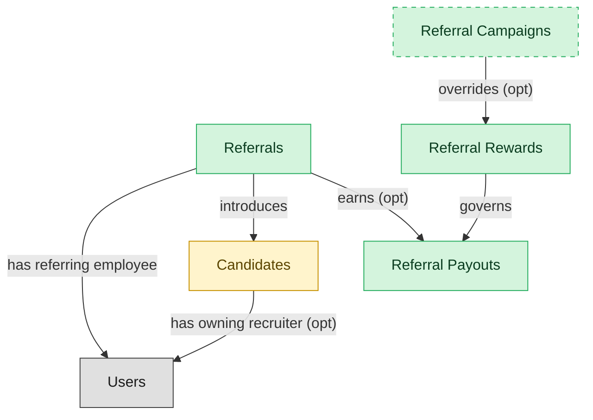

# Employee Referrals

## 1. Overview

### 1.1 Analyst overview

Employee-driven candidate sourcing with referral-bonus tracking (`candidate_referrals`). Embedded-masters `candidates`. Cross-domain handoffs to PAYROLL (bonus payout) and EMP-EXP (engagement signal).

## 2. Entity summary

| Name | Description |
| --- | --- |
| Referral Campaigns | Time-bounded promotion offering bonus referral rewards (e.g. 'double bonus for engineering Q3 2026', 'spot-bonus for hard-to-fill roles'). Scopes a referral_rewards override. |
| Referral Payouts | Individual payout instance triggered when a referred candidate is hired and meets tenure conditions. Lifecycle: pending -> approved -> paid (-> clawed_back). |
| Referral Rewards | Bounty rule defining the payout amount and conditions for a successful referral (e.g. $5000 paid 90 days after hire start, scaled by role level). |
| Referrals | Employee-submitted candidate suggestion linked to a requisition. Tracks the referring employee, candidate, status, and any payable bonus. |
| Candidates | Person known to the recruiting org, with or without an active application. Carries contact details, resume, tags, GDPR consent, and source. Distinct from Employee until hired. |

## 3. Entities catalog

| # | data_object | role | mastered in | label | necessity | pattern flags | write tier | notes |
| ---: | --- | --- | --- | --- | --- | --- | --- | --- |
| 1 | `referral_campaigns` (Referral Campaigns) | master | - | - | optional | - | `:manage` | - |
| 2 | `referral_payouts` (Referral Payouts) | master | - | - | required | - | `:manage` | - |
| 3 | `referral_rewards` (Referral Rewards) | master | - | - | required | - | `:admin` | - |
| 4 | `candidate_referrals` (Referrals) | master | - | - | required | - | `:manage` | - |
| 5 | `candidates` (Candidates) | embedded_master | `ats-candidate-crm` | Candidate CRM | required | personal_content | `:manage` | - |

## 4. Aliases and industry synonyms

_(no industry-scoped aliases or non-synonym alias types loaded for this scope; generic synonyms are omitted as common knowledge.)_

## 5. Relationships

### 5.1 Intra-scope edges

| from | verb | to | cardinality | kind | necessity | owner_side | delete_mode | fk_format | notes |
| --- | --- | --- | --- | --- | --- | --- | --- | --- | --- |
| `candidate_referrals` | earns | `referral_payouts` | one_to_one | reference | optional | source | clear | reference | - |
| `referral_rewards` | governs | `referral_payouts` | one_to_many | reference | required | source | restrict | reference | - |
| `referral_campaigns` | overrides | `referral_rewards` | one_to_many | reference | optional | source | clear | reference | - |
| `candidate_referrals` | introduces | `candidates` | one_to_many | reference | required | target | restrict | reference | - |

### 5.2 Built-in edges (`users` and other platform built-ins)

| from | verb | to | cardinality | necessity | owner_side | delete_mode | fk_format | notes |
| --- | --- | --- | --- | --- | --- | --- | --- | --- |
| `candidates` | has owning recruiter | `users` | many_to_many | optional | source | clear | reference | - |
| `candidate_referrals` | has referring employee | `users` | many_to_many | required | source | restrict | reference | - |

### 5.3 Cross-scope edges

#### 5.3a Outbound from this scope's masters and contributors

_Edges this scope drives: the in-scope endpoint has `role` of `master` or `contributor`._

_(no outbound cross-scope edges from this scope's masters or contributors.)_

#### 5.3b Context edges on embedded shells and consumed entities

_Edges the canonical owner drives, shown for context: the in-scope endpoint has `role` of `embedded_master`, `consumer`, or `derived`._

21 context edges

| from | verb | to | cardinality | necessity | delete_mode | fk_format | notes |
| --- | --- | --- | --- | --- | --- | --- | --- |
| `candidates` | engaged_via | `candidate_engagements` | one_to_many | optional | clear | reference | - |
| `candidates` | attends_via | `recruiting_event_attendances` | one_to_many | required | restrict | reference | - |
| `candidates` | noted_via | `recruiter_interactions` | one_to_many | optional | clear | reference | - |
| `candidates` | consents_via | `candidate_consents` | one_to_many | required | cascade | parent | - |
| `candidates` | member_of_via | `talent_pool_memberships` | one_to_many | required | restrict | reference | - |
| `candidates` | discloses_via | `fcra_disclosures` | one_to_many | required | cascade | parent | - |
| `candidates` | self_identifies_via | `eeo_responses` | one_to_many | optional | cascade | parent | - |
| `candidates` | submits_via | `data_subject_requests` | one_to_many | optional | cascade | parent | - |
| `candidates` | self_ids_via | `voluntary_self_identifications` | one_to_many | optional | cascade | parent | - |
| `candidates` | acknowledges_via | `fcra_summary_of_rights_acknowledgements` | one_to_many | optional | cascade | parent | - |
| `candidates` | documented_via | `candidate_documents` | one_to_many | optional | cascade | parent | - |
| `candidates` | annotated_via | `candidate_notes` | one_to_many | optional | cascade | parent | - |
| `candidates` | tagged_via | `candidate_tag_assignments` | one_to_many | optional | clear | reference | - |
| `skill_profiles` | feeds | `candidates` | one_to_many | optional | clear | reference | - |
| `candidates` | submits | `job_applications` | one_to_many | required | restrict | reference | - |
| `recruitment_sources` | attributes | `candidates` | one_to_many | required | restrict | reference | - |
| `recruitment_agencies` | sources | `candidates` | one_to_many | required | restrict | reference | - |
| `recruitment_events` | attracts | `candidates` | one_to_many | required | restrict | reference | - |
| `talent_pools` | groups | `candidates` | many_to_many | required | restrict | reference | - |
| `candidates` | becomes | `employees` | one_to_one | required | restrict | reference | - |
| `candidates` | becomes pre-employee | `pre_employees` | one_to_one | required | restrict | reference | - |

## 6. Cross-domain context

### 6.1 Master consumers (other modules / domains that embed this scope's masters)

| data_object | other module / domain | role | necessity | notes |
| --- | --- | --- | --- | --- |
| `candidate_referrals` | PAYROLL-EARNINGS-DEDUCTIONS (Earnings, Deductions and Garnishments) - PAYROLL | consumer | required | - |

### 6.2 Outbound handoffs (events this scope publishes)

| source module | target domain | target module | trigger_event | transition | payload | integration | friction | description |
| --- | --- | --- | --- | --- | --- | --- | --- | --- |
| ATS-REFERRALS | PAYROLL | PAYROLL-EARNINGS-DEDUCTIONS | `candidate_referral.bonus_earned` | _(state_change)_ | `candidate_referrals` | api_call | medium | Referral-bonus eligibility milestone reached; PAYROLL pays bonus via off-cycle or next regular run. |
| ATS-REFERRALS | ATS | ATS-CANDIDATE-CRM | `candidate_referral.submitted` | _(lifecycle)_ | `candidates` | lifecycle_progression | low | - |

### 6.3 Inbound handoffs (events this scope reacts to)

_(no inbound `handoffs` whose payload is in this scope.)_

### 6.4 Master providers (modules / domains that own masters this scope embeds)

| data_object | role here | necessity | canonical owner(s) | slice notes |
| --- | --- | --- | --- | --- |
| `candidates` | embedded_master | required | ATS-CANDIDATE-CRM (ATS) | - |

## 7. Lifecycle states

### `candidate_referrals` (Referral)

| order | state_name | initial? | terminal? | requires_permission? | derived gate | description |
| --- | --- | --- | --- | --- | --- | --- |
| 1 | `submitted` | ✓ | - | - | - | Employee submitted a referral candidate against a requisition. |
| 2 | `under_review` | - | - | - | - | Recruiter is evaluating the referred candidate. |
| 3 | `converted` | - | ✓ | - | - | Referral became a job application in the ATS pipeline. |
| 4 | `bonus_payable` | - | - | ✓ | `ats-referrals:pay_referral_bonus` | Hire confirmed; gated step to approve the referral bonus payout. |
| 5 | `bonus_paid` | - | ✓ | - | - | Referral bonus has been issued to the referring employee. |
| 6 | `rejected` | - | ✓ | - | - | Referral not pursued. |

### `candidates` (Candidate)

_This scope holds `candidates` as **embedded_master**; the canonical state machine is owned by `ATS-CANDIDATE-CRM`._

| order | state_name | initial? | terminal? | requires_permission? | derived gate | description |
| --- | --- | --- | --- | --- | --- | --- |
| 1 | `prospect` | ✓ | - | - | - | Person known to the recruiting org with no active application. |
| 2 | `active` | - | - | - | - | Candidate has at least one open application or is actively engaged. |
| 3 | `hired` | - | ✓ | ✓ | `ats-candidate-crm:hire_candidate` | Candidate accepted an offer and converted to employee. |
| 4 | `do_not_hire` | - | ✓ | ✓ | `ats-candidate-crm:flag_do_not_hire` | Candidate flagged as ineligible for future consideration; gated decision. |
| 5 | `archived` | - | ✓ | - | - | Candidate kept in the database but not active in any pipeline. |

### `referral_campaigns` (Referral Campaign)

| order | state_name | initial? | terminal? | requires_permission? | derived gate | description |
| --- | --- | --- | --- | --- | --- | --- |
| 1 | `draft` | ✓ | - | - | - | Campaign being scoped. |
| 2 | `active` | - | - | - | - | Campaign live; referrals submitted during window qualify for override reward. |
| 3 | `ended` | - | ✓ | - | - | Campaign window closed. |

### `referral_payouts` (Referral Payout)

| order | state_name | initial? | terminal? | requires_permission? | derived gate | description |
| --- | --- | --- | --- | --- | --- | --- |
| 1 | `pending` | ✓ | - | - | - | Referral hire confirmed; tenure clock running. |
| 2 | `approved` | - | - | ✓ | `ats-referrals:approve_referral_payout` | Tenure condition met; payout approved by HR/Finance. |
| 3 | `paid` | - | ✓ | - | - | Payout disbursed to referrer. |
| 4 | `clawed_back` | - | ✓ | ✓ | `ats-referrals:clawback_referral_payout` | Referred employee left before tenure clause expired; payout reversed. |
| 5 | `forfeited` | - | ✓ | - | - | Conditions never met (referred candidate not hired, did not start, voided). |

## 8. Permissions and business rules (derived)

### 8.1 Permissions

| permission | tier | description | included in `:admin`? |
| --- | --- | --- | --- |
| `ats-referrals:read` | baseline-read | Read access to every entity in the module | ✓ |
| `ats-referrals:manage` | baseline-manage | Edit operational records | ✓ |
| `ats-referrals:admin` | baseline-admin | Edit reference data and inherit every workflow gate below | - |
| `ats-referrals:pay_referral_bonus` | workflow-gate (lifecycle) | Transition `candidate_referrals` into state `bonus_payable` | ✓ |
| `ats-referrals:approve_referral_payout` | workflow-gate (lifecycle) | Transition `referral_payouts` into state `approved` | ✓ |
| `ats-referrals:clawback_referral_payout` | workflow-gate (lifecycle) | Transition `referral_payouts` into state `clawed_back` | ✓ |

### 8.2 Business rules

_(no flag-derived business rules.)_
