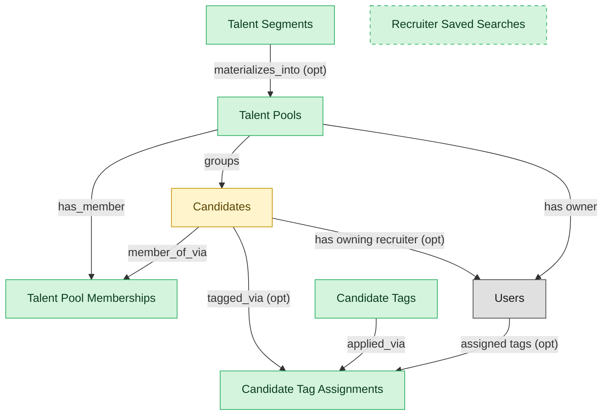

# Talent Pools

## 1. Overview

### 1.1 Analyst overview

Curated candidate groupings for nurture and pipeline-building (`talent_pools`). Embedded-masters `candidates`; deployed alone, materializes a thin candidate shell. Mirrors standalone talent-acquisition CRM products.

## 2. Entity summary

| Name | Description |
| --- | --- |
| Candidate Tag Assignments | Many-to-many junction between candidates and candidate_tags. Carries assigned_by, assigned_at, and optional context. |
| Candidate Tags | Free-form label applied to a candidate to support segmentation, search, and pool inclusion rules. Distinct from talent pools (curated membership lists). Carries name, optional category, and color. |
| Recruiter Saved Searches | Persisted recruiter boolean query over the candidate database. Carries filter expression, last_run timestamp, alert preferences. |
| Talent Pool Memberships | Junction between candidates and talent_pools. Carries added timestamp, source, status_in_pool (cold/warm/hot), match score, and last_engagement timestamp. |
| Talent Pools | Curated segment or pipeline of candidates kept warm for future roles (e.g. silver medallists, alumni, target-school grads, hard-to-fill skill clusters). |
| Talent Segments | Rule-based pool definition (boolean filter over candidates) that materializes membership automatically. Examples: 'Senior PMs in NYC with FinTech experience', 'Engineering alumni who left in the last 2 years'. |
| Candidates | Person known to the recruiting org, with or without an active application. Carries contact details, resume, tags, GDPR consent, and source. Distinct from Employee until hired. |

## 3. Entities catalog

| # | data_object | role | mastered in | label | necessity | pattern flags | notes |
| ---: | --- | --- | --- | --- | --- | --- | --- |
| 1 | `candidate_tag_assignments` (Candidate Tag Assignments) | master | - | - | required | - | - |
| 2 | `candidate_tags` (Candidate Tags) | master | - | - | required | - | - |
| 3 | `recruiter_saved_searches` (Recruiter Saved Searches) | master | - | - | optional | - | - |
| 4 | `talent_pool_memberships` (Talent Pool Memberships) | master | - | - | required | personal_content | - |
| 5 | `talent_pools` (Talent Pools) | master | - | - | required | - | - |
| 6 | `talent_segments` (Talent Segments) | master | - | - | required | - | - |
| 7 | `candidates` (Candidates) | embedded_master | `ats-candidate-crm` | Candidate CRM | required | personal_content | - |

## 4. Aliases and industry synonyms

_(no industry-scoped aliases or non-synonym alias types loaded for this scope; generic synonyms are omitted as common knowledge.)_

## 5. Relationships

### 5.1 Intra-scope edges

| from | verb | to | cardinality | kind | necessity | owner_side | notes |
| --- | --- | --- | --- | --- | --- | --- | --- |
| `talent_pools` | has_member | `talent_pool_memberships` | one_to_many | composition | required | source | - |
| `candidates` | member_of_via | `talent_pool_memberships` | one_to_many | reference | required | target | - |
| `talent_segments` | materializes_into | `talent_pools` | one_to_many | reference | optional | source | - |
| `candidates` | tagged_via | `candidate_tag_assignments` | one_to_many | reference | optional | source | - |
| `candidate_tags` | applied_via | `candidate_tag_assignments` | one_to_many | reference | required | source | - |
| `talent_pools` | groups | `candidates` | many_to_many | reference | required | target | - |

### 5.2 Built-in edges (`users` and other platform built-ins)

| from | verb | to | cardinality | necessity | owner_side | notes |
| --- | --- | --- | --- | --- | --- | --- |
| `candidates` | has owning recruiter | `users` | many_to_many | optional | source | - |
| `talent_pools` | has owner | `users` | many_to_many | required | source | - |
| `users` | assigned tags | `candidate_tag_assignments` | one_to_many | optional | source | - |

### 5.3 Cross-scope edges

#### 5.3a Outbound from this scope's masters and contributors

_Edges this scope drives: the in-scope endpoint has `role` of `master` or `contributor`._

| from | verb | to | cardinality | necessity | notes |
| --- | --- | --- | --- | --- | --- |
| `talent_pools` | targets | `candidate_nurture_campaigns` | many_to_many | optional | - |

#### 5.3b Context edges on embedded shells and consumed entities

_Edges the canonical owner drives, shown for context: the in-scope endpoint has `role` of `embedded_master`, `consumer`, or `derived`._

19 context edges

| from | verb | to | cardinality | necessity | notes |
| --- | --- | --- | --- | --- | --- |
| `candidates` | engaged_via | `candidate_engagements` | one_to_many | optional | - |
| `candidates` | attends_via | `recruiting_event_attendances` | one_to_many | required | - |
| `candidates` | noted_via | `recruiter_interactions` | one_to_many | optional | - |
| `candidates` | consents_via | `candidate_consents` | one_to_many | required | - |
| `candidates` | discloses_via | `fcra_disclosures` | one_to_many | required | - |
| `candidates` | self_identifies_via | `eeo_responses` | one_to_many | optional | - |
| `candidates` | submits_via | `data_subject_requests` | one_to_many | optional | - |
| `candidates` | self_ids_via | `voluntary_self_identifications` | one_to_many | optional | - |
| `candidates` | acknowledges_via | `fcra_summary_of_rights_acknowledgements` | one_to_many | optional | - |
| `candidates` | documented_via | `candidate_documents` | one_to_many | optional | - |
| `candidates` | annotated_via | `candidate_notes` | one_to_many | optional | - |
| `skill_profiles` | feeds | `candidates` | one_to_many | optional | - |
| `candidates` | submits | `job_applications` | one_to_many | required | - |
| `candidate_referrals` | introduces | `candidates` | one_to_many | required | - |
| `recruitment_sources` | attributes | `candidates` | one_to_many | required | - |
| `recruitment_agencies` | sources | `candidates` | one_to_many | required | - |
| `recruitment_events` | attracts | `candidates` | one_to_many | required | - |
| `candidates` | becomes | `employees` | one_to_one | required | - |
| `candidates` | becomes pre-employee | `pre_employees` | one_to_one | required | - |

## 6. Cross-domain context

### 6.1 Master consumers (other modules / domains that embed this scope's masters)

| data_object | other module / domain | role | necessity | notes |
| --- | --- | --- | --- | --- |
| `talent_pools` | ATS-CANDIDATE-CRM (Candidate CRM) - ATS | consumer | optional | - |

### 6.2 Outbound handoffs (events this scope publishes)

| source module | target domain | target module | trigger_event | payload | integration | friction | description |
| --- | --- | --- | --- | --- | --- | --- | --- |
| ATS-TALENT-POOLS | ATS | ATS-CANDIDATE-CRM | `talent_pool.candidate_added` | `talent_pools` | lifecycle_progression | low | - |

### 6.3 Inbound handoffs (events this scope reacts to)

_(no inbound `handoffs` whose payload is in this scope.)_

### 6.4 Master providers (modules / domains that own masters this scope embeds)

| data_object | role here | necessity | canonical owner(s) | slice notes |
| --- | --- | --- | --- | --- |
| `candidates` | embedded_master | required | ATS-CANDIDATE-CRM (ATS) | - |

## 7. Lifecycle states

### `candidates` (Candidate)

_This scope holds `candidates` as **embedded_master**; the canonical state machine is owned by `ATS-CANDIDATE-CRM`._

| order | state_name | initial? | terminal? | requires_permission? | derived gate | description |
| --- | --- | --- | --- | --- | --- | --- |
| 1 | `prospect` | ✓ | - | - | - | Person known to the recruiting org with no active application. |
| 2 | `active` | - | - | - | - | Candidate has at least one open application or is actively engaged. |
| 3 | `hired` | - | ✓ | ✓ | `ats-candidate-crm:hire_candidate` | Candidate accepted an offer and converted to employee. |
| 4 | `do_not_hire` | - | ✓ | ✓ | `ats-candidate-crm:flag_do_not_hire` | Candidate flagged as ineligible for future consideration; gated decision. |
| 5 | `archived` | - | ✓ | - | - | Candidate kept in the database but not active in any pipeline. |

### `talent_pool_memberships` (Talent Pool Membership)

| order | state_name | initial? | terminal? | requires_permission? | derived gate | description |
| --- | --- | --- | --- | --- | --- | --- |
| 1 | `cold` | ✓ | - | - | - | In pool, no recent engagement. |
| 2 | `warm` | - | - | - | - | Recent positive engagement (replied, attended event). |
| 3 | `hot` | - | - | - | - | Actively engaged; recruiter is in conversation about a specific role. |
| 4 | `removed` | - | ✓ | - | - | Candidate removed from pool (opt-out, archive, do-not-contact). |

### `talent_pools` (Talent Pool)

| order | state_name | initial? | terminal? | requires_permission? | derived gate | description |
| --- | --- | --- | --- | --- | --- | --- |
| 1 | `active` | ✓ | - | - | - | Pool is open for additions and nurture campaigns. |
| 2 | `paused` | - | - | - | - | Pool nurture is temporarily halted (off-season, budget freeze) but membership is retained. |
| 3 | `archived` | - | ✓ | - | - | Pool is closed; membership is retained for historical attribution but no further outreach occurs. |

### `talent_segments` (Talent Segment)

| order | state_name | initial? | terminal? | requires_permission? | derived gate | description |
| --- | --- | --- | --- | --- | --- | --- |
| 1 | `draft` | ✓ | - | - | - | Segment rule being authored. |
| 2 | `active` | - | - | - | - | Segment live; membership materializes from rule. |
| 3 | `archived` | - | ✓ | - | - | Segment retired; rule no longer evaluated. |

## 8. Permissions and business rules (derived)

### 8.1 Permissions

| permission | tier | description | included in `:admin`? |
| --- | --- | --- | --- |
| `ats-talent-pools:read` | baseline-read | Read access to every entity in the module | ✓ |
| `ats-talent-pools:manage` | baseline-manage | Edit operational records | ✓ |
| `ats-talent-pools:admin` | baseline-admin | Edit reference data and inherit every workflow gate below | - |
| `ats-talent-pools:view_all_talent_pool_memberships` | override (personal_content) | View all `talent_pool_memberships` rows beyond row-scope | ✓ |
| `ats-talent-pools:manage_all_talent_pool_memberships` | override (personal_content) | Manage all `talent_pool_memberships` rows beyond row-scope | ✓ |

### 8.2 Business rules

| rule_name | data_object | source flag | intent |
| --- | --- | --- | --- |
| `talent_pool_membership_edit_scope` | `talent_pool_memberships` | has_personal_content | Row-scope by default; override via `ats-talent-pools:view_all_talent_pool_memberships` / `ats-talent-pools:manage_all_talent_pool_memberships` |
