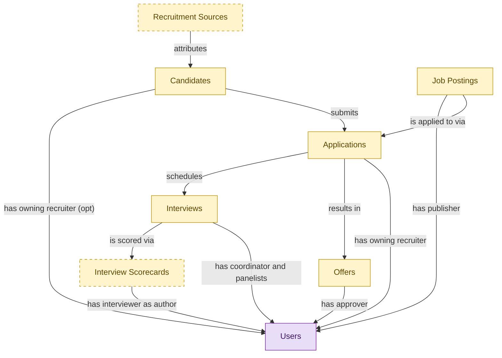

# Hiring Starter

## 1. Overview

### 1.1 Analyst overview

Entry-tier deployable for a basic hiring workflow: post jobs, capture applications, run interviews, generate offers. Embeds the canonical masters from the full ATS modules and inherits their lifecycle states. Ships three baseline permissions and one system skill; no workflow gates, no requisition approvals, no background-check orchestration, no pre-employee reconciliation. Upgrades to the full ATS surface without tenant data migration via the embedded-master demotion path.

## 2. Entity summary

| Name | Description |
| --- | --- |
| Applications | A candidate's submission against a specific requisition. Carries pipeline stage, status (active / rejected / withdrawn / hired), source, and the full evaluation history. |
| Candidates | Person known to the recruiting org, with or without an active application. Carries contact details, resume, tags, GDPR consent, and source. Distinct from Employee until hired. |
| Interview Scorecards | Structured interviewer feedback against a defined rubric: per-competency ratings, written notes, and a hire/no-hire recommendation. |
| Interviews | Scheduled assessment event between a candidate and one or more interviewers. Carries time, location/medium, panel, interview kit, and outcome. |
| Job Postings | Published, candidate-facing version of a requisition on a career site or job board. One requisition can have many postings (per board, language, or region). |
| Offers | Formal employment offer extended to a candidate. Carries compensation components, start date, terms, approval chain, and status (draft / approved / sent / accepted / declined / rescinded). |
| Recruitment Sources | Channel a candidate came from: job board, referral, agency, sourcing campaign, career event, or inbound. Used for source-of-hire analytics and channel ROI. |
| Users | Semantius platform-owned user table. Referenced from domain `data_objects` via `data_object_relationships` for assignee / author / approver / creator edges. Not surfaced in domain-level analytics (Signal 1/2 ignore `kind='platform_builtin'`). |

## 3. Entities catalog

| # | data_object | role | mastered in | label | necessity | pattern flags | write tier | notes |
| ---: | --- | --- | --- | --- | --- | --- | --- | --- |
| 1 | `job_applications` (Applications) | embedded_master | `ats-recruitment-pipeline` | Recruitment Pipeline | required | personal_content | `:manage` | - |
| 2 | `candidates` (Candidates) | embedded_master | `ats-candidate-crm` | Candidate CRM | required | personal_content | `:manage` | - |
| 3 | `interview_scorecards` (Interview Scorecards) | embedded_master | `ats-interviews` | Interviews | optional | personal_content, submit_lock | `:manage` | - |
| 4 | `interviews` (Interviews) | embedded_master | `ats-interviews` | Interviews | required | - | `:manage` | - |
| 5 | `job_postings` (Job Postings) | embedded_master | `ats-recruitment-pipeline` | Recruitment Pipeline | required | - | `:manage` | - |
| 6 | `job_offers` (Offers) | embedded_master | `ats-offers` | Offers | required | personal_content, single_approver | `:manage` | - |
| 7 | `recruitment_sources` (Recruitment Sources) | embedded_master | `ats-candidate-crm` | Candidate CRM | optional | - | `:admin` | - |
| 8 | `users` (Users) | consumer | _(platform built-in)_ | _(platform built-in)_ | required | - | `:manage` _(pending)_ | - |

## 4. Aliases and industry synonyms

_(no industry-scoped aliases or non-synonym alias types loaded for this scope; generic synonyms are omitted as common knowledge.)_

## 5. Relationships

### 5.1 Intra-scope edges

| from | verb | to | cardinality | kind | necessity | owner_side | delete_mode | fk_format | notes |
| --- | --- | --- | --- | --- | --- | --- | --- | --- | --- |
| `job_postings` | is applied to via | `job_applications` | one_to_many | reference | required | source | restrict | reference | - |
| `candidates` | submits | `job_applications` | one_to_many | reference | required | target | restrict | reference | - |
| `recruitment_sources` | attributes | `candidates` | one_to_many | reference | required | target | restrict | reference | - |
| `job_applications` | schedules | `interviews` | one_to_many | reference | required | source | restrict | reference | - |
| `interviews` | is scored via | `interview_scorecards` | one_to_many | reference | required | source | restrict | reference | - |
| `job_applications` | results in | `job_offers` | one_to_many | reference | required | source | restrict | reference | - |

### 5.2 Built-in edges (`users` and other platform built-ins)

| from | verb | to | cardinality | necessity | owner_side | delete_mode | fk_format | notes |
| --- | --- | --- | --- | --- | --- | --- | --- | --- |
| `candidates` | has owning recruiter | `users` | many_to_many | optional | source | clear | reference | - |
| `job_postings` | has publisher | `users` | many_to_many | required | source | restrict | reference | - |
| `job_applications` | has owning recruiter | `users` | many_to_many | required | source | restrict | reference | - |
| `interviews` | has coordinator and panelists | `users` | many_to_many | required | source | restrict | reference | - |
| `interview_scorecards` | has interviewer as author | `users` | many_to_many | required | source | restrict | reference | - |
| `job_offers` | has approver | `users` | many_to_many | required | source | restrict | reference | - |

### 5.3 Cross-scope edges

#### 5.3a Outbound from this scope's masters and contributors

_Edges this scope drives: the in-scope endpoint has `role` of `master` or `contributor`._

_(no outbound cross-scope edges from this scope's masters or contributors.)_

#### 5.3b Context edges on embedded shells and consumed entities

_Edges the canonical owner drives, shown for context: the in-scope endpoint has `role` of `embedded_master`, `consumer`, or `derived`._

41 context edges

| from | verb | to | cardinality | necessity | delete_mode | fk_format | notes |
| --- | --- | --- | --- | --- | --- | --- | --- |
| `candidates` | engaged_via | `candidate_engagements` | one_to_many | optional | clear | reference | - |
| `candidates` | attends_via | `recruiting_event_attendances` | one_to_many | required | restrict | reference | - |
| `candidates` | noted_via | `recruiter_interactions` | one_to_many | optional | clear | reference | - |
| `candidates` | consents_via | `candidate_consents` | one_to_many | required | cascade | parent | - |
| `candidates` | member_of_via | `talent_pool_memberships` | one_to_many | required | restrict | reference | - |
| `candidates` | discloses_via | `fcra_disclosures` | one_to_many | required | cascade | parent | - |
| `job_applications` | transitions_via | `application_stage_transitions` | one_to_many | required | cascade | parent | - |
| `job_postings` | syndicates_via | `job_posting_distributions` | one_to_many | optional | cascade | parent | - |
| `job_postings` | asks | `application_screening_questions` | one_to_many | optional | cascade | parent | - |
| `job_applications` | answers_via | `application_screening_answers` | one_to_many | optional | cascade | parent | - |
| `candidates` | self_identifies_via | `eeo_responses` | one_to_many | optional | cascade | parent | - |
| `interview_kits` | shapes | `interviews` | one_to_many | optional | clear | reference | - |
| `interviews` | convenes | `interview_panels` | one_to_one | required | cascade | parent | - |
| `interview_panels` | produces | `interview_scorecards` | one_to_many | optional | cascade | parent | - |
| `interviewer_availability_slots` | booked_for | `interviews` | one_to_one | optional | clear | reference | - |
| `job_offers` | evolves_through | `offer_versions` | one_to_many | required | cascade | parent | - |
| `job_offers` | gated_by | `offer_approvals` | one_to_many | optional | cascade | parent | - |
| `candidates` | submits_via | `data_subject_requests` | one_to_many | optional | cascade | parent | - |
| `candidates` | self_ids_via | `voluntary_self_identifications` | one_to_many | optional | cascade | parent | - |
| `candidates` | acknowledges_via | `fcra_summary_of_rights_acknowledgements` | one_to_many | optional | cascade | parent | - |
| `job_applications` | disposed_via | `application_dispositions` | one_to_many | optional | cascade | parent | - |
| `job_applications` | logged_via | `applicant_flow_records` | one_to_one | required | cascade | parent | - |
| `candidates` | documented_via | `candidate_documents` | one_to_many | optional | cascade | parent | - |
| `candidates` | annotated_via | `candidate_notes` | one_to_many | optional | cascade | parent | - |
| `candidates` | tagged_via | `candidate_tag_assignments` | one_to_many | optional | clear | reference | - |
| `job_profiles` | feeds | `job_postings` | one_to_many | optional | clear | reference | - |
| `skill_profiles` | feeds | `candidates` | one_to_many | optional | clear | reference | - |
| `job_requisitions` | is advertised through | `job_postings` | one_to_many | required | restrict | reference | - |
| `job_requisitions` | receives | `job_applications` | one_to_many | required | restrict | reference | - |
| `candidate_referrals` | introduces | `candidates` | one_to_many | required | restrict | reference | - |
| `recruitment_agencies` | sources | `candidates` | one_to_many | required | restrict | reference | - |
| `recruitment_events` | attracts | `candidates` | one_to_many | required | restrict | reference | - |
| `talent_pools` | groups | `candidates` | many_to_many | required | restrict | reference | - |
| `job_applications` | requires | `candidate_assessments` | one_to_many | required | restrict | reference | - |
| `job_offers` | is contingent on | `background_checks` | one_to_many | required | restrict | reference | - |
| `job_offers` | spawns | `onboarding_journeys` | one_to_one | required | restrict | reference | - |
| `job_offers` | triggers | `benefit_enrollments` | one_to_one | required | restrict | reference | - |
| `job_offers` | seeds | `compensation_statements` | one_to_one | required | restrict | reference | - |
| `candidates` | becomes | `employees` | one_to_one | required | restrict | reference | - |
| `job_offers` | spawns pre-employee record | `pre_employees` | one_to_one | required | restrict | reference | - |
| `candidates` | becomes pre-employee | `pre_employees` | one_to_one | required | restrict | reference | - |

## 6. Cross-domain context

### 6.1 Master consumers (other modules / domains that embed this scope's masters)

### 6.2 Outbound handoffs (events this scope publishes)

_(no outbound `handoffs` whose payload is in this scope.)_

### 6.3 Inbound handoffs (events this scope reacts to)

_(no inbound `handoffs` whose payload is in this scope.)_

### 6.4 Master providers (modules / domains that own masters this scope embeds)

| data_object | role here | necessity | canonical owner(s) | slice notes |
| --- | --- | --- | --- | --- |
| `candidates` | embedded_master | required | ATS-CANDIDATE-CRM (ATS) | - |
| `interview_scorecards` | embedded_master | optional | ATS-INTERVIEWS (ATS) | - |
| `interviews` | embedded_master | required | ATS-INTERVIEWS (ATS) | - |
| `job_applications` | embedded_master | required | ATS-RECRUITMENT-PIPELINE (ATS) | - |
| `job_offers` | embedded_master | required | ATS-OFFERS (ATS) | - |
| `job_postings` | embedded_master | required | ATS-RECRUITMENT-PIPELINE (ATS) | - |
| `recruitment_sources` | embedded_master | optional | ATS-CANDIDATE-CRM (ATS) | - |
| `users` | consumer | required | _(platform built-in)_ | - |

## 7. Lifecycle states

### `candidates` (Candidate)

_This scope holds `candidates` as **embedded_master**; the canonical state machine is owned by `ATS-CANDIDATE-CRM`._

| order | state_name | initial? | terminal? | requires_permission? | derived gate | description |
| --- | --- | --- | --- | --- | --- | --- |
| 1 | `prospect` | ✓ | - | - | - | Person known to the recruiting org with no active application. |
| 2 | `active` | - | - | - | - | Candidate has at least one open application or is actively engaged. |
| 3 | `hired` | - | ✓ | ✓ | `ats-candidate-crm:hire_candidate` | Candidate accepted an offer and converted to employee. |
| 4 | `do_not_hire` | - | ✓ | ✓ | `ats-candidate-crm:flag_do_not_hire` | Candidate flagged as ineligible for future consideration; gated decision. |
| 5 | `archived` | - | ✓ | - | - | Candidate kept in the database but not active in any pipeline. |

### `interview_scorecards` (Interview Scorecard)

_This scope holds `interview_scorecards` as **embedded_master**; the canonical state machine is owned by `ATS-INTERVIEWS`._

| order | state_name | initial? | terminal? | requires_permission? | derived gate | description |
| --- | --- | --- | --- | --- | --- | --- |
| 1 | `draft` | ✓ | - | - | - | Interviewer is filling in ratings and notes against the rubric. |
| 2 | `submitted` | - | ✓ | ✓ | `ats-interviews:submit_scorecard` | Scorecard submitted and locked; hire/no-hire recommendation recorded. |

### `interviews` (Interview)

_This scope holds `interviews` as **embedded_master**; the canonical state machine is owned by `ATS-INTERVIEWS`._

| order | state_name | initial? | terminal? | requires_permission? | derived gate | description |
| --- | --- | --- | --- | --- | --- | --- |
| 1 | `scheduled` | ✓ | - | - | - | Interview booked with candidate, panel, time, and medium. |
| 2 | `confirmed` | - | - | - | - | Candidate and panel confirmed attendance. |
| 3 | `completed` | - | ✓ | - | - | Interview took place; scorecards are being collected. |
| 4 | `no_show` | - | ✓ | - | - | Candidate or panel did not attend; interview did not occur. |
| 5 | `cancelled` | - | ✓ | - | - | Interview cancelled before it took place. |
| 6 | `rescheduled` | - | ✓ | - | - | Original slot abandoned in favor of a new scheduled interview record. |

### `job_applications` (Application)

_This scope holds `job_applications` as **embedded_master**; the canonical state machine is owned by `ATS-RECRUITMENT-PIPELINE`._

| order | state_name | initial? | terminal? | requires_permission? | derived gate | description |
| --- | --- | --- | --- | --- | --- | --- |
| 1 | `applied` | ✓ | - | - | - | Candidate submitted an application against the requisition. |
| 2 | `screening` | - | - | - | - | Recruiter is reviewing resume and qualifications. |
| 3 | `interviewing` | - | - | - | - | Candidate is progressing through interview loops. |
| 4 | `offer_extended` | - | - | - | - | An offer has been generated and is in flight for this application. |
| 5 | `hired` | - | ✓ | ✓ | `ats-pre-employee-record:hire_candidate` | Candidate accepted the offer and was hired; gated transition. |
| 6 | `rejected` | - | ✓ | - | - | Application closed without progression by recruiter or hiring manager. |
| 7 | `withdrawn` | - | ✓ | - | - | Candidate withdrew their application. |

### `job_offers` (Offer)

_This scope holds `job_offers` as **embedded_master**; the canonical state machine is owned by `ATS-OFFERS`._

| order | state_name | initial? | terminal? | requires_permission? | derived gate | description |
| --- | --- | --- | --- | --- | --- | --- |
| 1 | `draft` | ✓ | - | - | - | Recruiter is composing offer terms and compensation components. |
| 2 | `pending_approval` | - | - | - | - | Offer routed to the designated approver for sign-off. |
| 3 | `approved` | - | - | ✓ | `ats-offers:approve_offer` | Approver signed off; offer is ready to send. |
| 4 | `sent` | - | - | - | - | Offer delivered to the candidate. |
| 5 | `accepted` | - | ✓ | - | - | Candidate accepted the offer. |
| 6 | `declined` | - | ✓ | - | - | Candidate declined the offer. |
| 7 | `rescinded` | - | ✓ | ✓ | `ats-offers:rescind_offer` | Offer withdrawn by the employer after being sent; gated action. |

### `job_postings` (Job Posting)

_This scope holds `job_postings` as **embedded_master**; the canonical state machine is owned by `ATS-RECRUITMENT-PIPELINE`._

| order | state_name | initial? | terminal? | requires_permission? | derived gate | description |
| --- | --- | --- | --- | --- | --- | --- |
| 1 | `draft` | ✓ | - | - | - | Posting being composed against a requisition for a specific board or region. |
| 2 | `published` | - | - | ✓ | `ats-recruitment-pipeline:publish_posting` | Posting is live on the target channel; gated publish step. |
| 3 | `paused` | - | - | - | - | Posting temporarily hidden from the channel. |
| 4 | `expired` | - | ✓ | - | - | Posting reached its scheduled end date. |
| 5 | `closed` | - | ✓ | - | - | Posting taken down because the requisition is filled or cancelled. |

## 8. Permissions and business rules (derived)

### 8.1 Permissions

| permission | tier | description | included in `:admin`? |
| --- | --- | --- | --- |
| `hiring-starter:read` | baseline-read | Read access to every entity in the module | ✓ |
| `hiring-starter:manage` | baseline-manage | Edit operational records | ✓ |
| `hiring-starter:admin` | baseline-admin | Edit reference data and inherit every workflow gate below | - |

### 8.2 Business rules

_(no flag-derived business rules.)_

## 9. Roles, RACI, and responsibilities (derived)

_Baseline roles, the permission hierarchy, and RACI realization are DERIVED from this scope's entity-type write tiers + `process_raci`; none of it is stored in the catalog (the deployer provisions it from this blueprint)._

### 9.1 `HIRING-STARTER`

**Baseline roles:**

| role | baseline grant |
| --- | --- |
| `hiring-starter_viewer` | `hiring-starter:read` |
| `hiring-starter_manager` | `hiring-starter:manage` |

**Permission hierarchy:**

| permission | includes |
| --- | --- |
| `hiring-starter:admin` | `hiring-starter:manage` |
| `hiring-starter:manage` | `hiring-starter:read` |

**RACI realization:**

_(no `process_raci` assignments wired to this module's gated processes yet; authored per-domain in Phase E.)_

### 9.2 Functional ownership and default grants

| responsibility | business function | default role | default tier |
| --- | --- | --- | --- |
| owner | Recruiting | `admin` | `:admin` |
| contributor | Legal | `manage` | `:manage` |
