# Compliance Training

## 1. Overview

### 1.1 Analyst overview

Mandatory regulatory training assignment, tracking, and certification: sexual harassment training (CA SB-1343), HIPAA, OSHA, anti-bribery, SOX, GDPR, AML. Masters `compliance_assignments` and `learner_certifications`. Realizes COMPLIANCE-TRAIN and CERT-MGMT. Distinct from general LMS course delivery: assignments are mandatory and time-bound, lifecycle includes `overdue`/`waived`/`expired` states with regulator-evidence retention, and ownership typically sits with GRC/Compliance, not L&D.

## 2. Entity summary

| Name | Description |
| --- | --- |
| BSA / AML Training Records | BSA / AML 31 CFR 1020 training documentation row for banking-sector compliance. |
| Compliance Audit Records | Regulator-facing audit trail row capturing who did what training when, with version and evidence reference. Distinct from learning_records: audit-purpose subset, retention-locked. |
| Compliance Training Assignments | Mandatory training assignment tied to a regulation, role, location, or hire-event (anti-harassment, AML, GDPR, OSHA, HIPAA). Carries due date, escalation policy, audit log. |
| Compliance Training Campaigns | Campaign container that bundles assignments by audience and due-date: annual code-of-conduct cycle, harassment refresh, security awareness wave. |
| FDA Part 11 Audit Trails | 21 CFR Part 11 audit trail row for GxP-relevant training; tamper-evident, retention-locked. |
| FERPA Training Records | FERPA staff training documentation row for the education sector. |
| Harassment Training Acknowledgements | Statutory acknowledgement of harassment training completion per CA SB-1343, NY 201-g, IL 2-109; carries signed timestamp and IP. |
| HIPAA Training Records | HIPAA 45 CFR 164.530(b) workforce-training documentation row. |
| OSHA Training Records | OSHA 29 CFR 1910 mandated training documentation row. |
| Recertification Schedules | Periodic recurrence configuration that drives FINRA / BSA-AML / HIPAA / OSHA refresh assignment cycles. |
| Regulator Filing Exports | Export artifact for regulator submissions: OSHA 300, FINRA CE filings, state-CE rollups. |
| SOX Training Evidence | SOX 404 control-evidence row for finance training completion. |
| Training Evidence Records | Inspection-ready evidence package: signed roster, certificate hash, content version, signature record reference. Generated for regulator submission. |
| Certifications | Issued credential against a worker (internal certification, vendor cert, regulatory cert) with issue date, expiry, issuing body, and renewal rules. Drives recertification campaigns. |
| Cost Centers | Organisational unit for cost allocation: name, code, manager, hierarchy, currency. Drives variance reporting and project / departmental P&L. A near-universal foreign key in finance and payroll. |
| Courses | Atomic learning unit: e-learning module, video, live session, blended programme, external content. Carries content reference, duration, format, language, prerequisites, certification award. |
| Employees | Canonical record of a person currently or formerly employed by the organization. Carries identity (legal name, contact, IDs), employment metadata (start date, end date, employment type, country), and pointers to position, job profile, org unit, manager, and life-event history. The most multi-mastered data object in the catalog: HCM masters the core HR slice, Payroll masters the comp/withholding slice, and IGA masters the identity/access slice. Onboarding, PA, and Talent Management consume or contribute. |
| Org Units | Node in the organizational hierarchy: division, business unit, department, team. Carries manager, cost center alignment, geographic scope, and parent/child relationships. HCM masters the operational hierarchy; EPM contributes the cost-center mapping (which would be Finance-mastered once a Finance/GL domain is loaded). |
| Positions | Approved slot in the org - a 'chair' with role definition, cost center, reporting line, location, and FTE allocation. Distinct from job_profiles (the catalog definition) and from employees (the person filling the slot). A position can be open, filled, or eliminated. SWP designs future positions via org_designs; HCM operationalizes them once approved. |
| Signature Records | E-signature envelope: signing audit trail, IP addresses, external e-signature provider envelope and document reference IDs, and the signed PDF artifact. Distinct from contracts, one contract may have many signature events (counterpart, amendment, renewal). |
| Onboarding Tasks | Discrete to-do within a journey: sign I-9, attend orientation, complete compliance training, meet buddy, receive laptop. Carries assignee (new hire / manager / IT / facilities / HR), due date, completion state, evidence, and task type (form / training / meeting / provisioning / acknowledgement). Many tasks are local; a subset triggers cross-domain handoffs into ITSM, IWMS, Payroll, LMS, IGA, or HRSD. |
| Policy Attestations | Record that a user read, understood, and acknowledged a policy; timestamp, version, medium, completion evidence. |

```mermaid
flowchart TD
  classDef master fill:#d4f4dd,stroke:#27ae60,color:#0b3d20;
  classDef embedded_master fill:#fff4cc,stroke:#c79100,color:#5b4500;
  classDef consumer fill:#e8def8,stroke:#7b1fa2,color:#3a155d;
  classDef platform_builtin fill:#e0e0e0,stroke:#424242,color:#1a1a1a;
  org_units["Org Units"]
  compliance_assignments["Compliance Training Assignments"]
  employees["Employees"]
  cost_centers["Cost Centers"]
  learner_certifications["Certifications"]
  courses["Courses"]
  hcm_positions["Positions"]
  onboarding_tasks["Onboarding Tasks"]
  policy_attestations["Policy Attestations"]
  compliance_training_campaigns["Compliance Training Campaigns"]
  compliance_audit_records["Compliance Audit Records"]
  training_evidence_records["Training Evidence Records"]
  harassment_training_acknowledgements["Harassment Training Acknowledgements"]
  recertification_schedules["Recertification Schedules"]
  regulator_filing_exports["Regulator Filing Exports"]
  fda_part11_audit_trails["FDA Part 11 Audit Trails"]
  bsa_aml_training_records["BSA / AML Training Records"]
  signature_records["Signature Records"]
  hipaa_training_records["HIPAA Training Records"]
  osha_training_records["OSHA Training Records"]
  sox_training_evidence["SOX Training Evidence"]
  ferpa_training_records["FERPA Training Records"]
  users["Users"]
  compliance_training_campaigns -->|"generates"| compliance_assignments
  compliance_assignments -->|"evidences (opt)"| compliance_audit_records
  compliance_audit_records -->|"rolled_into (opt)"| training_evidence_records
  training_evidence_records -->|"supplies (opt)"| regulator_filing_exports
  compliance_assignments -->|"acknowledged_via (opt)"| harassment_training_acknowledgements
  recertification_schedules -->|"triggers (opt)"| compliance_training_campaigns
  compliance_assignments -->|"produces (opt)"| hipaa_training_records
  compliance_assignments -->|"produces (opt)"| osha_training_records
  compliance_assignments -->|"produces (opt)"| sox_training_evidence
  compliance_assignments -->|"produces (opt)"| ferpa_training_records
  compliance_assignments -->|"produces (opt)"| fda_part11_audit_trails
  compliance_assignments -->|"produces (opt)"| bsa_aml_training_records
  org_units -->|"groups"| employees
  org_units -->|"contains"| hcm_positions
  hcm_positions -->|"is_filled_by (opt)"| employees
  cost_centers -->|"funds"| org_units
  org_units -->|"maps_to (opt)"| cost_centers
  courses -->|"fulfills (opt)"| compliance_assignments
  courses -->|"grants (opt)"| learner_certifications
  hcm_positions -->|"requires (opt)"| compliance_assignments
  org_units -->|"sponsors (opt)"| compliance_assignments
  employees -->|"reflected on (opt)"| compliance_assignments
  employees -->|"fills (opt)"| hcm_positions
  org_units -->|"rolls_up_to (opt)"| org_units
  users -->|"owns (opt)"| courses
  users -->|"acknowledges"| harassment_training_acknowledgements
  users -->|"evidenced_by_record_for (opt)"| hipaa_training_records
  users -->|"evidenced_by_record_for (opt)"| osha_training_records
  users -->|"evidenced_by_record_for (opt)"| sox_training_evidence
  users -->|"evidenced_by_record_for (opt)"| ferpa_training_records
  users -->|"audit_trailed_in (opt)"| fda_part11_audit_trails
  users -->|"evidenced_by_record_for (opt)"| bsa_aml_training_records
  users -->|"attests to policies (opt)"| policy_attestations
  policy_attestations -->|"has attester"| users
  users -->|"signed (opt)"| signature_records
  employees -->|"is_linked_to (opt)"| users
  users -->|"manages (opt)"| hcm_positions
  users -->|"leads (opt)"| org_units
  users -->|"owns (opt)"| cost_centers
  users -->|"performs (opt)"| onboarding_tasks
  users -->|"created (opt)"| onboarding_tasks
  users -->|"authors (opt)"| courses
  users -->|"must complete"| compliance_assignments
  users -->|"owns (opt)"| compliance_assignments
  users -->|"holds"| learner_certifications
  org_units -->|"has members (opt)"| users
  class org_units embedded_master;
  class compliance_assignments master;
  class employees embedded_master;
  class cost_centers embedded_master;
  class learner_certifications embedded_master;
  class courses embedded_master;
  class hcm_positions embedded_master;
  class onboarding_tasks consumer;
  class policy_attestations consumer;
  class compliance_training_campaigns master;
  class compliance_audit_records master;
  class training_evidence_records master;
  class harassment_training_acknowledgements master;
  class recertification_schedules master;
  class regulator_filing_exports master;
  class fda_part11_audit_trails master;
  class bsa_aml_training_records master;
  class signature_records embedded_master;
  class hipaa_training_records master;
  class osha_training_records master;
  class sox_training_evidence master;
  class ferpa_training_records master;
  class users platform_builtin;
  style org_units stroke-dasharray:5 5;
  style cost_centers stroke-dasharray:5 5;
  style hcm_positions stroke-dasharray:5 5;
  style hipaa_training_records stroke-dasharray:5 5;
  style osha_training_records stroke-dasharray:5 5;
  style sox_training_evidence stroke-dasharray:5 5;
  style ferpa_training_records stroke-dasharray:5 5;
```

## 3. Entities catalog

| # | data_object | role | mastered in | label | necessity | pattern flags | write tier | notes |
| ---: | --- | --- | --- | --- | --- | --- | --- | --- |
| 1 | `bsa_aml_training_records` (BSA / AML Training Records) | master | - | - | required | personal_content, submit_lock | `:manage` _(pending)_ | - |
| 2 | `compliance_audit_records` (Compliance Audit Records) | master | - | - | required | personal_content, submit_lock | `:manage` _(pending)_ | - |
| 3 | `compliance_assignments` (Compliance Training Assignments) | master | - | - | required | personal_content | `:manage` _(pending)_ | - |
| 4 | `compliance_training_campaigns` (Compliance Training Campaigns) | master | - | - | required | submit_lock | `:manage` _(pending)_ | - |
| 5 | `fda_part11_audit_trails` (FDA Part 11 Audit Trails) | master | - | - | required | personal_content, submit_lock | `:manage` _(pending)_ | - |
| 6 | `ferpa_training_records` (FERPA Training Records) | master | - | - | optional | personal_content, submit_lock | `:manage` _(pending)_ | - |
| 7 | `harassment_training_acknowledgements` (Harassment Training Acknowledgements) | master | - | - | required | personal_content, submit_lock | `:manage` _(pending)_ | - |
| 8 | `hipaa_training_records` (HIPAA Training Records) | master | - | - | optional | personal_content, submit_lock | `:manage` _(pending)_ | - |
| 9 | `osha_training_records` (OSHA Training Records) | master | - | - | optional | personal_content, submit_lock | `:manage` _(pending)_ | - |
| 10 | `recertification_schedules` (Recertification Schedules) | master | - | - | required | - | `:manage` _(pending)_ | - |
| 11 | `regulator_filing_exports` (Regulator Filing Exports) | master | - | - | required | submit_lock | `:manage` _(pending)_ | - |
| 12 | `sox_training_evidence` (SOX Training Evidence) | master | - | - | optional | personal_content, submit_lock | `:manage` _(pending)_ | - |
| 13 | `training_evidence_records` (Training Evidence Records) | master | - | - | required | personal_content, submit_lock | `:manage` _(pending)_ | - |
| 14 | `learner_certifications` (Certifications) | embedded_master | `lms-credentials` | Credentials, Badges and Continuing Education | required | personal_content, submit_lock | `:manage` _(pending)_ | - |
| 15 | `cost_centers` (Cost Centers) | embedded_master | `ERP-FIN` _(domain-level, not modularized)_ | Core ERP Financial Management | optional | - | `:manage` _(pending)_ | - |
| 16 | `courses` (Courses) | embedded_master | `lms-course-delivery` | Course Delivery | required | - | `:manage` _(pending)_ | - |
| 17 | `employees` (Employees) | embedded_master | `hcm-core-worker` | Core Worker Record | required | personal_content | `:manage` _(pending)_ | - |
| 18 | `org_units` (Org Units) | embedded_master | `hcm-org-positions` | Organisation and Position Management | optional | - | `:manage` _(pending)_ | - |
| 19 | `hcm_positions` (Positions) | embedded_master | `hcm-org-positions` | Organisation and Position Management | optional | single_approver | `:manage` _(pending)_ | - |
| 20 | `signature_records` (Signature Records) | embedded_master | `clm-repository` | Contract Repository | required | submit_lock | `:manage` _(pending)_ | - |
| 21 | `onboarding_tasks` (Onboarding Tasks) | consumer | `onb-journey-mgmt` | Onboarding Journey Management | required | personal_content | `:manage` _(pending)_ | - |
| 22 | `policy_attestations` (Policy Attestations) | consumer | `GRC` _(domain-level, not modularized)_ | Governance, Risk and Compliance | required | - | `:manage` _(pending)_ | - |

## 4. Aliases and industry synonyms

_(no industry-scoped aliases or non-synonym alias types loaded for this scope; generic synonyms are omitted as common knowledge.)_

## 5. Relationships

### 5.1 Intra-scope edges

| from | verb | to | cardinality | kind | necessity | owner_side | delete_mode | fk_format | notes |
| --- | --- | --- | --- | --- | --- | --- | --- | --- | --- |
| `compliance_training_campaigns` | generates | `compliance_assignments` | one_to_many | composition | required | source | cascade | parent | - |
| `compliance_assignments` | evidences | `compliance_audit_records` | one_to_many | reference | optional | target | clear | reference | - |
| `compliance_audit_records` | rolled_into | `training_evidence_records` | one_to_many | reference | optional | target | clear | reference | - |
| `training_evidence_records` | supplies | `regulator_filing_exports` | many_to_many | association | optional | source | clear | reference | - |
| `compliance_assignments` | acknowledged_via | `harassment_training_acknowledgements` | one_to_many | reference | optional | target | clear | reference | - |
| `recertification_schedules` | triggers | `compliance_training_campaigns` | one_to_many | reference | optional | target | clear | reference | - |
| `compliance_assignments` | produces | `hipaa_training_records` | one_to_many | reference | optional | target | clear | reference | - |
| `compliance_assignments` | produces | `osha_training_records` | one_to_many | reference | optional | target | clear | reference | - |
| `compliance_assignments` | produces | `sox_training_evidence` | one_to_many | reference | optional | target | clear | reference | - |
| `compliance_assignments` | produces | `ferpa_training_records` | one_to_many | reference | optional | target | clear | reference | - |
| `compliance_assignments` | produces | `fda_part11_audit_trails` | one_to_many | reference | optional | target | clear | reference | - |
| `compliance_assignments` | produces | `bsa_aml_training_records` | one_to_many | reference | optional | target | clear | reference | - |
| `org_units` | groups | `employees` | one_to_many | reference | required | source | restrict | reference | - |
| `org_units` | contains | `hcm_positions` | one_to_many | reference | required | source | restrict | reference | - |
| `hcm_positions` | is_filled_by | `employees` | one_to_one | reference | optional | target | clear | reference | - |
| `cost_centers` | funds | `org_units` | one_to_many | reference | required | source | restrict | reference | - |
| `org_units` | maps_to | `cost_centers` | one_to_one | reference | optional | source | clear | reference | - |
| `courses` | fulfills | `compliance_assignments` | one_to_many | reference | optional | source | clear | reference | - |
| `courses` | grants | `learner_certifications` | one_to_many | reference | optional | source | clear | reference | - |
| `hcm_positions` | requires | `compliance_assignments` | one_to_many | reference | optional | source | clear | reference | - |
| `org_units` | sponsors | `compliance_assignments` | one_to_many | reference | optional | source | clear | reference | - |
| `employees` | reflected on | `compliance_assignments` | one_to_many | reference | optional | source | clear | reference | - |
| `employees` | fills | `hcm_positions` | one_to_one | reference | optional | source | clear | reference | - |
| `org_units` | rolls_up_to | `org_units` | one_to_many | reference | optional | source | clear | reference | - |

### 5.2 Built-in edges (`users` and other platform built-ins)

| from | verb | to | cardinality | necessity | owner_side | delete_mode | fk_format | notes |
| --- | --- | --- | --- | --- | --- | --- | --- | --- |
| `users` | owns | `courses` | one_to_many | optional | source | clear | reference | - |
| `users` | acknowledges | `harassment_training_acknowledgements` | one_to_many | required | source | restrict | reference | - |
| `users` | evidenced_by_record_for | `hipaa_training_records` | one_to_many | optional | source | clear | reference | - |
| `users` | evidenced_by_record_for | `osha_training_records` | one_to_many | optional | source | clear | reference | - |
| `users` | evidenced_by_record_for | `sox_training_evidence` | one_to_many | optional | source | clear | reference | - |
| `users` | evidenced_by_record_for | `ferpa_training_records` | one_to_many | optional | source | clear | reference | - |
| `users` | audit_trailed_in | `fda_part11_audit_trails` | one_to_many | optional | source | clear | reference | - |
| `users` | evidenced_by_record_for | `bsa_aml_training_records` | one_to_many | optional | source | clear | reference | - |
| `users` | attests to policies | `policy_attestations` | one_to_many | optional | source | clear | reference | - |
| `policy_attestations` | has attester | `users` | many_to_many | required | source | restrict | reference | - |
| `users` | signed | `signature_records` | one_to_many | optional | source | clear | reference | - |
| `employees` | is_linked_to | `users` | one_to_one | optional | target | clear | reference | - |
| `users` | manages | `hcm_positions` | one_to_many | optional | source | clear | reference | - |
| `users` | leads | `org_units` | one_to_many | optional | source | clear | reference | - |
| `users` | owns | `cost_centers` | one_to_many | optional | source | clear | reference | - |
| `users` | performs | `onboarding_tasks` | one_to_many | optional | source | clear | reference | - |
| `users` | created | `onboarding_tasks` | one_to_many | optional | source | clear | reference | - |
| `users` | authors | `courses` | one_to_many | optional | source | clear | reference | - |
| `users` | must complete | `compliance_assignments` | one_to_many | required | source | restrict | reference | - |
| `users` | owns | `compliance_assignments` | one_to_many | optional | source | clear | reference | - |
| `users` | holds | `learner_certifications` | one_to_many | required | source | restrict | reference | - |
| `org_units` | has members | `users` | one_to_many | optional | target | clear | reference | - |

### 5.3 Cross-scope edges

#### 5.3a Outbound from this scope's masters and contributors

_Edges this scope drives: the in-scope endpoint has `role` of `master` or `contributor`._

| from | verb | to | cardinality | necessity | delete_mode | fk_format | notes |
| --- | --- | --- | --- | --- | --- | --- | --- |
| `automated_enrollment_rules` | creates | `compliance_assignments` | one_to_many | optional | clear | reference | - |
| `compliance_assignments` | escalates_via | `manager_nudges` | one_to_many | optional | clear | reference | - |
| `compliance_obligations` | tracked by | `compliance_assignments` | one_to_many | optional | clear | reference | - |
| `compliance_assignments` | triggers | `iga_provisioning_events` | one_to_many | optional | clear | reference | - |

#### 5.3b Context edges on embedded shells and consumed entities

_Edges the canonical owner drives, shown for context: the in-scope endpoint has `role` of `embedded_master`, `consumer`, or `derived`._

78 context edges

| from | verb | to | cardinality | necessity | delete_mode | fk_format | notes |
| --- | --- | --- | --- | --- | --- | --- | --- |
| `employees` | triggers | `iga_provisioning_events` | one_to_many | optional | clear | reference | - |
| `employees` | finalized by | `onboarding_document_collections` | one_to_many | optional | clear | reference | - |
| `pre_employees` | promotes to | `employees` | one_to_one | required | restrict | reference | - |
| `legal_holds` | identifies_custodians_from | `employees` | many_to_many | optional | clear | reference | - |
| `legal_advice_records` | references | `employees` | many_to_many | optional | clear | reference | - |
| `employees` | is host for | `host_assignments` | one_to_many | required | restrict | reference | - |
| `courses` | has_version | `course_versions` | one_to_many | required | cascade | parent | - |
| `courses` | classified_as | `course_categories` | many_to_many | optional | clear | reference | - |
| `courses` | tagged_with | `course_tags` | many_to_many | optional | clear | reference | - |
| `course_catalogs` | lists | `courses` | many_to_many | optional | clear | reference | - |
| `courses` | reviewed_via | `course_reviews` | one_to_many | optional | clear | reference | - |
| `courses` | rated_via | `course_ratings` | one_to_many | optional | clear | reference | - |
| `courses` | discussed_in | `course_discussions` | one_to_many | optional | clear | reference | - |
| `courses` | scheduled_as | `course_offerings` | one_to_many | optional | clear | reference | - |
| `certification_definitions` | instantiated_as | `learner_certifications` | one_to_many | required | restrict | reference | - |
| `certificate_templates` | renders | `learner_certifications` | one_to_many | optional | clear | reference | - |
| `courses` | grants | `certification_definitions` | many_to_many | optional | clear | reference | - |
| `courses` | yields_credits_via | `continuing_education_credits` | many_to_many | optional | clear | reference | - |
| `learning_path_steps` | references | `courses` | one_to_many | optional | clear | reference | - |
| `legal_contracts` | witnessed_by | `signature_records` | one_to_many | required | cascade | parent | - |
| `employees` | requests | `absence_requests` | one_to_many | optional | clear | reference | - |
| `job_profiles` | defines | `hcm_positions` | one_to_many | required | restrict | reference | - |
| `employees` | signs | `employment_contracts` | one_to_many | required | cascade | parent | - |
| `employees` | generates | `employment_events` | one_to_many | required | cascade | parent | - |
| `employees` | triggers | `asset_lifecycle_events` | one_to_many | optional | clear | reference | - |
| `employees` | holds | `skill_profiles` | one_to_one | optional | clear | reference | - |
| `org_units` | engages | `contingent_workers` | one_to_many | optional | clear | reference | - |
| `org_units` | is_scored_by | `engagement_drivers` | one_to_many | optional | clear | reference | - |
| `org_units` | is_measured_by | `people_kpis` | one_to_many | optional | clear | reference | - |
| `employees` | triggers | `service_requests` | one_to_many | optional | clear | reference | - |
| `org_units` | triggers | `iga_entitlement_definitions` | one_to_many | optional | clear | reference | - |
| `employees` | triggers | `pay_runs` | one_to_many | optional | clear | reference | - |
| `hcm_positions` | spawns | `job_requisitions` | one_to_many | optional | clear | reference | - |
| `employees` | enrolls_in | `course_enrollments` | one_to_many | optional | clear | reference | - |
| `job_profiles` | maps_to | `courses` | many_to_many | optional | clear | reference | - |
| `employees` | becomes | `career_aspirations` | one_to_one | optional | clear | reference | - |
| `employees` | becomes | `work_shifts` | one_to_many | optional | clear | reference | - |
| `employees` | becomes | `compensation_statements` | one_to_one | optional | clear | reference | - |
| `salary_bands` | anchors | `hcm_positions` | one_to_many | optional | clear | reference | - |
| `employees` | triggers | `benefit_enrollments` | one_to_many | optional | clear | reference | - |
| `employees` | triggers | `corporate_cards` | one_to_many | optional | clear | reference | - |
| `employees` | spawns | `onboarding_journeys` | one_to_one | optional | clear | reference | - |
| `employees` | spawns | `hr_cases` | one_to_many | optional | clear | reference | - |
| `employees` | feeds | `headcount_plans` | one_to_many | optional | clear | reference | - |
| `employees` | feeds | `agency_time_entries` | one_to_many | optional | clear | reference | - |
| `onboarding_stages` | contains | `onboarding_tasks` | one_to_many | required | cascade | parent | - |
| `employees` | onboarded by | `onboarding_journeys` | one_to_many | required | restrict | reference | - |
| `onboarding_tasks` | emits | `service_requests` | one_to_many | optional | clear | reference | - |
| `onboarding_tasks` | triggers | `asset_lifecycle_events` | one_to_many | optional | clear | reference | - |
| `onboarding_tasks` | emits | `service_incidents` | one_to_many | optional | clear | reference | - |
| `onboarding_tasks` | emits | `workplace_service_requests` | one_to_many | optional | clear | reference | - |
| `onboarding_tasks` | spawns | `hr_cases` | one_to_many | optional | clear | reference | - |
| `onboarding_tasks` | spawns | `iga_access_requests` | one_to_many | optional | clear | reference | - |
| `onboarding_tasks` | spawns | `course_enrollments` | one_to_many | optional | clear | reference | - |
| `courses` | sequenced_into | `learning_paths` | many_to_many | optional | clear | reference | - |
| `courses` | enrolled_via | `course_enrollments` | one_to_many | required | restrict | reference | - |
| `skill_profiles` | updated by | `learner_certifications` | one_to_many | optional | clear | reference | - |
| `cost_centers` | funds | `course_enrollments` | one_to_many | optional | clear | reference | - |
| `employees` | reflects | `learning_records` | one_to_many | optional | clear | reference | - |
| `employees` | declares | `life_events` | one_to_many | optional | clear | reference | - |
| `org_units` | sponsors | `benefit_plans` | many_to_many | optional | clear | reference | - |
| `employees` | updated by | `life_events` | one_to_many | optional | clear | reference | - |
| `survey_campaigns` | targets | `org_units` | many_to_many | optional | clear | reference | - |
| `org_units` | owns | `action_plans` | one_to_many | optional | clear | reference | - |
| `employees` | submits | `survey_responses` | one_to_many | optional | clear | reference | - |
| `employees` | flagged on | `engagement_drivers` | one_to_many | optional | clear | reference | - |
| `employees` | reflected on | `engagement_drivers` | one_to_many | optional | clear | reference | - |
| `employees` | raises | `hr_cases` | one_to_many | required | restrict | reference | - |
| `employees` | updated by | `hr_cases` | one_to_many | optional | clear | reference | - |
| `case_categories` | drives | `employees` | one_to_many | optional | clear | reference | - |
| `envelopes` | yields | `signature_records` | one_to_many | optional | clear | reference | - |
| `contingent_workers` | reviewed_against | `employees` | one_to_one | optional | clear | reference | - |
| `candidates` | becomes | `employees` | one_to_one | required | restrict | reference | - |
| `employees` | learns_via | `course_enrollments` | one_to_many | required | restrict | reference | - |
| `employees` | enrolls_in | `benefit_enrollments` | one_to_many | required | restrict | reference | - |
| `survey_campaigns` | targets | `employees` | many_to_many | optional | clear | reference | - |
| `workforce_scenarios` | drives | `hcm_positions` | one_to_many | required | restrict | reference | - |
| `org_designs` | proposes | `hcm_positions` | one_to_many | required | restrict | reference | - |

## 6. Cross-domain context

### 6.1 Master consumers (other modules / domains that embed this scope's masters)

| data_object | other module / domain | role | necessity | notes |
| --- | --- | --- | --- | --- |
| `bsa_aml_training_records` | TRAINING-RECORDS-STARTER (Training Records (Compliance Documentation Starter)) - LMS | embedded_master | optional | - |
| `compliance_assignments` | HRSD-CASE-MGMT (HR Case Management) - HRSD | consumer | optional | Consumed by HRSD-CASE-MGMT when an inbound handoff escalates to an HR case. Routed via B10b 2026-05-26 audit fixes. |
| `compliance_assignments` | IGA-AUTO-PROVISIONING (IGA Automated Provisioning) - IGA | consumer | optional | Overdue compliance training fires auto-revoke of gated access (e.g. PII data, regulated systems). |
| `compliance_assignments` | LMS-AUTOMATION (Learning Automation) - LMS | embedded_master | required | - |
| `compliance_assignments` | TRAINING-RECORDS-STARTER (Training Records (Compliance Documentation Starter)) - LMS | embedded_master | required | - |
| `fda_part11_audit_trails` | TRAINING-RECORDS-STARTER (Training Records (Compliance Documentation Starter)) - LMS | embedded_master | optional | - |
| `ferpa_training_records` | TRAINING-RECORDS-STARTER (Training Records (Compliance Documentation Starter)) - LMS | embedded_master | optional | - |
| `harassment_training_acknowledgements` | TRAINING-RECORDS-STARTER (Training Records (Compliance Documentation Starter)) - LMS | embedded_master | optional | - |
| `hipaa_training_records` | TRAINING-RECORDS-STARTER (Training Records (Compliance Documentation Starter)) - LMS | embedded_master | optional | - |
| `osha_training_records` | TRAINING-RECORDS-STARTER (Training Records (Compliance Documentation Starter)) - LMS | embedded_master | optional | - |
| `sox_training_evidence` | TRAINING-RECORDS-STARTER (Training Records (Compliance Documentation Starter)) - LMS | embedded_master | optional | - |
| `training_evidence_records` | TRAINING-RECORDS-STARTER (Training Records (Compliance Documentation Starter)) - LMS | embedded_master | required | - |

### 6.2 Outbound handoffs (events this scope publishes)

| source module | target domain | target module | trigger_event | transition | payload | integration | friction | description |
| --- | --- | --- | --- | --- | --- | --- | --- | --- |
| LMS-COMPLIANCE-TRAINING | GRC | _(domain-level)_ | `compliance_assignment.overdue` | _(threshold)_ | `compliance_assignments` | event_stream | high | Compliance training overdue is a control failure; GRC tracks obligation status, IGA may suspend high-risk access. |
| LMS-COMPLIANCE-TRAINING | GRC | _(domain-level)_ | `compliance_assignment.due` | _(threshold)_ | `compliance_assignments` | event_stream | medium | GRC obligation tracker updates the per-employee compliance status to 'due' so the regulator-evidence dashboard reflects the impending breach risk. Drives audit-evidence reporting (e.g., Compliance Operations dashboard). |
| LMS-COMPLIANCE-TRAINING | GRC | _(domain-level)_ | `compliance_assignment.completed` | _(lifecycle)_ | `compliance_assignments` | event_stream | low | - |
| LMS-COMPLIANCE-TRAINING | GRC | _(domain-level)_ | `compliance_assignment.expired` | _(threshold)_ | `compliance_assignments` | event_stream | high | - |
| LMS-COMPLIANCE-TRAINING | GRC | _(domain-level)_ | `training_evidence_record.submitted` | _(lifecycle)_ | `training_evidence_records` | event_stream | low | - |
| LMS-COMPLIANCE-TRAINING | HRSD | HRSD-CASE-MGMT | `compliance_assignment.due` | _(threshold)_ | `compliance_assignments` | api_call | medium | HR Service Delivery opens (or updates) an employee-facing case/task with the impending obligation, deadline, and link to the assigned course. Failure mode: when an HRSD platform isn't deployed, the nudge falls back to direct email and the in-tool reminder. |
| LMS-COMPLIANCE-TRAINING | IGA | IGA-AUTO-PROVISIONING | `compliance_assignment.overdue` | _(threshold)_ | `compliance_assignments` | api_call | high | Severe overdue (PCI, HIPAA, SOX-relevant) may auto-suspend system access pending completion. Alert-without-feedback-loop common. |
| LMS-COMPLIANCE-TRAINING | IGA | IGA-AUTO-PROVISIONING | `compliance_assignment.expired` | _(threshold)_ | `compliance_assignments` | api_call | high | - |
| LMS-COMPLIANCE-TRAINING | HCM | _(domain-level)_ | `compliance_assignment.due` | _(threshold)_ | `compliance_assignments` | event_stream | medium | Compliance assignment due-date nudges to HCM-mastered manager/employee record. HCM surfaces the impending obligation on the employee profile and routes a reminder to the line manager. |
| LMS-COMPLIANCE-TRAINING | LMS | LMS-AUTOMATION | `compliance_assignment.overdue` | _(threshold)_ | `compliance_assignments` | lifecycle_progression | low | - |
| LMS-COMPLIANCE-TRAINING | LMS | LMS-AUTOMATION | `compliance_training_campaign.launched` | _(lifecycle)_ | `compliance_training_campaigns` | lifecycle_progression | low | - |
| LMS-COMPLIANCE-TRAINING | SKILLS-MGMT | SKILLS-MGMT-PROFILE | `learner_certification.earned` | _(lifecycle)_ | `learner_certifications` | lifecycle_progression | low | - |

### 6.3 Inbound handoffs (events this scope reacts to)

| target module | source domain | source module | trigger_event | transition | payload | integration | friction | description |
| --- | --- | --- | --- | --- | --- | --- | --- | --- |
| LMS-COMPLIANCE-TRAINING | GRC | _(domain-level)_ | `compliance_policy.updated` | `published` → `republished` _(state_change)_ | `policy_attestations` | api_call | medium | Policy version triggers LMS compliance-training requirement for scoped users. |
| LMS-COMPLIANCE-TRAINING | LMS | LMS-COURSE-DELIVERY | `course.published` | _(lifecycle)_ | `courses` | lifecycle_progression | low | - |
| LMS-COMPLIANCE-TRAINING | ONBOARDING | ONB-JOURNEY-MGMT | `task.compliance_training_required` | _(state_change)_ | `onboarding_tasks` | api_call | medium | Compliance training items (security awareness, anti-harassment, HIPAA, country-specific code-of-conduct, role-specific certifications) trigger LMS enrollments. LMS masters the enrollment record and completion certificate; Onboarding consumes the completion event to close out its task. Friction sits in keeping the training catalog mapped to roles/jurisdictions. |

### 6.4 Master providers (modules / domains that own masters this scope embeds)

| data_object | role here | necessity | canonical owner(s) | slice notes |
| --- | --- | --- | --- | --- |
| `cost_centers` | embedded_master | optional | ERP-FIN (Core ERP Financial Management) | - |
| `courses` | embedded_master | required | LMS-COURSE-DELIVERY (LMS) | - |
| `employees` | embedded_master | required | HCM-CORE-WORKER (HCM), PAYROLL (Payroll Management), IGA (Identity Governance and Administration), MDM (Master Data Management) | - |
| `hcm_positions` | embedded_master | optional | HCM-ORG-POSITIONS (HCM) | - |
| `learner_certifications` | embedded_master | required | LMS-CREDENTIALS (LMS) | - |
| `org_units` | embedded_master | optional | HCM-ORG-POSITIONS (HCM) | - |
| `signature_records` | embedded_master | required | CLM-REPOSITORY (CLM) | - |
| `onboarding_tasks` | consumer | required | ONB-JOURNEY-MGMT (ONBOARDING) | - |
| `policy_attestations` | consumer | required | GRC (Governance, Risk and Compliance) | - |

## 7. Lifecycle states

### `bsa_aml_training_records` (BSA / AML Training Record)

| order | state_name | initial? | terminal? | requires_permission? | derived gate | description |
| --- | --- | --- | --- | --- | --- | --- |
| 1 | `recorded` | ✓ | - | - | - | - |
| 2 | `validated` | - | - | ✓ | `lms-compliance-training:validate` | - |
| 3 | `archived` | - | ✓ | ✓ | `lms-compliance-training:archive` | - |

### `compliance_assignments` (Compliance Training Assignment)

| order | state_name | initial? | terminal? | requires_permission? | derived gate | description |
| --- | --- | --- | --- | --- | --- | --- |
| 1 | `assigned` | ✓ | - | - | - | Mandatory training assignment created for a learner with due date. |
| 2 | `in_progress` | - | - | - | - | Learner has started the underlying course or activity. |
| 3 | `completed` | - | ✓ | ✓ | `lms-compliance-training:complete` | Learner finished the assignment within the due window. |
| 4 | `overdue` | - | - | - | - | Due date passed without completion and escalation policy engaged. |
| 5 | `waived` | - | ✓ | ✓ | `lms-compliance-training:waive` | Assignment formally waived by compliance owner with audit reason. |
| 6 | `expired` | - | ✓ | ✓ | `lms-compliance-training:expire` | Assignment closed unmet at the regulatory deadline. |

### `compliance_audit_records` (Compliance Audit Record)

| order | state_name | initial? | terminal? | requires_permission? | derived gate | description |
| --- | --- | --- | --- | --- | --- | --- |
| 1 | `recorded` | ✓ | - | - | - | - |
| 2 | `validated` | - | - | ✓ | `lms-compliance-training:validate` | - |
| 3 | `submitted` | - | - | ✓ | `lms-compliance-training:submit` | - |
| 4 | `archived` | - | ✓ | ✓ | `lms-compliance-training:archive` | - |

### `compliance_training_campaigns` (Compliance Training Campaign)

| order | state_name | initial? | terminal? | requires_permission? | derived gate | description |
| --- | --- | --- | --- | --- | --- | --- |
| 1 | `draft` | ✓ | - | - | - | - |
| 2 | `scheduled` | - | - | ✓ | `lms-compliance-training:schedule` | - |
| 3 | `running` | - | - | - | - | - |
| 4 | `completed` | - | ✓ | ✓ | `lms-compliance-training:complete` | - |
| 5 | `cancelled` | - | ✓ | ✓ | `lms-compliance-training:cancel` | - |

### `courses` (Course)

_This scope holds `courses` as **embedded_master**; the canonical state machine is owned by `LMS-COURSE-DELIVERY`._

| order | state_name | initial? | terminal? | requires_permission? | derived gate | description |
| --- | --- | --- | --- | --- | --- | --- |
| 1 | `draft` | ✓ | - | - | - | Course being authored by an instructional designer or SME. |
| 2 | `in_review` | - | - | - | - | Content under review by L&D or compliance reviewers. |
| 3 | `published` | - | - | ✓ | `lms-course-delivery:publish` | Course released to the catalog and available for enrollment. |
| 4 | `retired` | - | ✓ | ✓ | `lms-course-delivery:retire` | Course removed from the catalog and kept for historical transcripts. |

### `employees` (Employee)

_This scope holds `employees` as **embedded_master**; the canonical state machine is owned by `HCM-CORE-WORKER`._

| order | state_name | initial? | terminal? | requires_permission? | derived gate | description |
| --- | --- | --- | --- | --- | --- | --- |
| 1 | `draft` | ✓ | - | - | - | Pre-hire stub created during requisition or onboarding handoff; not yet a worker of record. |
| 2 | `active` | - | - | ✓ | `hcm-core-worker:active_employee` | Worker is currently employed and appears in headcount, payroll eligibility, and directory feeds. |
| 3 | `on_leave` | - | - | ✓ | `hcm-core-worker:on_leave_employee` | Employee is on approved leave (parental, medical, sabbatical); active record but suppressed from some downstream feeds. |
| 4 | `suspended` | - | - | ✓ | `hcm-core-worker:suspended_employee` | Employment temporarily halted (investigation, disciplinary); pay and access may be paused. |
| 5 | `terminated` | - | ✓ | ✓ | `hcm-core-worker:terminated_employee` | Employment ended (voluntary or involuntary); final pay processed, access deprovisioned. |

### `fda_part11_audit_trails` (FDA Part 11 Audit Trail)

| order | state_name | initial? | terminal? | requires_permission? | derived gate | description |
| --- | --- | --- | --- | --- | --- | --- |
| 1 | `recorded` | ✓ | - | - | - | - |
| 2 | `validated` | - | - | ✓ | `lms-compliance-training:validate` | - |
| 3 | `archived` | - | ✓ | ✓ | `lms-compliance-training:archive` | - |

### `ferpa_training_records` (FERPA Training Record)

| order | state_name | initial? | terminal? | requires_permission? | derived gate | description |
| --- | --- | --- | --- | --- | --- | --- |
| 1 | `recorded` | ✓ | - | - | - | - |
| 2 | `validated` | - | - | ✓ | `lms-compliance-training:validate` | - |
| 3 | `archived` | - | ✓ | ✓ | `lms-compliance-training:archive` | - |

### `harassment_training_acknowledgements` (Harassment Training Acknowledgement)

| order | state_name | initial? | terminal? | requires_permission? | derived gate | description |
| --- | --- | --- | --- | --- | --- | --- |
| 1 | `pending` | ✓ | - | - | - | - |
| 2 | `acknowledged` | - | - | ✓ | `lms-compliance-training:acknowledge` | - |
| 3 | `archived` | - | ✓ | ✓ | `lms-compliance-training:archive` | - |

### `hcm_positions` (Position)

_This scope holds `hcm_positions` as **embedded_master**; the canonical state machine is owned by `HCM-ORG-POSITIONS`._

| order | state_name | initial? | terminal? | requires_permission? | derived gate | description |
| --- | --- | --- | --- | --- | --- | --- |
| 1 | `proposed` | ✓ | - | - | - | Position has been designed but not yet approved against the headcount plan. |
| 2 | `approved` | - | - | ✓ | `hcm-org-positions:approved_position` | Cleared by headcount/finance owner; eligible to spawn a requisition. |
| 3 | `open` | - | - | ✓ | `hcm-org-positions:open_position` | Approved and actively being recruited against; not yet filled. |
| 4 | `filled` | - | - | ✓ | `hcm-org-positions:filled_position` | An employee occupies the position. |
| 5 | `frozen` | - | - | ✓ | `hcm-org-positions:frozen_position` | Temporarily not fillable (hiring freeze, budget hold); retains the slot. |
| 6 | `eliminated` | - | ✓ | ✓ | `hcm-org-positions:eliminated_position` | Removed from the org structure permanently. |

### `hipaa_training_records` (HIPAA Training Record)

| order | state_name | initial? | terminal? | requires_permission? | derived gate | description |
| --- | --- | --- | --- | --- | --- | --- |
| 1 | `recorded` | ✓ | - | - | - | - |
| 2 | `validated` | - | - | ✓ | `lms-compliance-training:validate` | - |
| 3 | `archived` | - | ✓ | ✓ | `lms-compliance-training:archive` | - |

### `learner_certifications` (Certification)

_This scope holds `learner_certifications` as **embedded_master**; the canonical state machine is owned by `LMS-CREDENTIALS`._

| order | state_name | initial? | terminal? | requires_permission? | derived gate | description |
| --- | --- | --- | --- | --- | --- | --- |
| 1 | `issued` | ✓ | - | ✓ | `lms-compliance-training:issue` | Credential awarded to the learner with issue and expiry dates. |
| 2 | `active` | - | - | - | - | Credential in force and valid for compliance or role requirements. |
| 3 | `renewing` | - | - | - | - | Recertification campaign engaged before expiry. |
| 4 | `renewed` | - | - | ✓ | `lms-compliance-training:renew` | Credential renewed with a fresh validity window. |
| 5 | `expired` | - | ✓ | - | - | Credential past its expiry date and no longer valid. |
| 6 | `revoked` | - | ✓ | ✓ | `lms-compliance-training:revoke` | Credential withdrawn by the issuing body or L&D for cause. |

### `onboarding_tasks` (Onboarding Task)

_This scope holds `onboarding_tasks` as **consumer**; the canonical state machine is owned by `ONB-JOURNEY-MGMT`._

| order | state_name | initial? | terminal? | requires_permission? | derived gate | description |
| --- | --- | --- | --- | --- | --- | --- |
| 1 | `pending` | ✓ | - | - | - | Task assigned; due date set; not yet started. |
| 2 | `in_progress` | - | - | - | - | Assignee has started work or partial evidence captured. |
| 3 | `completed` | - | ✓ | ✓ | `onb-journey-mgmt:completed_onboarding_task` | Task done; evidence (form, acknowledgement, signature, ticket id) captured. |
| 4 | `skipped` | - | ✓ | ✓ | `onb-journey-mgmt:skipped_onboarding_task` | Task waived by manager/HR for this journey. |
| 5 | `cancelled` | - | ✓ | ✓ | `onb-journey-mgmt:cancelled_onboarding_task` | Task voided (journey cancelled, prerequisite removed). |

### `org_units` (Org Unit)

_This scope holds `org_units` as **embedded_master**; the canonical state machine is owned by `HCM-ORG-POSITIONS`._

| order | state_name | initial? | terminal? | requires_permission? | derived gate | description |
| --- | --- | --- | --- | --- | --- | --- |
| 1 | `draft` | ✓ | - | - | - | Org unit defined as part of a future structure; not yet operational. |
| 2 | `active` | - | - | ✓ | `hcm-org-positions:active_org_unit` | Operational unit; carries headcount, cost-center linkage, and reporting lines. |
| 3 | `reorganized` | - | ✓ | ✓ | `hcm-org-positions:reorganized_org_unit` | Unit folded into or replaced by a new structure; references remain for history. |
| 4 | `closed` | - | ✓ | ✓ | `hcm-org-positions:closed_org_unit` | Unit dissolved; no employees or positions reside in it. |

### `osha_training_records` (OSHA Training Record)

| order | state_name | initial? | terminal? | requires_permission? | derived gate | description |
| --- | --- | --- | --- | --- | --- | --- |
| 1 | `recorded` | ✓ | - | - | - | - |
| 2 | `validated` | - | - | ✓ | `lms-compliance-training:validate` | - |
| 3 | `archived` | - | ✓ | ✓ | `lms-compliance-training:archive` | - |

### `regulator_filing_exports` (Regulator Filing Export)

| order | state_name | initial? | terminal? | requires_permission? | derived gate | description |
| --- | --- | --- | --- | --- | --- | --- |
| 1 | `drafted` | ✓ | - | - | - | - |
| 2 | `finalized` | - | - | ✓ | `lms-compliance-training:finalize` | - |
| 3 | `filed` | - | - | ✓ | `lms-compliance-training:file` | - |
| 4 | `archived` | - | ✓ | ✓ | `lms-compliance-training:archive` | - |

### `signature_records` (Signature Record)

_This scope holds `signature_records` as **embedded_master**; the canonical state machine is owned by `CLM-REPOSITORY`._

| order | state_name | initial? | terminal? | requires_permission? | derived gate | description |
| --- | --- | --- | --- | --- | --- | --- |
| 10 | `pending` | ✓ | - | - | - | Signature envelope created but not yet dispatched. |
| 20 | `sent` | - | - | - | - | Envelope dispatched to first signer(s); awaiting first signature. |
| 30 | `in_progress` | - | - | - | - | One or more signers have signed; others remain. |
| 40 | `completed` | - | ✓ | - | - | All required signers have signed. The signed contract document is persisted. Terminal positive outcome. |
| 50 | `declined` | - | ✓ | - | - | A signer declined to sign. Envelope is terminal; a new envelope can be created if negotiation re-opens. |
| 60 | `voided` | - | ✓ | ✓ | `clm-repository:void_signature_record` | Sender voided the envelope before all signers completed. Terminal. |

### `sox_training_evidence` (SOX Training Evidence)

| order | state_name | initial? | terminal? | requires_permission? | derived gate | description |
| --- | --- | --- | --- | --- | --- | --- |
| 1 | `recorded` | ✓ | - | - | - | - |
| 2 | `validated` | - | - | ✓ | `lms-compliance-training:validate` | - |
| 3 | `archived` | - | ✓ | ✓ | `lms-compliance-training:archive` | - |

### `training_evidence_records` (Training Evidence Record)

| order | state_name | initial? | terminal? | requires_permission? | derived gate | description |
| --- | --- | --- | --- | --- | --- | --- |
| 1 | `drafted` | ✓ | - | - | - | - |
| 2 | `finalized` | - | - | ✓ | `lms-compliance-training:finalize` | - |
| 3 | `submitted` | - | - | ✓ | `lms-compliance-training:submit` | - |
| 4 | `archived` | - | ✓ | ✓ | `lms-compliance-training:archive` | - |

## 8. Permissions and business rules (derived)

### 8.1 Permissions

| permission | tier | description | included in `:admin`? |
| --- | --- | --- | --- |
| `lms-compliance-training:read` | baseline-read | Read access to every entity in the module | ✓ |
| `lms-compliance-training:manage` | baseline-manage | Edit operational records | ✓ |
| `lms-compliance-training:admin` | baseline-admin | Edit reference data and inherit every workflow gate below | - |
| `lms-compliance-training:issue` | workflow-gate (lifecycle) | Transition `learner_certifications` into state `issued` | ✓ |
| `lms-compliance-training:renew` | workflow-gate (lifecycle) | Transition `learner_certifications` into state `renewed` | ✓ |
| `lms-compliance-training:revoke` | workflow-gate (lifecycle) | Transition `learner_certifications` into state `revoked` | ✓ |
| `lms-compliance-training:complete` | workflow-gate (lifecycle) | Transition `compliance_assignments` into state `completed` | ✓ |
| `lms-compliance-training:waive` | workflow-gate (lifecycle) | Transition `compliance_assignments` into state `waived` | ✓ |
| `lms-compliance-training:expire` | workflow-gate (lifecycle) | Transition `compliance_assignments` into state `expired` | ✓ |
| `lms-compliance-training:schedule` | workflow-gate (lifecycle) | Transition `compliance_training_campaigns` into state `scheduled` | ✓ |
| `lms-compliance-training:complete` | workflow-gate (lifecycle) | Transition `compliance_training_campaigns` into state `completed` | ✓ |
| `lms-compliance-training:cancel` | workflow-gate (lifecycle) | Transition `compliance_training_campaigns` into state `cancelled` | ✓ |
| `lms-compliance-training:validate` | workflow-gate (lifecycle) | Transition `compliance_audit_records` into state `validated` | ✓ |
| `lms-compliance-training:submit` | workflow-gate (lifecycle) | Transition `compliance_audit_records` into state `submitted` | ✓ |
| `lms-compliance-training:archive` | workflow-gate (lifecycle) | Transition `compliance_audit_records` into state `archived` | ✓ |
| `lms-compliance-training:finalize` | workflow-gate (lifecycle) | Transition `training_evidence_records` into state `finalized` | ✓ |
| `lms-compliance-training:submit` | workflow-gate (lifecycle) | Transition `training_evidence_records` into state `submitted` | ✓ |
| `lms-compliance-training:archive` | workflow-gate (lifecycle) | Transition `training_evidence_records` into state `archived` | ✓ |
| `lms-compliance-training:acknowledge` | workflow-gate (lifecycle) | Transition `harassment_training_acknowledgements` into state `acknowledged` | ✓ |
| `lms-compliance-training:archive` | workflow-gate (lifecycle) | Transition `harassment_training_acknowledgements` into state `archived` | ✓ |
| `lms-compliance-training:finalize` | workflow-gate (lifecycle) | Transition `regulator_filing_exports` into state `finalized` | ✓ |
| `lms-compliance-training:file` | workflow-gate (lifecycle) | Transition `regulator_filing_exports` into state `filed` | ✓ |
| `lms-compliance-training:archive` | workflow-gate (lifecycle) | Transition `regulator_filing_exports` into state `archived` | ✓ |
| `lms-compliance-training:validate` | workflow-gate (lifecycle) | Transition `hipaa_training_records` into state `validated` | ✓ |
| `lms-compliance-training:archive` | workflow-gate (lifecycle) | Transition `hipaa_training_records` into state `archived` | ✓ |
| `lms-compliance-training:validate` | workflow-gate (lifecycle) | Transition `osha_training_records` into state `validated` | ✓ |
| `lms-compliance-training:archive` | workflow-gate (lifecycle) | Transition `osha_training_records` into state `archived` | ✓ |
| `lms-compliance-training:validate` | workflow-gate (lifecycle) | Transition `sox_training_evidence` into state `validated` | ✓ |
| `lms-compliance-training:archive` | workflow-gate (lifecycle) | Transition `sox_training_evidence` into state `archived` | ✓ |
| `lms-compliance-training:validate` | workflow-gate (lifecycle) | Transition `ferpa_training_records` into state `validated` | ✓ |
| `lms-compliance-training:archive` | workflow-gate (lifecycle) | Transition `ferpa_training_records` into state `archived` | ✓ |
| `lms-compliance-training:validate` | workflow-gate (lifecycle) | Transition `fda_part11_audit_trails` into state `validated` | ✓ |
| `lms-compliance-training:archive` | workflow-gate (lifecycle) | Transition `fda_part11_audit_trails` into state `archived` | ✓ |
| `lms-compliance-training:validate` | workflow-gate (lifecycle) | Transition `bsa_aml_training_records` into state `validated` | ✓ |
| `lms-compliance-training:archive` | workflow-gate (lifecycle) | Transition `bsa_aml_training_records` into state `archived` | ✓ |
| `lms-compliance-training:view_all_compliance_training_assignments` | override (personal_content) | View all `compliance_assignments` rows beyond row-scope | ✓ |
| `lms-compliance-training:manage_all_compliance_training_assignments` | override (personal_content) | Manage all `compliance_assignments` rows beyond row-scope | ✓ |
| `lms-compliance-training:submit_compliance_training_campaign` | override (submit_lock) | Submit and lock a `compliance_training_campaigns` row (post-submit edits gated) | ✓ |
| `lms-compliance-training:view_all_compliance_audit_records` | override (personal_content) | View all `compliance_audit_records` rows beyond row-scope | ✓ |
| `lms-compliance-training:manage_all_compliance_audit_records` | override (personal_content) | Manage all `compliance_audit_records` rows beyond row-scope | ✓ |
| `lms-compliance-training:submit_compliance_audit_record` | override (submit_lock) | Submit and lock a `compliance_audit_records` row (post-submit edits gated) | ✓ |
| `lms-compliance-training:view_all_training_evidence_records` | override (personal_content) | View all `training_evidence_records` rows beyond row-scope | ✓ |
| `lms-compliance-training:manage_all_training_evidence_records` | override (personal_content) | Manage all `training_evidence_records` rows beyond row-scope | ✓ |
| `lms-compliance-training:submit_training_evidence_record` | override (submit_lock) | Submit and lock a `training_evidence_records` row (post-submit edits gated) | ✓ |
| `lms-compliance-training:view_all_harassment_training_acknowledgements` | override (personal_content) | View all `harassment_training_acknowledgements` rows beyond row-scope | ✓ |
| `lms-compliance-training:manage_all_harassment_training_acknowledgements` | override (personal_content) | Manage all `harassment_training_acknowledgements` rows beyond row-scope | ✓ |
| `lms-compliance-training:submit_harassment_training_acknowledgement` | override (submit_lock) | Submit and lock a `harassment_training_acknowledgements` row (post-submit edits gated) | ✓ |
| `lms-compliance-training:submit_regulator_filing_export` | override (submit_lock) | Submit and lock a `regulator_filing_exports` row (post-submit edits gated) | ✓ |
| `lms-compliance-training:view_all_fda_part_11_audit_trails` | override (personal_content) | View all `fda_part11_audit_trails` rows beyond row-scope | ✓ |
| `lms-compliance-training:manage_all_fda_part_11_audit_trails` | override (personal_content) | Manage all `fda_part11_audit_trails` rows beyond row-scope | ✓ |
| `lms-compliance-training:submit_fda_part_11_audit_trail` | override (submit_lock) | Submit and lock a `fda_part11_audit_trails` row (post-submit edits gated) | ✓ |
| `lms-compliance-training:view_all_bsa_/_aml_training_records` | override (personal_content) | View all `bsa_aml_training_records` rows beyond row-scope | ✓ |
| `lms-compliance-training:manage_all_bsa_/_aml_training_records` | override (personal_content) | Manage all `bsa_aml_training_records` rows beyond row-scope | ✓ |
| `lms-compliance-training:submit_bsa_/_aml_training_record` | override (submit_lock) | Submit and lock a `bsa_aml_training_records` row (post-submit edits gated) | ✓ |
| `lms-compliance-training:view_all_hipaa_training_records` | override (personal_content) | View all `hipaa_training_records` rows beyond row-scope | ✓ |
| `lms-compliance-training:manage_all_hipaa_training_records` | override (personal_content) | Manage all `hipaa_training_records` rows beyond row-scope | ✓ |
| `lms-compliance-training:submit_hipaa_training_record` | override (submit_lock) | Submit and lock a `hipaa_training_records` row (post-submit edits gated) | ✓ |
| `lms-compliance-training:view_all_osha_training_records` | override (personal_content) | View all `osha_training_records` rows beyond row-scope | ✓ |
| `lms-compliance-training:manage_all_osha_training_records` | override (personal_content) | Manage all `osha_training_records` rows beyond row-scope | ✓ |
| `lms-compliance-training:submit_osha_training_record` | override (submit_lock) | Submit and lock a `osha_training_records` row (post-submit edits gated) | ✓ |
| `lms-compliance-training:view_all_sox_training_evidence` | override (personal_content) | View all `sox_training_evidence` rows beyond row-scope | ✓ |
| `lms-compliance-training:manage_all_sox_training_evidence` | override (personal_content) | Manage all `sox_training_evidence` rows beyond row-scope | ✓ |
| `lms-compliance-training:submit_sox_training_evidence` | override (submit_lock) | Submit and lock a `sox_training_evidence` row (post-submit edits gated) | ✓ |
| `lms-compliance-training:view_all_ferpa_training_records` | override (personal_content) | View all `ferpa_training_records` rows beyond row-scope | ✓ |
| `lms-compliance-training:manage_all_ferpa_training_records` | override (personal_content) | Manage all `ferpa_training_records` rows beyond row-scope | ✓ |
| `lms-compliance-training:submit_ferpa_training_record` | override (submit_lock) | Submit and lock a `ferpa_training_records` row (post-submit edits gated) | ✓ |

### 8.2 Business rules

| rule_name | data_object | source flag | intent |
| --- | --- | --- | --- |
| `compliance_training_assignment_edit_scope` | `compliance_assignments` | has_personal_content | Row-scope by default; override via `lms-compliance-training:view_all_compliance_training_assignments` / `lms-compliance-training:manage_all_compliance_training_assignments` |
| `submit_restricted_to_compliance_training_campaign_owner` | `compliance_training_campaigns` | has_submit_lock | Only the row's authoring user can submit; post-submit the row is read-only except via `lms-compliance-training:manage_all_compliance_training_campaigns` |
| `compliance_audit_record_edit_scope` | `compliance_audit_records` | has_personal_content | Row-scope by default; override via `lms-compliance-training:view_all_compliance_audit_records` / `lms-compliance-training:manage_all_compliance_audit_records` |
| `submit_restricted_to_compliance_audit_record_owner` | `compliance_audit_records` | has_submit_lock | Only the row's authoring user can submit; post-submit the row is read-only except via `lms-compliance-training:manage_all_compliance_audit_records` |
| `training_evidence_record_edit_scope` | `training_evidence_records` | has_personal_content | Row-scope by default; override via `lms-compliance-training:view_all_training_evidence_records` / `lms-compliance-training:manage_all_training_evidence_records` |
| `submit_restricted_to_training_evidence_record_owner` | `training_evidence_records` | has_submit_lock | Only the row's authoring user can submit; post-submit the row is read-only except via `lms-compliance-training:manage_all_training_evidence_records` |
| `harassment_training_acknowledgement_edit_scope` | `harassment_training_acknowledgements` | has_personal_content | Row-scope by default; override via `lms-compliance-training:view_all_harassment_training_acknowledgements` / `lms-compliance-training:manage_all_harassment_training_acknowledgements` |
| `submit_restricted_to_harassment_training_acknowledgement_owner` | `harassment_training_acknowledgements` | has_submit_lock | Only the row's authoring user can submit; post-submit the row is read-only except via `lms-compliance-training:manage_all_harassment_training_acknowledgements` |
| `submit_restricted_to_regulator_filing_export_owner` | `regulator_filing_exports` | has_submit_lock | Only the row's authoring user can submit; post-submit the row is read-only except via `lms-compliance-training:manage_all_regulator_filing_exports` |
| `fda_part_11_audit_trail_edit_scope` | `fda_part11_audit_trails` | has_personal_content | Row-scope by default; override via `lms-compliance-training:view_all_fda_part_11_audit_trails` / `lms-compliance-training:manage_all_fda_part_11_audit_trails` |
| `submit_restricted_to_fda_part_11_audit_trail_owner` | `fda_part11_audit_trails` | has_submit_lock | Only the row's authoring user can submit; post-submit the row is read-only except via `lms-compliance-training:manage_all_fda_part_11_audit_trails` |
| `bsa_/_aml_training_record_edit_scope` | `bsa_aml_training_records` | has_personal_content | Row-scope by default; override via `lms-compliance-training:view_all_bsa_/_aml_training_records` / `lms-compliance-training:manage_all_bsa_/_aml_training_records` |
| `submit_restricted_to_bsa_/_aml_training_record_owner` | `bsa_aml_training_records` | has_submit_lock | Only the row's authoring user can submit; post-submit the row is read-only except via `lms-compliance-training:manage_all_bsa_/_aml_training_records` |
| `hipaa_training_record_edit_scope` | `hipaa_training_records` | has_personal_content | Row-scope by default; override via `lms-compliance-training:view_all_hipaa_training_records` / `lms-compliance-training:manage_all_hipaa_training_records` |
| `submit_restricted_to_hipaa_training_record_owner` | `hipaa_training_records` | has_submit_lock | Only the row's authoring user can submit; post-submit the row is read-only except via `lms-compliance-training:manage_all_hipaa_training_records` |
| `osha_training_record_edit_scope` | `osha_training_records` | has_personal_content | Row-scope by default; override via `lms-compliance-training:view_all_osha_training_records` / `lms-compliance-training:manage_all_osha_training_records` |
| `submit_restricted_to_osha_training_record_owner` | `osha_training_records` | has_submit_lock | Only the row's authoring user can submit; post-submit the row is read-only except via `lms-compliance-training:manage_all_osha_training_records` |
| `sox_training_evidence_edit_scope` | `sox_training_evidence` | has_personal_content | Row-scope by default; override via `lms-compliance-training:view_all_sox_training_evidence` / `lms-compliance-training:manage_all_sox_training_evidence` |
| `submit_restricted_to_sox_training_evidence_owner` | `sox_training_evidence` | has_submit_lock | Only the row's authoring user can submit; post-submit the row is read-only except via `lms-compliance-training:manage_all_sox_training_evidence` |
| `ferpa_training_record_edit_scope` | `ferpa_training_records` | has_personal_content | Row-scope by default; override via `lms-compliance-training:view_all_ferpa_training_records` / `lms-compliance-training:manage_all_ferpa_training_records` |
| `submit_restricted_to_ferpa_training_record_owner` | `ferpa_training_records` | has_submit_lock | Only the row's authoring user can submit; post-submit the row is read-only except via `lms-compliance-training:manage_all_ferpa_training_records` |

## 9. Roles, RACI, and responsibilities (derived)

_Baseline roles, the permission hierarchy, and RACI realization are DERIVED from this scope's entity-type write tiers + `process_raci`; none of it is stored in the catalog (the deployer provisions it from this blueprint)._

### 9.1 `LMS-COMPLIANCE-TRAINING`

**Baseline roles:**

| role | baseline grant |
| --- | --- |
| `lms-compliance-training_viewer` | `lms-compliance-training:read` |
| `lms-compliance-training_manager` | `lms-compliance-training:manage` |

**Permission hierarchy:**

| permission | includes |
| --- | --- |
| `lms-compliance-training:admin` | `lms-compliance-training:manage` |
| `lms-compliance-training:manage` | `lms-compliance-training:read` |
| `lms-compliance-training:admin` | `lms-compliance-training:issue` |
| `lms-compliance-training:admin` | `lms-compliance-training:renew` |
| `lms-compliance-training:admin` | `lms-compliance-training:revoke` |
| `lms-compliance-training:admin` | `lms-compliance-training:complete` |
| `lms-compliance-training:admin` | `lms-compliance-training:waive` |
| `lms-compliance-training:admin` | `lms-compliance-training:expire` |
| `lms-compliance-training:admin` | `lms-compliance-training:schedule` |
| `lms-compliance-training:admin` | `lms-compliance-training:complete` |
| `lms-compliance-training:admin` | `lms-compliance-training:cancel` |
| `lms-compliance-training:admin` | `lms-compliance-training:validate` |
| `lms-compliance-training:admin` | `lms-compliance-training:submit` |
| `lms-compliance-training:admin` | `lms-compliance-training:archive` |
| `lms-compliance-training:admin` | `lms-compliance-training:finalize` |
| `lms-compliance-training:admin` | `lms-compliance-training:submit` |
| `lms-compliance-training:admin` | `lms-compliance-training:archive` |
| `lms-compliance-training:admin` | `lms-compliance-training:acknowledge` |
| `lms-compliance-training:admin` | `lms-compliance-training:archive` |
| `lms-compliance-training:admin` | `lms-compliance-training:finalize` |
| `lms-compliance-training:admin` | `lms-compliance-training:file` |
| `lms-compliance-training:admin` | `lms-compliance-training:archive` |
| `lms-compliance-training:admin` | `lms-compliance-training:validate` |
| `lms-compliance-training:admin` | `lms-compliance-training:archive` |
| `lms-compliance-training:admin` | `lms-compliance-training:validate` |
| `lms-compliance-training:admin` | `lms-compliance-training:archive` |
| `lms-compliance-training:admin` | `lms-compliance-training:validate` |
| `lms-compliance-training:admin` | `lms-compliance-training:archive` |
| `lms-compliance-training:admin` | `lms-compliance-training:validate` |
| `lms-compliance-training:admin` | `lms-compliance-training:archive` |
| `lms-compliance-training:admin` | `lms-compliance-training:validate` |
| `lms-compliance-training:admin` | `lms-compliance-training:archive` |
| `lms-compliance-training:admin` | `lms-compliance-training:validate` |
| `lms-compliance-training:admin` | `lms-compliance-training:archive` |
| `lms-compliance-training:admin` | `lms-compliance-training:view_all_compliance_training_assignments` |
| `lms-compliance-training:admin` | `lms-compliance-training:manage_all_compliance_training_assignments` |
| `lms-compliance-training:admin` | `lms-compliance-training:submit_compliance_training_campaign` |
| `lms-compliance-training:admin` | `lms-compliance-training:view_all_compliance_audit_records` |
| `lms-compliance-training:admin` | `lms-compliance-training:manage_all_compliance_audit_records` |
| `lms-compliance-training:admin` | `lms-compliance-training:submit_compliance_audit_record` |
| `lms-compliance-training:admin` | `lms-compliance-training:view_all_training_evidence_records` |
| `lms-compliance-training:admin` | `lms-compliance-training:manage_all_training_evidence_records` |
| `lms-compliance-training:admin` | `lms-compliance-training:submit_training_evidence_record` |
| `lms-compliance-training:admin` | `lms-compliance-training:view_all_harassment_training_acknowledgements` |
| `lms-compliance-training:admin` | `lms-compliance-training:manage_all_harassment_training_acknowledgements` |
| `lms-compliance-training:admin` | `lms-compliance-training:submit_harassment_training_acknowledgement` |
| `lms-compliance-training:admin` | `lms-compliance-training:submit_regulator_filing_export` |
| `lms-compliance-training:admin` | `lms-compliance-training:view_all_fda_part_11_audit_trails` |
| `lms-compliance-training:admin` | `lms-compliance-training:manage_all_fda_part_11_audit_trails` |
| `lms-compliance-training:admin` | `lms-compliance-training:submit_fda_part_11_audit_trail` |
| `lms-compliance-training:admin` | `lms-compliance-training:view_all_bsa_/_aml_training_records` |
| `lms-compliance-training:admin` | `lms-compliance-training:manage_all_bsa_/_aml_training_records` |
| `lms-compliance-training:admin` | `lms-compliance-training:submit_bsa_/_aml_training_record` |
| `lms-compliance-training:admin` | `lms-compliance-training:view_all_hipaa_training_records` |
| `lms-compliance-training:admin` | `lms-compliance-training:manage_all_hipaa_training_records` |
| `lms-compliance-training:admin` | `lms-compliance-training:submit_hipaa_training_record` |
| `lms-compliance-training:admin` | `lms-compliance-training:view_all_osha_training_records` |
| `lms-compliance-training:admin` | `lms-compliance-training:manage_all_osha_training_records` |
| `lms-compliance-training:admin` | `lms-compliance-training:submit_osha_training_record` |
| `lms-compliance-training:admin` | `lms-compliance-training:view_all_sox_training_evidence` |
| `lms-compliance-training:admin` | `lms-compliance-training:manage_all_sox_training_evidence` |
| `lms-compliance-training:admin` | `lms-compliance-training:submit_sox_training_evidence` |
| `lms-compliance-training:admin` | `lms-compliance-training:view_all_ferpa_training_records` |
| `lms-compliance-training:admin` | `lms-compliance-training:manage_all_ferpa_training_records` |
| `lms-compliance-training:admin` | `lms-compliance-training:submit_ferpa_training_record` |

**RACI realization:**

_(no `process_raci` assignments wired to this module's gated processes yet; authored per-domain in Phase E.)_

### 9.2 Functional ownership and default grants

| responsibility | business function | default role | default tier |
| --- | --- | --- | --- |
| owner | Learning and Development | `admin` | `:admin` |
| contributor | Governance, Risk and Compliance | `manage` | `:manage` |
| contributor | Legal | `manage` | `:manage` |
| consumer | Manufacturing Operations | `read` | `:read` |
| consumer | Sales | `read` | `:read` |
| consumer | Software Engineering | `read` | `:read` |
