# Course Delivery

## 1. Overview

### 1.1 Analyst overview

The core LMS workflow: course authoring, content delivery, enrollment, completion tracking, and transcript posting. Masters `courses`, `course_enrollments`, `learning_records`. Realizes COURSE-AUTHOR and CONTENT-DELIVERY capabilities. The backbone module every LMS deployment installs first; the other LMS modules embedded_master courses to reference content.

## 2. Entity summary

| Name | Description |
| --- | --- |
| Assessment Attempts | Per-learner per-attempt audit row: start time, score, pass/fail, time-on-task. FINRA / Part 11 evidence substrate. |
| Assessment Questions | Item-bank entry: question stem, choices, scoring, and metadata for randomization. |
| Course Assessments | Quiz or exam definition associated with a course or lesson; carries passing score and attempt policy. |
| Course Catalogs | Scoped catalog view: subset of courses surfaced to a specific audience, branch, or domain. |
| Course Categories | Hierarchical taxonomy for catalog browsing and reporting. |
| Course Completions | Terminal completion record per learner per course version. Distinct from learning_records (event log). |
| Course Discussions | Forum-style discussion thread attached to a course or lesson; collaborative-learning surface. |
| Course Enrollments | Per-learner per-course state record: assigned date, due date, attempts, status (not_started, in_progress, completed, expired), score. The operational unit of learning tracking. |
| Course Modules | Intra-course composition unit grouping related lessons; supports completion tracking at sub-course granularity. |
| Course Ratings | Numeric rating (typically 1-5) per learner per course; aggregate analytics surface. |
| Course Reviews | Learner-authored qualitative review of a course post-completion. |
| Course Tags | Free-form taxonomy alongside categories; supports faceted search. |
| Course Versions | Versioned snapshot of a course's content lineage. Required for compliance retention: regulators ask which version of training each learner completed. |
| Courses | Atomic learning unit: e-learning module, video, live session, blended programme, external content. Carries content reference, duration, format, language, prerequisites, certification award. |
| Learning Content Assets | Reusable content asset (video, PDF, image, audio) referenced by lessons and modules. |
| Learning Records | Granular completion event for a course or activity, often xAPI / SCORM / cmi5 statement: actor, verb, object, result, timestamp. Feeds skill_profiles and certifications. |
| Lessons | Leaf consumable inside a course module: video, document, SCORM block, or live activity. |
| Quiz Responses | Item-level learner response capture for psychometric analysis and per-question review. |
| SCORM Packages | SCORM / AICC / cmi5 content package import; carries content interop manifest and runtime state. |
| xAPI Statements | Experience-API event log row capturing actor-verb-object learning activity inside or outside the LMS. |
| Cost Centers | Organisational unit for cost allocation: name, code, manager, hierarchy, currency. Drives variance reporting and project / departmental P&L. A near-universal foreign key in finance and payroll. |
| Employees | Canonical record of a person currently or formerly employed by the organization. Carries identity (legal name, contact, IDs), employment metadata (start date, end date, employment type, country), and pointers to position, job profile, org unit, manager, and life-event history. The most multi-mastered data object in the catalog: HCM masters the core HR slice, Payroll masters the comp/withholding slice, and IGA masters the identity/access slice. Onboarding, PA, and Talent Management consume or contribute. |
| Org Units | Node in the organizational hierarchy: division, business unit, department, team. Carries manager, cost center alignment, geographic scope, and parent/child relationships. HCM masters the operational hierarchy; EPM contributes the cost-center mapping (which would be Finance-mastered once a Finance/GL domain is loaded). |
| Positions | Approved slot in the org - a 'chair' with role definition, cost center, reporting line, location, and FTE allocation. Distinct from job_profiles (the catalog definition) and from employees (the person filling the slot). A position can be open, filled, or eliminated. SWP designs future positions via org_designs; HCM operationalizes them once approved. |

```mermaid
flowchart TD
  classDef master fill:#d4f4dd,stroke:#27ae60,color:#0b3d20;
  classDef embedded_master fill:#fff4cc,stroke:#c79100,color:#5b4500;
  classDef platform_builtin fill:#e0e0e0,stroke:#424242,color:#1a1a1a;
  org_units["Org Units"]
  courses["Courses"]
  course_enrollments["Course Enrollments"]
  learning_records["Learning Records"]
  employees["Employees"]
  hcm_positions["Positions"]
  cost_centers["Cost Centers"]
  course_versions["Course Versions"]
  course_modules["Course Modules"]
  lessons["Lessons"]
  learning_content_assets["Learning Content Assets"]
  scorm_packages["SCORM Packages"]
  xapi_statements["xAPI Statements"]
  course_completions["Course Completions"]
  course_assessments["Course Assessments"]
  assessment_questions["Assessment Questions"]
  assessment_attempts["Assessment Attempts"]
  quiz_responses["Quiz Responses"]
  course_categories["Course Categories"]
  course_tags["Course Tags"]
  course_catalogs["Course Catalogs"]
  course_discussions["Course Discussions"]
  course_reviews["Course Reviews"]
  course_ratings["Course Ratings"]
  users["Users"]
  courses -->|"has_version"| course_versions
  course_versions -->|"contains (opt)"| course_modules
  course_modules -->|"contains (opt)"| lessons
  lessons -->|"uses (opt)"| learning_content_assets
  course_versions -->|"imports (opt)"| scorm_packages
  course_completions -->|"records_completion_of"| course_versions
  course_enrollments -->|"yields (opt)"| course_completions
  course_assessments -->|"contains (opt)"| assessment_questions
  course_assessments -->|"attempted_by (opt)"| assessment_attempts
  assessment_attempts -->|"produces (opt)"| quiz_responses
  courses -->|"classified_as (opt)"| course_categories
  courses -->|"tagged_with (opt)"| course_tags
  course_catalogs -->|"lists (opt)"| courses
  courses -->|"reviewed_via (opt)"| course_reviews
  courses -->|"rated_via (opt)"| course_ratings
  courses -->|"discussed_in (opt)"| course_discussions
  org_units -->|"groups"| employees
  org_units -->|"contains"| hcm_positions
  hcm_positions -->|"is_filled_by (opt)"| employees
  cost_centers -->|"funds"| org_units
  employees -->|"enrolls_in (opt)"| course_enrollments
  org_units -->|"maps_to (opt)"| cost_centers
  courses -->|"enrolled_via"| course_enrollments
  course_enrollments -->|"produces"| learning_records
  cost_centers -->|"funds (opt)"| course_enrollments
  employees -->|"reflects (opt)"| learning_records
  employees -->|"fills (opt)"| hcm_positions
  employees -->|"learns_via"| course_enrollments
  org_units -->|"rolls_up_to (opt)"| org_units
  users -->|"owns (opt)"| courses
  users -->|"attempts"| assessment_attempts
  users -->|"answers (opt)"| quiz_responses
  users -->|"completes"| course_completions
  users -->|"posts_in (opt)"| course_discussions
  users -->|"authors (opt)"| course_reviews
  users -->|"rates_via (opt)"| course_ratings
  employees -->|"is_linked_to (opt)"| users
  users -->|"manages (opt)"| hcm_positions
  users -->|"leads (opt)"| org_units
  users -->|"owns (opt)"| cost_centers
  users -->|"authors (opt)"| courses
  users -->|"enrolls in"| course_enrollments
  users -->|"assigns (opt)"| course_enrollments
  users -->|"earns"| learning_records
  org_units -->|"has members (opt)"| users
  class org_units embedded_master;
  class courses master;
  class course_enrollments master;
  class learning_records master;
  class employees embedded_master;
  class hcm_positions embedded_master;
  class cost_centers embedded_master;
  class course_versions master;
  class course_modules master;
  class lessons master;
  class learning_content_assets master;
  class scorm_packages master;
  class xapi_statements master;
  class course_completions master;
  class course_assessments master;
  class assessment_questions master;
  class assessment_attempts master;
  class quiz_responses master;
  class course_categories master;
  class course_tags master;
  class course_catalogs master;
  class course_discussions master;
  class course_reviews master;
  class course_ratings master;
  class users platform_builtin;
  style org_units stroke-dasharray:5 5;
  style hcm_positions stroke-dasharray:5 5;
  style cost_centers stroke-dasharray:5 5;
```

## 3. Entities catalog

| # | data_object | role | mastered in | label | necessity | pattern flags | notes |
| ---: | --- | --- | --- | --- | --- | --- | --- |
| 1 | `assessment_attempts` (Assessment Attempts) | master | - | - | required | personal_content, submit_lock | - |
| 2 | `assessment_questions` (Assessment Questions) | master | - | - | required | - | - |
| 3 | `course_assessments` (Course Assessments) | master | - | - | required | submit_lock | - |
| 4 | `course_catalogs` (Course Catalogs) | master | - | - | required | - | - |
| 5 | `course_categories` (Course Categories) | master | - | - | required | - | - |
| 6 | `course_completions` (Course Completions) | master | - | - | required | personal_content, submit_lock | - |
| 7 | `course_discussions` (Course Discussions) | master | - | - | required | personal_content | - |
| 8 | `course_enrollments` (Course Enrollments) | master | - | - | required | personal_content | - |
| 9 | `course_modules` (Course Modules) | master | - | - | required | - | - |
| 10 | `course_ratings` (Course Ratings) | master | - | - | required | personal_content | - |
| 11 | `course_reviews` (Course Reviews) | master | - | - | required | personal_content, submit_lock | - |
| 12 | `course_tags` (Course Tags) | master | - | - | required | - | - |
| 13 | `course_versions` (Course Versions) | master | - | - | required | submit_lock | - |
| 14 | `courses` (Courses) | master | - | - | required | - | - |
| 15 | `learning_content_assets` (Learning Content Assets) | master | - | - | required | - | - |
| 16 | `learning_records` (Learning Records) | master | - | - | required | personal_content | - |
| 17 | `lessons` (Lessons) | master | - | - | required | - | - |
| 18 | `quiz_responses` (Quiz Responses) | master | - | - | required | personal_content, submit_lock | - |
| 19 | `scorm_packages` (SCORM Packages) | master | - | - | required | - | - |
| 20 | `xapi_statements` (xAPI Statements) | master | - | - | required | personal_content | - |
| 21 | `cost_centers` (Cost Centers) | embedded_master | `ERP-FIN` _(domain-level, not modularized)_ | Core ERP Financial Management | optional | - | - |
| 22 | `employees` (Employees) | embedded_master | `hcm-core-worker` | Core Worker Record | required | personal_content | - |
| 23 | `org_units` (Org Units) | embedded_master | `hcm-org-positions` | Organisation and Position Management | optional | - | - |
| 24 | `hcm_positions` (Positions) | embedded_master | `hcm-org-positions` | Organisation and Position Management | optional | single_approver | - |

## 4. Aliases and industry synonyms

_(no industry-scoped aliases or non-synonym alias types loaded for this scope; generic synonyms are omitted as common knowledge.)_

## 5. Relationships

### 5.1 Intra-scope edges

| from | verb | to | cardinality | kind | necessity | owner_side | notes |
| --- | --- | --- | --- | --- | --- | --- | --- |
| `courses` | has_version | `course_versions` | one_to_many | composition | required | source | - |
| `course_versions` | contains | `course_modules` | one_to_many | composition | optional | source | - |
| `course_modules` | contains | `lessons` | one_to_many | composition | optional | source | - |
| `lessons` | uses | `learning_content_assets` | many_to_many | association | optional | source | - |
| `course_versions` | imports | `scorm_packages` | one_to_many | reference | optional | source | - |
| `course_completions` | records_completion_of | `course_versions` | one_to_many | reference | required | target | - |
| `course_enrollments` | yields | `course_completions` | one_to_many | composition | optional | source | - |
| `course_assessments` | contains | `assessment_questions` | one_to_many | composition | optional | source | - |
| `course_assessments` | attempted_by | `assessment_attempts` | one_to_many | reference | optional | source | - |
| `assessment_attempts` | produces | `quiz_responses` | one_to_many | composition | optional | source | - |
| `courses` | classified_as | `course_categories` | many_to_many | association | optional | source | - |
| `courses` | tagged_with | `course_tags` | many_to_many | association | optional | source | - |
| `course_catalogs` | lists | `courses` | many_to_many | association | optional | source | - |
| `courses` | reviewed_via | `course_reviews` | one_to_many | reference | optional | target | - |
| `courses` | rated_via | `course_ratings` | one_to_many | reference | optional | target | - |
| `courses` | discussed_in | `course_discussions` | one_to_many | reference | optional | target | - |
| `org_units` | groups | `employees` | one_to_many | reference | required | source | - |
| `org_units` | contains | `hcm_positions` | one_to_many | reference | required | source | - |
| `hcm_positions` | is_filled_by | `employees` | one_to_one | reference | optional | target | - |
| `cost_centers` | funds | `org_units` | one_to_many | reference | required | source | - |
| `employees` | enrolls_in | `course_enrollments` | one_to_many | reference | optional | source | - |
| `org_units` | maps_to | `cost_centers` | one_to_one | reference | optional | source | - |
| `courses` | enrolled_via | `course_enrollments` | one_to_many | reference | required | source | - |
| `course_enrollments` | produces | `learning_records` | one_to_many | composition | required | source | - |
| `cost_centers` | funds | `course_enrollments` | one_to_many | reference | optional | source | - |
| `employees` | reflects | `learning_records` | one_to_many | reference | optional | source | - |
| `employees` | fills | `hcm_positions` | one_to_one | reference | optional | source | - |
| `employees` | learns_via | `course_enrollments` | one_to_many | reference | required | source | - |
| `org_units` | rolls_up_to | `org_units` | one_to_many | reference | optional | source | - |

### 5.2 Built-in edges (`users` and other platform built-ins)

| from | verb | to | cardinality | necessity | owner_side | notes |
| --- | --- | --- | --- | --- | --- | --- |
| `users` | owns | `courses` | one_to_many | optional | source | - |
| `users` | attempts | `assessment_attempts` | one_to_many | required | source | - |
| `users` | answers | `quiz_responses` | one_to_many | optional | source | - |
| `users` | completes | `course_completions` | one_to_many | required | source | - |
| `users` | posts_in | `course_discussions` | one_to_many | optional | source | - |
| `users` | authors | `course_reviews` | one_to_many | optional | source | - |
| `users` | rates_via | `course_ratings` | one_to_many | optional | source | - |
| `employees` | is_linked_to | `users` | one_to_one | optional | target | - |
| `users` | manages | `hcm_positions` | one_to_many | optional | source | - |
| `users` | leads | `org_units` | one_to_many | optional | source | - |
| `users` | owns | `cost_centers` | one_to_many | optional | source | - |
| `users` | authors | `courses` | one_to_many | optional | source | - |
| `users` | enrolls in | `course_enrollments` | one_to_many | required | source | - |
| `users` | assigns | `course_enrollments` | one_to_many | optional | source | - |
| `users` | earns | `learning_records` | one_to_many | required | source | - |
| `org_units` | has members | `users` | one_to_many | optional | target | - |

### 5.3 Cross-scope edges

#### 5.3a Outbound from this scope's masters and contributors

_Edges this scope drives: the in-scope endpoint has `role` of `master` or `contributor`._

| from | verb | to | cardinality | necessity | notes |
| --- | --- | --- | --- | --- | --- |
| `courses` | scheduled_as | `course_offerings` | one_to_many | optional | - |
| `courses` | grants | `certification_definitions` | many_to_many | optional | - |
| `courses` | yields_credits_via | `continuing_education_credits` | many_to_many | optional | - |
| `learning_path_steps` | references | `courses` | one_to_many | optional | - |
| `automated_enrollment_rules` | creates | `course_enrollments` | one_to_many | optional | - |
| `job_profiles` | maps_to | `courses` | many_to_many | optional | - |
| `onboarding_tasks` | spawns | `course_enrollments` | one_to_many | optional | - |
| `courses` | sequenced_into | `learning_paths` | many_to_many | optional | - |
| `courses` | fulfills | `compliance_assignments` | one_to_many | optional | - |
| `courses` | grants | `learner_certifications` | one_to_many | optional | - |
| `skill_profiles` | updated by | `course_enrollments` | one_to_many | optional | - |
| `course_enrollments` | updates | `career_aspirations` | one_to_many | optional | - |
| `learning_records` | feeds | `people_kpis` | one_to_many | optional | - |

#### 5.3b Context edges on embedded shells and consumed entities

_Edges the canonical owner drives, shown for context: the in-scope endpoint has `role` of `embedded_master`, `consumer`, or `derived`._

50 context edges

| from | verb | to | cardinality | necessity | notes |
| --- | --- | --- | --- | --- | --- |
| `employees` | triggers | `iga_provisioning_events` | one_to_many | optional | - |
| `employees` | finalized by | `onboarding_document_collections` | one_to_many | optional | - |
| `pre_employees` | promotes to | `employees` | one_to_one | required | - |
| `legal_holds` | identifies_custodians_from | `employees` | many_to_many | optional | - |
| `legal_advice_records` | references | `employees` | many_to_many | optional | - |
| `employees` | is host for | `host_assignments` | one_to_many | required | - |
| `employees` | requests | `absence_requests` | one_to_many | optional | - |
| `job_profiles` | defines | `hcm_positions` | one_to_many | required | - |
| `employees` | signs | `employment_contracts` | one_to_many | required | - |
| `employees` | generates | `employment_events` | one_to_many | required | - |
| `employees` | triggers | `asset_lifecycle_events` | one_to_many | optional | - |
| `employees` | holds | `skill_profiles` | one_to_one | optional | - |
| `org_units` | engages | `contingent_workers` | one_to_many | optional | - |
| `org_units` | is_scored_by | `engagement_drivers` | one_to_many | optional | - |
| `org_units` | is_measured_by | `people_kpis` | one_to_many | optional | - |
| `employees` | triggers | `service_requests` | one_to_many | optional | - |
| `org_units` | triggers | `iga_entitlement_definitions` | one_to_many | optional | - |
| `employees` | triggers | `pay_runs` | one_to_many | optional | - |
| `hcm_positions` | spawns | `job_requisitions` | one_to_many | optional | - |
| `employees` | becomes | `career_aspirations` | one_to_one | optional | - |
| `employees` | becomes | `work_shifts` | one_to_many | optional | - |
| `employees` | becomes | `compensation_statements` | one_to_one | optional | - |
| `salary_bands` | anchors | `hcm_positions` | one_to_many | optional | - |
| `employees` | triggers | `benefit_enrollments` | one_to_many | optional | - |
| `employees` | triggers | `corporate_cards` | one_to_many | optional | - |
| `employees` | spawns | `onboarding_journeys` | one_to_one | optional | - |
| `employees` | spawns | `hr_cases` | one_to_many | optional | - |
| `employees` | feeds | `headcount_plans` | one_to_many | optional | - |
| `employees` | feeds | `agency_time_entries` | one_to_many | optional | - |
| `employees` | onboarded by | `onboarding_journeys` | one_to_many | required | - |
| `hcm_positions` | requires | `compliance_assignments` | one_to_many | optional | - |
| `org_units` | sponsors | `compliance_assignments` | one_to_many | optional | - |
| `employees` | reflected on | `compliance_assignments` | one_to_many | optional | - |
| `employees` | declares | `life_events` | one_to_many | optional | - |
| `org_units` | sponsors | `benefit_plans` | many_to_many | optional | - |
| `employees` | updated by | `life_events` | one_to_many | optional | - |
| `survey_campaigns` | targets | `org_units` | many_to_many | optional | - |
| `org_units` | owns | `action_plans` | one_to_many | optional | - |
| `employees` | submits | `survey_responses` | one_to_many | optional | - |
| `employees` | flagged on | `engagement_drivers` | one_to_many | optional | - |
| `employees` | reflected on | `engagement_drivers` | one_to_many | optional | - |
| `employees` | raises | `hr_cases` | one_to_many | required | - |
| `employees` | updated by | `hr_cases` | one_to_many | optional | - |
| `case_categories` | drives | `employees` | one_to_many | optional | - |
| `contingent_workers` | reviewed_against | `employees` | one_to_one | optional | - |
| `candidates` | becomes | `employees` | one_to_one | required | - |
| `employees` | enrolls_in | `benefit_enrollments` | one_to_many | required | - |
| `survey_campaigns` | targets | `employees` | many_to_many | optional | - |
| `workforce_scenarios` | drives | `hcm_positions` | one_to_many | required | - |
| `org_designs` | proposes | `hcm_positions` | one_to_many | required | - |

## 6. Cross-domain context

### 6.1 Master consumers (other modules / domains that embed this scope's masters)

| data_object | other module / domain | role | necessity | notes |
| --- | --- | --- | --- | --- |
| `course_enrollments` | LMS-CREDENTIALS (Credentials, Badges and Continuing Education) - LMS | embedded_master | required | - |
| `course_enrollments` | LMS-ILT-DELIVERY (Instructor-Led and Virtual-Instructor-Led Training) - LMS | embedded_master | required | - |
| `course_enrollments` | LMS-PATHS (Learning Paths) - LMS | embedded_master | required | - |
| `course_enrollments` | PA-PREDICTIVE-MODELS (Predictive Models) - PA | consumer | optional | - |
| `course_enrollments` | SKILLS-MGMT-PROFILE (Worker Skill Profiles and Assessments) - SKILLS-MGMT | contributor | optional | - |
| `course_enrollments` | TALENT-SUCCESSION-CAREER (Succession and Career Planning) - TALENT-MGMT | consumer | optional | - |
| `courses` | LMS-AUTOMATION (Learning Automation) - LMS | embedded_master | required | - |
| `courses` | LMS-COMPLIANCE-TRAINING (Compliance Training) - LMS | embedded_master | required | - |
| `courses` | LMS-CREDENTIALS (Credentials, Badges and Continuing Education) - LMS | embedded_master | required | - |
| `courses` | LMS-ILT-DELIVERY (Instructor-Led and Virtual-Instructor-Led Training) - LMS | embedded_master | required | - |
| `learning_records` | PA-PREDICTIVE-MODELS (Predictive Models) - PA | derived | required | - |

### 6.2 Outbound handoffs (events this scope publishes)

| source module | target domain | target module | trigger_event | payload | integration | friction | description |
| --- | --- | --- | --- | --- | --- | --- | --- |
| LMS-COURSE-DELIVERY | HCM | _(domain-level)_ | `course_completion.recorded` | `course_completions` | event_stream | low | - |
| LMS-COURSE-DELIVERY | HCM | _(domain-level)_ | `learning_record.posted` | `learning_records` | event_stream | low | Authoritative learning transcript visible in HCM employee record. |
| LMS-COURSE-DELIVERY | LMS | LMS-COMPLIANCE-TRAINING | `course.published` | `courses` | lifecycle_progression | low | - |
| LMS-COURSE-DELIVERY | LMS | LMS-ILT-DELIVERY | `course_version.published` | `course_versions` | lifecycle_progression | low | - |
| LMS-COURSE-DELIVERY | LMS | LMS-CREDENTIALS | `course_completion.recorded` | `course_completions` | lifecycle_progression | low | - |
| LMS-COURSE-DELIVERY | LMS | LMS-COMPLIANCE-TRAINING | `course_completion.recorded` | `course_completions` | lifecycle_progression | low | - |
| LMS-COURSE-DELIVERY | LMS | LMS-CREDENTIALS | `assessment_attempt.passed` | `assessment_attempts` | lifecycle_progression | low | - |
| LMS-COURSE-DELIVERY | TALENT-MGMT | TALENT-SUCCESSION-CAREER | `course_enrollment.completed` | `course_enrollments` | event_stream | low | Course completion updates skill-profile; TALENT-MGMT reflects in dev-plans and succession. |
| LMS-COURSE-DELIVERY | SKILLS-MGMT | SKILLS-MGMT-PROFILE | `course_enrollment.completed` | `course_enrollments` | lifecycle_progression | low | - |
| LMS-COURSE-DELIVERY | SKILLS-MGMT | SKILLS-MGMT-PROFILE | `course_version.published` | `course_versions` | lifecycle_progression | low | - |
| LMS-COURSE-DELIVERY | SKILLS-MGMT | SKILLS-MGMT-PROFILE | `course_completion.recorded` | `course_completions` | lifecycle_progression | low | - |
| LMS-COURSE-DELIVERY | SKILLS-MGMT | SKILLS-MGMT-PROFILE | `course.published` | `courses` | lifecycle_progression | low | - |

### 6.3 Inbound handoffs (events this scope reacts to)

| target module | source domain | source module | trigger_event | payload | integration | friction | description |
| --- | --- | --- | --- | --- | --- | --- | --- |
| LMS-COURSE-DELIVERY | HCM | HCM-CORE-WORKER | `employee.created` | `employees` | event_stream | low | New-hire creation provisions required-training assignments (compliance, role-based). Drives day-one and 30-day learning workflows. |

### 6.4 Master providers (modules / domains that own masters this scope embeds)

| data_object | role here | necessity | canonical owner(s) | slice notes |
| --- | --- | --- | --- | --- |
| `cost_centers` | embedded_master | optional | ERP-FIN (Core ERP Financial Management) | - |
| `employees` | embedded_master | required | HCM-CORE-WORKER (HCM), PAYROLL (Payroll Management), IGA (Identity Governance and Administration), MDM (Master Data Management) | - |
| `hcm_positions` | embedded_master | optional | HCM-ORG-POSITIONS (HCM) | - |
| `org_units` | embedded_master | optional | HCM-ORG-POSITIONS (HCM) | - |

## 7. Lifecycle states

### `assessment_attempts` (Assessment Attempt)

| order | state_name | initial? | terminal? | requires_permission? | derived gate | description |
| --- | --- | --- | --- | --- | --- | --- |
| 1 | `in_progress` | ✓ | - | - | - | - |
| 2 | `submitted` | - | - | ✓ | `lms-course-delivery:submit` | - |
| 3 | `graded` | - | - | ✓ | `lms-course-delivery:grade` | - |
| 4 | `passed` | - | ✓ | - | - | - |
| 5 | `failed` | - | ✓ | - | - | - |

### `course_assessments` (Course Assessment)

| order | state_name | initial? | terminal? | requires_permission? | derived gate | description |
| --- | --- | --- | --- | --- | --- | --- |
| 1 | `draft` | ✓ | - | - | - | - |
| 2 | `published` | - | - | ✓ | `lms-course-delivery:publish` | - |
| 3 | `retired` | - | ✓ | ✓ | `lms-course-delivery:retire` | - |

### `course_completions` (Course Completion)

| order | state_name | initial? | terminal? | requires_permission? | derived gate | description |
| --- | --- | --- | --- | --- | --- | --- |
| 1 | `recorded` | ✓ | - | - | - | - |
| 2 | `validated` | - | - | ✓ | `lms-course-delivery:validate` | - |
| 3 | `voided` | - | ✓ | ✓ | `lms-course-delivery:void` | - |

### `course_discussions` (Course Discussion)

| order | state_name | initial? | terminal? | requires_permission? | derived gate | description |
| --- | --- | --- | --- | --- | --- | --- |
| 1 | `open` | ✓ | - | - | - | - |
| 2 | `closed` | - | - | ✓ | `lms-course-delivery:close` | - |
| 3 | `archived` | - | ✓ | ✓ | `lms-course-delivery:archive` | - |

### `course_enrollments` (Course Enrollment)

| order | state_name | initial? | terminal? | requires_permission? | derived gate | description |
| --- | --- | --- | --- | --- | --- | --- |
| 1 | `enrolled` | ✓ | - | - | - | Learner enrolled in the course but has not started. |
| 2 | `in_progress` | - | - | - | - | Learner has begun the course content or activities. |
| 3 | `completed` | - | ✓ | ✓ | `lms-course-delivery:complete` | Learner met all completion criteria with a passing score. |
| 4 | `failed` | - | ✓ | ✓ | `lms-course-delivery:fail` | Learner did not meet the passing criteria within allowed attempts. |
| 5 | `expired` | - | ✓ | ✓ | `lms-course-delivery:expire` | Enrollment closed unmet at the due date or content expiry. |
| 6 | `withdrawn` | - | ✓ | ✓ | `lms-course-delivery:withdraw` | Learner withdrew or was unenrolled before completion. |

### `course_reviews` (Course Review)

| order | state_name | initial? | terminal? | requires_permission? | derived gate | description |
| --- | --- | --- | --- | --- | --- | --- |
| 1 | `submitted` | ✓ | - | - | - | - |
| 2 | `published` | - | - | ✓ | `lms-course-delivery:publish` | - |
| 3 | `flagged` | - | - | - | - | - |
| 4 | `removed` | - | ✓ | ✓ | `lms-course-delivery:remove` | - |

### `course_versions` (Course Version)

| order | state_name | initial? | terminal? | requires_permission? | derived gate | description |
| --- | --- | --- | --- | --- | --- | --- |
| 1 | `draft` | ✓ | - | - | - | - |
| 2 | `in_review` | - | - | - | - | - |
| 3 | `published` | - | - | ✓ | `lms-course-delivery:publish` | - |
| 4 | `retired` | - | ✓ | ✓ | `lms-course-delivery:retire` | - |

### `courses` (Course)

| order | state_name | initial? | terminal? | requires_permission? | derived gate | description |
| --- | --- | --- | --- | --- | --- | --- |
| 1 | `draft` | ✓ | - | - | - | Course being authored by an instructional designer or SME. |
| 2 | `in_review` | - | - | - | - | Content under review by L&D or compliance reviewers. |
| 3 | `published` | - | - | ✓ | `lms-course-delivery:publish` | Course released to the catalog and available for enrollment. |
| 4 | `retired` | - | ✓ | ✓ | `lms-course-delivery:retire` | Course removed from the catalog and kept for historical transcripts. |

### `employees` (Employee)

_This scope holds `employees` as **embedded_master**; the canonical state machine is owned by `HCM-CORE-WORKER`._

| order | state_name | initial? | terminal? | requires_permission? | derived gate | description |
| --- | --- | --- | --- | --- | --- | --- |
| 1 | `draft` | ✓ | - | - | - | Pre-hire stub created during requisition or onboarding handoff; not yet a worker of record. |
| 2 | `active` | - | - | ✓ | `hcm-core-worker:active_employee` | Worker is currently employed and appears in headcount, payroll eligibility, and directory feeds. |
| 3 | `on_leave` | - | - | ✓ | `hcm-core-worker:on_leave_employee` | Employee is on approved leave (parental, medical, sabbatical); active record but suppressed from some downstream feeds. |
| 4 | `suspended` | - | - | ✓ | `hcm-core-worker:suspended_employee` | Employment temporarily halted (investigation, disciplinary); pay and access may be paused. |
| 5 | `terminated` | - | ✓ | ✓ | `hcm-core-worker:terminated_employee` | Employment ended (voluntary or involuntary); final pay processed, access deprovisioned. |

### `hcm_positions` (Position)

_This scope holds `hcm_positions` as **embedded_master**; the canonical state machine is owned by `HCM-ORG-POSITIONS`._

| order | state_name | initial? | terminal? | requires_permission? | derived gate | description |
| --- | --- | --- | --- | --- | --- | --- |
| 1 | `proposed` | ✓ | - | - | - | Position has been designed but not yet approved against the headcount plan. |
| 2 | `approved` | - | - | ✓ | `hcm-org-positions:approved_position` | Cleared by headcount/finance owner; eligible to spawn a requisition. |
| 3 | `open` | - | - | ✓ | `hcm-org-positions:open_position` | Approved and actively being recruited against; not yet filled. |
| 4 | `filled` | - | - | ✓ | `hcm-org-positions:filled_position` | An employee occupies the position. |
| 5 | `frozen` | - | - | ✓ | `hcm-org-positions:frozen_position` | Temporarily not fillable (hiring freeze, budget hold); retains the slot. |
| 6 | `eliminated` | - | ✓ | ✓ | `hcm-org-positions:eliminated_position` | Removed from the org structure permanently. |

### `learning_content_assets` (Learning Content Asset)

| order | state_name | initial? | terminal? | requires_permission? | derived gate | description |
| --- | --- | --- | --- | --- | --- | --- |
| 1 | `uploaded` | ✓ | - | - | - | - |
| 2 | `active` | - | - | - | - | - |
| 3 | `deprecated` | - | - | - | - | - |
| 4 | `archived` | - | ✓ | ✓ | `lms-course-delivery:archive` | - |

### `learning_records` (Learning Record)

| order | state_name | initial? | terminal? | requires_permission? | derived gate | description |
| --- | --- | --- | --- | --- | --- | --- |
| 1 | `recorded` | ✓ | - | - | - | Statement captured from the content runtime or external source. |
| 2 | `validated` | - | ✓ | ✓ | `lms-course-delivery:validate` | Record validated against schema and posted to the learner transcript. |
| 3 | `voided` | - | ✓ | ✓ | `lms-course-delivery:void` | Record voided due to data error, duplicate, or content reset. |

### `org_units` (Org Unit)

_This scope holds `org_units` as **embedded_master**; the canonical state machine is owned by `HCM-ORG-POSITIONS`._

| order | state_name | initial? | terminal? | requires_permission? | derived gate | description |
| --- | --- | --- | --- | --- | --- | --- |
| 1 | `draft` | ✓ | - | - | - | Org unit defined as part of a future structure; not yet operational. |
| 2 | `active` | - | - | ✓ | `hcm-org-positions:active_org_unit` | Operational unit; carries headcount, cost-center linkage, and reporting lines. |
| 3 | `reorganized` | - | ✓ | ✓ | `hcm-org-positions:reorganized_org_unit` | Unit folded into or replaced by a new structure; references remain for history. |
| 4 | `closed` | - | ✓ | ✓ | `hcm-org-positions:closed_org_unit` | Unit dissolved; no employees or positions reside in it. |

### `scorm_packages` (SCORM Package)

| order | state_name | initial? | terminal? | requires_permission? | derived gate | description |
| --- | --- | --- | --- | --- | --- | --- |
| 1 | `uploaded` | ✓ | - | - | - | - |
| 2 | `validated` | - | - | ✓ | `lms-course-delivery:validate` | - |
| 3 | `active` | - | - | - | - | - |
| 4 | `deprecated` | - | ✓ | ✓ | `lms-course-delivery:deprecate` | - |

## 8. Permissions and business rules (derived)

### 8.1 Permissions

| permission | tier | description | included in `:admin`? |
| --- | --- | --- | --- |
| `lms-course-delivery:read` | baseline-read | Read access to every entity in the module | ✓ |
| `lms-course-delivery:manage` | baseline-manage | Edit operational records | ✓ |
| `lms-course-delivery:admin` | baseline-admin | Edit reference data and inherit every workflow gate below | - |
| `lms-course-delivery:publish` | workflow-gate (lifecycle) | Transition `courses` into state `published` | ✓ |
| `lms-course-delivery:retire` | workflow-gate (lifecycle) | Transition `courses` into state `retired` | ✓ |
| `lms-course-delivery:complete` | workflow-gate (lifecycle) | Transition `course_enrollments` into state `completed` | ✓ |
| `lms-course-delivery:fail` | workflow-gate (lifecycle) | Transition `course_enrollments` into state `failed` | ✓ |
| `lms-course-delivery:expire` | workflow-gate (lifecycle) | Transition `course_enrollments` into state `expired` | ✓ |
| `lms-course-delivery:withdraw` | workflow-gate (lifecycle) | Transition `course_enrollments` into state `withdrawn` | ✓ |
| `lms-course-delivery:validate` | workflow-gate (lifecycle) | Transition `learning_records` into state `validated` | ✓ |
| `lms-course-delivery:void` | workflow-gate (lifecycle) | Transition `learning_records` into state `voided` | ✓ |
| `lms-course-delivery:publish` | workflow-gate (lifecycle) | Transition `course_versions` into state `published` | ✓ |
| `lms-course-delivery:retire` | workflow-gate (lifecycle) | Transition `course_versions` into state `retired` | ✓ |
| `lms-course-delivery:archive` | workflow-gate (lifecycle) | Transition `learning_content_assets` into state `archived` | ✓ |
| `lms-course-delivery:validate` | workflow-gate (lifecycle) | Transition `scorm_packages` into state `validated` | ✓ |
| `lms-course-delivery:deprecate` | workflow-gate (lifecycle) | Transition `scorm_packages` into state `deprecated` | ✓ |
| `lms-course-delivery:validate` | workflow-gate (lifecycle) | Transition `course_completions` into state `validated` | ✓ |
| `lms-course-delivery:void` | workflow-gate (lifecycle) | Transition `course_completions` into state `voided` | ✓ |
| `lms-course-delivery:publish` | workflow-gate (lifecycle) | Transition `course_assessments` into state `published` | ✓ |
| `lms-course-delivery:retire` | workflow-gate (lifecycle) | Transition `course_assessments` into state `retired` | ✓ |
| `lms-course-delivery:submit` | workflow-gate (lifecycle) | Transition `assessment_attempts` into state `submitted` | ✓ |
| `lms-course-delivery:grade` | workflow-gate (lifecycle) | Transition `assessment_attempts` into state `graded` | ✓ |
| `lms-course-delivery:close` | workflow-gate (lifecycle) | Transition `course_discussions` into state `closed` | ✓ |
| `lms-course-delivery:archive` | workflow-gate (lifecycle) | Transition `course_discussions` into state `archived` | ✓ |
| `lms-course-delivery:publish` | workflow-gate (lifecycle) | Transition `course_reviews` into state `published` | ✓ |
| `lms-course-delivery:remove` | workflow-gate (lifecycle) | Transition `course_reviews` into state `removed` | ✓ |
| `lms-course-delivery:view_all_course_enrollments` | override (personal_content) | View all `course_enrollments` rows beyond row-scope | ✓ |
| `lms-course-delivery:manage_all_course_enrollments` | override (personal_content) | Manage all `course_enrollments` rows beyond row-scope | ✓ |
| `lms-course-delivery:view_all_learning_records` | override (personal_content) | View all `learning_records` rows beyond row-scope | ✓ |
| `lms-course-delivery:manage_all_learning_records` | override (personal_content) | Manage all `learning_records` rows beyond row-scope | ✓ |
| `lms-course-delivery:submit_course_version` | override (submit_lock) | Submit and lock a `course_versions` row (post-submit edits gated) | ✓ |
| `lms-course-delivery:view_all_xapi_statements` | override (personal_content) | View all `xapi_statements` rows beyond row-scope | ✓ |
| `lms-course-delivery:manage_all_xapi_statements` | override (personal_content) | Manage all `xapi_statements` rows beyond row-scope | ✓ |
| `lms-course-delivery:view_all_course_completions` | override (personal_content) | View all `course_completions` rows beyond row-scope | ✓ |
| `lms-course-delivery:manage_all_course_completions` | override (personal_content) | Manage all `course_completions` rows beyond row-scope | ✓ |
| `lms-course-delivery:submit_course_completion` | override (submit_lock) | Submit and lock a `course_completions` row (post-submit edits gated) | ✓ |
| `lms-course-delivery:submit_course_assessment` | override (submit_lock) | Submit and lock a `course_assessments` row (post-submit edits gated) | ✓ |
| `lms-course-delivery:view_all_assessment_attempts` | override (personal_content) | View all `assessment_attempts` rows beyond row-scope | ✓ |
| `lms-course-delivery:manage_all_assessment_attempts` | override (personal_content) | Manage all `assessment_attempts` rows beyond row-scope | ✓ |
| `lms-course-delivery:submit_assessment_attempt` | override (submit_lock) | Submit and lock a `assessment_attempts` row (post-submit edits gated) | ✓ |
| `lms-course-delivery:view_all_quiz_responses` | override (personal_content) | View all `quiz_responses` rows beyond row-scope | ✓ |
| `lms-course-delivery:manage_all_quiz_responses` | override (personal_content) | Manage all `quiz_responses` rows beyond row-scope | ✓ |
| `lms-course-delivery:submit_quiz_response` | override (submit_lock) | Submit and lock a `quiz_responses` row (post-submit edits gated) | ✓ |
| `lms-course-delivery:view_all_course_discussions` | override (personal_content) | View all `course_discussions` rows beyond row-scope | ✓ |
| `lms-course-delivery:manage_all_course_discussions` | override (personal_content) | Manage all `course_discussions` rows beyond row-scope | ✓ |
| `lms-course-delivery:view_all_course_reviews` | override (personal_content) | View all `course_reviews` rows beyond row-scope | ✓ |
| `lms-course-delivery:manage_all_course_reviews` | override (personal_content) | Manage all `course_reviews` rows beyond row-scope | ✓ |
| `lms-course-delivery:submit_course_review` | override (submit_lock) | Submit and lock a `course_reviews` row (post-submit edits gated) | ✓ |
| `lms-course-delivery:view_all_course_ratings` | override (personal_content) | View all `course_ratings` rows beyond row-scope | ✓ |
| `lms-course-delivery:manage_all_course_ratings` | override (personal_content) | Manage all `course_ratings` rows beyond row-scope | ✓ |

### 8.2 Business rules

| rule_name | data_object | source flag | intent |
| --- | --- | --- | --- |
| `course_enrollment_edit_scope` | `course_enrollments` | has_personal_content | Row-scope by default; override via `lms-course-delivery:view_all_course_enrollments` / `lms-course-delivery:manage_all_course_enrollments` |
| `learning_record_edit_scope` | `learning_records` | has_personal_content | Row-scope by default; override via `lms-course-delivery:view_all_learning_records` / `lms-course-delivery:manage_all_learning_records` |
| `submit_restricted_to_course_version_owner` | `course_versions` | has_submit_lock | Only the row's authoring user can submit; post-submit the row is read-only except via `lms-course-delivery:manage_all_course_versions` |
| `xapi_statement_edit_scope` | `xapi_statements` | has_personal_content | Row-scope by default; override via `lms-course-delivery:view_all_xapi_statements` / `lms-course-delivery:manage_all_xapi_statements` |
| `course_completion_edit_scope` | `course_completions` | has_personal_content | Row-scope by default; override via `lms-course-delivery:view_all_course_completions` / `lms-course-delivery:manage_all_course_completions` |
| `submit_restricted_to_course_completion_owner` | `course_completions` | has_submit_lock | Only the row's authoring user can submit; post-submit the row is read-only except via `lms-course-delivery:manage_all_course_completions` |
| `submit_restricted_to_course_assessment_owner` | `course_assessments` | has_submit_lock | Only the row's authoring user can submit; post-submit the row is read-only except via `lms-course-delivery:manage_all_course_assessments` |
| `assessment_attempt_edit_scope` | `assessment_attempts` | has_personal_content | Row-scope by default; override via `lms-course-delivery:view_all_assessment_attempts` / `lms-course-delivery:manage_all_assessment_attempts` |
| `submit_restricted_to_assessment_attempt_owner` | `assessment_attempts` | has_submit_lock | Only the row's authoring user can submit; post-submit the row is read-only except via `lms-course-delivery:manage_all_assessment_attempts` |
| `quiz_response_edit_scope` | `quiz_responses` | has_personal_content | Row-scope by default; override via `lms-course-delivery:view_all_quiz_responses` / `lms-course-delivery:manage_all_quiz_responses` |
| `submit_restricted_to_quiz_response_owner` | `quiz_responses` | has_submit_lock | Only the row's authoring user can submit; post-submit the row is read-only except via `lms-course-delivery:manage_all_quiz_responses` |
| `course_discussion_edit_scope` | `course_discussions` | has_personal_content | Row-scope by default; override via `lms-course-delivery:view_all_course_discussions` / `lms-course-delivery:manage_all_course_discussions` |
| `course_review_edit_scope` | `course_reviews` | has_personal_content | Row-scope by default; override via `lms-course-delivery:view_all_course_reviews` / `lms-course-delivery:manage_all_course_reviews` |
| `submit_restricted_to_course_review_owner` | `course_reviews` | has_submit_lock | Only the row's authoring user can submit; post-submit the row is read-only except via `lms-course-delivery:manage_all_course_reviews` |
| `course_rating_edit_scope` | `course_ratings` | has_personal_content | Row-scope by default; override via `lms-course-delivery:view_all_course_ratings` / `lms-course-delivery:manage_all_course_ratings` |
