# Learning Paths

## 1. Overview

Authors and assigns sequenced learning paths inside the LMS. Masters learning_paths; consumes skill_profiles (mastered by SKILLS-MGMT after migration) to recommend paths against skill gaps.

## 2. Entity summary

| Name | data_object | Description |
| --- | --- | --- |
| Curricula | `curricula` | Grouped paths and courses targeting a role, function, or compliance scope. Used by Workday and Cornerstone as the primary noun for role-based learning. |
| Learning Path Assignments | `learning_path_assignments` | Path-to-learner assignment row distinct from course_enrollments; tracks overall path progress and completion percentage. |
| Learning Path Steps | `learning_path_steps` | Ordered step inside a learning path: pointer to a course, sub-path, or external resource with sequencing rules. |
| Learning Paths | `learning_paths` | Curated sequence of courses targeting a role, skill, or certification. Drives ordered enrolment and progress tracking across multiple courses. |
| Learning Plans | `learning_plans` | Personalized plan composed of multiple paths or courses, often manager-curated or AI-recommended against skill gaps. |
| Prerequisite Rules | `prerequisite_rules` | Gating logic that controls path progression: required completions, scores, certifications, or competencies. |
| Certifications | `learner_certifications` | Issued credential against a worker (internal certification, vendor cert, regulatory cert) with issue date, expiry, issuing body, and renewal rules. Drives recertification campaigns. |
| Course Enrollments | `course_enrollments` | Per-learner per-course state record: assigned date, due date, attempts, status (not_started, in_progress, completed, expired), score. The operational unit of learning tracking. |
| Employees | `employees` | Canonical record of a person currently or formerly employed by the organization. Carries identity (legal name, contact, IDs), employment metadata (start date, end date, employment type, country), and pointers to position, job profile, org unit, manager, and life-event history. The most multi-mastered data object in the catalog: HCM masters the core HR slice, Payroll masters the comp/withholding slice, and IGA masters the identity/access slice. Onboarding, PA, and Talent Management consume or contribute. |
| Job Profiles | `job_profiles` | Canonical role definition in the job catalog: title, family, level, responsibilities, required skills and competencies, pay range, FLSA classification. Distinct from positions (which are slots referencing a profile). Many positions share a single job profile. |
| Org Units | `org_units` | Node in the organizational hierarchy: division, business unit, department, team. Carries manager, cost center alignment, geographic scope, and parent/child relationships. HCM masters the operational hierarchy; EPM contributes the cost-center mapping (which would be Finance-mastered once a Finance/GL domain is loaded). |
| Positions | `hcm_positions` | Approved slot in the org - a 'chair' with role definition, cost center, reporting line, location, and FTE allocation. Distinct from job_profiles (the catalog definition) and from employees (the person filling the slot). A position can be open, filled, or eliminated. SWP designs future positions via org_designs; HCM operationalizes them once approved. |
| Performance Goals | `performance_goals` | Individual goal or OKR with owner, period, metric, weight, status, alignment to organisational objectives. Reviewed within performance_reviews cycles. |
| Skill Profiles | `skill_profiles` | Per-worker collection of skills with self-assessed and validated proficiency levels, derived from completed courses, certifications, performance signals, and inferred peer-comparison. The central artifact of HCM-side skills-cloud and talent-intelligence offerings. |
| Skills Gap Analyses | `skills_gap_analyses` | Comparison of current-state skills inventory vs future-state demand by role, level, and geography. Drives build/buy/borrow strategy: which gaps to close via training (LMS), external hires (ATS), or contingent workforce. Outputs feed both SWP scenarios and LMS curriculum decisions. |

```mermaid
flowchart TD
  classDef master fill:#d4f4dd,stroke:#27ae60,color:#0b3d20;
  classDef embedded_master fill:#fff4cc,stroke:#c79100,color:#5b4500;
  classDef consumer fill:#e8def8,stroke:#7b1fa2,color:#3a155d;
  classDef platform_builtin fill:#e0e0e0,stroke:#424242,color:#1a1a1a;
  learning_paths["Learning Paths"]
  employees["Employees"]
  hcm_positions["Positions"]
  org_units["Org Units"]
  course_enrollments["Course Enrollments"]
  learner_certifications["Certifications"]
  job_profiles["Job Profiles"]
  skills_gap_analyses["Skills Gap Analyses"]
  performance_goals["Performance Goals"]
  skill_profiles["Skill Profiles"]
  learning_path_steps["Learning Path Steps"]
  curricula["Curricula"]
  learning_path_assignments["Learning Path Assignments"]
  learning_plans["Learning Plans"]
  prerequisite_rules["Prerequisite Rules"]
  users["Users"]
  learning_paths -->|"contains"| learning_path_steps
  curricula -->|"comprises (opt)"| learning_paths
  learning_paths -->|"assigned_via (opt)"| learning_path_assignments
  learning_plans -->|"composes (opt)"| learning_paths
  learning_path_steps -->|"gated_by (opt)"| prerequisite_rules
  org_units -->|"groups"| employees
  org_units -->|"contains"| hcm_positions
  hcm_positions -->|"is_filled_by (opt)"| employees
  job_profiles -->|"defines"| hcm_positions
  employees -->|"holds (opt)"| skill_profiles
  job_profiles -->|"maps_to (opt)"| skill_profiles
  employees -->|"enrolls_in (opt)"| course_enrollments
  skill_profiles -->|"updated by (opt)"| learner_certifications
  skill_profiles -->|"updated by (opt)"| course_enrollments
  job_profiles -->|"requires (opt)"| learning_paths
  job_profiles -->|"expects (opt)"| skill_profiles
  employees -->|"fills (opt)"| hcm_positions
  employees -->|"learns_via"| course_enrollments
  org_units -->|"rolls_up_to (opt)"| org_units
  skills_gap_analyses -->|"prescribes (opt)"| learning_paths
  users -->|"curates (opt)"| learning_paths
  users -->|"assigned_path"| learning_path_assignments
  users -->|"owns_plan"| learning_plans
  employees -->|"is_linked_to (opt)"| users
  users -->|"manages (opt)"| hcm_positions
  users -->|"leads (opt)"| org_units
  users -->|"owns (opt)"| job_profiles
  users -->|"enrolls in"| course_enrollments
  users -->|"assigns (opt)"| course_enrollments
  users -->|"holds"| learner_certifications
  users -->|"holds"| skill_profiles
  users -->|"owns"| performance_goals
  org_units -->|"has members (opt)"| users
  users -->|"prepares (opt)"| skills_gap_analyses
  class learning_paths master;
  class employees embedded_master;
  class hcm_positions embedded_master;
  class org_units embedded_master;
  class course_enrollments embedded_master;
  class learner_certifications embedded_master;
  class job_profiles embedded_master;
  class skills_gap_analyses consumer;
  class performance_goals consumer;
  class skill_profiles consumer;
  class learning_path_steps master;
  class curricula master;
  class learning_path_assignments master;
  class learning_plans master;
  class prerequisite_rules master;
  class users platform_builtin;
  style hcm_positions stroke-dasharray:5 5;
  style org_units stroke-dasharray:5 5;
  style job_profiles stroke-dasharray:5 5;
  style skill_profiles stroke-dasharray:5 5;
```

## 3. Entities catalog

| # | data_object | singular | plural | role | mastered in | mastered label | necessity | pattern flags | write tier | notes |
| ---: | --- | --- | --- | --- | --- | --- | --- | --- | --- | --- |
| 1 | `curricula` | Curriculum | Curricula | master | - | - | required | - | `:admin` | - |
| 2 | `learning_path_assignments` | Learning Path Assignment | Learning Path Assignments | master | - | - | required | personal_content | `:manage` | - |
| 3 | `learning_path_steps` | Learning Path Step | Learning Path Steps | master | - | - | required | - | `:admin` | - |
| 4 | `learning_paths` | Learning Path | Learning Paths | master | - | - | required | - | `:manage` | - |
| 5 | `learning_plans` | Learning Plan | Learning Plans | master | - | - | required | personal_content | `:manage` | - |
| 6 | `prerequisite_rules` | Prerequisite Rule | Prerequisite Rules | master | - | - | required | - | `:admin` | - |
| 7 | `learner_certifications` | Certification | Certifications | embedded_master | `lms-credentials` | Credentials, Badges and Continuing Education | required | personal_content, submit_lock | `:manage` | - |
| 8 | `course_enrollments` | Course Enrollment | Course Enrollments | embedded_master | `lms-course-delivery` | Course Delivery | required | personal_content | `:manage` | - |
| 9 | `employees` | Employee | Employees | embedded_master | `hcm-core-worker` | Core Worker Record | required | personal_content | `:manage` _(pending)_ | - |
| 10 | `job_profiles` | Job Profile | Job Profiles | embedded_master | `hcm-org-positions` | Organisation and Position Management | optional | single_approver | `:manage` _(pending)_ | - |
| 11 | `org_units` | Org Unit | Org Units | embedded_master | `hcm-org-positions` | Organisation and Position Management | optional | - | `:manage` _(pending)_ | - |
| 12 | `hcm_positions` | Position | Positions | embedded_master | `hcm-org-positions` | Organisation and Position Management | optional | single_approver | `:manage` _(pending)_ | - |
| 13 | `performance_goals` | Performance Goal | Performance Goals | consumer | `talent-performance-mgmt` | Performance and Goal Management | required | personal_content | `:manage` _(pending)_ | - |
| 14 | `skill_profiles` | Skill Profile | Skill Profiles | consumer | `skills-mgmt-profile` | Worker Skill Profiles and Assessments | optional | personal_content | `:manage` _(pending)_ | - |
| 15 | `skills_gap_analyses` | Skills Gap Analysis | Skills Gap Analyses | consumer | `swp-demand-forecast` | Demand Forecast | required | - | `:manage` _(pending)_ | - |

## 4. Aliases and industry synonyms

_(no industry-scoped aliases or non-synonym alias types loaded for this scope; generic synonyms are omitted as common knowledge.)_

## 5. Relationships

### 5.1 Intra-scope edges

| from | verb | to | cardinality | kind | necessity | owner_side | delete_mode | fk_format | notes |
| --- | --- | --- | --- | --- | --- | --- | --- | --- | --- |
| `learning_paths` | contains | `learning_path_steps` | one_to_many | composition | required | source | cascade | parent | - |
| `curricula` | comprises | `learning_paths` | many_to_many | association | optional | source | clear | reference | - |
| `learning_paths` | assigned_via | `learning_path_assignments` | one_to_many | reference | optional | target | clear | reference | - |
| `learning_plans` | composes | `learning_paths` | many_to_many | association | optional | source | clear | reference | - |
| `learning_path_steps` | gated_by | `prerequisite_rules` | many_to_many | association | optional | source | clear | reference | - |
| `org_units` | groups | `employees` | one_to_many | reference | required | source | restrict | reference | - |
| `org_units` | contains | `hcm_positions` | one_to_many | reference | required | source | restrict | reference | - |
| `hcm_positions` | is_filled_by | `employees` | one_to_one | reference | optional | target | clear | reference | - |
| `job_profiles` | defines | `hcm_positions` | one_to_many | reference | required | source | restrict | reference | - |
| `employees` | holds | `skill_profiles` | one_to_one | reference | optional | source | clear | reference | - |
| `job_profiles` | maps_to | `skill_profiles` | many_to_many | association | optional | source | clear | reference | - |
| `employees` | enrolls_in | `course_enrollments` | one_to_many | reference | optional | source | clear | reference | - |
| `skill_profiles` | updated by | `learner_certifications` | one_to_many | reference | optional | source | clear | reference | - |
| `skill_profiles` | updated by | `course_enrollments` | one_to_many | reference | optional | source | clear | reference | - |
| `job_profiles` | requires | `learning_paths` | many_to_many | association | optional | source | clear | reference | - |
| `job_profiles` | expects | `skill_profiles` | many_to_many | association | optional | source | clear | reference | - |
| `employees` | fills | `hcm_positions` | one_to_one | reference | optional | source | clear | reference | - |
| `employees` | learns_via | `course_enrollments` | one_to_many | reference | required | source | restrict | reference | - |
| `org_units` | rolls_up_to | `org_units` | one_to_many | reference | optional | source | clear | reference | - |
| `skills_gap_analyses` | prescribes | `learning_paths` | one_to_many | reference | optional | source | clear | reference | - |

### 5.2 Built-in edges (`users` and other platform built-ins)

| from | verb | to | cardinality | necessity | owner_side | delete_mode | fk_format | notes |
| --- | --- | --- | --- | --- | --- | --- | --- | --- |
| `users` | curates | `learning_paths` | one_to_many | optional | source | clear | reference | - |
| `users` | assigned_path | `learning_path_assignments` | one_to_many | required | source | restrict | reference | - |
| `users` | owns_plan | `learning_plans` | one_to_many | required | source | restrict | reference | - |
| `employees` | is_linked_to | `users` | one_to_one | optional | target | clear | reference | - |
| `users` | manages | `hcm_positions` | one_to_many | optional | source | clear | reference | - |
| `users` | leads | `org_units` | one_to_many | optional | source | clear | reference | - |
| `users` | owns | `job_profiles` | one_to_many | optional | source | clear | reference | - |
| `users` | enrolls in | `course_enrollments` | one_to_many | required | source | restrict | reference | - |
| `users` | assigns | `course_enrollments` | one_to_many | optional | source | clear | reference | - |
| `users` | holds | `learner_certifications` | one_to_many | required | source | restrict | reference | - |
| `users` | holds | `skill_profiles` | one_to_many | required | source | restrict | reference | - |
| `users` | owns | `performance_goals` | one_to_many | required | target | restrict | reference | - |
| `org_units` | has members | `users` | one_to_many | optional | target | clear | reference | - |
| `users` | prepares | `skills_gap_analyses` | one_to_many | optional | source | clear | reference | - |

### 5.3 Cross-scope edges

#### 5.3a Outbound from this scope's masters and contributors

_Edges this scope drives: the in-scope endpoint has `role` of `master` or `contributor`._

| from | verb | to | cardinality | necessity | delete_mode | fk_format | notes |
| --- | --- | --- | --- | --- | --- | --- | --- |
| `learning_path_steps` | references | `courses` | one_to_many | optional | none | n/a | - |
| `courses` | sequenced_into | `learning_paths` | many_to_many | optional | none | n/a | - |

#### 5.3b Context edges on embedded shells and consumed entities

_Edges the canonical owner drives, shown for context: the in-scope endpoint has `role` of `embedded_master`, `consumer`, or `derived`._

77 context edges

| from | verb | to | cardinality | necessity | delete_mode | fk_format | notes |
| --- | --- | --- | --- | --- | --- | --- | --- |
| `employees` | triggers | `iga_provisioning_events` | one_to_many | optional | none | n/a | - |
| `employees` | finalized by | `onboarding_document_collections` | one_to_many | optional | none | n/a | - |
| `pre_employees` | promotes to | `employees` | one_to_one | required | none (required-if-present) | n/a | - |
| `legal_holds` | identifies_custodians_from | `employees` | many_to_many | optional | none | n/a | - |
| `legal_advice_records` | references | `employees` | many_to_many | optional | none | n/a | - |
| `employees` | is host for | `host_assignments` | one_to_many | required | none (required-if-present) | n/a | - |
| `job_profiles` | expects | `competency_models` | one_to_many | optional | none | n/a | - |
| `skill_profiles` | updated by | `skill_assessments` | one_to_many | optional | none | n/a | - |
| `skill_profiles` | updated by | `skill_endorsements` | one_to_many | optional | none | n/a | - |
| `skill_profiles` | updated by | `skill_inference_runs` | one_to_many | optional | none | n/a | - |
| `skill_profiles` | assessed against | `competency_models` | many_to_many | optional | none | n/a | - |
| `competency_models` | compared via | `skills_gap_analyses` | one_to_many | optional | none | n/a | - |
| `skill_profiles` | compared via | `fit_scores` | one_to_many | required | none (required-if-present) | n/a | - |
| `skill_profiles` | feeds | `mobility_recommendations` | one_to_many | required | none (required-if-present) | n/a | - |
| `course_enrollments` | yields | `course_completions` | one_to_many | optional | none | n/a | - |
| `certification_definitions` | instantiated_as | `learner_certifications` | one_to_many | required | none (required-if-present) | n/a | - |
| `certificate_templates` | renders | `learner_certifications` | one_to_many | optional | none | n/a | - |
| `automated_enrollment_rules` | creates | `course_enrollments` | one_to_many | optional | none | n/a | - |
| `employees` | requests | `absence_requests` | one_to_many | optional | none | n/a | - |
| `employees` | signs | `employment_contracts` | one_to_many | required | ⚠ audit: required composed child out of scope | n/a | - |
| `employees` | generates | `employment_events` | one_to_many | required | ⚠ audit: required composed child out of scope | n/a | - |
| `cost_centers` | funds | `org_units` | one_to_many | required | none (required-if-present) | n/a | - |
| `employees` | triggers | `asset_lifecycle_events` | one_to_many | optional | none | n/a | - |
| `org_units` | engages | `contingent_workers` | one_to_many | optional | none | n/a | - |
| `org_units` | is_scored_by | `engagement_drivers` | one_to_many | optional | none | n/a | - |
| `org_units` | is_measured_by | `people_kpis` | one_to_many | optional | none | n/a | - |
| `employees` | triggers | `service_requests` | one_to_many | optional | none | n/a | - |
| `org_units` | triggers | `iga_entitlement_definitions` | one_to_many | optional | none | n/a | - |
| `employees` | triggers | `pay_runs` | one_to_many | optional | none | n/a | - |
| `hcm_positions` | spawns | `job_requisitions` | one_to_many | optional | none | n/a | - |
| `job_profiles` | feeds | `job_postings` | one_to_many | optional | none | n/a | - |
| `job_profiles` | maps_to | `courses` | many_to_many | optional | none | n/a | - |
| `employees` | becomes | `career_aspirations` | one_to_one | optional | none | n/a | - |
| `employees` | becomes | `work_shifts` | one_to_many | optional | none | n/a | - |
| `employees` | becomes | `compensation_statements` | one_to_one | optional | none | n/a | - |
| `salary_bands` | anchors | `hcm_positions` | one_to_many | optional | none | n/a | - |
| `salary_bands` | bands | `job_profiles` | one_to_many | optional | none | n/a | - |
| `employees` | triggers | `benefit_enrollments` | one_to_many | optional | none | n/a | - |
| `org_units` | maps_to | `cost_centers` | one_to_one | optional | none | n/a | - |
| `employees` | triggers | `corporate_cards` | one_to_many | optional | none | n/a | - |
| `employees` | spawns | `onboarding_journeys` | one_to_one | optional | none | n/a | - |
| `employees` | spawns | `hr_cases` | one_to_many | optional | none | n/a | - |
| `employees` | feeds | `headcount_plans` | one_to_many | optional | none | n/a | - |
| `employees` | feeds | `agency_time_entries` | one_to_many | optional | none | n/a | - |
| `employees` | onboarded by | `onboarding_journeys` | one_to_many | required | none (required-if-present) | n/a | - |
| `onboarding_tasks` | spawns | `course_enrollments` | one_to_many | optional | none | n/a | - |
| `courses` | enrolled_via | `course_enrollments` | one_to_many | required | none (required-if-present) | n/a | - |
| `course_enrollments` | produces | `learning_records` | one_to_many | required | ⚠ audit: required composed child out of scope | n/a | - |
| `courses` | grants | `learner_certifications` | one_to_many | optional | none | n/a | - |
| `hcm_positions` | requires | `compliance_assignments` | one_to_many | optional | none | n/a | - |
| `org_units` | sponsors | `compliance_assignments` | one_to_many | optional | none | n/a | - |
| `cost_centers` | funds | `course_enrollments` | one_to_many | optional | none | n/a | - |
| `employees` | reflects | `learning_records` | one_to_many | optional | none | n/a | - |
| `employees` | reflected on | `compliance_assignments` | one_to_many | optional | none | n/a | - |
| `skill_profiles` | feeds | `candidates` | one_to_many | optional | none | n/a | - |
| `skill_profiles` | feeds | `career_aspirations` | one_to_many | optional | none | n/a | - |
| `course_enrollments` | updates | `career_aspirations` | one_to_many | optional | none | n/a | - |
| `employees` | declares | `life_events` | one_to_many | optional | none | n/a | - |
| `org_units` | sponsors | `benefit_plans` | many_to_many | optional | none | n/a | - |
| `employees` | updated by | `life_events` | one_to_many | optional | none | n/a | - |
| `survey_campaigns` | targets | `org_units` | many_to_many | optional | none | n/a | - |
| `org_units` | owns | `action_plans` | one_to_many | optional | none | n/a | - |
| `employees` | submits | `survey_responses` | one_to_many | optional | none | n/a | - |
| `employees` | flagged on | `engagement_drivers` | one_to_many | optional | none | n/a | - |
| `employees` | reflected on | `engagement_drivers` | one_to_many | optional | none | n/a | - |
| `employees` | raises | `hr_cases` | one_to_many | required | none (required-if-present) | n/a | - |
| `employees` | updated by | `hr_cases` | one_to_many | optional | none | n/a | - |
| `case_categories` | drives | `employees` | one_to_many | optional | none | n/a | - |
| `contingent_workers` | reviewed_against | `employees` | one_to_one | optional | none | n/a | - |
| `candidates` | becomes | `employees` | one_to_one | required | none (required-if-present) | n/a | - |
| `employees` | enrolls_in | `benefit_enrollments` | one_to_many | required | none (required-if-present) | n/a | - |
| `survey_campaigns` | targets | `employees` | many_to_many | optional | none | n/a | - |
| `performance_reviews` | evaluates | `performance_goals` | one_to_many | optional | none | n/a | - |
| `performance_goals` | aligns_to | `okr_objectives` | many_to_many | optional | none | n/a | - |
| `position_demand_forecasts` | grounds | `skills_gap_analyses` | one_to_many | optional | none | n/a | - |
| `workforce_scenarios` | drives | `hcm_positions` | one_to_many | required | none (required-if-present) | n/a | - |
| `org_designs` | proposes | `hcm_positions` | one_to_many | required | none (required-if-present) | n/a | - |

## 6. Cross-domain context

### 6.1 Master consumers (other modules / domains that embed this scope's masters)

### 6.2 Outbound handoffs (events this scope publishes)

| source module | target domain | target module | trigger_event | transition | payload | integration | friction | description |
| --- | --- | --- | --- | --- | --- | --- | --- | --- |
| HCM-CORE-WORKER | HRSD | HRSD-CASE-MGMT | `employee.terminated` | `terminated` _(lifecycle)_ | `employees` | event_stream | medium | Termination kicks off offboarding case (exit interview, knowledge transfer, paperwork). Multiple downstream HRSD tasks created. |
| HCM-CORE-WORKER | IGA | IGA-ACCESS-REQUEST | `employee.promoted` | _(lifecycle)_ | `employees` | event_stream | high | Promotion (mover event) requires entitlement re-evaluation: add new role access, revoke prior-role access. SoD risk window during transition. |
| HCM-ORG-POSITIONS | IGA | IGA-ACCESS-REQUEST | `org_unit.created` | - | `org_units` | event_stream | medium | New org unit drives IGA group/role provisioning. Group-name conventions and ownership must be encoded; otherwise orphan groups proliferate. |
| HCM-CORE-WORKER | IGA | IGA-ACCESS-REQUEST | `employee.terminated` | `terminated` _(lifecycle)_ | `employees` | api_call | high | Termination in HCM must immediately revoke identity access in IGA: disable account, remove group memberships, terminate app-level entitlements. Failure modes: contractor terminations not flowing (different HCM table); rehires confuse the de-provisioning idempotency; access lingers after termination is the canonical audit finding. |
| HCM-CORE-WORKER | IGA | IGA-ACCESS-REQUEST | `employee.created` | `created` _(lifecycle)_ | `employees` | api_call | high | New employee in HCM triggers directory account creation and birthright-role assignment in IGA. High friction because role-to-entitlement mappings drift per business unit, and IGA frequently needs additional context (cost center, manager, location) that arrives later in the journey. Same trigger event as the HCM → Onboarding and HCM → Payroll handoffs. |
| HCM-ORG-POSITIONS | IGA | IGA-ACCESS-REQUEST | `org_unit.disbanded` | _(state_change)_ | `org_units` | event_stream | high | Org-unit disbandment requires IGA group cleanup; orphan-group risk if employees re-assigned slowly. |
| LMS-CREDENTIALS | IGA | IGA-AUTO-PROVISIONING | `learner_certification.revoked` | _(lifecycle)_ | `learner_certifications` | api_call | high | - |
| LMS-CREDENTIALS | IGA | IGA-AUTO-PROVISIONING | `learner_certification.expired` | _(threshold)_ | `learner_certifications` | api_call | high | - |
| LMS-CREDENTIALS | IGA | IGA-AUTO-PROVISIONING | `learner_certification.renewed` | _(lifecycle)_ | `learner_certifications` | api_call | medium | - |
| HCM-ORG-POSITIONS | IGA | IGA-ACCESS-REQUEST | `org_unit.merged` | _(state_change)_ | `org_units` | event_stream | high | Org-unit merge consolidates IGA groups: members migrate, entitlements deduplicated, SoD revalidated. Often runs as a batch project rather than event. |
| HCM-CORE-WORKER | HCM | HCM-LIFECYCLE-WORKFLOWS | `employee.terminated` | `terminated` _(lifecycle)_ | `employees` | lifecycle_progression | low | Termination drives the offboarding self-service flow: exit-interview prompt, equipment-return task, knowledge-handoff surfaces in the lifecycle workflow module. |
| HCM-CORE-WORKER | HCM | HCM-LIFECYCLE-WORKFLOWS | `employee.created` | `created` _(lifecycle)_ | `employees` | lifecycle_progression | low | New worker record surfaces in self-service: manager dashboard, new-hire welcome surface, lifecycle task inbox. In-process state read; no message bus. |
| HCM-CORE-WORKER | PAYROLL | PAYROLL-RUN | `employee.promoted` | _(lifecycle)_ | `employees` | event_stream | medium | Promotion typically includes salary change. Effective-dated change must flow to PAYROLL with retroactive handling. |
| HCM-CORE-WORKER | PAYROLL | PAYROLL-RUN | `employee.terminated` | `terminated` _(lifecycle)_ | `employees` | event_stream | high | Termination drives final pay (severance, accrued PTO payout, prorated bonus). Cross-vendor stack when HCM and PAYROLL are different vendors; retro-adjustments are common. |
| HCM-CORE-WORKER | PAYROLL | PAYROLL-RUN | `employee.created` | `created` _(lifecycle)_ | `employees` | api_call | medium | New employee in HCM triggers comp profile activation in Payroll: gross-to-net rules selected by jurisdiction, deductions initialised, bank account and tax setup collected via Onboarding flow. Same trigger event as the HCM → Onboarding handoff; both subscribe to the employee.created event. |
| HCM-ORG-POSITIONS | ATS | ATS-RECRUITMENT-PIPELINE | `hcm_position.filled` | _(state_change)_ | `hcm_positions` | api_call | medium | - |
| HCM-ORG-POSITIONS | ATS | ATS-RECRUITMENT-PIPELINE | `hcm_position.approved_for_creation` | `approved_for_creation` _(lifecycle)_ | `hcm_positions` | event_stream | medium | Approved position flows to ATS as the basis for a requisition. Approval state must be in sync to avoid requisitions opened against unapproved positions. |
| HCM-ORG-POSITIONS | ATS | ATS-RECRUITMENT-PIPELINE | `hcm_position.opened` | _(state_change)_ | `hcm_positions` | api_call | medium | - |
| HCM-ORG-POSITIONS | ATS | ATS-RECRUITMENT-PIPELINE | `hcm_position.approved` | _(state_change)_ | `hcm_positions` | api_call | medium | - |
| HCM-ORG-POSITIONS | ATS | ATS-RECRUITMENT-PIPELINE | `org_unit.disbanded` | _(state_change)_ | `org_units` | api_call | high | - |
| HCM-ORG-POSITIONS | ATS | ATS-RECRUITMENT-PIPELINE | `org_unit.merged` | _(state_change)_ | `org_units` | api_call | high | - |
| HCM-ORG-POSITIONS | ATS | ATS-RECRUITMENT-PIPELINE | `hcm_position.eliminated` | _(state_change)_ | `hcm_positions` | api_call | high | - |
| HCM-ORG-POSITIONS | ATS | ATS-RECRUITMENT-PIPELINE | `org_unit.activated` | _(state_change)_ | `org_units` | api_call | low | - |
| HCM-ORG-POSITIONS | ATS | ATS-RECRUITMENT-PIPELINE | `job_profile.retired` | _(state_change)_ | `job_profiles` | api_call | high | - |
| HCM-ORG-POSITIONS | ATS | ATS-RECRUITMENT-PIPELINE | `job_profile.published` | _(state_change)_ | `job_profiles` | event_stream | low | Canonical job profile feeds ATS posting templates and screening criteria. |
| HCM-ORG-POSITIONS | ATS | ATS-RECRUITMENT-PIPELINE | `job_profile.activated` | _(state_change)_ | `job_profiles` | api_call | low | - |
| HCM-ORG-POSITIONS | ATS | ATS-RECRUITMENT-PIPELINE | `org_unit.reorganized` | _(state_change)_ | `org_units` | api_call | high | - |
| HCM-ORG-POSITIONS | ATS | ATS-RECRUITMENT-PIPELINE | `org_unit.closed` | _(state_change)_ | `org_units` | api_call | high | - |
| HCM-ORG-POSITIONS | ATS | ATS-RECRUITMENT-PIPELINE | `hcm_position.frozen` | _(state_change)_ | `hcm_positions` | api_call | high | - |
| HCM-ORG-POSITIONS | ATS | ATS-RECRUITMENT-PIPELINE | `job_profile.approved` | _(state_change)_ | `job_profiles` | api_call | low | - |
| HCM-ORG-POSITIONS | ATS | ATS-RECRUITMENT-PIPELINE | `job_profile.updated` | _(state_change)_ | `job_profiles` | api_call | medium | - |
| HCM-ORG-POSITIONS | ATS | ATS-RECRUITMENT-PIPELINE | `org_unit.created` | - | `org_units` | api_call | medium | - |
| LMS-PATHS | LMS | LMS-COURSE-DELIVERY | `learning_path.assigned` | _(state_change)_ | `learning_paths` | lifecycle_progression | low | - |
| HCM-CORE-WORKER | TALENT-MGMT | TALENT-PERFORMANCE-MGMT | `employee.promoted` | _(lifecycle)_ | `employees` | event_stream | low | Promotion updates succession-plan slots and 9-box placement context. |
| LMS-COURSE-DELIVERY | TALENT-MGMT | TALENT-SUCCESSION-CAREER | `course_enrollment.completed` | _(lifecycle)_ | `course_enrollments` | event_stream | low | Course completion updates skill-profile; TALENT-MGMT reflects in dev-plans and succession. |
| HCM-CORE-WORKER | TALENT-MGMT | TALENT-PERFORMANCE-MGMT | `employee.created` | `created` _(lifecycle)_ | `employees` | api_call | low | New employee triggers talent-profile initialisation in Talent Management: career aspirations, mobility preferences, skills profile stubs. Same employee.created trigger as Onboarding / Payroll / IGA handoffs. |
| HCM-CORE-WORKER | WFM | _(domain-level)_ | `employee.created` | `created` _(lifecycle)_ | `employees` | event_stream | low | New employee provisioned in HCM becomes a schedulable resource in WFM - identity, position, base FTE. Mid-shift onboarding and badge-binding are typical edge cases. |
| HCM-CORE-WORKER | COMP-MGMT | COMP-PLANNING | `employee.created` | `created` _(lifecycle)_ | `employees` | event_stream | low | New-hire creation provides compensation basis. Bands and grades attach via job profile. |
| HCM-ORG-POSITIONS | COMP-MGMT | COMP-BENCHMARKING | `job_profile.published` | _(state_change)_ | `job_profiles` | event_stream | low | Job profile links to salary bands; COMP-MGMT mapping authoritative. |
| HCM-ORG-POSITIONS | COMP-MGMT | COMP-PLANNING | `hcm_position.approved_for_creation` | `approved_for_creation` _(lifecycle)_ | `hcm_positions` | event_stream | low | Approved position carries grade/band, anchoring offer-comp generation. |
| HCM-CORE-WORKER | COMP-MGMT | COMP-PLANNING | `employee.promoted` | _(lifecycle)_ | `employees` | event_stream | low | Promotion event triggers off-cycle compensation review (eligibility, band placement, increase recommendation) in COMP-MGMT. |
| HCM-CORE-WORKER | BEN-ADMIN | BEN-ENROLLMENT | `employee.terminated` | `terminated` _(lifecycle)_ | `employees` | event_stream | high | Termination triggers benefits termination, COBRA / equivalent notices, and dependent coverage decisions. Late notifications cause coverage gaps. |
| HCM-CORE-WORKER | BEN-ADMIN | BEN-ENROLLMENT | `employee.created` | `created` _(lifecycle)_ | `employees` | event_stream | medium | New-hire creation seeds benefits eligibility (waiting periods, default elections). Drives carrier feed setup at end of new-hire window. |
| HCM-ORG-POSITIONS | ERP-FIN | _(domain-level)_ | `org_unit.created` | - | `org_units` | api_call | medium | New org unit usually maps to cost-center; ERP-FIN must reflect the structure for budgeting and labor allocation. |
| HCM-CORE-WORKER | EXPENSE | _(domain-level)_ | `employee.terminated` | `terminated` _(lifecycle)_ | `employees` | event_stream | medium | Termination triggers EXPENSE corporate-card deactivation and outstanding-report close-out. |
| HCM-CORE-WORKER | PSA | PSA-RESOURCE-MGMT | `employee.created` | `created` _(lifecycle)_ | `employees` | event_stream | low | New consultant hired. PSA resource pool adds the employee as available capacity; skill inventory record is seeded for downstream certifications. |
| HCM-CORE-WORKER | PSA | PSA-RESOURCE-MGMT | `employee.promoted` | _(lifecycle)_ | `employees` | event_stream | low | Consultant promoted (level / job profile change). PSA reevaluates billable rate band and skill inventory; existing project_assignments may need rate revision. |
| HCM-CORE-WORKER | PSA | PSA-RESOURCE-MGMT | `employee.terminated` | `terminated` _(lifecycle)_ | `employees` | event_stream | medium | Consultant terminated. PSA must release any active project_assignments, return capacity to bench and re-allocate forecast. Medium friction: leaver-event timing varies (immediate vs notice period) and active assignments may need urgent rebalancing. |
| HCM-CORE-WORKER | PSA | PSA-RESOURCE-MGMT | `attrition_risk.high` | _(state_change)_ | `employees` | event_stream | high | ML attrition score crosses high threshold. PSA resource managers may proactively rebalance assignments away from at-risk consultants on critical engagements. High friction: probabilistic→deterministic pattern (score requires judgement call), false-positive volume can swamp the staffing queue. |
| HCM-CORE-WORKER | PSA | PSA-PROJECT-DELIVERY | `employee.terminated` | `terminated` _(lifecycle)_ | `employees` | event_stream | medium | Terminated employee may be the assignee on open project_tasks. PROJECT-DELIVERY needs to surface affected tasks for reassignment or completion handover. |
| HCM-ORG-POSITIONS | PSA | PSA-RESOURCE-MGMT | `job_profile.activated` | _(state_change)_ | `job_profiles` | event_stream | low | Job profile activated for production. PSA makes the role assignable on new project_assignments and project_resource_allocations. |
| HCM-ORG-POSITIONS | PSA | PSA-RESOURCE-MGMT | `job_profile.published` | _(state_change)_ | `job_profiles` | event_stream | low | New job profile published. PSA picks up the role definition (competencies, level) as a new shape for skill-based demand modeling and resource_skill_inventories matching. |
| HCM-ORG-POSITIONS | PSA | PSA-RESOURCE-MGMT | `job_profile.updated` | _(state_change)_ | `job_profiles` | event_stream | low | Job profile updated (competencies, level, responsibilities). PSA revalidates the resource pool's skill matches and surfaces gaps via existing resource_skill_inventory.gap_identified signal. |
| HCM-ORG-POSITIONS | PSA | PSA-RESOURCE-MGMT | `job_profile.retired` | _(state_change)_ | `job_profiles` | event_stream | low | Job profile retired. PSA blocks new assignments to the role and surfaces a migration list for any existing project_assignments still referencing it. |
| HCM-ORG-POSITIONS | SKILLS-MGMT | SKILLS-MGMT-PROFILE | `job_profile.published` | _(state_change)_ | `job_profiles` | event_stream | low | Job profile competencies drive LMS skill-profile expectations and required-training assignments. |
| LMS-COURSE-DELIVERY | SKILLS-MGMT | SKILLS-MGMT-PROFILE | `course_enrollment.completed` | _(lifecycle)_ | `course_enrollments` | lifecycle_progression | low | - |

### 6.3 Inbound handoffs (events this scope reacts to)

| target module | source domain | source module | trigger_event | transition | payload | integration | friction | description |
| --- | --- | --- | --- | --- | --- | --- | --- | --- |
| HCM-CORE-WORKER | ATS | ATS-CANDIDATE-CRM | `candidate.hired` | `hired` _(lifecycle)_ | `employees` | event_stream | medium | Candidate-to-employee conversion: hired candidate from ATS triggers employee-record creation in HCM. Field mapping (candidate → employee) is rarely perfect; missing fields (legal name spelling, work-eligibility detail, tax IDs) get collected in the Onboarding journey and back-filled into HCM. |
| HCM-CORE-WORKER | PA | PA-PREDICTIVE-MODELS | `attrition_risk.high` | _(state_change)_ | `employees` | event_stream | high | Flight-risk score flagged on employee; HR-business-partner motion required. Probabilistic-signal-to-deterministic-action friction shape; false-positive volume drives mistrust. |
| HCM-CORE-WORKER | MDM | _(domain-level)_ | `employee_golden_record.created` | `active` _(lifecycle)_ | `employees` | api_call | medium | Resolved identity → HCM links operational HR record. |
| HCM-CORE-WORKER | COMP-MGMT | COMP-PLANNING | `merit_cycle.approved` | `approved` _(state_change)_ | `employees` | event_stream | low | Cycle-close pay-rate changes post to the worker record (base salary, bonus target, equity guideline). |
| HCM-CORE-WORKER | EMP-EXP | EMP-EXP-CONTINUOUS-LISTEN | `attrition_risk.high` | _(state_change)_ | `employees` | api_call | high | Attrition-risk inference from engagement signals surfaces to managers via HCM dashboards. Probabilistic-signal → deterministic-action pattern: a risk score is not a directive; intervention is gated by manager judgement, data-privacy rules (anonymity floor), and DEI-bias concerns. |

### 6.4 Master providers (modules / domains that own masters this scope embeds)

| data_object | role here | necessity | canonical owner(s) | slice notes |
| --- | --- | --- | --- | --- |
| `course_enrollments` | embedded_master | required | LMS-COURSE-DELIVERY (LMS) | - |
| `employees` | embedded_master | required | HCM-CORE-WORKER (HCM) | - |
| `hcm_positions` | embedded_master | optional | HCM-ORG-POSITIONS (HCM) | - |
| `job_profiles` | embedded_master | optional | HCM-ORG-POSITIONS (HCM) | - |
| `learner_certifications` | embedded_master | required | LMS-CREDENTIALS (LMS) | - |
| `org_units` | embedded_master | optional | HCM-ORG-POSITIONS (HCM) | - |
| `performance_goals` | consumer | required | TALENT-PERFORMANCE-MGMT (TALENT-MGMT) | - |
| `skill_profiles` | consumer | optional | SKILLS-MGMT-PROFILE (SKILLS-MGMT) | - |
| `skills_gap_analyses` | consumer | required | SWP-DEMAND-FORECAST (SWP) | - |

## 7. Lifecycle states

### `course_enrollments` (Course Enrollment)

_This scope holds `course_enrollments` as **embedded_master**; the canonical state machine is owned by `LMS-COURSE-DELIVERY`._

| order | state_name | initial? | terminal? | requires_permission? | derived gate | description |
| --- | --- | --- | --- | --- | --- | --- |
| 1 | `enrolled` | ✓ | - | - | - | Learner enrolled in the course but has not started. |
| 2 | `in_progress` | - | - | - | - | Learner has begun the course content or activities. |
| 3 | `completed` | - | ✓ | ✓ | `lms-paths:complete` | Learner met all completion criteria with a passing score. |
| 4 | `failed` | - | ✓ | ✓ | `lms-paths:fail` | Learner did not meet the passing criteria within allowed attempts. |
| 5 | `expired` | - | ✓ | ✓ | `lms-paths:expire` | Enrollment closed unmet at the due date or content expiry. |
| 6 | `withdrawn` | - | ✓ | ✓ | `lms-paths:withdraw` | Learner withdrew or was unenrolled before completion. |

### `curricula` (Curriculum)

| order | state_name | initial? | terminal? | requires_permission? | derived gate | description |
| --- | --- | --- | --- | --- | --- | --- |
| 1 | `draft` | ✓ | - | - | - | - |
| 2 | `published` | - | - | ✓ | `lms-paths:publish` | - |
| 3 | `retired` | - | ✓ | ✓ | `lms-paths:retire` | - |

### `employees` (Employee)

_This scope holds `employees` as **embedded_master**; the canonical state machine is owned by `HCM-CORE-WORKER`._

| order | state_name | initial? | terminal? | requires_permission? | derived gate | description |
| --- | --- | --- | --- | --- | --- | --- |
| 1 | `draft` | ✓ | - | - | - | Pre-hire stub created during requisition or onboarding handoff; not yet a worker of record. |
| 2 | `active` | - | - | ✓ | `lms-paths:active_employee` | Worker is currently employed and appears in headcount, payroll eligibility, and directory feeds. |
| 3 | `on_leave` | - | - | ✓ | `lms-paths:on_leave_employee` | Employee is on approved leave (parental, medical, sabbatical); active record but suppressed from some downstream feeds. |
| 4 | `suspended` | - | - | ✓ | `lms-paths:suspended_employee` | Employment temporarily halted (investigation, disciplinary); pay and access may be paused. |
| 5 | `terminated` | - | ✓ | ✓ | `lms-paths:terminated_employee` | Employment ended (voluntary or involuntary); final pay processed, access deprovisioned. |

### `hcm_positions` (Position)

_This scope holds `hcm_positions` as **embedded_master**; the canonical state machine is owned by `HCM-ORG-POSITIONS`._

| order | state_name | initial? | terminal? | requires_permission? | derived gate | description |
| --- | --- | --- | --- | --- | --- | --- |
| 1 | `proposed` | ✓ | - | - | - | Position has been designed but not yet approved against the headcount plan. |
| 2 | `approved` | - | - | ✓ | `lms-paths:approved_position` | Cleared by headcount/finance owner; eligible to spawn a requisition. |
| 3 | `open` | - | - | ✓ | `lms-paths:open_position` | Approved and actively being recruited against; not yet filled. |
| 4 | `filled` | - | - | ✓ | `lms-paths:filled_position` | An employee occupies the position. |
| 5 | `frozen` | - | - | ✓ | `lms-paths:frozen_position` | Temporarily not fillable (hiring freeze, budget hold); retains the slot. |
| 6 | `eliminated` | - | ✓ | ✓ | `lms-paths:eliminated_position` | Removed from the org structure permanently. |

### `job_profiles` (Job Profile)

_This scope holds `job_profiles` as **embedded_master**; the canonical state machine is owned by `HCM-ORG-POSITIONS`._

| order | state_name | initial? | terminal? | requires_permission? | derived gate | description |
| --- | --- | --- | --- | --- | --- | --- |
| 1 | `draft` | ✓ | - | - | - | Profile is being authored or revised; not yet available for position assignment. |
| 2 | `approved` | - | - | ✓ | `lms-paths:approved_job_profile` | Cleared by the catalog owner; ready to be referenced by positions and postings. |
| 3 | `active` | - | - | ✓ | `lms-paths:active_job_profile` | In production use; positions and postings can reference it. |
| 4 | `retired` | - | ✓ | ✓ | `lms-paths:retired_job_profile` | No longer assignable to new positions; historical references preserved. |

### `learner_certifications` (Certification)

_This scope holds `learner_certifications` as **embedded_master**; the canonical state machine is owned by `LMS-CREDENTIALS`._

| order | state_name | initial? | terminal? | requires_permission? | derived gate | description |
| --- | --- | --- | --- | --- | --- | --- |
| 1 | `issued` | ✓ | - | ✓ | `lms-paths:issue` | Credential awarded to the learner with issue and expiry dates. |
| 2 | `active` | - | - | - | - | Credential in force and valid for compliance or role requirements. |
| 3 | `renewing` | - | - | - | - | Recertification campaign engaged before expiry. |
| 4 | `renewed` | - | - | ✓ | `lms-paths:renew` | Credential renewed with a fresh validity window. |
| 5 | `expired` | - | ✓ | - | - | Credential past its expiry date and no longer valid. |
| 6 | `revoked` | - | ✓ | ✓ | `lms-paths:revoke` | Credential withdrawn by the issuing body or L&D for cause. |

### `learning_path_assignments` (Learning Path Assignment)

| order | state_name | initial? | terminal? | requires_permission? | derived gate | description |
| --- | --- | --- | --- | --- | --- | --- |
| 1 | `assigned` | ✓ | - | - | - | - |
| 2 | `in_progress` | - | - | - | - | - |
| 3 | `completed` | - | ✓ | ✓ | `lms-paths:complete` | - |
| 4 | `expired` | - | ✓ | - | - | - |

### `learning_paths` (Learning Path)

| order | state_name | initial? | terminal? | requires_permission? | derived gate | description |
| --- | --- | --- | --- | --- | --- | --- |
| 1 | `draft` | ✓ | - | - | - | Path being curated by L&D with course sequencing. |
| 2 | `published` | - | - | ✓ | `lms-paths:publish` | Path released and assignable to roles, skills, or audiences. |
| 3 | `retired` | - | ✓ | ✓ | `lms-paths:retire` | Path removed from new assignments and kept for historical reference. |

### `learning_plans` (Learning Plan)

| order | state_name | initial? | terminal? | requires_permission? | derived gate | description |
| --- | --- | --- | --- | --- | --- | --- |
| 1 | `draft` | ✓ | - | - | - | - |
| 2 | `active` | - | - | ✓ | `lms-paths:activate` | - |
| 3 | `completed` | - | ✓ | ✓ | `lms-paths:complete` | - |
| 4 | `archived` | - | ✓ | ✓ | `lms-paths:archive` | - |

### `org_units` (Org Unit)

_This scope holds `org_units` as **embedded_master**; the canonical state machine is owned by `HCM-ORG-POSITIONS`._

| order | state_name | initial? | terminal? | requires_permission? | derived gate | description |
| --- | --- | --- | --- | --- | --- | --- |
| 1 | `draft` | ✓ | - | - | - | Org unit defined as part of a future structure; not yet operational. |
| 2 | `active` | - | - | ✓ | `lms-paths:active_org_unit` | Operational unit; carries headcount, cost-center linkage, and reporting lines. |
| 3 | `reorganized` | - | ✓ | ✓ | `lms-paths:reorganized_org_unit` | Unit folded into or replaced by a new structure; references remain for history. |
| 4 | `closed` | - | ✓ | ✓ | `lms-paths:closed_org_unit` | Unit dissolved; no employees or positions reside in it. |

### `performance_goals` (Performance Goal)

_This scope holds `performance_goals` as **consumer**; the canonical state machine is owned by `TALENT-PERFORMANCE-MGMT`._

| order | state_name | initial? | terminal? | requires_permission? | derived gate | description |
| --- | --- | --- | --- | --- | --- | --- |
| 1 | `drafted` | ✓ | - | - | - | Goal authored by employee or manager. |
| 2 | `approved` | - | - | ✓ | `talent-performance-mgmt:approve_performance_goal` | Manager approves the goal; it becomes part of the cycle. |
| 3 | `in_progress` | - | - | - | - | Goal is being worked. |
| 4 | `completed` | - | - | ✓ | `talent-performance-mgmt:complete_performance_goal` | Outcome recorded; counts toward review rating. |
| 5 | `cancelled` | - | ✓ | ✓ | `talent-performance-mgmt:cancel_performance_goal` | Goal abandoned (role change, priority shift, etc.). |

### `skill_profiles` (Skill Profile)

_This scope holds `skill_profiles` as **consumer**; the canonical state machine is owned by `SKILLS-MGMT-PROFILE`._

| order | state_name | initial? | terminal? | requires_permission? | derived gate | description |
| --- | --- | --- | --- | --- | --- | --- |
| 1 | `initialized` | ✓ | - | - | - | Profile seeded for the worker from role and prior signals. |
| 2 | `self_assessed` | - | - | - | - | Worker has captured self-assessed proficiency levels. |
| 3 | `validated` | - | - | ✓ | `skills-mgmt-profile:validate` | Manager or skills owner validated proficiency entries. |
| 4 | `inactive` | - | ✓ | ✓ | `skills-mgmt-profile:deactivate` | Profile retired (worker exit or role-change reset). |

### `skills_gap_analyses` (Skills Gap Analysis)

_This scope holds `skills_gap_analyses` as **consumer**; the canonical state machine is owned by `SWP-DEMAND-FORECAST`._

| order | state_name | initial? | terminal? | requires_permission? | derived gate | description |
| --- | --- | --- | --- | --- | --- | --- |
| 10 | `draft` | ✓ | - | - | - | Analysis under construction. |
| 20 | `published` | - | - | ✓ | `swp-demand-forecast:publish_skills_gap_analysis` | Analysis published; LMS curricula refresh, ATS sourcing prioritization shifts. |
| 90 | `archived` | - | ✓ | - | - | Analysis superseded by a later cycle. |

## 8. Permissions and business rules (derived)

### 8.1 Permissions

| permission | tier | description | included in `:admin`? |
| --- | --- | --- | --- |
| `lms-paths:read` | baseline-read | Read access to every entity in the module | ✓ |
| `lms-paths:manage` | baseline-manage | Edit operational records | ✓ |
| `lms-paths:admin` | baseline-admin | Edit reference data and inherit every workflow gate below | - |
| `lms-paths:active_employee` | workflow-gate (lifecycle) | Transition `employees` into state `active` | ✓ |
| `lms-paths:on_leave_employee` | workflow-gate (lifecycle) | Transition `employees` into state `on_leave` | ✓ |
| `lms-paths:suspended_employee` | workflow-gate (lifecycle) | Transition `employees` into state `suspended` | ✓ |
| `lms-paths:terminated_employee` | workflow-gate (lifecycle) | Transition `employees` into state `terminated` | ✓ |
| `lms-paths:approved_position` | workflow-gate (lifecycle) | Transition `hcm_positions` into state `approved` | ✓ |
| `lms-paths:open_position` | workflow-gate (lifecycle) | Transition `hcm_positions` into state `open` | ✓ |
| `lms-paths:filled_position` | workflow-gate (lifecycle) | Transition `hcm_positions` into state `filled` | ✓ |
| `lms-paths:frozen_position` | workflow-gate (lifecycle) | Transition `hcm_positions` into state `frozen` | ✓ |
| `lms-paths:eliminated_position` | workflow-gate (lifecycle) | Transition `hcm_positions` into state `eliminated` | ✓ |
| `lms-paths:approved_job_profile` | workflow-gate (lifecycle) | Transition `job_profiles` into state `approved` | ✓ |
| `lms-paths:active_job_profile` | workflow-gate (lifecycle) | Transition `job_profiles` into state `active` | ✓ |
| `lms-paths:retired_job_profile` | workflow-gate (lifecycle) | Transition `job_profiles` into state `retired` | ✓ |
| `lms-paths:active_org_unit` | workflow-gate (lifecycle) | Transition `org_units` into state `active` | ✓ |
| `lms-paths:reorganized_org_unit` | workflow-gate (lifecycle) | Transition `org_units` into state `reorganized` | ✓ |
| `lms-paths:closed_org_unit` | workflow-gate (lifecycle) | Transition `org_units` into state `closed` | ✓ |
| `lms-paths:publish` | workflow-gate (lifecycle) | Transition `learning_paths` into state `published` | ✓ |
| `lms-paths:retire` | workflow-gate (lifecycle) | Transition `learning_paths` into state `retired` | ✓ |
| `lms-paths:complete` | workflow-gate (lifecycle) | Transition `course_enrollments` into state `completed` | ✓ |
| `lms-paths:fail` | workflow-gate (lifecycle) | Transition `course_enrollments` into state `failed` | ✓ |
| `lms-paths:expire` | workflow-gate (lifecycle) | Transition `course_enrollments` into state `expired` | ✓ |
| `lms-paths:withdraw` | workflow-gate (lifecycle) | Transition `course_enrollments` into state `withdrawn` | ✓ |
| `lms-paths:issue` | workflow-gate (lifecycle) | Transition `learner_certifications` into state `issued` | ✓ |
| `lms-paths:renew` | workflow-gate (lifecycle) | Transition `learner_certifications` into state `renewed` | ✓ |
| `lms-paths:revoke` | workflow-gate (lifecycle) | Transition `learner_certifications` into state `revoked` | ✓ |
| `lms-paths:activate` | workflow-gate (lifecycle) | Transition `learning_plans` into state `active` | ✓ |
| `lms-paths:archive` | workflow-gate (lifecycle) | Transition `learning_plans` into state `archived` | ✓ |
| `lms-paths:view_all_employees` | override (personal_content) | View all `employees` rows beyond row-scope | ✓ |
| `lms-paths:manage_all_employees` | override (personal_content) | Manage all `employees` rows beyond row-scope | ✓ |
| `lms-paths:view_all_course_enrollments` | override (personal_content) | View all `course_enrollments` rows beyond row-scope | ✓ |
| `lms-paths:manage_all_course_enrollments` | override (personal_content) | Manage all `course_enrollments` rows beyond row-scope | ✓ |
| `lms-paths:view_all_certifications` | override (personal_content) | View all `learner_certifications` rows beyond row-scope | ✓ |
| `lms-paths:manage_all_certifications` | override (personal_content) | Manage all `learner_certifications` rows beyond row-scope | ✓ |
| `lms-paths:submit_certification` | override (submit_lock) | Submit and lock a `learner_certifications` row (post-submit edits gated) | ✓ |
| `lms-paths:view_all_learning_path_assignments` | override (personal_content) | View all `learning_path_assignments` rows beyond row-scope | ✓ |
| `lms-paths:manage_all_learning_path_assignments` | override (personal_content) | Manage all `learning_path_assignments` rows beyond row-scope | ✓ |
| `lms-paths:view_all_learning_plans` | override (personal_content) | View all `learning_plans` rows beyond row-scope | ✓ |
| `lms-paths:manage_all_learning_plans` | override (personal_content) | Manage all `learning_plans` rows beyond row-scope | ✓ |

### 8.2 Business rules

| rule_name | data_object | source flag | intent |
| --- | --- | --- | --- |
| `employee_edit_scope` | `employees` | has_personal_content | Row-scope by default; override via `lms-paths:view_all_employees` / `lms-paths:manage_all_employees` |
| `approve_position_requires_approver` | `hcm_positions` | has_single_approver | Exactly one explicit approver required; uses the module's approval gate (`lms-paths:approved_position`). |
| `course_enrollment_edit_scope` | `course_enrollments` | has_personal_content | Row-scope by default; override via `lms-paths:view_all_course_enrollments` / `lms-paths:manage_all_course_enrollments` |
| `certification_edit_scope` | `learner_certifications` | has_personal_content | Row-scope by default; override via `lms-paths:view_all_certifications` / `lms-paths:manage_all_certifications` |
| `submit_restricted_to_certification_owner` | `learner_certifications` | has_submit_lock | Only the row's authoring user can submit; post-submit the row is read-only except via `lms-paths:manage_all_certifications` |
| `approve_job_profile_requires_approver` | `job_profiles` | has_single_approver | Exactly one explicit approver required; uses the module's approval gate (`lms-paths:approved_job_profile`). |
| `learning_path_assignment_edit_scope` | `learning_path_assignments` | has_personal_content | Row-scope by default; override via `lms-paths:view_all_learning_path_assignments` / `lms-paths:manage_all_learning_path_assignments` |
| `learning_plan_edit_scope` | `learning_plans` | has_personal_content | Row-scope by default; override via `lms-paths:view_all_learning_plans` / `lms-paths:manage_all_learning_plans` |

## 9. Roles, RACI, and responsibilities (derived)

_Baseline roles, the permission hierarchy, and RACI realization are DERIVED from this scope's entity-type write tiers + `process_raci`; none of it is stored in the catalog (the deployer provisions it from this blueprint)._

### 9.1 `LMS-PATHS`

**Baseline roles:**

| role | baseline grant |
| --- | --- |
| `lms-paths_viewer` | `lms-paths:read` |
| `lms-paths_manager` | `lms-paths:manage` |
| `lms-paths_admin` | `lms-paths:admin` |

**Permission hierarchy:**

| permission | includes |
| --- | --- |
| `lms-paths:admin` | `lms-paths:manage` |
| `lms-paths:manage` | `lms-paths:read` |
| `lms-paths:admin` | `lms-paths:active_employee` |
| `lms-paths:admin` | `lms-paths:on_leave_employee` |
| `lms-paths:admin` | `lms-paths:suspended_employee` |
| `lms-paths:admin` | `lms-paths:terminated_employee` |
| `lms-paths:admin` | `lms-paths:approved_position` |
| `lms-paths:admin` | `lms-paths:open_position` |
| `lms-paths:admin` | `lms-paths:filled_position` |
| `lms-paths:admin` | `lms-paths:frozen_position` |
| `lms-paths:admin` | `lms-paths:eliminated_position` |
| `lms-paths:admin` | `lms-paths:approved_job_profile` |
| `lms-paths:admin` | `lms-paths:active_job_profile` |
| `lms-paths:admin` | `lms-paths:retired_job_profile` |
| `lms-paths:admin` | `lms-paths:active_org_unit` |
| `lms-paths:admin` | `lms-paths:reorganized_org_unit` |
| `lms-paths:admin` | `lms-paths:closed_org_unit` |
| `lms-paths:admin` | `lms-paths:publish` |
| `lms-paths:admin` | `lms-paths:retire` |
| `lms-paths:admin` | `lms-paths:complete` |
| `lms-paths:admin` | `lms-paths:fail` |
| `lms-paths:admin` | `lms-paths:expire` |
| `lms-paths:admin` | `lms-paths:withdraw` |
| `lms-paths:admin` | `lms-paths:issue` |
| `lms-paths:admin` | `lms-paths:renew` |
| `lms-paths:admin` | `lms-paths:revoke` |
| `lms-paths:admin` | `lms-paths:activate` |
| `lms-paths:admin` | `lms-paths:archive` |
| `lms-paths:admin` | `lms-paths:view_all_employees` |
| `lms-paths:admin` | `lms-paths:manage_all_employees` |
| `lms-paths:admin` | `lms-paths:view_all_course_enrollments` |
| `lms-paths:admin` | `lms-paths:manage_all_course_enrollments` |
| `lms-paths:admin` | `lms-paths:view_all_certifications` |
| `lms-paths:admin` | `lms-paths:manage_all_certifications` |
| `lms-paths:admin` | `lms-paths:submit_certification` |
| `lms-paths:admin` | `lms-paths:view_all_learning_path_assignments` |
| `lms-paths:admin` | `lms-paths:manage_all_learning_path_assignments` |
| `lms-paths:admin` | `lms-paths:view_all_learning_plans` |
| `lms-paths:admin` | `lms-paths:manage_all_learning_plans` |

**RACI realization:**

_(no `process_raci` assignments wired to this module's gated processes yet; authored per-domain in Phase E.)_

### 9.2 Functional ownership and default grants

| responsibility | business function | default role | default tier |
| --- | --- | --- | --- |
| owner | Learning and Development | `admin` | `:admin` |
| contributor | Governance, Risk and Compliance | `manage` | `:manage` |
| contributor | Legal | `manage` | `:manage` |
| consumer | Manufacturing Operations | `read` | `:read` |
| consumer | Sales | `read` | `:read` |
| consumer | Software Engineering | `read` | `:read` |
