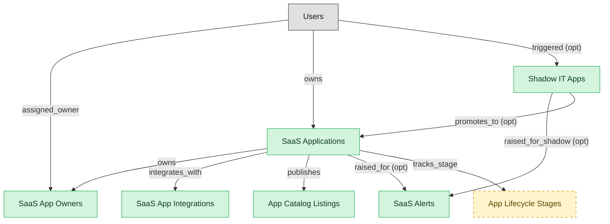

# SMP Discovery and Catalog

## 1. Overview

### 1.1 Analyst overview

Discovery of sanctioned and shadow SaaS, app inventory, ownership, integrations, lifecycle staging, catalog publication, and operational signal/alerts. The discovery substrate of an SMP deployment.

## 2. Entity summary

| Name | Description |
| --- | --- |
| App Catalog Listings | Curated, published listing of a sanctioned SaaS application that employees can browse and request access to. Carries description, owner, request route, SSO availability, approval workflow. Distinct from saas_applications (the discovered inventory of what's running); the catalog is the publication of what's offered. LeanIX, Torii, BetterCloud flagship. |
| SaaS Alerts | System-raised anomaly on the SaaS portfolio: shadow-IT signup detected, license-overage projected, renewal window opening, integration token expiring, vendor-risk score change. Distinct from monitoring_alerts (OBS/AIOPS infrastructure-grain). BetterCloud Alert Center and Torii Alerts are the flagship surfaces. |
| SaaS App Integrations | Discovered or configured connection between SMP and a SaaS application's APIs (SSO source, SCIM source, finance source, usage source). Per-app per-tenant, with auth state and last-sync time. Distinct from IPAAS integration_connectors (platform-grain vendor-connector definitions); BetterCloud's App Integrations flagship surface. |
| SaaS App Owners | Typed role assignment of a user to a SaaS application (business owner, IT owner, finance owner, security owner). Not a flat FK on saas_applications because one app may have multiple typed owners; modeled by Productiv and LeanIX as a first-class junction. |
| SaaS Applications | Canonical SaaS app in the portfolio (collaboration, CRM, productivity, design, work-management tools). Carries vendor, category, criticality tier, sanctioned/shadow flag, and links to the active subscription. Distinct from SAM's software_titles which are typically installed (or hybrid). The flagship SMP entity. |
| Shadow IT Apps | SaaS app discovered in use but not officially sanctioned. Found via expense data (corporate card SaaS charges), SSO logs (unsanctioned login), browser extensions, network traffic, or signup-with-corporate-email detection. The thing finance, security, IT, and SMP all want to see but historically nobody owns end-to-end. |
| App Lifecycle Stages | Portfolio-rationalization stage of a SaaS application (Evaluate, Pilot, Sanctioned, Sunset, Retired). Distinct from saas_applications.record_status (discovered → sanctioned → deprecated → deprovisioned, which tracks discovery state). LeanIX's TIME taxonomy is the flagship. |

## 3. Entities catalog

| # | data_object | role | mastered in | label | necessity | pattern flags | write tier | notes |
| ---: | --- | --- | --- | --- | --- | --- | --- | --- |
| 1 | `smp_app_catalog_listings` (App Catalog Listings) | master | - | - | required | - | `:manage` _(pending)_ | - |
| 2 | `smp_alerts` (SaaS Alerts) | master | - | - | required | - | `:manage` _(pending)_ | - |
| 3 | `smp_app_integrations` (SaaS App Integrations) | master | - | - | required | - | `:manage` _(pending)_ | - |
| 4 | `smp_app_owners` (SaaS App Owners) | master | - | - | required | personal_content | `:manage` _(pending)_ | - |
| 5 | `saas_applications` (SaaS Applications) | master | - | - | required | - | `:manage` _(pending)_ | - |
| 6 | `shadow_it_apps` (Shadow IT Apps) | master | - | - | required | - | `:manage` _(pending)_ | - |
| 7 | `smp_app_lifecycle_stages` (App Lifecycle Stages) | embedded_master | - | - | optional | - | `:manage` _(pending)_ | - |

## 4. Aliases and industry synonyms

_(no industry-scoped aliases or non-synonym alias types loaded for this scope; generic synonyms are omitted as common knowledge.)_

## 5. Relationships

### 5.1 Intra-scope edges

| from | verb | to | cardinality | kind | necessity | owner_side | delete_mode | fk_format | notes |
| --- | --- | --- | --- | --- | --- | --- | --- | --- | --- |
| `saas_applications` | owns | `smp_app_owners` | many_to_many | reference | required | source | restrict | reference | - |
| `saas_applications` | integrates_with | `smp_app_integrations` | one_to_many | reference | required | target | restrict | reference | - |
| `saas_applications` | publishes | `smp_app_catalog_listings` | one_to_one | reference | required | source | restrict | reference | - |
| `saas_applications` | raised_for | `smp_alerts` | one_to_many | reference | optional | target | clear | reference | - |
| `shadow_it_apps` | raised_for_shadow | `smp_alerts` | one_to_many | reference | optional | target | clear | reference | - |
| `saas_applications` | tracks_stage | `smp_app_lifecycle_stages` | one_to_one | reference | required | target | restrict | reference | - |
| `shadow_it_apps` | promotes_to | `saas_applications` | one_to_one | reference | optional | source | clear | reference | - |

### 5.2 Built-in edges (`users` and other platform built-ins)

| from | verb | to | cardinality | necessity | owner_side | delete_mode | fk_format | notes |
| --- | --- | --- | --- | --- | --- | --- | --- | --- |
| `users` | assigned_owner | `smp_app_owners` | many_to_many | required | source | restrict | reference | - |
| `users` | owns | `saas_applications` | one_to_many | required | target | restrict | reference | - |
| `users` | triggered | `shadow_it_apps` | one_to_many | optional | target | clear | reference | - |

### 5.3 Cross-scope edges

#### 5.3a Outbound from this scope's masters and contributors

_Edges this scope drives: the in-scope endpoint has `role` of `master` or `contributor`._

| from | verb | to | cardinality | necessity | delete_mode | fk_format | notes |
| --- | --- | --- | --- | --- | --- | --- | --- |
| `enterprise_applications` | aliased_as | `saas_applications` | one_to_one | optional | clear | reference | - |
| `saas_applications` | lifecycle events for | `asset_lifecycle_events` | one_to_many | optional | clear | reference | - |
| `asset_contracts` | covers | `saas_applications` | many_to_many | optional | clear | reference | - |
| `saas_applications` | entitles_to | `iga_user_entitlements` | one_to_many | required | restrict | reference | - |
| `saas_applications` | recommends_for_app | `smp_optimization_recommendations` | one_to_many | optional | clear | reference | - |
| `saas_applications` | benchmarks_for | `smp_app_benchmarks` | one_to_many | required | restrict | reference | - |
| `saas_applications` | assesses_app | `smp_vendor_risk_assessments` | one_to_many | required | restrict | reference | - |
| `saas_applications` | automates_app | `smp_automation_workflows` | one_to_many | optional | clear | reference | - |
| `smp_app_catalog_listings` | requests_listing | `smp_app_requests` | one_to_many | required | restrict | reference | - |
| `saas_applications` | has | `saas_subscriptions` | one_to_many | optional | clear | reference | - |
| `saas_applications` | measured_by | `saas_usage_metrics` | one_to_many | required | cascade | parent | - |
| `saas_applications` | assigned_via | `smp_license_seat_assignments` | one_to_many | required | cascade | parent | - |

#### 5.3b Context edges on embedded shells and consumed entities

_Edges the canonical owner drives, shown for context: the in-scope endpoint has `role` of `embedded_master`, `consumer`, or `derived`._

_(no context cross-scope edges on this scope's embedded shells or consumed entities.)_

## 6. Cross-domain context

### 6.1 Master consumers (other modules / domains that embed this scope's masters)

| data_object | other module / domain | role | necessity | notes |
| --- | --- | --- | --- | --- |
| `saas_applications` | APM-PORTFOLIO-REGISTRY (Portfolio Registry) - APM | consumer | optional | - |
| `saas_applications` | IGA-ENTITLEMENT-CATALOG (IGA Entitlement Catalog) - IGA | consumer | optional | Newly discovered or sanctioned SaaS apps trigger entitlement registration in IGA catalog. |
| `saas_applications` | ITAM-PORTFOLIO-REPORTING (Portfolio TCO Reporting) - ITAM | consumer | required | - |
| `saas_applications` | SMP-RENEWAL-VENDOR (SMP Renewal and Vendor Management) - SMP | consumer | required | - |

### 6.2 Outbound handoffs (events this scope publishes)

| source module | target domain | target module | trigger_event | transition | payload | integration | friction | description |
| --- | --- | --- | --- | --- | --- | --- | --- | --- |
| SMP-DISCOVERY | IGA | IGA-ENTITLEMENT-CATALOG | `saas_application.sanctioned` | - | `saas_applications` | api_call | low | Sanctioned SaaS apps are wired into IGA provisioning catalog. |
| SMP-DISCOVERY | IGA | IGA-ENTITLEMENT-CATALOG | `saas_application.discovered` | - | `saas_applications` | event_stream | medium | Newly discovered SaaS apps surface to IGA for shadow-IT visibility and access governance. |
| SMP-DISCOVERY | FINOPS | _(domain-level)_ | `saas_application.sanctioned` | - | `saas_applications` | event_stream | medium | Sanctioned SaaS apps come under FINOPS spend tracking. |

### 6.3 Inbound handoffs (events this scope reacts to)

| target module | source domain | source module | trigger_event | transition | payload | integration | friction | description |
| --- | --- | --- | --- | --- | --- | --- | --- | --- |
| SMP-DISCOVERY | EXPENSE | _(domain-level)_ | `card.saas_charge_detected` | _(state_change)_ | `shadow_it_apps` | event_stream | high | Corporate-card SaaS charge detected by the expense system surfaces a candidate shadow-IT app in SMP. High friction: finance sees the charge, IT/SMP sees (or doesn't see) the app - reconciling vendor-name-on-card with app-name-in-portfolio is messy and is one of the highest-value SMP-to-EXPENSE integrations. |
| SMP-DISCOVERY | DISCOVERY | _(domain-level)_ | `sso_login.unsanctioned_app` | _(state_change)_ | `shadow_it_apps` | event_stream | medium | SSO logs reveal a login to a SaaS app that's not in the sanctioned catalog - flagged as shadow IT. Complements the EXPENSE-side detection: SSO catches apps that use corporate SSO but aren't tracked; expense catches credit-card paid apps that don't. |
| SMP-DISCOVERY | SPEND-MGMT | _(domain-level)_ | `card_transaction.posted` | `posted` _(signal)_ | `shadow_it_apps` | api_call | high | SaaS purchases on corporate cards reveal shadow IT to SMP - merchant categorization required to identify SaaS subscriptions vs other spend, then deduplicated against the existing SMP saas_subscription catalog. The card-side discovery path is the primary signal for off-procurement SaaS today. Shadow-data pattern. |

### 6.4 Master providers (modules / domains that own masters this scope embeds)

| data_object | role here | necessity | canonical owner(s) | slice notes |
| --- | --- | --- | --- | --- |
| `smp_app_lifecycle_stages` | embedded_master | optional | _(no canonical owner recorded)_ | - |

## 7. Lifecycle states

### `saas_applications` (SaaS Application)

| order | state_name | initial? | terminal? | requires_permission? | derived gate | description |
| --- | --- | --- | --- | --- | --- | --- |
| 10 | `discovered` | ✓ | - | - | - | App detected via SSO logs, expense data, or browser plugin. Not yet reviewed by IT. |
| 20 | `triaged` | - | - | - | - | App has been reviewed by IT but no sanction decision recorded yet. |
| 30 | `sanctioned` | - | - | ✓ | `smp-discovery:sanction_application` | App is officially supported; IGA provisioning, FINOPS spend tracking, and ITAM registration activated. |
| 40 | `deprecated` | - | - | ✓ | `smp-discovery:deprecate_application` | Slated for replacement or removal; no new assignments allowed; existing users on read-only or sunset path. |
| 50 | `deprovisioned` | - | ✓ | ✓ | `smp-discovery:deprovision_application` | App removed tenant-wide. ITSM closes related tickets; IGA revokes access; FINOPS terminates spend. |

### `shadow_it_apps` (Shadow IT App)

| order | state_name | initial? | terminal? | requires_permission? | derived gate | description |
| --- | --- | --- | --- | --- | --- | --- |
| 10 | `discovered` | ✓ | - | - | - | Unsanctioned app surfaced by discovery (expense card, signup detection, network traffic). Awaiting triage. |
| 20 | `triaged` | - | - | - | - | IT has reviewed the shadow app and is weighing sanction vs block. |
| 30 | `sanctioned_promoted` | - | ✓ | ✓ | `smp-discovery:promote_shadow_app` | Shadow app promoted to the sanctioned catalog; a corresponding saas_applications record is created. |
| 40 | `blocked` | - | ✓ | ✓ | `smp-discovery:block_shadow_app` | Shadow app blocked at the network and SSO layer; users notified. |

### `smp_alerts` (SaaS Alert)

| order | state_name | initial? | terminal? | requires_permission? | derived gate | description |
| --- | --- | --- | --- | --- | --- | --- |
| 10 | `raised` | ✓ | - | - | - | - |
| 20 | `acknowledged` | - | - | ✓ | `smp-discovery:acknowledge_alert` | - |
| 30 | `triaged` | - | - | ✓ | `smp-discovery:triage_alert` | - |
| 40 | `resolved` | - | ✓ | ✓ | `smp-discovery:resolve_alert` | - |
| 50 | `suppressed` | - | ✓ | ✓ | `smp-discovery:suppress_alert` | - |

### `smp_app_catalog_listings` (App Catalog Listing)

| order | state_name | initial? | terminal? | requires_permission? | derived gate | description |
| --- | --- | --- | --- | --- | --- | --- |
| 10 | `draft` | ✓ | - | - | - | - |
| 20 | `published` | - | - | ✓ | `smp-discovery:publish_catalog_listing` | - |
| 30 | `deprecated` | - | - | ✓ | `smp-discovery:deprecate_catalog_listing` | - |
| 40 | `unlisted` | - | ✓ | ✓ | `smp-discovery:unlist_catalog_listing` | - |

### `smp_app_integrations` (SaaS App Integration)

| order | state_name | initial? | terminal? | requires_permission? | derived gate | description |
| --- | --- | --- | --- | --- | --- | --- |
| 10 | `configured` | ✓ | - | - | - | - |
| 20 | `connected` | - | - | - | - | - |
| 30 | `degraded` | - | - | ✓ | `smp-discovery:mark_integration_degraded` | - |
| 40 | `disconnected` | - | - | ✓ | `smp-discovery:disconnect_integration` | - |
| 50 | `archived` | - | ✓ | ✓ | `smp-discovery:archive_integration` | - |

### `smp_app_lifecycle_stages` (App Lifecycle Stage)

_This scope holds `smp_app_lifecycle_stages` as **embedded_master**; the canonical state machine is owned by _(no canonical master found)_._

| order | state_name | initial? | terminal? | requires_permission? | derived gate | description |
| --- | --- | --- | --- | --- | --- | --- |
| 10 | `evaluate` | ✓ | - | - | - | - |
| 20 | `pilot` | - | - | ✓ | `smp-discovery:promote_to_pilot` | - |
| 30 | `sanctioned` | - | - | ✓ | `smp-discovery:promote_to_sanctioned` | - |
| 40 | `sunset` | - | - | ✓ | `smp-discovery:sunset_app` | - |
| 50 | `retired` | - | ✓ | ✓ | `smp-discovery:retire_app` | - |

### `smp_app_owners` (SaaS App Owner)

| order | state_name | initial? | terminal? | requires_permission? | derived gate | description |
| --- | --- | --- | --- | --- | --- | --- |
| 10 | `active` | ✓ | - | - | - | - |
| 20 | `revoked` | - | ✓ | ✓ | `smp-discovery:revoke_app_owner` | - |

## 8. Permissions and business rules (derived)

### 8.1 Permissions

| permission | tier | description | included in `:admin`? |
| --- | --- | --- | --- |
| `smp-discovery:read` | baseline-read | Read access to every entity in the module | ✓ |
| `smp-discovery:manage` | baseline-manage | Edit operational records | ✓ |
| `smp-discovery:admin` | baseline-admin | Edit reference data and inherit every workflow gate below | - |
| `smp-discovery:sanction_application` | workflow-gate (lifecycle) | Transition `saas_applications` into state `sanctioned` | ✓ |
| `smp-discovery:deprecate_application` | workflow-gate (lifecycle) | Transition `saas_applications` into state `deprecated` | ✓ |
| `smp-discovery:deprovision_application` | workflow-gate (lifecycle) | Transition `saas_applications` into state `deprovisioned` | ✓ |
| `smp-discovery:promote_shadow_app` | workflow-gate (lifecycle) | Transition `shadow_it_apps` into state `sanctioned_promoted` | ✓ |
| `smp-discovery:block_shadow_app` | workflow-gate (lifecycle) | Transition `shadow_it_apps` into state `blocked` | ✓ |
| `smp-discovery:revoke_app_owner` | workflow-gate (lifecycle) | Transition `smp_app_owners` into state `revoked` | ✓ |
| `smp-discovery:mark_integration_degraded` | workflow-gate (lifecycle) | Transition `smp_app_integrations` into state `degraded` | ✓ |
| `smp-discovery:disconnect_integration` | workflow-gate (lifecycle) | Transition `smp_app_integrations` into state `disconnected` | ✓ |
| `smp-discovery:archive_integration` | workflow-gate (lifecycle) | Transition `smp_app_integrations` into state `archived` | ✓ |
| `smp-discovery:publish_catalog_listing` | workflow-gate (lifecycle) | Transition `smp_app_catalog_listings` into state `published` | ✓ |
| `smp-discovery:deprecate_catalog_listing` | workflow-gate (lifecycle) | Transition `smp_app_catalog_listings` into state `deprecated` | ✓ |
| `smp-discovery:unlist_catalog_listing` | workflow-gate (lifecycle) | Transition `smp_app_catalog_listings` into state `unlisted` | ✓ |
| `smp-discovery:acknowledge_alert` | workflow-gate (lifecycle) | Transition `smp_alerts` into state `acknowledged` | ✓ |
| `smp-discovery:triage_alert` | workflow-gate (lifecycle) | Transition `smp_alerts` into state `triaged` | ✓ |
| `smp-discovery:resolve_alert` | workflow-gate (lifecycle) | Transition `smp_alerts` into state `resolved` | ✓ |
| `smp-discovery:suppress_alert` | workflow-gate (lifecycle) | Transition `smp_alerts` into state `suppressed` | ✓ |
| `smp-discovery:promote_to_pilot` | workflow-gate (lifecycle) | Transition `smp_app_lifecycle_stages` into state `pilot` | ✓ |
| `smp-discovery:promote_to_sanctioned` | workflow-gate (lifecycle) | Transition `smp_app_lifecycle_stages` into state `sanctioned` | ✓ |
| `smp-discovery:sunset_app` | workflow-gate (lifecycle) | Transition `smp_app_lifecycle_stages` into state `sunset` | ✓ |
| `smp-discovery:retire_app` | workflow-gate (lifecycle) | Transition `smp_app_lifecycle_stages` into state `retired` | ✓ |
| `smp-discovery:view_all_saas_app_owners` | override (personal_content) | View all `smp_app_owners` rows beyond row-scope | ✓ |
| `smp-discovery:manage_all_saas_app_owners` | override (personal_content) | Manage all `smp_app_owners` rows beyond row-scope | ✓ |

### 8.2 Business rules

| rule_name | data_object | source flag | intent |
| --- | --- | --- | --- |
| `saas_app_owner_edit_scope` | `smp_app_owners` | has_personal_content | Row-scope by default; override via `smp-discovery:view_all_saas_app_owners` / `smp-discovery:manage_all_saas_app_owners` |

## 9. Roles, RACI, and responsibilities (derived)

_Baseline roles, the permission hierarchy, and RACI realization are DERIVED from this scope's entity-type write tiers + `process_raci`; none of it is stored in the catalog (the deployer provisions it from this blueprint)._

### 9.1 `SMP-DISCOVERY`

**Baseline roles:**

| role | baseline grant |
| --- | --- |
| `smp-discovery_viewer` | `smp-discovery:read` |
| `smp-discovery_manager` | `smp-discovery:manage` |

**Permission hierarchy:**

| permission | includes |
| --- | --- |
| `smp-discovery:admin` | `smp-discovery:manage` |
| `smp-discovery:manage` | `smp-discovery:read` |
| `smp-discovery:admin` | `smp-discovery:sanction_application` |
| `smp-discovery:admin` | `smp-discovery:deprecate_application` |
| `smp-discovery:admin` | `smp-discovery:deprovision_application` |
| `smp-discovery:admin` | `smp-discovery:promote_shadow_app` |
| `smp-discovery:admin` | `smp-discovery:block_shadow_app` |
| `smp-discovery:admin` | `smp-discovery:revoke_app_owner` |
| `smp-discovery:admin` | `smp-discovery:mark_integration_degraded` |
| `smp-discovery:admin` | `smp-discovery:disconnect_integration` |
| `smp-discovery:admin` | `smp-discovery:archive_integration` |
| `smp-discovery:admin` | `smp-discovery:publish_catalog_listing` |
| `smp-discovery:admin` | `smp-discovery:deprecate_catalog_listing` |
| `smp-discovery:admin` | `smp-discovery:unlist_catalog_listing` |
| `smp-discovery:admin` | `smp-discovery:acknowledge_alert` |
| `smp-discovery:admin` | `smp-discovery:triage_alert` |
| `smp-discovery:admin` | `smp-discovery:resolve_alert` |
| `smp-discovery:admin` | `smp-discovery:suppress_alert` |
| `smp-discovery:admin` | `smp-discovery:promote_to_pilot` |
| `smp-discovery:admin` | `smp-discovery:promote_to_sanctioned` |
| `smp-discovery:admin` | `smp-discovery:sunset_app` |
| `smp-discovery:admin` | `smp-discovery:retire_app` |
| `smp-discovery:admin` | `smp-discovery:view_all_saas_app_owners` |
| `smp-discovery:admin` | `smp-discovery:manage_all_saas_app_owners` |

**RACI realization:**

_(no `process_raci` assignments wired to this module's gated processes yet; authored per-domain in Phase E.)_

### 9.2 Functional ownership and default grants

| responsibility | business function | default role | default tier |
| --- | --- | --- | --- |
| owner | IT Asset Management | `admin` | `:admin` |
| contributor | Finance | `manage` | `:manage` |
| contributor | Procurement | `manage` | `:manage` |
