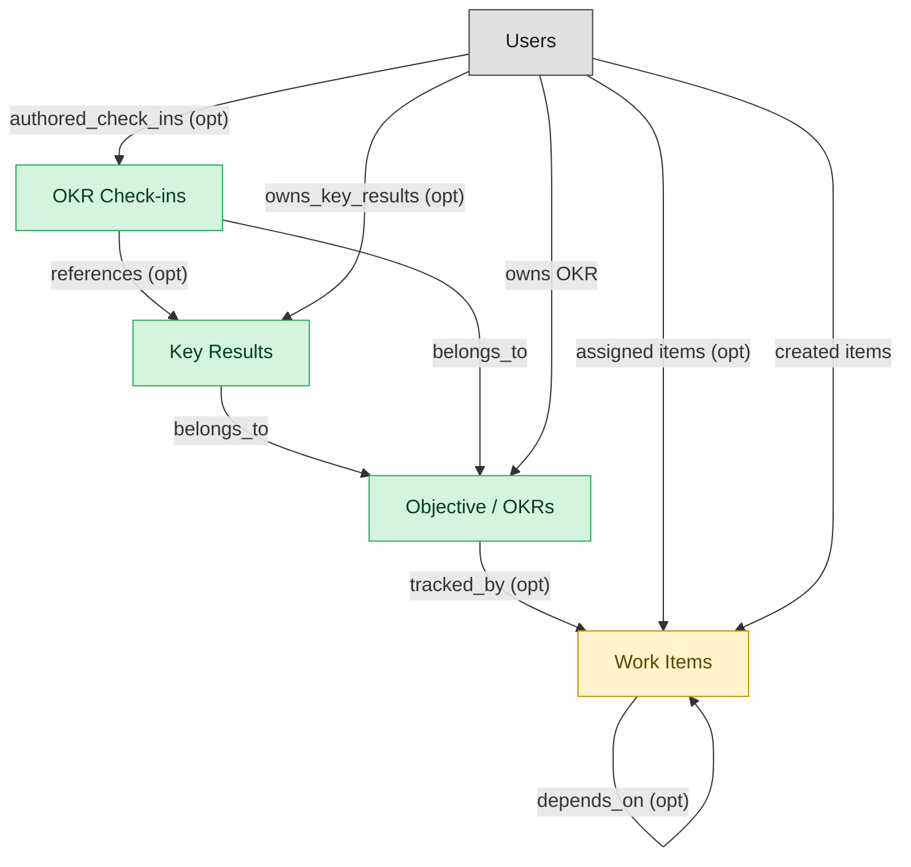

# Team-Execution Goals and OKRs

## 1. Overview

### 1.1 Analyst overview

Team-execution OKR tracking surface: objectives with key results that link to work items for automatic progress rollup, weekly check-in cadences, scoring, and closure. Deploys alongside the task-execution module for full integration, or standalone with a thin embedded work-item shell for KR linking.

## 2. Entity summary

| Name | Description |
| --- | --- |
| Key Results | Measurable result attached to an okr_objective. The unit of scoring on OKR programs - vendors universally model KR as first-class (Asana, Monday, ClickUp, Workfront). |
| Objective / OKRs | Hierarchical objective with measurable key results, weighted progress rollup from child objectives or linked work_items, owner accountability, and cadence (quarterly/annual). Mastered by three distinct domains: WORK-MGMT (team-level execution OKRs), SPM (strategic portfolio OKRs), TALENT-MGMT (individual performance-management OKRs). Same primitive, three different lifecycles and review processes - canonical Signal-1 multi-master. |
| OKR Check-ins | Periodic status update on an okr_objective or key_result during the active cycle. Cadence-of-record (weekly/bi-weekly) for OKR programs. May discuss individual performance - flagged as personal content. |
| Work Items | Atomic primitive in a work-management platform: task / item / card with owner, due date, status, priority, dependencies, subtasks, attachments, and comments. Same shape regardless of platform-specific terminology (task, item, row, card). |

## 3. Entities catalog

| # | data_object | role | mastered in | label | necessity | pattern flags | write tier | notes |
| ---: | --- | --- | --- | --- | --- | --- | --- | --- |
| 1 | `okr_key_results` (Key Results) | master | - | - | required | - | `:manage` _(pending)_ | - |
| 2 | `okr_objectives` (Objective / OKRs) | master | - | - | required | personal_content | `:manage` _(pending)_ | - |
| 3 | `okr_check_ins` (OKR Check-ins) | master | - | - | required | personal_content | `:manage` _(pending)_ | - |
| 4 | `work_items` (Work Items) | embedded_master | `work-mgmt-task-exec` | Task and Project Execution | required | - | `:manage` _(pending)_ | - |

## 4. Aliases and industry synonyms

_(no industry-scoped aliases or non-synonym alias types loaded for this scope; generic synonyms are omitted as common knowledge.)_

## 5. Relationships

### 5.1 Intra-scope edges

| from | verb | to | cardinality | kind | necessity | owner_side | delete_mode | fk_format | notes |
| --- | --- | --- | --- | --- | --- | --- | --- | --- | --- |
| `okr_key_results` | belongs_to | `okr_objectives` | one_to_many | composition | required | target | cascade | parent | - |
| `okr_check_ins` | belongs_to | `okr_objectives` | one_to_many | composition | required | target | cascade | parent | - |
| `okr_check_ins` | references | `okr_key_results` | one_to_many | reference | optional | target | clear | reference | - |
| `work_items` | depends_on | `work_items` | many_to_many | association | optional | source | clear | reference | - |
| `okr_objectives` | tracked_by | `work_items` | one_to_many | reference | optional | source | clear | reference | - |

### 5.2 Built-in edges (`users` and other platform built-ins)

| from | verb | to | cardinality | necessity | owner_side | delete_mode | fk_format | notes |
| --- | --- | --- | --- | --- | --- | --- | --- | --- |
| `users` | owns_key_results | `okr_key_results` | one_to_many | optional | source | clear | reference | - |
| `users` | authored_check_ins | `okr_check_ins` | one_to_many | optional | source | clear | reference | - |
| `users` | assigned items | `work_items` | one_to_many | optional | source | clear | reference | - |
| `users` | created items | `work_items` | one_to_many | required | source | restrict | reference | - |
| `users` | owns OKR | `okr_objectives` | one_to_many | required | source | restrict | reference | - |

### 5.3 Cross-scope edges

#### 5.3a Outbound from this scope's masters and contributors

_Edges this scope drives: the in-scope endpoint has `role` of `master` or `contributor`._

| from | verb | to | cardinality | necessity | delete_mode | fk_format | notes |
| --- | --- | --- | --- | --- | --- | --- | --- |
| `strategy_maps` | organizes | `okr_objectives` | one_to_many | optional | none | n/a | - |
| `okr_objectives` | advanced_by | `strategic_initiatives` | many_to_many | optional | none | n/a | - |
| `okr_objectives` | reviewed_in | `operating_reviews` | many_to_many | optional | none | n/a | - |
| `strategy_decisions` | affects | `okr_objectives` | many_to_many | optional | none | n/a | - |
| `work_projects` | aligned_to | `okr_objectives` | many_to_many | optional | none | n/a | - |
| `performance_reviews` | evaluates | `okr_objectives` | one_to_many | optional | none | n/a | - |
| `performance_goals` | aligns_to | `okr_objectives` | many_to_many | optional | none | n/a | - |

#### 5.3b Context edges on embedded shells and consumed entities

_Edges the canonical owner drives, shown for context: the in-scope endpoint has `role` of `embedded_master`, `consumer`, or `derived`._

16 context edges

| from | verb | to | cardinality | necessity | delete_mode | fk_format | notes |
| --- | --- | --- | --- | --- | --- | --- | --- |
| `test_defects` | spawns | `work_items` | one_to_many | optional | none | n/a | - |
| `work_dependencies` | blocks | `work_items` | many_to_many | required | none (required-if-present) | n/a | - |
| `work_approval_chains` | gates | `work_items` | many_to_many | optional | none | n/a | - |
| `work_user_workloads` | rolls_up | `work_items` | many_to_many | required | none (required-if-present) | n/a | - |
| `work_custom_field_values` | set_on | `work_items` | one_to_many | required | ⚠ audit: required composed child out of scope | n/a | - |
| `work_items` | placed_in | `work_sections` | one_to_many | optional | none | n/a | - |
| `work_task_templates` | seeds_item | `work_items` | one_to_many | optional | none | n/a | - |
| `work_item_tags` | tagged_on | `work_items` | one_to_many | required | ⚠ audit: required composed child out of scope | n/a | - |
| `work_item_comments` | belongs_to | `work_items` | one_to_many | required | ⚠ audit: required composed child out of scope | n/a | - |
| `work_item_attachments` | belongs_to | `work_items` | one_to_many | required | ⚠ audit: required composed child out of scope | n/a | - |
| `work_form_submissions` | converts_to | `work_items` | one_to_many | optional | none | n/a | - |
| `action_plans` | spawns | `work_items` | one_to_many | optional | none | n/a | - |
| `work_projects` | contains | `work_items` | one_to_many | required | ⚠ audit: required composed child out of scope | n/a | - |
| `work_automations` | drives | `work_items` | one_to_many | optional | none | n/a | - |
| `work_items` | mirrors_to | `service_requests` | one_to_one | optional | none | n/a | - |
| `strategic_initiatives` | portfolio rollup from | `work_items` | one_to_many | optional | none | n/a | - |

## 6. Cross-domain context

### 6.1 Master consumers (other modules / domains that embed this scope's masters)

| data_object | other module / domain | role | necessity | notes |
| --- | --- | --- | --- | --- |
| `okr_objectives` | PM-ROADMAP-DELIVERY (Roadmap, Release, and Strategy) - PROD-MGMT | consumer | optional | - |
| `okr_objectives` | SEM-EXECUTION-TRACKING (Execution Tracking) - SEM | consumer | required | - |
| `okr_objectives` | SEM-OPERATING-RHYTHM (Operating Rhythm) - SEM | consumer | required | - |
| `okr_objectives` | SEM-STRATEGY-DEFINITION (Strategy Definition) - SEM | embedded_master | required | - |
| `okr_objectives` | TALENT-PERFORMANCE-MGMT (Performance and Goal Management) - TALENT-MGMT | embedded_master | optional | - |

### 6.2 Outbound handoffs (events this scope publishes)

| source module | target domain | target module | trigger_event | transition | payload | integration | friction | description |
| --- | --- | --- | --- | --- | --- | --- | --- | --- |
| WORK-MGMT-GOALS-OKR | SPM | _(domain-level)_ | `okr_objective.committed` | `drafted` → `committed` _(lifecycle)_ | `okr_objectives` | api_call | medium | Team-level OKR commits in WM cascade upward into SPM portfolio rollup. SPM tracks corporate / strategic OKRs and aggregates team commits for portfolio reporting. target_domain_module_id NULL because SPM is not yet modularized. |
| WORK-MGMT-TASK-EXEC | SPM | _(domain-level)_ | `work_item.completed` | `in_progress` → `done` _(lifecycle)_ | `work_items` | batch_sync | medium | Work-management platforms publish task-completion data to portfolio dashboards in SPM tools. The portfolio rollup powers strategy-to-execution dashboards and OKR progress (via okr_objectives.key_results linking down to work_items). Nightly sync is the common pattern; richer real-time integrations exist but are vendor-specific. |
| WORK-MGMT-GOALS-OKR | TALENT-MGMT | TALENT-PERFORMANCE-MGMT | `okr_objective.committed` | `drafted` → `committed` _(lifecycle)_ | `okr_objectives` | api_call | medium | Team OKR commits in WORK-MGMT-GOALS-OKR; TALENT-PERFORMANCE-MGMT reads the committed objective so per-employee performance_goals can align to its KRs. Most modern perf platforms (Lattice, 15Five, Culture Amp) ship OKR-tool sync; non-trivial when the OKR tool is separate from the perf tool because employee-to-KR mapping is manual. |
| WORK-MGMT-GOALS-OKR | TALENT-MGMT | TALENT-PERFORMANCE-MGMT | `okr_objective.scored` | `in_progress` → `scored` _(lifecycle)_ | `okr_objectives` | api_call | high | End-of-cycle OKR score feeds directly into per-employee performance review compensation discussion. High friction: most-cited integration pain point across Lattice/15Five/Culture Amp user surveys when the team OKR tool is a separate vendor from the perf review tool - managers re-derive scores manually, often after late-bound corrections to the OKR-side scoring. |
| WORK-MGMT-TASK-EXEC | PSA | PSA-PROJECT-DELIVERY | `work_item.completed` | `in_progress` → `done` _(lifecycle)_ | `work_items` | api_call | low | When WM is the work tracker for a PSA-managed delivery, work_item completion closes the loop on PSA-side time / utilization accounting. Pairs with the existing PSA -> WM project_task.completed inbound for the bidirectional sync pattern. |
| WORK-MGMT-GOALS-OKR | PROD-MGMT | PM-ROADMAP-DELIVERY | `okr_objective.committed` | `drafted` → `committed` _(lifecycle)_ | `okr_objectives` | api_call | medium | Team OKR commits in WM; PROD-MGMT roadmaps that align to OKR cycles pick up the committed objective for alignment scoring. Aha, Productboard, and similar tools maintain OKR sync as a paid feature. |
| WORK-MGMT-TASK-EXEC | PROD-MGMT | PM-ROADMAP-DELIVERY | `work_item.completed` | `in_progress` → `done` _(lifecycle)_ | `work_items` | api_call | medium | WM work_item completion updates PROD-MGMT roadmap progress when items are linked to feature_requests or product_releases. Most product-mgmt tools (Aha, Productboard, Roadmunk) integrate via this signal but each integration is bespoke - friction is the mapping between work_item id and roadmap_item id. |
| WORK-MGMT-GOALS-OKR | PROD-MGMT | PM-ROADMAP-DELIVERY | `okr_objective.scored` | `in_progress` → `scored` _(lifecycle)_ | `okr_objectives` | api_call | medium | End-of-cycle OKR score feeds PROD-MGMT retrospective and next-cycle roadmap prioritization. Distinct from committed (kickoff) and aligned to roadmap delivery KPIs. |
| WORK-MGMT-GOALS-OKR | WORK-MGMT | WORK-MGMT-TASK-EXEC | `okr_objective.committed` | `drafted` → `committed` _(lifecycle)_ | `okr_objectives` | lifecycle_progression | low | Committing an OKR unlocks KR-to-work_item linking and optionally auto-creates placeholder work_items per the objective's templates. Reverse direction of the rollup flow. |

### 6.3 Inbound handoffs (events this scope reacts to)

| target module | source domain | source module | trigger_event | transition | payload | integration | friction | description |
| --- | --- | --- | --- | --- | --- | --- | --- | --- |
| WORK-MGMT-GOALS-OKR | WORK-MGMT | WORK-MGMT-TASK-EXEC | `work_item.completed` | `in_progress` → `done` _(lifecycle)_ | `work_items` | lifecycle_progression | low | Terminal completion of a work item is the strongest progress signal - drives KR closure recalculation and triggers KR-fully-met evaluations on linked objectives. |
| WORK-MGMT-GOALS-OKR | WORK-MGMT | WORK-MGMT-TASK-EXEC | `work_item.status_changed` | `any` → `any` _(lifecycle)_ | `work_items` | lifecycle_progression | low | Work item status change triggers KR progress recalculation in GOALS-OKR for any objective that has linked the item to a key result. In-process FK + state read; no message moves. |
| WORK-MGMT-GOALS-OKR | SPM | _(domain-level)_ | `okr_objective.created` | `draft` _(lifecycle)_ | `okr_objectives` | manual_handoff | high | Executive-level OKRs created in SPM (or in a slide deck, or an HCM perf system) need to cascade into team-level OKRs in the work-management tool. Almost universally manual: someone reads the corporate OKR and authors child OKRs in the WORK-MGMT goals module. The cascade gap is what dedicated OKR-platform vendors exist to close. |

### 6.4 Master providers (modules / domains that own masters this scope embeds)

| data_object | role here | necessity | canonical owner(s) | slice notes |
| --- | --- | --- | --- | --- |
| `work_items` | embedded_master | required | WORK-MGMT-TASK-EXEC (WORK-MGMT) | - |

## 7. Lifecycle states

### `okr_key_results` (Key Result)

| order | state_name | initial? | terminal? | requires_permission? | derived gate | description |
| --- | --- | --- | --- | --- | --- | --- |
| 1 | `drafted` | ✓ | - | - | - | - |
| 2 | `committed` | - | - | ✓ | `work-mgmt-goals-okr:commit_okr_key_result` | - |
| 3 | `in_progress` | - | - | - | - | - |
| 4 | `at_risk` | - | - | - | - | - |
| 5 | `achieved` | - | ✓ | ✓ | `work-mgmt-goals-okr:achieve_okr_key_result` | - |
| 6 | `missed` | - | ✓ | ✓ | `work-mgmt-goals-okr:miss_okr_key_result` | - |

### `okr_objectives` (Objective / OKR)

| order | state_name | initial? | terminal? | requires_permission? | derived gate | description |
| --- | --- | --- | --- | --- | --- | --- |
| 1 | `drafted` | ✓ | - | - | - | - |
| 1 | `drafted` | ✓ | - | - | - | Objective drafted by the owner. |
| 2 | `committed` | - | - | ✓ | `talent-performance-mgmt:commit_okr_objective` | Owner and manager commit to the objective for the cycle. |
| 2 | `committed` | - | - | ✓ | `work-mgmt-goals-okr:commit_okr_objective` | - |
| 3 | `in_progress` | - | - | - | - | - |
| 3 | `in_progress` | - | - | - | - | Objective is being pursued; key results updated. |
| 4 | `graded` | - | - | ✓ | `talent-performance-mgmt:grade_okr_objective` | End-of-cycle score (0.0-1.0) recorded. |
| 4 | `scored` | - | - | ✓ | `work-mgmt-goals-okr:score_okr_objective` | - |
| 5 | `closed` | - | ✓ | - | - | Cycle closed; objective archived. |
| 5 | `closed` | - | ✓ | - | - | - |

> ⚠ **state-machine shape:** 2 is_initial (expected exactly 1); state_order not unique/monotonic.

### `work_items` (Work Item)

_This scope holds `work_items` as **embedded_master**; the canonical state machine is owned by `WORK-MGMT-TASK-EXEC`._

| order | state_name | initial? | terminal? | requires_permission? | derived gate | description |
| --- | --- | --- | --- | --- | --- | --- |
| 1 | `open` | ✓ | - | - | - | - |
| 2 | `in_progress` | - | - | - | - | - |
| 3 | `blocked` | - | - | - | - | - |
| 4 | `done` | - | ✓ | - | - | - |
| 5 | `cancelled` | - | ✓ | ✓ | `work-mgmt-goals-okr:cancel_work_item` | - |

## 8. Permissions and business rules (derived)

### 8.1 Permissions

| permission | tier | description | included in `:admin`? |
| --- | --- | --- | --- |
| `work-mgmt-goals-okr:read` | baseline-read | Read access to every entity in the module | ✓ |
| `work-mgmt-goals-okr:manage` | baseline-manage | Edit operational records | ✓ |
| `work-mgmt-goals-okr:admin` | baseline-admin | Edit reference data and inherit every workflow gate below | - |
| `work-mgmt-goals-okr:cancel_work_item` | workflow-gate (lifecycle) | Transition `work_items` into state `cancelled` | ✓ |
| `work-mgmt-goals-okr:commit_okr_objective` | workflow-gate (lifecycle) | Transition `okr_objectives` into state `committed` | ✓ |
| `work-mgmt-goals-okr:score_okr_objective` | workflow-gate (lifecycle) | Transition `okr_objectives` into state `scored` | ✓ |
| `work-mgmt-goals-okr:commit_okr_key_result` | workflow-gate (lifecycle) | Transition `okr_key_results` into state `committed` | ✓ |
| `work-mgmt-goals-okr:achieve_okr_key_result` | workflow-gate (lifecycle) | Transition `okr_key_results` into state `achieved` | ✓ |
| `work-mgmt-goals-okr:miss_okr_key_result` | workflow-gate (lifecycle) | Transition `okr_key_results` into state `missed` | ✓ |
| `work-mgmt-goals-okr:view_all_objective_/_okrs` | override (personal_content) | View all `okr_objectives` rows beyond row-scope | ✓ |
| `work-mgmt-goals-okr:manage_all_objective_/_okrs` | override (personal_content) | Manage all `okr_objectives` rows beyond row-scope | ✓ |
| `work-mgmt-goals-okr:view_all_okr_check-ins` | override (personal_content) | View all `okr_check_ins` rows beyond row-scope | ✓ |
| `work-mgmt-goals-okr:manage_all_okr_check-ins` | override (personal_content) | Manage all `okr_check_ins` rows beyond row-scope | ✓ |

### 8.2 Business rules

| rule_name | data_object | source flag | intent |
| --- | --- | --- | --- |
| `objective_/_okr_edit_scope` | `okr_objectives` | has_personal_content | Row-scope by default; override via `work-mgmt-goals-okr:view_all_objective_/_okrs` / `work-mgmt-goals-okr:manage_all_objective_/_okrs` |
| `okr_check-in_edit_scope` | `okr_check_ins` | has_personal_content | Row-scope by default; override via `work-mgmt-goals-okr:view_all_okr_check-ins` / `work-mgmt-goals-okr:manage_all_okr_check-ins` |

## 9. Roles, RACI, and responsibilities (derived)

_Baseline roles, the permission hierarchy, and RACI realization are DERIVED from this scope's entity-type write tiers + `process_raci`; none of it is stored in the catalog (the deployer provisions it from this blueprint)._

### 9.1 `WORK-MGMT-GOALS-OKR`

**Baseline roles:**

| role | baseline grant |
| --- | --- |
| `work-mgmt-goals-okr_viewer` | `work-mgmt-goals-okr:read` |
| `work-mgmt-goals-okr_manager` | `work-mgmt-goals-okr:manage` |

**Permission hierarchy:**

| permission | includes |
| --- | --- |
| `work-mgmt-goals-okr:admin` | `work-mgmt-goals-okr:manage` |
| `work-mgmt-goals-okr:manage` | `work-mgmt-goals-okr:read` |
| `work-mgmt-goals-okr:admin` | `work-mgmt-goals-okr:cancel_work_item` |
| `work-mgmt-goals-okr:admin` | `work-mgmt-goals-okr:commit_okr_objective` |
| `work-mgmt-goals-okr:admin` | `work-mgmt-goals-okr:score_okr_objective` |
| `work-mgmt-goals-okr:admin` | `work-mgmt-goals-okr:commit_okr_key_result` |
| `work-mgmt-goals-okr:admin` | `work-mgmt-goals-okr:achieve_okr_key_result` |
| `work-mgmt-goals-okr:admin` | `work-mgmt-goals-okr:miss_okr_key_result` |
| `work-mgmt-goals-okr:admin` | `work-mgmt-goals-okr:view_all_objective_/_okrs` |
| `work-mgmt-goals-okr:admin` | `work-mgmt-goals-okr:manage_all_objective_/_okrs` |
| `work-mgmt-goals-okr:admin` | `work-mgmt-goals-okr:view_all_okr_check-ins` |
| `work-mgmt-goals-okr:admin` | `work-mgmt-goals-okr:manage_all_okr_check-ins` |

**RACI realization:**

_(no `process_raci` assignments wired to this module's gated processes yet; authored per-domain in Phase E.)_

### 9.2 Functional ownership and default grants

| responsibility | business function | default role | default tier |
| --- | --- | --- | --- |
| owner | Business Operations | `admin` | `:admin` |
| contributor | Customer Success | `manage` | `:manage` |
| contributor | Marketing | `manage` | `:manage` |
| contributor | Product Management | `manage` | `:manage` |
| consumer | Sales | `read` | `:read` |
