# ATS — Applicant Tracking and Recruiting fact sheet

## 1. Overview

Requisition management, candidate sourcing, interview workflows, and offer management. AI-assisted matching and screening overlays are increasingly bundled.

Candidate matching and resume parsing ML — significant in modern ATS products; the rest is pipeline stages, scheduling, and offers.

## 2. Entity summary

| Name | Description |
| --- | --- |
| Applications | A candidate's submission against a specific requisition. Carries pipeline stage, status (active / rejected / withdrawn / hired), source, and the full evaluation history. |
| Assessments | Skills, cognitive, technical, or personality test result attached to an application. Often sourced from a partner system (HackerRank, Codility, Pymetrics) and referenced here. |
| Background Checks | External verification result for a candidate (criminal, employment history, education, credit, identity). Status and findings typically returned by a provider (Checkr, HireRight, Sterling). |
| Candidates | Person known to the recruiting org, with or without an active application. Carries contact details, resume, tags, GDPR consent, and source. Distinct from Employee until hired. |
| Career Aspirations | Worker-declared career interest: target roles, mobility preferences (geographic, functional), aspired timeline. Drives internal-mobility matching. |
| Cost Centers | Organisational unit for cost allocation: name, code, manager, hierarchy, currency. Drives variance reporting and project / departmental P&L. A near-universal foreign key in finance and payroll. |
| Employees | Canonical record of a person currently or formerly employed by the organization. Carries identity (legal name, contact, IDs), employment metadata (start date, end date, employment type, country), and pointers to position, job profile, org unit, manager, and life-event history. The most multi-mastered data object in the catalog: HCM masters the core HR slice, Payroll masters the comp/withholding slice, and IGA masters the identity/access slice. Onboarding, PA, and Talent Management consume or contribute. |
| Interview Scorecards | Structured interviewer feedback against a defined rubric: per-competency ratings, written notes, and a hire/no-hire recommendation. |
| Interviews | Scheduled assessment event between a candidate and one or more interviewers. Carries time, location/medium, panel, interview kit, and outcome. |
| Job Postings | Published, candidate-facing version of a requisition on a career site or job board. One requisition can have many postings (per board, language, or region). |
| Job Profiles | Canonical role definition in the job catalog: title, family, level, responsibilities, required skills and competencies, pay range, FLSA classification. Distinct from positions (which are slots referencing a profile). Many positions share a single job profile. |
| Job Requisitions | Approved request to hire for a specific role. The master ATS work item, carries headcount, level, location, hiring manager, recruiter, and status (draft / open / on_hold / filled / cancelled). |
| Offers | Formal employment offer extended to a candidate. Carries compensation components, start date, terms, approval chain, and status (draft / approved / sent / accepted / declined / rescinded). |
| Org Units | Node in the organizational hierarchy: division, business unit, department, team. Carries manager, cost center alignment, geographic scope, and parent/child relationships. HCM masters the operational hierarchy; EPM contributes the cost-center mapping (which would be Finance-mastered once a Finance/GL domain is loaded). |
| Positions | Approved slot in the org — a 'chair' with role definition, cost center, reporting line, location, and FTE allocation. Distinct from job_profiles (the catalog definition) and from employees (the person filling the slot). A position can be open, filled, or eliminated. SWP designs future positions via org_designs; HCM operationalizes them once approved. |
| Recruitment Agencies | Third-party recruiter or staffing firm supplying candidates. Tracks contract terms, contact, performance, and the candidates they have submitted. |
| Recruitment Events | Career fair, on-campus event, hackathon, or meetup used as a sourcing channel. Tracks attendees, captured leads, and event ROI. |
| Recruitment Sources | Channel a candidate came from: job board, referral, agency, sourcing campaign, career event, or inbound. Used for source-of-hire analytics and channel ROI. |
| Referrals | Employee-submitted candidate suggestion linked to a requisition. Tracks the referring employee, candidate, status, and any payable bonus. |
| Salary Bands | Pay-range structure by grade and geographic zone with minimum, midpoint, maximum, and benchmarking source. Drives offer guidance, merit eligibility, and pay-equity gap analysis. |
| Skill Profiles | Per-worker collection of skills with self-assessed and validated proficiency levels, derived from completed courses, certifications, performance signals, and inferred peer-comparison. The Workday Skills Cloud central artifact and equivalents (SuccessFactors Skills, Cornerstone Capabilities, Eightfold Talent DNA). |
| Talent Pools | Curated segment or pipeline of candidates kept warm for future roles (e.g. silver medallists, alumni, target-school grads, hard-to-fill skill clusters). |

```mermaid
flowchart LR
  classDef master fill:#d4f4dd,stroke:#27ae60,color:#0b3d20;
  classDef embedded_master fill:#fff4cc,stroke:#c79100,color:#5b4500;
  classDef contributor fill:#cfe8ff,stroke:#1976d2,color:#0d3a66;
  classDef consumer fill:#e8def8,stroke:#7b1fa2,color:#3a155d;
  classDef derived fill:#f7d7e6,stroke:#ad1457,color:#5a0930;
  classDef platform_builtin fill:#e0e0e0,stroke:#424242,color:#1a1a1a;
  salary_bands["Salary Bands"]
  career_aspirations["Career Aspirations"]
  skill_profiles["Skill Profiles"]
  job_profiles["Job Profiles"]
  org_units["Org Units"]
  cost_centers["Cost Centers"]
  hcm_positions["Positions"]
  employees["Employees"]
  interview_scorecards["Interview Scorecards"]
  candidate_assessments["Assessments"]
  job_offers["Offers"]
  job_requisitions["Job Requisitions"]
  recruitment_agencies["Recruitment Agencies"]
  recruitment_events["Recruitment Events"]
  background_checks["Background Checks"]
  job_postings["Job Postings"]
  candidates["Candidates"]
  job_applications["Applications"]
  recruitment_sources["Recruitment Sources"]
  candidate_referrals["Referrals"]
  talent_pools["Talent Pools"]
  interviews["Interviews"]
  users["Users"]
  org_units -->|"groups"| employees
  org_units -->|"contains"| hcm_positions
  hcm_positions -->|"is_filled_by (opt)"| employees
  job_profiles -->|"defines"| hcm_positions
  cost_centers -->|"funds"| org_units
  employees -->|"holds (opt)"| skill_profiles
  job_profiles -->|"maps_to (opt)"| skill_profiles
  hcm_positions -->|"spawns (opt)"| job_requisitions
  job_profiles -->|"feeds (opt)"| job_postings
  employees -->|"becomes (opt)"| career_aspirations
  salary_bands -->|"anchors (opt)"| hcm_positions
  salary_bands -->|"bands (opt)"| job_profiles
  org_units -->|"maps_to (opt)"| cost_centers
  employees -->|"fills (opt)"| hcm_positions
  job_profiles -->|"expects (opt)"| skill_profiles
  skill_profiles -->|"feeds (opt)"| candidates
  skill_profiles -->|"feeds (opt)"| career_aspirations
  job_requisitions -->|"is advertised through"| job_postings
  job_requisitions -->|"receives"| job_applications
  job_postings -->|"is applied to via"| job_applications
  candidates -->|"submits"| job_applications
  candidate_referrals -->|"introduces"| candidates
  recruitment_sources -->|"attributes"| candidates
  recruitment_agencies -->|"sources"| candidates
  recruitment_events -->|"attracts"| candidates
  talent_pools -->|"groups"| candidates
  job_applications -->|"schedules"| interviews
  interviews -->|"is scored via"| interview_scorecards
  job_applications -->|"requires"| candidate_assessments
  job_applications -->|"results in"| job_offers
  job_offers -->|"is contingent on"| background_checks
  candidates -->|"becomes"| employees
  employees -->|"is_linked_to (opt)"| users
  users -->|"manages (opt)"| hcm_positions
  users -->|"leads (opt)"| org_units
  users -->|"owns (opt)"| job_profiles
  users -->|"owns (opt)"| cost_centers
  users -->|"holds"| skill_profiles
  job_requisitions -->|"has recruiter and hiring manager"| users
  job_applications -->|"has owning recruiter"| users
  interviews -->|"has coordinator and panelists"| users
  interview_scorecards -->|"has interviewer as author"| users
  job_offers -->|"has approver"| users
  candidate_referrals -->|"has referring employee"| users
  class salary_bands consumer;
  class career_aspirations consumer;
  class skill_profiles contributor;
  class job_profiles embedded_master;
  class org_units embedded_master;
  class cost_centers embedded_master;
  class hcm_positions embedded_master;
  class employees embedded_master;
  class interview_scorecards master;
  class candidate_assessments master;
  class job_offers master;
  class job_requisitions master;
  class recruitment_agencies master;
  class recruitment_events master;
  class background_checks master;
  class job_postings master;
  class candidates master;
  class job_applications master;
  class recruitment_sources master;
  class candidate_referrals master;
  class talent_pools master;
  class interviews master;
  class users platform_builtin;
```

## 3. Data object inventory

| # | Name (plural) | Role | Necessity | Canonical? | Pattern flags | Notes / slice |
| ---: | --- | --- | --- | --- | --- | --- |
| 1 | `job_applications` (Applications) | master | required | — | personal_content | — |
| 2 | `candidate_assessments` (Assessments) | master | required | — | submit_lock | — |
| 3 | `background_checks` (Background Checks) | master | required | — | personal_content, submit_lock | — |
| 4 | `candidates` (Candidates) | master | required | ✓ bare-word | personal_content | — |
| 5 | `interview_scorecards` (Interview Scorecards) | master | required | — | personal_content, submit_lock | — |
| 6 | `interviews` (Interviews) | master | required | ✓ bare-word | — | — |
| 7 | `job_postings` (Job Postings) | master | required | — | — | — |
| 8 | `job_requisitions` (Job Requisitions) | master | required | — | single_approver | Recruiting execution — ATS masters the pipeline-stage, candidate, interview, offer, and acceptance slice. SWP co-masters the headcount-intent slice (position approval, budget alignment, plan-to-actual). Cross-domain handoff SWP→ATS on headcount.approved is the bridge. |
| 9 | `job_offers` (Offers) | master | required | — | personal_content, single_approver | — |
| 10 | `recruitment_agencies` (Recruitment Agencies) | master | required | — | — | — |
| 11 | `recruitment_events` (Recruitment Events) | master | required | — | — | — |
| 12 | `recruitment_sources` (Recruitment Sources) | master | required | — | — | — |
| 13 | `candidate_referrals` (Referrals) | master | required | — | — | — |
| 14 | `talent_pools` (Talent Pools) | master | required | — | — | — |
| 15 | `cost_centers` (Cost Centers) | embedded_master | optional | — | — | ATS local-masters cost_centers only for budget-tagged requisitions in deployments without finance integration; many ATS deployments skip cost_centers entirely. |
| 16 | `employees` (Employees) | embedded_master | required | ✓ bare-word | — | ATS local-masters the new-hire pre-employee record (offer accepted, but not yet active in HCM); persists until handoff via offer.accepted. Reads from HCM for internal-mobility candidates when present. |
| 17 | `job_profiles` (Job Profiles) | embedded_master | required | — | single_approver | ATS local-masters job_profiles for requisition templates and competency requirements; reads from HCM when present. |
| 18 | `org_units` (Org Units) | embedded_master | required | — | — | ATS local-masters org_units to scope requisitions to a department/location for routing and posting; reads from HCM when present. |
| 19 | `hcm_positions` (Positions) | embedded_master | required | — | single_approver | ATS local-masters positions for requisition-to-position binding (open headcount, hiring manager, required skills); reads from HCM/SWP when integrated. |
| 20 | `skill_profiles` (Skill Profiles) | contributor | required | — | personal_content | ATS contributes hire-time skill assessments and interview scorecards as initial skill-profile data points. |
| 21 | `career_aspirations` (Career Aspirations) | consumer | optional | — | — | ATS consumes career_aspirations to populate internal-mobility recommendations and surface candidates for open requisitions. |
| 22 | `salary_bands` (Salary Bands) | consumer | optional | — | — | ATS consumes salary_bands to enforce offer-guidance ranges and surface pay-transparency disclosures in job postings. |

## 4. Aliases and industry synonyms

| data_object | alias | alias_type | preferred? | context | notes |
| --- | --- | --- | --- | --- | --- |
| `candidates` | Applicant | synonym | — | — | generic; used by EEOC and OFCCP |
| `job_applications` | Candidacy | synonym | — | — | practitioner term for the candidate-to-req relationship |
| `talent_pools` | Candidate Pool | synonym | — | — | generic; also OFCCP applicant-pool analyses |
| `job_postings` | Career Site Posting | synonym | — | — | vendor-specific: iCIMS, SmartRecruiters distinguish branded career-site placements |
| `skill_profiles` | competency profile | synonym | — | — | cluster A \| LMS \| TM framing |
| `background_checks` | Consumer Report | synonym | — | — | regulatory: FCRA term for reports from a consumer reporting agency |
| `org_units` | cost-bearing unit | synonym | — | — | cluster A \| HCM \| finance-overlay framing |
| `org_units` | department | synonym | ✓ | — | cluster A \| HCM \| common enterprise label |
| `candidate_referrals` | Employee Referral | synonym | — | — | most common variant; matches referral-bonus program language |
| `interview_scorecards` | Evaluation Form | synonym | — | — | structured-hiring rubric framing |
| `job_requisitions` | Headcount Request | synonym | — | — | finance / HRBP framing emphasizing budget approval |
| `hcm_positions` | headcount slot | synonym | — | — | cluster A \| HCM \| finance / SWP framing |
| `recruitment_events` | Hiring Event | synonym | — | — | umbrella for career fairs, open houses, hackathons, virtual hiring days |
| `interview_scorecards` | Interview Feedback | synonym | — | — | vendor-specific: Lever, SmartRecruiters use 'Feedback' |
| `interviews` | Interview Schedule | synonym | — | — | emphasizes the session / loop / slot framing |
| `job_postings` | Job Ad | synonym | — | — | externally-published version of a requisition |
| `job_applications` | Job Application | synonym | — | — | long-form; candidate-facing flows and EEOC reporting |
| `job_profiles` | job catalog entry | synonym | — | — | cluster A \| HCM \| catalog framing |
| `job_postings` | Job Listing | synonym | — | — | standard on aggregator boards (Indeed, LinkedIn) |
| `job_offers` | Job Offer | synonym | — | — | long-form; legal / comp / candidate communications |
| `job_requisitions` | Job Req | synonym | — | — | universal recruiter shorthand |
| `job_offers` | Offer Letter | synonym | — | — | most common candidate-facing term; emphasizes the documentary artifact |
| `interviews` | Onsite | synonym | — | — | informal; tech-industry shorthand for full-day final loop |
| `job_requisitions` | Open Position | synonym | — | — | industry shorthand for approved-and-funded role |
| `candidates` | Person | synonym | — | — | vendor-specific: Workday Recruiting unified internal/external person record |
| `employees` | personnel | synonym | — | — | cluster A \| HCM \| enterprise / formal usage |
| `background_checks` | Pre-Employment Screening | synonym | — | — | umbrella for criminal, credit, employment, education verification |
| `candidate_assessments` | Pre-Hire Assessment | synonym | — | — | I-O-psych / assessment-vendor standard term (HireVue, Criteria) |
| `candidates` | Prospect | synonym | — | — | sourcing-CRM term before formal application |
| `recruitment_agencies` | Recruitment Vendor | synonym | — | — | procurement / VMS framing under MSA governance |
| `candidate_referrals` | Refer-a-Friend | synonym | — | — | informal; candidate-facing referral landing pages |
| `job_profiles` | role profile | synonym | — | — | cluster A \| HCM \| Workday-style naming |
| `recruitment_agencies` | Search Firm | synonym | — | — | executive search / retained recruiting framing |
| `hcm_positions` | seat | synonym | — | — | cluster A \| HCM \| informal / planning usage |
| `candidate_assessments` | Selection Procedure | synonym | — | — | regulatory: EEOC UGESP term for any hiring-criterion assessment |
| `skill_profiles` | skills passport | synonym | — | — | cluster A \| LMS \| Skills-Cloud branding |
| `candidate_assessments` | Skills Test | synonym | — | — | informal; common candidate-facing label |
| `recruitment_sources` | Source Channel | synonym | — | — | marketing-influenced framing |
| `recruitment_sources` | Source of Hire | synonym | — | — | standard recruiting-metrics term |
| `recruitment_agencies` | Staffing Agency | synonym | — | — | US term, particularly contingent/temp placements |
| `job_applications` | Submission | synonym | — | — | vendor-specific: Bullhorn (staffing-oriented ATS) |
| `talent_pools` | Talent Community | synonym | — | — | vendor-specific: Oracle Taleo, SuccessFactors brand opt-in pools |
| `talent_pools` | Talent Pipeline | synonym | — | — | sourcing-team term for curated nurture pool |
| `background_checks` | Vetting | synonym | — | — | informal; UK/EMEA and security-cleared hiring shorthand |
| `employees` | worker | synonym | — | — | cluster A \| HCM \| common HR-vendor short form |

## 5. Relationships

### 5.1 Intra-domain edges

| from | verb | to | cardinality | kind | necessity | owner_side | notes |
| --- | --- | --- | --- | --- | --- | --- | --- |
| `org_units` | groups | `employees` | one_to_many | reference | required | source | intra \| cluster A \| HCM \| every employee rolls up to an org unit |
| `org_units` | contains | `hcm_positions` | one_to_many | reference | required | source | intra \| cluster A \| HCM \| positions live inside an org unit |
| `hcm_positions` | is_filled_by | `employees` | one_to_one | reference | optional | target | intra \| cluster A \| HCM \| a position may be vacant or filled by one incumbent |
| `job_profiles` | defines | `hcm_positions` | one_to_many | reference | required | source | intra \| cluster A \| HCM \| job profile is the template for positions |
| `cost_centers` | funds | `org_units` | one_to_many | reference | required | source | intra \| cluster A \| HCM \| org-unit labor cost rolls to a cost center \| auto-flipped from many_to_one |
| `employees` | holds | `skill_profiles` | one_to_one | reference | optional | source | intra \| cluster A \| HCM \| each employee may have a skill profile |
| `job_profiles` | maps_to | `skill_profiles` | many_to_many | association | optional | source | intra \| cluster A \| HCM \| competencies expected by job profile |
| `hcm_positions` | spawns | `job_requisitions` | one_to_many | reference | optional | source | cross \| cluster A \| HCM \| approved position becomes a requisition in ATS |
| `job_profiles` | feeds | `job_postings` | one_to_many | reference | optional | source | cross \| cluster A \| HCM \| canonical job profile feeds ATS posting templates |
| `employees` | becomes | `career_aspirations` | one_to_one | reference | optional | source | cross \| cluster A \| HCM \| new employee triggers talent-profile initialization in Talent-Mgmt |
| `salary_bands` | anchors | `hcm_positions` | one_to_many | reference | optional | source | cross \| cluster A \| HCM \| approved position carries grade/band to Comp-Mgmt \| auto-flipped from many_to_one |
| `salary_bands` | bands | `job_profiles` | one_to_many | reference | optional | source | cross \| cluster A \| HCM \| job-profile-to-salary-band mapping is authoritative \| auto-flipped from many_to_one |
| `org_units` | maps_to | `cost_centers` | one_to_one | reference | optional | source | cross \| cluster A \| HCM \| new org unit usually maps to ERP-FIN cost center |
| `employees` | fills | `hcm_positions` | one_to_one | reference | optional | source | intra \| cluster A \| ONBOARDING \| embedded — incumbent of the position being onboarded |
| `job_profiles` | expects | `skill_profiles` | many_to_many | association | optional | source | intra \| cluster A \| LMS \| competency expectation by profile |
| `skill_profiles` | feeds | `candidates` | one_to_many | reference | optional | source | cross \| cluster A \| LMS \| internal-candidate skill data flows to ATS |
| `skill_profiles` | feeds | `career_aspirations` | one_to_many | reference | optional | source | cross \| cluster A \| LMS \| skill profile drives talent-mobility matching |
| `job_requisitions` | is advertised through | `job_postings` | one_to_many | reference | required | source | intra \| ATS \| req opens, postings are children |
| `job_requisitions` | receives | `job_applications` | one_to_many | reference | required | source | intra \| ATS \| apps target a specific req |
| `job_postings` | is applied to via | `job_applications` | one_to_many | reference | required | source | intra \| ATS \| app inflow is anchored on a posting |
| `candidates` | submits | `job_applications` | one_to_many | reference | required | target | intra \| ATS \| candidate persists across applications |
| `candidate_referrals` | introduces | `candidates` | one_to_many | reference | required | target | intra \| ATS \| referral is the introduction event; candidate is durable |
| `recruitment_sources` | attributes | `candidates` | one_to_many | reference | required | target | intra \| ATS \| source-of-hire dimension on candidate |
| `recruitment_agencies` | sources | `candidates` | one_to_many | reference | required | target | intra \| ATS \| agency is the channel; candidate persists |
| `recruitment_events` | attracts | `candidates` | one_to_many | reference | required | target | intra \| ATS \| event is the touchpoint; candidate persists |
| `talent_pools` | groups | `candidates` | many_to_many | reference | required | target | intra \| ATS \| pool is a membership shell; candidate lives outside it |
| `job_applications` | schedules | `interviews` | one_to_many | reference | required | source | intra \| ATS \| interview belongs to the application's pipeline |
| `interviews` | is scored via | `interview_scorecards` | one_to_many | reference | required | source | intra \| ATS \| scorecards are children of the interview |
| `job_applications` | requires | `candidate_assessments` | one_to_many | reference | required | source | intra \| ATS \| assessment invitation belongs to the app's pipeline |
| `job_applications` | results in | `job_offers` | one_to_many | reference | required | source | intra \| ATS \| offer is the conversion of the application |
| `job_offers` | is contingent on | `background_checks` | one_to_many | reference | required | source | intra \| ATS \| background check gates offer-to-firm conversion |
| `candidates` | becomes | `employees` | one_to_one | reference | required | source | cross \| ATS→HCM \| candidate.hired creates employee record; identity handoff |

### 5.2 Built-in edges (`users` and other platform built-ins)

| from | verb | to | cardinality | necessity | owner_side | notes |
| --- | --- | --- | --- | --- | --- | --- |
| `employees` | is_linked_to | `users` | one_to_one | optional | target | users \| cluster A \| HCM \| every employee maps to an identity user |
| `users` | manages | `hcm_positions` | one_to_many | optional | source | users \| cluster A \| HCM \| manager-of-position relationship \| auto-flipped from many_to_one |
| `users` | leads | `org_units` | one_to_many | optional | source | users \| cluster A \| HCM \| org-unit head \| auto-flipped from many_to_one |
| `users` | owns | `job_profiles` | one_to_many | optional | source | users \| cluster A \| HCM \| catalog owner (HR/COE) \| auto-flipped from many_to_one |
| `users` | owns | `cost_centers` | one_to_many | optional | source | users \| cluster A \| HCM \| cost-center owner \| auto-flipped from many_to_one |
| `users` | holds | `skill_profiles` | one_to_many | required | source | users \| cluster A \| LMS \| learner identity \| auto-flipped from many_to_one |
| `job_requisitions` | has recruiter and hiring manager | `users` | many_to_many | required | source | users \| ATS \| recruiter + hiring_manager roles on the req |
| `job_applications` | has owning recruiter | `users` | many_to_many | required | source | users \| ATS \| recruiter role on the application |
| `interviews` | has coordinator and panelists | `users` | many_to_many | required | source | users \| ATS \| coordinator + panelist roles on the interview |
| `interview_scorecards` | has interviewer as author | `users` | many_to_many | required | source | users \| ATS \| interviewer is the scorecard author |
| `job_offers` | has approver | `users` | many_to_many | required | source | users \| ATS \| approver role on offer |
| `candidate_referrals` | has referring employee | `users` | many_to_many | required | source | users \| ATS \| referring_employee role on referral |

### 5.3 Cross-domain edges (payload→target verb edges)

| from | verb | to | cardinality | necessity | notes |
| --- | --- | --- | --- | --- | --- |
| `employees` | signs | `employment_contracts` | one_to_many | required | intra \| cluster A \| HCM \| contracts belong to the employee |
| `employees` | generates | `employment_events` | one_to_many | required | intra \| cluster A \| HCM \| hire/transfer/leave/term events for an employee |
| `employees` | triggers | `asset_lifecycle_events` | one_to_many | optional | intra \| cluster A \| HCM \| issue/return/recall events tied to the employee |
| `employees` | requests | `absence_requests` | one_to_many | optional | intra \| cluster A \| HCM \| self-service absence requests originate from employee |
| `org_units` | engages | `contingent_workers` | one_to_many | optional | intra \| cluster A \| HCM \| contingent workforce attaches to an org unit |
| `org_units` | is_scored_by | `engagement_drivers` | one_to_many | optional | intra \| cluster A \| HCM \| engagement drivers measured at org-unit level |
| `org_units` | is_measured_by | `people_kpis` | one_to_many | optional | intra \| cluster A \| HCM \| people KPIs aggregated by org unit |
| `employees` | triggers | `service_requests` | one_to_many | optional | cross \| cluster A \| HCM \| termination fan-out of offboarding service requests in ITSM |
| `employees` | feeds | `agency_time_entries` | one_to_many | optional | cross \| cluster A \| HCM \| agency staff termination freezes time entries in AGENCY-MGMT |
| `employees` | triggers | `iga_provisioning_events` | one_to_many | optional | cross \| cluster A \| HCM \| create/terminate/promote drives IGA account/entitlement actions |
| `org_units` | triggers | `iga_entitlement_definitions` | one_to_many | optional | cross \| cluster A \| HCM \| new/merged/disbanded org units drive IGA group lifecycle |
| `employees` | triggers | `pay_runs` | one_to_many | optional | cross \| cluster A \| HCM \| new-hire/termination/promotion drives Payroll comp activation and final pay |
| `employees` | enrolls_in | `course_enrollments` | one_to_many | optional | cross \| cluster A \| HCM \| new-hire creation provisions LMS training |
| `job_profiles` | maps_to | `courses` | many_to_many | optional | cross \| cluster A \| HCM \| job-profile competencies drive required training |
| `employees` | becomes | `work_shifts` | one_to_many | optional | cross \| cluster A \| HCM \| new employee becomes a schedulable resource in WFM |
| `employees` | becomes | `compensation_statements` | one_to_one | optional | cross \| cluster A \| HCM \| new-hire/promotion drives Comp-Mgmt compensation basis |
| `employees` | triggers | `benefit_enrollments` | one_to_many | optional | cross \| cluster A \| HCM \| create/terminate/event drives BEN-ADMIN eligibility & COBRA |
| `employees` | triggers | `corporate_cards` | one_to_many | optional | cross \| cluster A \| HCM \| termination deactivates corporate cards in EXPENSE |
| `employees` | spawns | `onboarding_journeys` | one_to_one | optional | cross \| cluster A \| HCM \| new-hire creation triggers onboarding plan instantiation |
| `employees` | spawns | `hr_cases` | one_to_many | optional | cross \| cluster A \| HCM \| termination kicks off offboarding HR case in HRSD |
| `employees` | feeds | `headcount_plans` | one_to_many | optional | cross \| cluster A \| HCM \| headcount actuals reconcile to SWP plan |
| `employees` | onboarded by | `onboarding_journeys` | one_to_many | required | intra \| cluster A \| ONBOARDING \| journey is bound to one new-hire employee \| auto-flipped from many_to_one |
| `employees` | finalized by | `onboarding_document_collections` | one_to_many | optional | cross \| cluster A \| ONBOARDING \| all docs collected → HCM finalizes employee record \| auto-flipped from many_to_one |
| `skill_profiles` | updated by | `learner_certifications` | one_to_many | optional | intra \| cluster A \| LMS \| earning a cert refreshes the worker skill profile \| auto-flipped from many_to_one |
| `skill_profiles` | updated by | `course_enrollments` | one_to_many | optional | intra \| cluster A \| LMS \| completion refreshes skill profile \| auto-flipped from many_to_one |
| `employees` | learns_via | `course_enrollments` | one_to_many | required | intra \| cluster A \| LMS \| embedded — learner identity |
| `hcm_positions` | requires | `compliance_assignments` | one_to_many | optional | intra \| cluster A \| LMS \| role-based compliance training |
| `job_profiles` | requires | `learning_paths` | many_to_many | optional | intra \| cluster A \| LMS \| job-profile competency paths |
| `org_units` | sponsors | `compliance_assignments` | one_to_many | optional | intra \| cluster A \| LMS \| org-unit assigns compliance training |
| `cost_centers` | funds | `course_enrollments` | one_to_many | optional | intra \| cluster A \| LMS \| training cost allocation |
| `employees` | reflects | `learning_records` | one_to_many | optional | cross \| cluster A \| LMS \| learning transcript visible on HCM employee record \| auto-flipped from many_to_one |
| `employees` | reflected on | `compliance_assignments` | one_to_many | optional | cross \| cluster A \| LMS \| lapsed mandatory training surfaces on HCM employee record \| auto-flipped from many_to_one |
| `course_enrollments` | updates | `career_aspirations` | one_to_many | optional | cross \| cluster A \| LMS \| completion drives dev-plans / succession |
| `employees` | enrolls_in | `benefit_enrollments` | one_to_many | required | intra \| cluster A \| BEN-ADMIN \| embedded — enrollee identity |
| `employees` | declares | `life_events` | one_to_many | optional | intra \| cluster A \| BEN-ADMIN \| embedded — employee declaring event |
| `org_units` | sponsors | `benefit_plans` | many_to_many | optional | intra \| cluster A \| BEN-ADMIN \| embedded — org-level offering |
| `employees` | updated by | `life_events` | one_to_many | optional | cross \| cluster A \| BEN-ADMIN \| approved life event may update dependents / emergency contacts in HCM \| auto-flipped from many_to_one |
| `survey_campaigns` | targets | `employees` | many_to_many | optional | intra \| cluster A \| EMP-EXP \| embedded — invited population |
| `survey_campaigns` | targets | `org_units` | many_to_many | optional | intra \| cluster A \| EMP-EXP \| embedded — org-unit scoping |
| `org_units` | owns | `action_plans` | one_to_many | optional | intra \| cluster A \| EMP-EXP \| org-unit accountable for action plan \| auto-flipped from many_to_one |
| `employees` | submits | `survey_responses` | one_to_many | optional | intra \| cluster A \| EMP-EXP \| respondent identity at employee level \| auto-flipped from many_to_one |
| `employees` | flagged on | `engagement_drivers` | one_to_many | optional | cross \| cluster A \| EMP-EXP \| high attrition-risk surfaces on HCM employee dashboard \| auto-flipped from many_to_one |
| `employees` | reflected on | `engagement_drivers` | one_to_many | optional | cross \| cluster A \| EMP-EXP \| survey-cycle results visible to HRBPs in HCM \| auto-flipped from many_to_one |
| `career_aspirations` | informs | `survey_responses` | one_to_many | optional | cross \| cluster A \| EMP-EXP \| negative sentiment triggers flight-risk review in TM \| auto-flipped from many_to_one |
| `employees` | raises | `hr_cases` | one_to_many | required | intra \| cluster A \| HRSD \| requester identity (employee scope) \| auto-flipped from many_to_one |
| `employees` | updated by | `hr_cases` | one_to_many | optional | cross \| cluster A \| HRSD \| HR cases involving data changes flow back to HCM \| auto-flipped from many_to_one |
| `case_categories` | drives | `employees` | one_to_many | optional | cross \| cluster A \| HRSD \| taxonomy affects HCM employee-portal self-service routing |
| `legal_holds` | identifies_custodians_from | `employees` | many_to_many | optional | cross \| cluster C \| LSD \| HCM employee data drives custodian id |
| `legal_advice_records` | references | `employees` | many_to_many | optional | cross \| cluster C \| LSD \| employee-related advice from HR case |
| `employees` | is host for | `host_assignments` | one_to_many | required | cross \| cluster C \| VIS-MGMT \| host notifications trigger employee engagement \| auto-flipped from many_to_one |
| `contingent_workers` | reviewed_against | `employees` | one_to_one | optional | cross \| cluster D \| VMS \| tenure-threshold crossover triggers HCM reclassification/conversion |
| `job_offers` | spawns | `onboarding_journeys` | one_to_one | required | cross \| ATS→ONBOARDING \| offer.accepted creates onboarding journey (high friction) |
| `job_offers` | triggers | `benefit_enrollments` | one_to_one | required | cross \| ATS→BEN-ADMIN \| offer.accepted opens benefit enrollment |
| `job_offers` | seeds | `compensation_statements` | one_to_one | required | cross \| ATS→COMP-MGMT \| offer.signed seeds first compensation statement |
| `job_requisitions` | updates | `position_demand_forecasts` | many_to_many | optional | cross \| ATS→SWP \| requisition.filled feeds the demand-forecast actualization (analytical) |
| `job_requisitions` | feeds | `people_kpis` | many_to_many | optional | cross \| ATS→PA \| requisition.filled rolls into time-to-fill / hire-velocity KPIs (analytical) |
| `candidate_assessments` | informs | `risk_assessments` | many_to_many | optional | cross \| ATS→TALENT-MGMT \| assessment.completed contributes to talent risk assessment (analytical) |

## 6. Cross-domain context

### 6.1 Co-masters (other domains that have a role on this domain's masters)

| data_object | other domain | role | necessity | notes |
| --- | --- | --- | --- | --- |
| `job_requisitions` | SWP (Strategic Workforce Planning) | master | required | Headcount intent — SWP masters the position approval, budget alignment, and plan-to-actual reconciliation slice. ATS masters the recruiting-execution slice (pipeline stages, candidates, interviews, offers). Cross-domain handoff SWP→ATS on headcount.approved is the bridge. |

### 6.2 Outbound handoffs (events this domain publishes)

| target domain | trigger_event | payload data_object | integration | friction | description |
| --- | --- | --- | --- | --- | --- |
| HRSD | `background_check.flagged` | `background_checks` | manual_handoff | high | Adverse-action workflow requires HR-legal review; manual escalation common. Friction shape: alert/escalation without feedback loop. |
| HCM | `requisition.filled` | `job_requisitions` | event_stream | low | Requisition fill closes headcount slot; HCM headcount-plan updates. |
| HCM | `candidate_assessment.failed` | `candidate_assessments` | event_stream | low | Failed-assessment outcomes close the candidate's loop in ATS and propagate to HCM only if the candidate is an internal-mobility applicant whose profile should reflect the development gap. |
| HCM | `candidate.hired` | `employees` | event_stream | medium | Candidate-to-employee conversion: hired candidate from ATS triggers employee-record creation in HCM. Field mapping (candidate → employee) is rarely perfect; missing fields (legal name spelling, work-eligibility detail, tax IDs) get collected in the Onboarding journey and back-filled into HCM. |
| HCM | `candidate_assessment.passed` | `candidate_assessments` | event_stream | medium | Passing an assessment advances the candidate; on eventual hire, HCM uses the assessment result as the first data point for the new-hire skill profile. |
| HCM | `candidate.hired` | `candidates` | event_stream | high | Hired-candidate event publishes the hiring outcome to HCM, which must create the employee record. Identifier mapping (candidate_id -> employee_id) is the canonical reconciliation gap. |
| HCM | `headcount.approved` | `job_requisitions` | event_stream | low | Headcount approval (often originating from HCM/SWP) confirmed back to HCM; gives ATS green light to source. |
| HCM | `job_offer.accepted` | `job_offers` | event_stream | medium | Offer acceptance signals firm hiring intent; HCM creates pending-employee record. |
| PAYROLL | `background_check.cleared` | `background_checks` | api_call | medium | Cleared background check unblocks final pay setup at start date; PAYROLL setup proceeds. |
| PAYROLL | `candidate_referral.bonus_earned` | `candidate_referrals` | api_call | medium | Referral-bonus eligibility milestone reached; PAYROLL pays bonus via off-cycle or next regular run. |
| TALENT-MGMT | `assessment.completed` | `candidate_assessments` | api_call | medium | Completed assessment scores seed the talent-management skill profile for hired candidates and a structured talent pool for non-hires. |
| COMP-MGMT | `job_offer.signed` | `job_offers` | event_stream | low | Signed offer establishes the comp baseline; COMP-MGMT incorporates into cycle history. |
| COMP-MGMT | `job_offer.signed` | `compensation_statements` | event_stream | medium | Offer signature instantiates the new-hire compensation plan (base, target bonus, equity grant, sign-on) in COMP-MGMT. |
| BEN-ADMIN | `job_offer.accepted` | `benefit_enrollments` | event_stream | medium | Offer acceptance opens the new-hire benefit-enrollment window in BEN-ADMIN, gated by the actual employee.created event from HCM. |
| BEN-ADMIN | `candidate.hired` | `candidates` | event_stream | low | Hired candidate triggers eligibility window in BEN-ADMIN. |
| EMP-EXP | `candidate_referral.submitted` | `candidate_referrals` | event_stream | low | Referral submission is an engagement signal; EMP-EXP recognition flows pick up. |
| PA | `requisition.filled` | `people_kpis` | event_stream | low | Filled requisition events flow from ATS to PA for time-to-fill, source-of-hire, and offer-acceptance-rate KPI refresh. Same event drives the ATS → SWP handoff that updates demand forecasts. |
| PA | `recruitment_source.attributed` | `recruitment_sources` | batch_sync | low | Source attribution feeds people-analytics quality-of-hire and cost-per-hire models. |
| ONBOARDING | `job_offer.accepted` | `job_offers` | event_stream | medium | Offer acceptance triggers pre-boarding (paperwork, welcome packet, day-one logistics). |
| ONBOARDING | `candidate.hired` | `candidates` | event_stream | medium | Hired candidate drives onboarding-plan kickoff with role/location/manager context from ATS payload. |
| ONBOARDING | `job_offer.accepted` | `onboarding_journeys` | event_stream | high | Candidate accepts offer in ATS; ATS publishes the offer-accepted event with offer details, position, hiring manager, location, start date. Onboarding instantiates a journey by selecting a plan based on role + location + employment type, materializes the task list, and notifies the new hire to begin pre-boarding. Failure modes: late offer-detail changes after journey instantiation (start date pushed, role re-leveled) require either journey re-materialization or manual reconciliation. |
| SWP | `requisition.filled` | `position_demand_forecasts` | event_stream | medium | Filled requisitions from ATS decrement open demand in SWP's position forecasts and update plan-vs-actual fill metrics (time-to-fill, fill rate by role/geo). Lower friction than headcount.actuals_updated from HCM because the requisition→forecast mapping is more direct. |
| SWP | `requisition.filled` | `job_requisitions` | event_stream | low | Filled requisition feeds SWP actuals-vs-plan reconciliation. |

### 6.3 Inbound handoffs (events from other domains this domain reacts to)

| source domain | trigger_event | payload data_object | integration | friction | description |
| --- | --- | --- | --- | --- | --- |
| HCM | `employee.terminated` | `job_requisitions` | api_call | low | Employee termination in HCM optionally triggers backfill requisition consideration in ATS. Low friction when SWP-driven; some orgs auto-open a backfill req on regrettable losses, others route through SWP for approval first. |
| HCM | `hcm_position.approved_for_creation` | `hcm_positions` | event_stream | medium | Approved position flows to ATS as the basis for a requisition. Approval state must be in sync to avoid requisitions opened against unapproved positions. |
| HCM | `job_profile.published` | `job_profiles` | event_stream | low | Canonical job profile feeds ATS posting templates and screening criteria. |
| LMS | `skill_profile.updated` | `skill_profiles` | event_stream | medium | Internal-candidate skill data flows into ATS for internal mobility sourcing. |
| TALENT-MGMT | `successor.tagged` | `career_aspirations` | api_call | low | Successors identified in succession_plans surface in ATS as pre-qualified internal candidates for matched requisitions. |
| COMP-MGMT | `salary_band.updated` | `salary_bands` | event_stream | low | Updated bands flow to ATS offer-generation. |
| PA | `predictive_model.scored` | `predictive_models` | api_call | medium | Hire-success and quality-of-hire scores inform ATS sourcing prioritization. |
| PSA | `project_resource_allocation.demand_unmet` | `project_resource_allocations` | manual_handoff | high | Unmet allocation demand is the seed for a hiring requisition; the manual handoff between resource manager and recruiter is the dominant pattern. |
| SWP | `headcount.approved` | `job_requisitions` | api_call | high | Approved headcount in SWP authorises requisition creation in ATS. THIS IS THE CO-MASTER BRIDGE: SWP masters the intent slice (approved position, budget, time window) and ATS masters the execution slice (pipeline, candidates, interviews, offer). High friction because SWP's plan structure (org × geo × level × time) rarely matches ATS's requisition template structure (job code × location × hiring manager × pay range), requiring mapping rules that drift as either side evolves. |
| SWP | `position_demand_forecast.updated` | `position_demand_forecasts` | event_stream | high | Hiring demand sets ATS requisition-creation expectations. Plan-to-execute gap is a frequent friction source. |

### 6.4 Embedded / contributing / consuming dependencies (this domain's non-master rows)

| data_object | role here | necessity | canonical owner domain(s) | slice notes |
| --- | --- | --- | --- | --- |
| `salary_bands` | consumer | optional | COMP-MGMT | ATS consumes salary_bands to enforce offer-guidance ranges and surface pay-transparency disclosures in job postings. |
| `career_aspirations` | consumer | optional | TALENT-MGMT | ATS consumes career_aspirations to populate internal-mobility recommendations and surface candidates for open requisitions. |
| `skill_profiles` | contributor | required | LMS | ATS contributes hire-time skill assessments and interview scorecards as initial skill-profile data points. |
| `job_profiles` | embedded_master | required | HCM | ATS local-masters job_profiles for requisition templates and competency requirements; reads from HCM when present. |
| `org_units` | embedded_master | required | HCM | ATS local-masters org_units to scope requisitions to a department/location for routing and posting; reads from HCM when present. |
| `cost_centers` | embedded_master | optional | ERP-FIN | ATS local-masters cost_centers only for budget-tagged requisitions in deployments without finance integration; many ATS deployments skip cost_centers entirely. |
| `hcm_positions` | embedded_master | required | HCM | ATS local-masters positions for requisition-to-position binding (open headcount, hiring manager, required skills); reads from HCM/SWP when integrated. |
| `employees` | embedded_master | required | HCM, PAYROLL, IGA, MDM | ATS local-masters the new-hire pre-employee record (offer accepted, but not yet active in HCM); persists until handoff via offer.accepted. Reads from HCM for internal-mobility candidates when present. |

## 7. Lifecycle states (per master data_object)

### `background_checks` (Background Check)

| order | state_name | initial? | terminal? | requires_permission? | derived gate | description |
| --- | --- | --- | --- | --- | --- | --- |
| 1 | `requested` | ✓ | — | — | — | Check ordered from the provider for a candidate. |
| 2 | `in_progress` | — | — | — | — | Provider is running verification (criminal, employment, education, identity). |
| 3 | `completed_clear` | — | ✓ | — | — | Provider returned a clear result; no adverse findings. |
| 4 | `completed_consider` | — | ✓ | ✓ | `ats:completed_consider_background_check` | Provider returned adverse findings; gated review required before adjudication. |
| 5 | `cancelled` | — | ✓ | — | — | Check withdrawn before the provider returned a result. |

### `candidate_assessments` (Assessment)

| order | state_name | initial? | terminal? | requires_permission? | derived gate | description |
| --- | --- | --- | --- | --- | --- | --- |
| 1 | `invited` | ✓ | — | — | — | Assessment invitation sent to the candidate by the partner system. |
| 2 | `in_progress` | — | — | — | — | Candidate is actively taking the assessment. |
| 3 | `completed` | — | ✓ | — | — | Candidate finished the assessment and a score/result is recorded. |
| 4 | `expired` | — | ✓ | — | — | Invitation lapsed before the candidate completed the assessment. |
| 5 | `cancelled` | — | ✓ | — | — | Assessment withdrawn before completion. |

### `candidate_referrals` (Referral)

| order | state_name | initial? | terminal? | requires_permission? | derived gate | description |
| --- | --- | --- | --- | --- | --- | --- |
| 1 | `submitted` | ✓ | — | — | — | Employee submitted a referral candidate against a requisition. |
| 2 | `under_review` | — | — | — | — | Recruiter is evaluating the referred candidate. |
| 3 | `converted` | — | ✓ | — | — | Referral became a job application in the ATS pipeline. |
| 4 | `bonus_payable` | — | — | ✓ | `ats:pay_referral_bonus` | Hire confirmed; gated step to approve the referral bonus payout. |
| 5 | `bonus_paid` | — | ✓ | — | — | Referral bonus has been issued to the referring employee. |
| 6 | `rejected` | — | ✓ | — | — | Referral not pursued. |

### `candidates` (Candidate)

| order | state_name | initial? | terminal? | requires_permission? | derived gate | description |
| --- | --- | --- | --- | --- | --- | --- |
| 1 | `prospect` | ✓ | — | — | — | Person known to the recruiting org with no active application. |
| 2 | `active` | — | — | — | — | Candidate has at least one open application or is actively engaged. |
| 3 | `hired` | — | ✓ | ✓ | `ats:hire_candidate` | Candidate accepted an offer and converted to employee. |
| 4 | `do_not_hire` | — | ✓ | ✓ | `ats:flag_do_not_hire` | Candidate flagged as ineligible for future consideration; gated decision. |
| 5 | `archived` | — | ✓ | — | — | Candidate kept in the database but not active in any pipeline. |

### `interview_scorecards` (Interview Scorecard)

| order | state_name | initial? | terminal? | requires_permission? | derived gate | description |
| --- | --- | --- | --- | --- | --- | --- |
| 1 | `draft` | ✓ | — | — | — | Interviewer is filling in ratings and notes against the rubric. |
| 2 | `submitted` | — | ✓ | ✓ | `ats:submitted_interview_scorecard` | Scorecard submitted and locked; hire/no-hire recommendation recorded. |

### `interviews` (Interview)

| order | state_name | initial? | terminal? | requires_permission? | derived gate | description |
| --- | --- | --- | --- | --- | --- | --- |
| 1 | `scheduled` | ✓ | — | — | — | Interview booked with candidate, panel, time, and medium. |
| 2 | `confirmed` | — | — | — | — | Candidate and panel confirmed attendance. |
| 3 | `completed` | — | ✓ | — | — | Interview took place; scorecards are being collected. |
| 4 | `no_show` | — | ✓ | — | — | Candidate or panel did not attend; interview did not occur. |
| 5 | `cancelled` | — | ✓ | — | — | Interview cancelled before it took place. |
| 6 | `rescheduled` | — | ✓ | — | — | Original slot abandoned in favor of a new scheduled interview record. |

### `job_applications` (Application)

| order | state_name | initial? | terminal? | requires_permission? | derived gate | description |
| --- | --- | --- | --- | --- | --- | --- |
| 1 | `applied` | ✓ | — | — | — | Candidate submitted an application against the requisition. |
| 2 | `screening` | — | — | — | — | Recruiter is reviewing resume and qualifications. |
| 3 | `interviewing` | — | — | — | — | Candidate is progressing through interview loops. |
| 4 | `offer_extended` | — | — | — | — | An offer has been generated and is in flight for this application. |
| 5 | `hired` | — | ✓ | ✓ | `ats:hire_candidate` | Candidate accepted the offer and was hired; gated transition. |
| 6 | `rejected` | — | ✓ | — | — | Application closed without progression by recruiter or hiring manager. |
| 7 | `withdrawn` | — | ✓ | — | — | Candidate withdrew their application. |

### `job_offers` (Offer)

| order | state_name | initial? | terminal? | requires_permission? | derived gate | description |
| --- | --- | --- | --- | --- | --- | --- |
| 1 | `draft` | ✓ | — | — | — | Recruiter is composing offer terms and compensation components. |
| 2 | `pending_approval` | — | — | — | — | Offer routed to the designated approver for sign-off. |
| 3 | `approved` | — | — | ✓ | `ats:approve_offer` | Approver signed off; offer is ready to send. |
| 4 | `sent` | — | — | — | — | Offer delivered to the candidate. |
| 5 | `accepted` | — | ✓ | — | — | Candidate accepted the offer. |
| 6 | `declined` | — | ✓ | — | — | Candidate declined the offer. |
| 7 | `rescinded` | — | ✓ | ✓ | `ats:rescind_offer` | Offer withdrawn by the employer after being sent; gated action. |

### `job_postings` (Job Posting)

| order | state_name | initial? | terminal? | requires_permission? | derived gate | description |
| --- | --- | --- | --- | --- | --- | --- |
| 1 | `draft` | ✓ | — | — | — | Posting being composed against a requisition for a specific board or region. |
| 2 | `published` | — | — | ✓ | `ats:publish_posting` | Posting is live on the target channel; gated publish step. |
| 3 | `paused` | — | — | — | — | Posting temporarily hidden from the channel. |
| 4 | `expired` | — | ✓ | — | — | Posting reached its scheduled end date. |
| 5 | `closed` | — | ✓ | — | — | Posting taken down because the requisition is filled or cancelled. |

### `job_requisitions` (Job Requisition)

| order | state_name | initial? | terminal? | requires_permission? | derived gate | description |
| --- | --- | --- | --- | --- | --- | --- |
| 1 | `draft` | ✓ | — | — | — | Hiring manager is drafting the requisition. |
| 2 | `pending_approval` | — | — | — | — | Requisition routed for headcount and budget approval. |
| 3 | `open` | — | — | ✓ | `ats:approve_requisition` | Requisition approved and actively recruiting. |
| 4 | `on_hold` | — | — | — | — | Recruiting temporarily paused (budget freeze, scope change). |
| 5 | `filled` | — | ✓ | ✓ | `ats:close_requisition` | Requisition closed because the role was filled. |
| 6 | `cancelled` | — | ✓ | — | — | Requisition closed without a hire. |

## 8. Permissions and business rules (derived)

Derived from baseline tier (§4.1 of the plan) + lifecycle states with `requires_permission=true` (§4.2) + pattern flags `has_personal_content` / `has_submit_lock` / `has_single_approver` on masters (§4.3).

### 8.1 Permissions

| permission | tier | description | included in `:admin`? |
| --- | --- | --- | --- |
| `ats:read` | baseline-read | Read access to every entity in the module | ✓ |
| `ats:manage` | baseline-manage | Edit operational records | ✓ |
| `ats:admin` | baseline-admin | Edit reference data and inherit every workflow gate below | — |
| `ats:approve_requisition` | workflow-gate (lifecycle) | Transition `job_requisitions` into state `open` | ✓ |
| `ats:close_requisition` | workflow-gate (lifecycle) | Transition `job_requisitions` into state `filled` | ✓ |
| `ats:publish_posting` | workflow-gate (lifecycle) | Transition `job_postings` into state `published` | ✓ |
| `ats:hire_candidate` | workflow-gate (lifecycle) | Transition `candidates` into state `hired` | ✓ |
| `ats:flag_do_not_hire` | workflow-gate (lifecycle) | Transition `candidates` into state `do_not_hire` | ✓ |
| `ats:hire_candidate` | workflow-gate (lifecycle) | Transition `job_applications` into state `hired` | ✓ |
| `ats:pay_referral_bonus` | workflow-gate (lifecycle) | Transition `candidate_referrals` into state `bonus_payable` | ✓ |
| `ats:submitted_interview_scorecard` | workflow-gate (lifecycle) | Transition `interview_scorecards` into state `submitted` | ✓ |
| `ats:approve_offer` | workflow-gate (lifecycle) | Transition `job_offers` into state `approved` | ✓ |
| `ats:rescind_offer` | workflow-gate (lifecycle) | Transition `job_offers` into state `rescinded` | ✓ |
| `ats:completed_consider_background_check` | workflow-gate (lifecycle) | Transition `background_checks` into state `completed_consider` | ✓ |
| `ats:view_all_interview_scorecards` | override (personal_content) | View all `interview_scorecards` rows beyond row-scope | ✓ |
| `ats:manage_all_interview_scorecards` | override (personal_content) | Manage all `interview_scorecards` rows beyond row-scope | ✓ |
| `ats:submit_interview_scorecard` | override (submit_lock) | Submit and lock a `interview_scorecards` row (post-submit edits gated) | ✓ |
| `ats:submit_assessment` | override (submit_lock) | Submit and lock a `candidate_assessments` row (post-submit edits gated) | ✓ |
| `ats:view_all_offers` | override (personal_content) | View all `job_offers` rows beyond row-scope | ✓ |
| `ats:manage_all_offers` | override (personal_content) | Manage all `job_offers` rows beyond row-scope | ✓ |
| `ats:view_all_background_checks` | override (personal_content) | View all `background_checks` rows beyond row-scope | ✓ |
| `ats:manage_all_background_checks` | override (personal_content) | Manage all `background_checks` rows beyond row-scope | ✓ |
| `ats:submit_background_check` | override (submit_lock) | Submit and lock a `background_checks` row (post-submit edits gated) | ✓ |
| `ats:view_all_candidates` | override (personal_content) | View all `candidates` rows beyond row-scope | ✓ |
| `ats:manage_all_candidates` | override (personal_content) | Manage all `candidates` rows beyond row-scope | ✓ |
| `ats:view_all_applications` | override (personal_content) | View all `job_applications` rows beyond row-scope | ✓ |
| `ats:manage_all_applications` | override (personal_content) | Manage all `job_applications` rows beyond row-scope | ✓ |

### 8.2 Business rules

| rule_name | data_object | source flag | intent |
| --- | --- | --- | --- |
| `interview_scorecard_edit_scope` | `interview_scorecards` | has_personal_content | Row-scope by default; override via `ats:view_all_interview_scorecards` / `ats:manage_all_interview_scorecards` |
| `submit_restricted_to_interview_scorecard_owner` | `interview_scorecards` | has_submit_lock | Only the row's authoring user can submit; post-submit the row is read-only except via `ats:manage_all_interview_scorecards` |
| `submit_restricted_to_assessment_owner` | `candidate_assessments` | has_submit_lock | Only the row's authoring user can submit; post-submit the row is read-only except via `ats:manage_all_assessments` |
| `offer_edit_scope` | `job_offers` | has_personal_content | Row-scope by default; override via `ats:view_all_offers` / `ats:manage_all_offers` |
| `approve_offer_requires_approver` | `job_offers` | has_single_approver | Exactly one explicit approver required; uses the approval gate from §7 (`ats:approve_offer` if surfaced). |
| `approve_job_requisition_requires_approver` | `job_requisitions` | has_single_approver | Exactly one explicit approver required; uses the approval gate from §7 (`ats:approve_job_requisition` if surfaced). |
| `background_check_edit_scope` | `background_checks` | has_personal_content | Row-scope by default; override via `ats:view_all_background_checks` / `ats:manage_all_background_checks` |
| `submit_restricted_to_background_check_owner` | `background_checks` | has_submit_lock | Only the row's authoring user can submit; post-submit the row is read-only except via `ats:manage_all_background_checks` |
| `candidate_edit_scope` | `candidates` | has_personal_content | Row-scope by default; override via `ats:view_all_candidates` / `ats:manage_all_candidates` |
| `application_edit_scope` | `job_applications` | has_personal_content | Row-scope by default; override via `ats:view_all_applications` / `ats:manage_all_applications` |

## 9. Capabilities

| capability_code | capability_name | description |
| --- | --- | --- |
| `REQ-MGMT` | Requisition Management | Job-requisition creation, approval, and posting to job boards. |
| `SOURCING` | Candidate Sourcing | Active sourcing, talent CRM, talent pools, and referral programs. |
| `CANDIDATE-EXP` | Candidate Experience | Career site, application flow, communications, and candidate self-service. |
| `INTERVIEW-MGMT` | Interview Management | Interview scheduling, scorecards, and structured-interview workflows. |
| `OFFER-MGMT` | Offer Management | Offer generation, approval, e-signature, and pre-hire workflows. |
| `AI-RECRUIT` | AI-Driven Matching and Screening | Machine-learning candidate matching, resume parsing, and screening assistants. |

### 9.1 Delivery-strength matrix (solution × capability)

| solution | AI-RECRUIT | CANDIDATE-EXP | INTERVIEW-MGMT | OFFER-MGMT | REQ-MGMT | SOURCING |
| --- | --- | --- | --- | --- | --- | --- |
| Ashby | ◐ partial | ● native | ● native | ● native | ● native | ● native |
| Eightfold Talent Intelligence Platform | ● native | ◐ partial | ◐ partial | ◐ partial | ◐ partial | ● native |
| Greenhouse Recruiting | ◐ partial | ● native | ● native | ● native | ● native | ● native |
| iCIMS Talent Cloud | ◐ partial | ● native | ● native | ● native | ● native | ● native |
| Lever | ◐ partial | ● native | ● native | ● native | ● native | ● native |
| Phenom Intelligent Talent Experience | ● native | ● native | ● native | ◐ partial | ◐ partial | ● native |
| SAP SuccessFactors Recruiting | ◐ partial | ● native | ● native | ● native | ● native | ● native |
| SmartRecruiters | ◐ partial | ● native | ● native | ● native | ● native | ● native |
| Workday HiredScore | ● native | — | — | — | ✗ none | ◐ partial |
| Workday Recruiting | ◑ ext | ◐ partial | ● native | ● native | ● native | ● native |

## 10. Solutions and vendors

| solution | vendor | coverage | solution_kind |
| --- | --- | --- | --- |
| Workday Recruiting | Workday | primary | standard_solution |
| Greenhouse Recruiting | Greenhouse Software | primary | external_connector |
| Lever | Lever | primary | external_connector |
| iCIMS Talent Cloud | iCIMS | primary | standard_solution |
| SmartRecruiters | SmartRecruiters | primary | standard_solution |
| Ashby | Ashby | primary | standard_solution |
| Eightfold Talent Intelligence Platform | Eightfold AI | primary | standard_solution |
| Phenom Intelligent Talent Experience | Phenom | primary | standard_solution |
| SAP SuccessFactors Recruiting | SAP SE | primary | external_connector |
| Workday HiredScore | Workday | secondary | standard_solution |

## 11. Functional ownership (RACI)

### 11.1 Domain-level

| business_function | responsibility | notes |
| --- | --- | --- |
| Recruiting | owner | — |

## 12. Regulatory and jurisdictional context

| regulation | jurisdiction | applicability | notes |
| --- | --- | --- | --- |
| EU General Data Protection Regulation | European Union | mandatory | — |
| EU Pay Transparency Directive | European Union | mandatory | — |
| EU Artificial Intelligence Act | European Union | mandatory | — |
| Family Educational Rights and Privacy Act | United States | mandatory | — |
| Americans with Disabilities Act | United States | mandatory | Accessibility and disparate-impact obligations on screening tools. |
| Title VII of the Civil Rights Act of 1964 | United States | mandatory | — |
| Age Discrimination in Employment Act | United States | mandatory | — |
| EEO-1 Employer Information Report | United States | mandatory | Application-stage demographic data feeds the EEO-1 report. |
| California Consumer Privacy Act (CPRA) | California | mandatory | California applicants in-scope for consumer-equivalent privacy rights. |

## 13. Architect handoff hints

| hint | value | rationale |
| --- | --- | --- |
| module_slug_suggestion | `ats` | lowercased `domain_code`; used as the prefix in derived permissions (§8) |
| naming_mode | mixed | 2 canonical bare-word masters + 12 domain-prefixed; preserve existing claims when extending the model |
| suggested_vendor_template | Greenhouse Recruiting (Greenhouse Software) | primary-coverage solution with `solution_kind=external_connector`; architect can mine its public schema for entity shapes |
