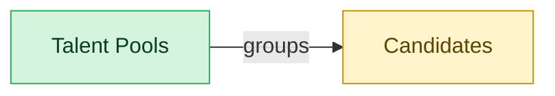

# Talent Pools

## 1. Overview

Curated candidate groupings for nurture and pipeline-building (`talent_pools`). Embedded-masters `candidates`; deployed alone, materializes a thin candidate shell. Mirrors standalone talent-acquisition CRM products.

## 2. Entity summary

| Name | Description |
| --- | --- |
| Talent Pools | Curated segment or pipeline of candidates kept warm for future roles (e.g. silver medallists, alumni, target-school grads, hard-to-fill skill clusters). |
| Candidates | Person known to the recruiting org, with or without an active application. Carries contact details, resume, tags, GDPR consent, and source. Distinct from Employee until hired. |

## 3. Entities catalog

| # | data_object | role | necessity | canonical? | pattern flags | notes |
| ---: | --- | --- | --- | --- | --- | --- |
| 1 | `talent_pools` (Talent Pools) | master | required | - | - | - |
| 2 | `candidates` (Candidates) | embedded_master | required | ✓ bare-word | personal_content | - |

## 4. Aliases and industry synonyms

| data_object | alias | alias_type | preferred? | context | notes |
| --- | --- | --- | --- | --- | --- |
| `candidates` | Applicant | synonym | - | - | generic; used by EEOC and OFCCP |
| `talent_pools` | Candidate Pool | synonym | - | - | generic; also OFCCP applicant-pool analyses |
| `candidates` | Person | synonym | - | - | vendor-specific: Workday Recruiting unified internal/external person record |
| `candidates` | Prospect | synonym | - | - | sourcing-CRM term before formal application |
| `talent_pools` | Talent Community | synonym | - | - | vendor-specific: Oracle Taleo, SuccessFactors brand opt-in pools |
| `talent_pools` | Talent Pipeline | synonym | - | - | sourcing-team term for curated nurture pool |

## 5. Relationships

### 5.1 Intra-scope edges

| from | verb | to | cardinality | kind | necessity | owner_side | notes |
| --- | --- | --- | --- | --- | --- | --- | --- |
| `talent_pools` | groups | `candidates` | many_to_many | reference | required | target | intra \| ATS \| pool is a membership shell; candidate lives outside it |

### 5.2 Built-in edges (`users` and other platform built-ins)

_(no relationships against platform built-ins recorded for this scope.)_

### 5.3 Cross-scope edges

| from | verb | to | cardinality | necessity | notes |
| --- | --- | --- | --- | --- | --- |
| `skill_profiles` | feeds | `candidates` | one_to_many | optional | cross \| cluster A \| LMS \| internal-candidate skill data flows to ATS |
| `candidates` | submits | `job_applications` | one_to_many | required | intra \| ATS \| candidate persists across applications |
| `candidate_referrals` | introduces | `candidates` | one_to_many | required | intra \| ATS \| referral is the introduction event; candidate is durable |
| `recruitment_sources` | attributes | `candidates` | one_to_many | required | intra \| ATS \| source-of-hire dimension on candidate |
| `recruitment_agencies` | sources | `candidates` | one_to_many | required | intra \| ATS \| agency is the channel; candidate persists |
| `recruitment_events` | attracts | `candidates` | one_to_many | required | intra \| ATS \| event is the touchpoint; candidate persists |
| `candidates` | becomes | `employees` | one_to_one | required | cross \| ATS→HCM \| candidate.hired creates employee record; identity handoff |
| `candidates` | becomes pre-employee | `pre_employees` | one_to_one | required | Candidate identity continues into the pre-employee record; promoted to employees on activation. |

## 6. Cross-domain context

### 6.1 Co-masters (other modules / domains with a role on this scope's masters)

### 6.2 Outbound handoffs (events this scope publishes)

_(no outbound `cross_domain_handoffs` whose payload is in this scope.)_

### 6.3 Inbound handoffs (events this scope reacts to)

_(no inbound `cross_domain_handoffs` whose payload is in this scope.)_

### 6.4 Embedded / contributing / consuming dependencies

| data_object | role here | necessity | canonical owner(s) | slice notes |
| --- | --- | --- | --- | --- |
| `candidates` | embedded_master | required | ATS-CANDIDATE-CRM (ATS) | - |

## 7. Lifecycle states (per master)

### `talent_pools` (Talent Pool)

| order | state_name | initial? | terminal? | requires_permission? | derived gate | description |
| --- | --- | --- | --- | --- | --- | --- |
| 1 | `active` | ✓ | - | - | - | Pool is open for additions and nurture campaigns. |
| 2 | `paused` | - | - | - | - | Pool nurture is temporarily halted (off-season, budget freeze) but membership is retained. |
| 3 | `archived` | - | ✓ | - | - | Pool is closed; membership is retained for historical attribution but no further outreach occurs. |

## 8. Permissions and business rules (derived)

### 8.1 Permissions

| permission | tier | description | included in `:admin`? |
| --- | --- | --- | --- |
| `ats-talent-pools:read` | baseline-read | Read access to every entity in the module | ✓ |
| `ats-talent-pools:manage` | baseline-manage | Edit operational records | ✓ |
| `ats-talent-pools:admin` | baseline-admin | Edit reference data and inherit every workflow gate below | - |

### 8.2 Business rules

_(no flag-derived business rules.)_
