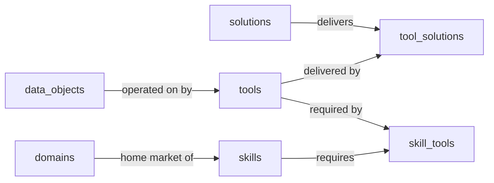

# Tool Catalog — Semantic Model

## 1. Overview

The Tool Catalog records the side-effect operations agent skills need to do their job, and which concrete vendor solutions deliver each one. Tools are abstract JSON-RPC function signatures (verb-shaped, vendor-independent: `send_email`, `query_invoices`, `transcribe_audio`), classified by operation kind. Skills are first-class records that bundle a coherent agent capability and link to the tools they require; a junction matrix maps each tool to every solution that delivers it.

A typical workload is an integration architect picking from the catalog: "this skill needs `send_email`, `query_invoices`, and `sign_document`; which of our deployed solutions cover those needs natively versus through a connector versus not at all?" The other typical workload is the inverse: given a skill, can every required tool be served by a Semantius-native solution, or does the skill force an external connector or action solution into the picture?

## 2. Entity summary

| # | Table name | Singular label | Purpose |
|---|---|---|---|
| 1 | `tools` | Tool | A JSON-RPC function an agent can invoke, classified by operation kind. |
| 2 | `skills` | Skill | An agent skill that bundles a coherent capability and depends on a set of tools. |
| 3 | `tool_solutions` | Tool Solution | Which solutions in the catalog deliver which tools, with strength and delivery method. |
| 4 | `skill_tools` | Skill Tool | Which tools a skill requires, with requirement level and workflow context. |

### Entity-relationship diagram



### Permissions summary

| Permission | Type | Description | Used by | Hierarchy parent |
|---|---|---|---|---|
| `tool_catalog:read` | baseline-read | Read every record in the catalog. Typically: every catalog consumer. | every entity (view_permission) | `tool_catalog:manage` |
| `tool_catalog:manage` | baseline-manage | Edit every record in the catalog. Typically: catalog curators, research agents. | every entity (edit_permission) | — |

Two-permission fallback: the Tool Catalog is a pure reference catalog (every entity ships seeded values and changes slowly via curator review). No operational tier exists below the reference tier, so the admin tier collapses into the manage tier and every entity uses `tool_catalog:manage` as `edit_permission`. No workflow permissions; no per-row read scoping. The deployer reads `view_permission` and `edit_permission` directly from this file.

## 3. Entities

### 3.1 `tools` — Tool

**Plural label:** Tools
**Label column:** `tool_name`
**Audit log:** no
**Edit permission:** manage
**Description:** A single JSON-RPC function the agent can call. Verb-shaped and vendor-independent; one row per function signature. Examples: send_email, query_invoices, transcribe_audio, create_calendar_event, post_chat_message.

**Fields**

| Field name | Format | Required | Label | Description | Reference / Notes |
|---|---|---|---|---|---|
| `tool_name` | string | yes | Name | Lowercase snake_case verb form (send_email, query_invoices). |  label_column, unique |
| `description` | multiline | yes | Description |  |  |
| `operation_kind` | enum | yes | Operation Kind | Drives the 100% Semantius derivation: `query` and `mutate` read or write structured business data; `side_effect` triggers an external action with no business-data return; `compute` is pure computation, AI, or web automation. | enum_values: ["query", "mutate", "side_effect", "compute"]; default: "query" |
| `data_object_id` | reference | no | Data Object | Set when operation_kind is `query` or `mutate`; null for `side_effect` and `compute`. | → `data_objects` (N:1), relationship_label: "operated on by" |
| `record_status` | enum | yes | Record Status |  | enum_values: ["new", "pending", "approved", "rejected"]; default: "new" |

**Relationships**

- A Tool may target one Data Object (N:1, via `tool.data_object_id`), required for query/mutate operations and null for side_effect/compute. The Data Object is mastered in the sibling Domain Map; the deployer resolves the FK against the catalog at deploy time.
- A Tool may be delivered by many Solutions through the `tool_solutions` junction.
- A Tool may be required by many Skills through the `skill_tools` junction.

**Validation rules**

```json
[
  {
    "code": "data_object_only_when_query_or_mutate",
    "message": "A data_object_id may only be set when operation_kind is query or mutate.",
    "description": "side_effect and compute tools have no business-data return value; the FK is meaningless for them and must stay null.",
    "jsonlogic": {
      "or": [
        { "==": [{ "var": "data_object_id" }, null] },
        { "in": [{ "var": "operation_kind" }, ["query", "mutate"]] }
      ]
    }
  },
  {
    "code": "data_object_required_when_query_or_mutate",
    "message": "A data_object_id is required when operation_kind is query or mutate.",
    "description": "Pairs with data_object_only_when_query_or_mutate. query and mutate tools must name the data_object they read or write so the 100% Semantius derivation can resolve solution coverage.",
    "jsonlogic": {
      "or": [
        { "!": [{ "in": [{ "var": "operation_kind" }, ["query", "mutate"]] }] },
        { "!=": [{ "var": "data_object_id" }, null] }
      ]
    }
  }
]
```

### 3.2 `skills` — Skill

**Plural label:** Skills
**Label column:** `skill_name`
**Audit log:** no
**Edit permission:** manage
**Description:** An agent skill (system, process, or role) that bundles a coherent capability and depends on a set of tools to operate. System skills correspond one-to-one to a domain in the Domain Map; process skills orchestrate a cluster of cross-domain handoffs; role skills wrap a particular user role.

**Fields**

| Field name | Format | Required | Label | Description | Reference / Notes |
|---|---|---|---|---|---|
| `skill_name` | string | yes | Name | Lowercase snake_case or kebab-case identifier (domain-map-analyst, onboarding-process, lead-to-cash). |  label_column, unique |
| `description` | multiline | yes | Description |  |  |
| `skill_type` | enum | yes | Skill Type | `system` skills mirror a Domain Map domain; `process` skills orchestrate cross-domain handoff clusters; `role` skills wrap a specific user role's day-to-day work. | enum_values: ["system", "process", "role"]; default: "system" |
| `domain_id` | reference | no | Domain | Optional; set for system skills that mirror a specific Domain Map domain. Null for process and role skills. | → `domains` (N:1), relationship_label: "home market of" |
| `record_status` | enum | yes | Record Status |  | enum_values: ["new", "pending", "approved", "rejected"]; default: "new" |

**Relationships**

- A Skill may be tied to one Domain (N:1, via `skill.domain_id`), required for system skills and null for process and role skills. The Domain is mastered in the sibling Domain Map.
- A Skill requires many Tools through the `skill_tools` junction, each row carrying a requirement level and workflow context.

**Validation rules**

```json
[
  {
    "code": "domain_required_when_skill_type_is_system",
    "message": "A domain_id is required when skill_type is system.",
    "description": "System skills mirror one Domain Map domain by definition; the FK is the only thing that ties the skill to its home market. Process and role skills may legitimately leave the FK null.",
    "jsonlogic": {
      "or": [
        { "!=": [{ "var": "skill_type" }, "system"] },
        { "!=": [{ "var": "domain_id" }, null] }
      ]
    }
  }
]
```

### 3.3 `tool_solutions` — Tool Solution

**Plural label:** Tool Solutions
**Label column:** `tool_solution_label`
**Audit log:** no
**Edit permission:** manage
**Description:** A junction record linking one Tool to one Solution that delivers it, with delivery strength, delivery method, and an optional endpoint URL. A single tool typically has many tool_solution rows (M365 + Gmail + AWS SES all deliver send_email); a single solution may deliver many tools (Microsoft 365 covers send_email, create_calendar_event, post_chat_message, and more).

**Fields**

| Field name | Format | Required | Label | Description | Reference / Notes |
|---|---|---|---|---|---|
| `tool_solution_label` | string | yes | Name | Computed at write time as `<tool_name> via <solution_name>`. |  label_column |
| `tool_id` | parent | yes | Tool |  | ↳ `tools` (N:1, cascade), relationship_label: "delivered by" |
| `solution_id` | parent | yes | Solution | Cross-module reference; the Solution row lives in the Domain Map. | ↳ `solutions` (N:1, cascade), relationship_label: "delivers" |
| `delivery_strength` | enum | yes | Delivery Strength | `native` solutions ship the tool as a first-class capability; `partial` covers most but not all use cases; `via_extension` requires an add-on or marketplace plugin; `not_supported` is recorded for completeness and excludes the solution from coverage queries. | enum_values: ["native", "partial", "via_extension", "not_supported"]; default: "native" |
| `delivery_method` | enum | yes | Delivery Method | How the agent invokes the tool against this solution; `mcp_server` is the preferred shape, the others degrade gracefully. | enum_values: ["mcp_server", "rest_api", "sdk", "cli"]; default: "mcp_server" |
| `endpoint_url` | url | yes | Endpoint URL | MCP server URL or API base when known; empty string acceptable. |  |
| `notes` | multiline | yes | Notes |  |  |
| `record_status` | enum | yes | Record Status |  | enum_values: ["new", "pending", "approved", "rejected"]; default: "new" |

**Relationships**

- A Tool Solution belongs to one Tool (N:1, required, cascade on delete).
- A Tool Solution belongs to one Solution (N:1, required, cascade on delete). The Solution is mastered in the sibling Domain Map.
- The (Tool, Solution) pair is intended to be unique per junction row; uniqueness is recorded as a forward-looking question in §7.2 since the platform's native unique annotation is single-column.

**Computed fields**

```json
[
  {
    "name": "tool_solution_label",
    "description": "Render the junction with the tool name and the solution name so the catalog reads clearly without joining.",
    "jsonlogic": {
      "set_record": ["t", "tools", { "var": "tool_id" },
        { "set_record": ["s", "solutions", { "var": "solution_id" },
          { "cat": [{ "var": "t.tool_name" }, " via ", { "var": "s.solution_name" }] }
        ]}
      ]
    }
  }
]
```

### 3.4 `skill_tools` — Skill Tool

**Plural label:** Skill Tools
**Label column:** `skill_tool_label`
**Audit log:** no
**Edit permission:** manage
**Description:** A junction record linking one Skill to one Tool it requires, with the requirement level (required, optional, or fallback) and a one-line workflow context note. The matrix of `skill_tools` rows is the input to the "100% Semantius" derivation: a skill is 100% Semantius iff every required tool has at least one tool_solution where the solution is classified semantius_native.

**Fields**

| Field name | Format | Required | Label | Description | Reference / Notes |
|---|---|---|---|---|---|
| `skill_tool_label` | string | yes | Name | Computed at write time as `<skill_name> needs <tool_name>`. |  label_column |
| `skill_id` | parent | yes | Skill |  | ↳ `skills` (N:1, cascade), relationship_label: "requires" |
| `tool_id` | parent | yes | Tool |  | ↳ `tools` (N:1, cascade), relationship_label: "required by" |
| `requirement_level` | enum | yes | Requirement Level | `required` tools must be available for the skill to function; `optional` improves the skill but the skill can degrade gracefully without them; `fallback` is invoked only when a preferred tool is unavailable. | enum_values: ["required", "optional", "fallback"]; default: "required" |
| `notes` | multiline | yes | Notes | Workflow context for this requirement, e.g. "called per matched invoice to notify the SaaS owner". |  |
| `record_status` | enum | yes | Record Status |  | enum_values: ["new", "pending", "approved", "rejected"]; default: "new" |

**Relationships**

- A Skill Tool belongs to one Skill (N:1, required, cascade on delete).
- A Skill Tool belongs to one Tool (N:1, required, cascade on delete).
- The (Skill, Tool) pair is intended to be unique per junction row; uniqueness is recorded as a forward-looking question in §7.2.

**Computed fields**

```json
[
  {
    "name": "skill_tool_label",
    "description": "Render the junction with the skill name and the tool name so the catalog reads clearly without joining.",
    "jsonlogic": {
      "set_record": ["s", "skills", { "var": "skill_id" },
        { "set_record": ["t", "tools", { "var": "tool_id" },
          { "cat": [{ "var": "s.skill_name" }, " needs ", { "var": "t.tool_name" }] }
        ]}
      ]
    }
  }
]
```

## 4. Relationship summary

| From | Field | To | Cardinality | Kind | Delete behavior |
|---|---|---|---|---|---|
| `tools` | `data_object_id` | `data_objects` | N:1 | reference | clear |
| `skills` | `domain_id` | `domains` | N:1 | reference | clear |
| `tool_solutions` | `tool_id` | `tools` | N:1 | parent (junction) | cascade |
| `tool_solutions` | `solution_id` | `solutions` | N:1 | parent (junction) | cascade |
| `skill_tools` | `skill_id` | `skills` | N:1 | parent (junction) | cascade |
| `skill_tools` | `tool_id` | `tools` | N:1 | parent (junction) | cascade |

## 5. Enumerations

### 5.1 `tools.operation_kind`
- `query`
- `mutate`
- `side_effect`
- `compute`

### 5.2 `skills.skill_type`
- `system`
- `process`
- `role`

### 5.3 `tool_solutions.delivery_strength`
- `native`
- `partial`
- `via_extension`
- `not_supported`

### 5.4 `tool_solutions.delivery_method`
- `mcp_server`
- `rest_api`
- `sdk`
- `cli`

### 5.5 `skill_tools.requirement_level`
- `required`
- `optional`
- `fallback`

### 5.6 `record_status` (every entity)
- `new`
- `pending`
- `approved`
- `rejected`

## 6. Cross-model link suggestions

| From | To | Verb | Cardinality | Delete |
|---|---|---|---|---|
| `tools` | `data_objects` | operated on by | N:1 | clear |
| `skills` | `domains` | home market of | N:1 | clear |
| `tool_solutions` | `solutions` | delivers | N:1 | cascade |

The first two rows reflect the optional outbound FKs declared in §3 to the sibling Domain Map. The third row is the junction leg from `tool_solutions` to the Domain Map's `solutions`; cross-module cascade is unusual but appropriate for a junction whose row is meaningless if either endpoint is gone. The deployer resolves each target against the live catalog at deploy time.

## 7. Open questions

### 7.1 Decisions needed (blockers)

None.

### 7.2 Future considerations (deferred scope)

- Should the platform enforce a unique `(tool_id, solution_id)` pair on `tool_solutions` to prevent duplicate junction rows? Currently relies on caller-side dedup.
- Should the platform enforce a unique `(skill_id, tool_id)` pair on `skill_tools` to prevent duplicate junction rows? Currently relies on caller-side dedup.
- Should tool authentication metadata (OAuth2 scope namespaces, API key rotation rules, service-account requirements) be captured at catalog level, or kept as the integrator's runtime concern? Deferred from v1 as premature bloat.
- Should tool tenancy be modeled (per-tenant `tool_instance` rows binding catalog tools to specific org deployments), or stay catalog-level? Deferred from v1.
- Should `endpoint_url` be promoted from a free string to a structured object (auth method, version, last-checked timestamp) once a meaningful number of MCP endpoints land in the catalog?
- Should the `delivery_strength = not_supported` value remain as a recorded value, or be moved to a separate `tool_solution_exclusions` table once the negative-coverage list grows? The current shape keeps everything in one table at the cost of filtering on most queries.
- Should `skill_tools.requirement_level = fallback` rows carry a pointer to the preferred tool they fall back from, so the catalog can render fallback chains explicitly?

## 8. Implementation notes for the downstream agent

1. Create one module named `tool_catalog`. Then create every permission listed in the §2 Permissions summary table, in table order, calling `create_permission` with the `Permission` and `Description` column values; after both permissions exist, call `create_permission_hierarchy` once with `including_permission_id = tool_catalog:manage.id, included_permission_id = tool_catalog:read.id` (so `manage` includes `read`). No admin tier, no workflow permissions; this is the two-permission fallback for a pure reference module.
2. Create entities in the order given in §2 (tools and skills first; tool_solutions and skill_tools second, since they FK to the first two).
3. For each entity: set `label_column` to the snake_case field marked as label in §3, pass `module_id`, `view_permission: "tool_catalog:read"`, and `edit_permission: "tool_catalog:manage"`. Do not manually create `id`, `created_at`, `updated_at`, or the auto-label field.
4. For each field in §3: pass `table_name`, `field_name`, `format`, `title` (the Label column), and for `reference` and `parent` fields also `reference_table` and a `reference_delete_mode` consistent with §4.
5. Fix up each entity's auto-created label-column field title where the §3 Label differs from `singular_label`. Affected fields and the corresponding `update_field` composite ids (always passed as strings, not integers):
   - `"tools.tool_name"` → title `"Name"`
   - `"skills.skill_name"` → title `"Name"`
   - `"tool_solutions.tool_solution_label"` → title `"Name"`
   - `"skill_tools.skill_tool_label"` → title `"Name"`
6. Deduplicate against Semantius built-in tables. No built-in overlap is expected for this module; if any of the four declared entities collides with a built-in name at deploy time, treat the collision per the standard deployer Stage 2d / 2e flow.
7. Apply §6 cross-model link suggestions against the live Domain Map. The three rows resolve to entities (`data_objects`, `domains`, `solutions`) that are part of the Domain Map module (slug `domain_map`); the deployer creates the FK columns on `tools`, `skills`, and `tool_solutions` respectively, with `relationship_label` and `reference_delete_mode` from the §6 row.
8. Extend the existing `domain_map.solutions` entity additively with one new column. The platform supports adding fields to an existing entity via `create_field`; this is the only change to the sibling module:
   - `table_name`: `solutions`
   - `field_name`: `solution_kind`
   - `format`: `enum`
   - `title`: `Solution Kind`
   - `description`: A classification used by the Tool Catalog's 100% Semantius derivation. `semantius_native` means the solution IS Semantius itself; `external_connector` is a system of record (SAP, NetSuite, Salesforce); `action` is a side-effect service (Microsoft Graph Mail, Twilio, DocuSign); `compute_service` is a compute/AI/automation service (OpenAI, Anthropic, Playwright); `standard_solution` is the default for solutions not yet integrated as a tool source.
   - `enum_values`: `["semantius_native", "external_connector", "action", "compute_service", "standard_solution"]`
   - `default`: `"standard_solution"`
   - Backfill: after creating the column, update every existing row in `domain_map.solutions` to `solution_kind = 'standard_solution'` (the platform default already does this when the field is added; the explicit backfill is a belt-and-braces safeguard).
9. Apply per-entity read-side rules. No `Input type rules` or `Select rule` sub-blocks are declared in this model; no `update_field` or `update_entity` calls are needed for those.
10. After creation, spot-check that `label_column` on each entity resolves to a real field and that all `reference_table` targets exist (`data_objects`, `domains`, `solutions` in `domain_map`; `tools` and `skills` in `tool_catalog`).
